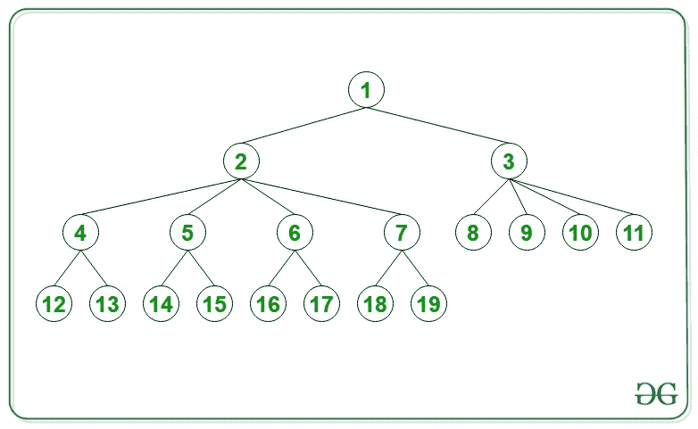

# 从根节点到 N 元树中给定节点的路径

> 原文:[https://www . geesforgeks . org/从根节点到给定 n 叉树节点的路径/](https://www.geeksforgeeks.org/path-from-the-root-node-to-a-given-node-in-an-n-ary-tree/)

给定一个整数 **N** 和一个如下形式的[T3N 元树【T5:](https://www.geeksforgeeks.org/generic-treesn-array-trees/) 

*   每个节点按顺序编号，从 **1** 开始，直到最后一级，包含节点 **N** 。
*   每个奇数层的节点包含 **2** 子节点，每个偶数层的节点包含 **4** 子节点。

任务是打印从根节点到节点 **N** 的路径。

**示例:**

> **输入:** N = 14
> 
> 
> 
> **输出:** 1 2 5 14
> **说明:**从节点 1 到节点 14 的路径是 1–>2–>5–>14。
> 
> **输入:** N = 11
> **输出:** 1 3 11
> **说明:**从节点 1 到节点 11 的路径是 1–>3–>11。

**方法:**按照以下步骤解决问题:

*   初始化一个[数组](https://www.geeksforgeeks.org/arrays-in-c-cpp/)来存储[树](https://www.geeksforgeeks.org/binary-tree-data-structure/)的每一级中存在的节点数，即{1，2，8，16，64，128……。}并储存起来。
*   计算数组的[前缀和](https://www.geeksforgeeks.org/prefix-sum-array-implementation-applications-competitive-programming/)，即{ 1 3 11 27 91 219……}。}
*   使用[下界()](https://www.geeksforgeeks.org/lower_bound-in-cpp/)找到前缀和数组中超过或等于 **N** 的索引 **ind** 。因此 **ind** 表示到达节点 **N** 需要经过的层数。
*   初始化一个变量，比如说， **temp = N** 和一个数组**path【】**来存储从根到 **N** 的节点。
*   递减 **ind** 直到其小于或等于 **1** 并继续更新**val = temp–前缀【ind–1】**。
*   如果 **ind** 为奇数，更新 **temp =前缀【ind–2】+(val+1)/2**。
*   否则，如果 **ind** 为偶数，则更新 **temp =前缀【ind–2】+(val+3)/4**。
*   将**温度**追加到**路径[]** 数组中。
*   最后打印数组，**路径[]** 。

下面是上述方法的实现:

## C++

```
// C++ program for the above approach
#include <bits/stdc++.h>
using namespace std;
typedef long long ll;

// Function to find the path
// from root to N
void PrintPathNodes(ll N)
{

    // Stores the number of
    // nodes at (i + 1)-th level
    vector<ll> arr;
    arr.push_back(1);

    // Stores the number of nodes
    ll k = 1;

    // Stores if the current
    // level is even or odd
    bool flag = true;

    while (k < N) {

        // If level is odd
        if (flag == true) {
            k *= 2;
            flag = false;
        }

        // If level is even
        else {

            k *= 4;
            flag = true;
        }

        // If level with
        // node N is reached
        if (k > N) {
            break;
        }

        // Push into vector
        arr.push_back(k);
    }

    ll len = arr.size();
    vector<ll> prefix(len);
    prefix[0] = 1;

    // Compute prefix sums of count
    // of nodes in each level
    for (ll i = 1; i < len; ++i) {
        prefix[i] = arr[i] + prefix[i - 1];
    }

    vector<ll>::iterator it
        = lower_bound(prefix.begin(),
                      prefix.end(), N);

    // Stores the level in which
    // node N s present
    ll ind = it - prefix.begin();

    ll temp = N;

    // Store path
    vector<int> path;

    path.push_back(N);

    while (ind > 1) {
        ll val = temp - prefix[ind - 1];

        if (ind % 2 != 0) {
            temp = prefix[ind - 2]
                   + (val + 1) / 2;
        }
        else {
            temp = prefix[ind - 2]
                   + (val + 3) / 4;
        }
        --ind;

        // Insert temp into path
        path.push_back(temp);
    }

    if (N != 1)
        path.push_back(1);

    // Print path
    for (int i = path.size() - 1;
         i >= 0; i--) {

        cout << path[i] << " ";
    }
}

// Driver Code
int main()
{

    ll N = 14;

    // Function Call
    PrintPathNodes(N);

    return 0;
}
```

## 蟒蛇 3

```
# Python3 program for the above approach
from bisect import bisect_left

# Function to find the path
# from root to N
def PrintPathNodes(N):

    # Stores the number of
    # nodes at (i + 1)-th level
    arr = []
    arr.append(1)

    # Stores the number of nodes
    k = 1

    # Stores if the current
    # level is even or odd
    flag = True
    while (k < N):

        # If level is odd
        if (flag == True):
            k *= 2
            flag = False

        # If level is even
        else:
            k *= 4
            flag = True

        # If level with
        # node N is reached
        if (k > N):
            break

        # Push into vector
        arr.append(k)
    lenn = len(arr)
    prefix = [0]*(lenn)
    prefix[0] = 1

    # Compute prefix sums of count
    # of nodes in each level
    for i in range(1,lenn):
        prefix[i] = arr[i] + prefix[i - 1]
    it = bisect_left(prefix, N)

    # Stores the level in which
    # node N s present
    ind = it
    temp = N

    # Store path
    path = []
    path.append(N)
    while (ind > 1):
        val = temp - prefix[ind - 1]

        if (ind % 2 != 0):
            temp = prefix[ind - 2] + (val + 1) // 2
        else:
            temp = prefix[ind - 2] + (val + 3) // 4
        ind -= 1

        # Insert temp into path
        path.append(temp)
    if (N != 1):
        path.append(1)

    # Print path
    for i in range(len(path)-1, -1, -1):
        print(path[i], end=" ")

# Driver Code
if __name__ == '__main__':
    N = 14

    # Function Call
    PrintPathNodes(N)

    # This code is contributed by mohit kumar 29
```

**Output:** 

```
1 2 5 14
```

***时间复杂度:** O(log(N))*
***辅助空间:** O(log(N))*