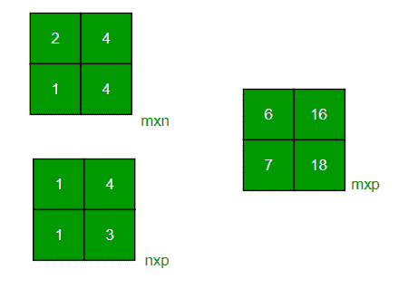

# Php 程序相乘两个矩阵

> 原文:[https://www . geeksforgeeks . org/PHP-程序乘二矩阵/](https://www.geeksforgeeks.org/php-program-to-multiply-two-matrices/)

给定两个矩阵，将它们相乘的任务。矩阵可以是正方形或矩形。

**示例:**

```
Input : mat1[][] = {{1, 2}, 
                   {3, 4}}
        mat2[][] = {{1, 1}, 
                    {1, 1}}
Output : {{3, 3}, 
          {7, 7}}
Input : mat1[][] = {{2, 4}, 
                    {3, 4}}
        mat2[][] = {{1, 2}, 
                    {1, 3}}       
Output : {{6, 16}, 
          {7, 18}}
```



**方阵乘法:**
下面的程序将两个大小为 4*4 的方阵相乘，我们可以针对不同的维度改变 N。

## 服务器端编程语言（Professional Hypertext Preprocessor 的缩写）

```
<?php
// PHP program to multiply two 
// square matrices.

// This function multiplies mat1[][] and 
// mat2[][], and stores the result in res[][]
function multiply(&$mat1, &$mat2, &$res)
{
    $N = 4;
    for ($i = 0; $i < $N; $i++)
    {
        for ($j = 0; $j < $N; $j++)
        {
            $res[$i][$j] = 0;
            for ($k = 0; $k < $N; $k++)
                $res[$i][$j] += $mat1[$i][$k] * 
                                $mat2[$k][$j];
        }
    }
}

// Driver Code
$mat1 = array(array(1, 1, 1, 1),
              array(2, 2, 2, 2),
              array(3, 3, 3, 3),
              array(4, 4, 4, 4));

$mat2 = array(array(1, 1, 1, 1),
              array(2, 2, 2, 2),
              array(3, 3, 3, 3),
              array(4, 4, 4, 4));

multiply($mat1, $mat2, $res);
$N = 4;
echo ("Result matrix is 
");
for ($i = 0; $i < $N; $i++)
{
    for ($j = 0; $j < $N; $j++)
    {
        echo ($res[$i][$j]);
        echo(" ");
    }
    echo ("
");
}

// This code is contributed 
// by Shivi_Aggarwal 
?>
```

**Output**

```
Result matrix is 
10 10 10 10 
20 20 20 20 
30 30 30 30 
40 40 40 40
```

**时间复杂度:** O(n <sup>3</sup> )。它可以使用斯特拉森矩阵乘法进行优化

**辅助空间:** O(n <sup>2</sup> )

**矩形矩阵的乘法:**
我们使用 C 语言中的指针与矩阵相乘。请参考以下帖子作为代码的先决条件。
[如何在 C 中传递一个 2D 阵作为参数？](https://www.geeksforgeeks.org/pass-2d-array-parameter-c/)

## 服务器端编程语言（Professional Hypertext Preprocessor 的缩写）

```
<?php
// PHP program to multiply two 
// rectangular matrices 

// Multiplies two matrices mat1[][]  
// and mat2[][] and prints result. 
// (m1) x (m2) and (n1) x (n2) are 
// dimensions of given matrices. 
function multiply($m1, $m2, $mat1, 
                  $n1, $n2, $mat2) 
{ 
    for ($i = 0; $i < $m1; $i++) 
    { 
        for ($j = 0; $j < $n2; $j++) 
        { 
            $res[$i][$j] = 0; 
            for ($x = 0; $x < $m2; $x++) 
            { 
                $res[$i][$j] += $mat1[$i][$x] * 
                                $mat2[$x][$j]; 
            } 
        } 
    } 
    for ($i = 0; $i < $m1; $i++) 
    { 
        for ($j = 0; $j < $n2; $j++) 
        { 
            echo $res[$i][$j] . " "; 
        } 
        echo "
"; 
    } 
} 

// Driver code 
$mat1 = array( array( 2, 4 ), array( 3, 4 )); 
$mat2 = array( array( 1, 2 ), array( 1, 3 )); 
$m1 = 2;
$m2 = 2;
$n1 = 2;
$n2 = 2; 

//Function call
multiply($m1, $m2, $mat1, $n1, $n2, $mat2); 

// This code is contributed by rathbhupendra
?>
```

**Output**

```
6 16 
7 18
```

**时间复杂度:** O(n <sup>3</sup> )。可以使用[斯特拉森的矩阵乘法](https://www.geeksforgeeks.org/strassens-matrix-multiplication/)进行优化

**辅助空间:** O(m1 * n2)

更多详情请参考[两矩阵相乘程序](https://www.geeksforgeeks.org/c-program-multiply-two-matrices/)整篇文章！