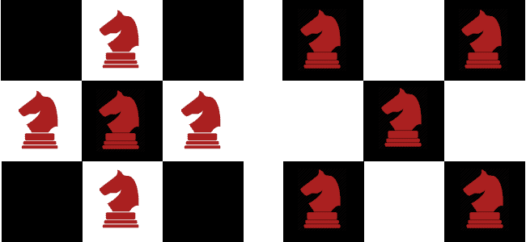

# 放置 K 骑士，使他们不会互相攻击

> 原文:[https://www . geeksforgeeks . org/place-k-knights-这样-他们-不-互相-攻击/](https://www.geeksforgeeks.org/place-k-knights-such-that-they-do-not-attack-each-other/)

给定整数 *M，N 和 K* ，任务是将 *K* 骑士放在 *M*N* 棋盘上，这样他们就不会互相攻击。
预计骑士会被放置在棋盘上不同的方块上。骑士可以垂直移动两个方块，水平移动一个方块，或者水平移动两个方块，垂直移动一个方块。如果骑士中的一个能在一次移动中到达另一个，他们就会互相攻击。将 *K* 骑士放置在 *M*N* 棋盘上有多种方式，有时也没有放置方式。我们应该列出所有可能的解决方案。

**示例:**

> **输入:** M = 3，N = 3，K = 5
> T3】输出:T5】K A K
> A K A
> K A K
> 
> 阿千阿
> 阿千阿
> 阿千阿
> 
> 解决方案总数:2
> 
> 
> **输入:** M = 5，N = 5，K = 13
> **输出:**
> K A K A K A K
> A K A K A K A
> K A K A K
> A K A K A
> K A K A K A K A K
> 
> 解决方案总数:1

**方法:**这个问题可以用回溯法解决。
想法是从第一排和第一列开始，一个接一个地放置骑士，并向前移动到第一排和第二列，这样他们就不会互相攻击。当一行结束时，我们移到下一行。在放置骑士之前，我们总是检查这个街区是否安全，也就是说，它不是其他骑士的攻击位置。如果它是安全的，我们把骑士放在棋盘上，并标记它的攻击位置，否则我们向前移动，检查其他区块。按照这个程序，每次我们在棋盘上插入一个新的骑士时，我们都会制作一个新的棋盘。这样做是因为，如果我们得到一个解决方案，我们需要其他解决方案，那么我们可以回溯到旧的骑士配置，然后可以检查其他可能的解决方案。回溯的过程一直持续到我们得到所有可能的解决方案。

下面是上述方法的实现:

```
// C++ implementation of the above approach
#include <iostream>
using namespace std;

/* m*n is the board dimension
k is the number of knights to be placed on board 
count is the number of possible solutions */
int m, n, k;
int count = 0;

/* This function is used to create an empty m*n board */
void makeBoard(char** board)
{
    for (int i = 0; i < m; i++) {
        for (int j = 0; j < n; j++) {
            board[i][j] = '_';
        }
    }
}

/* This function displays our board */
void displayBoard(char** board)
{
    cout << endl
         << endl;
    for (int i = 0; i < m; i++) {
        for (int j = 0; j < n; j++) {
            cout << " " << board[i][j] << " ";
        }
        cout << endl;
    }
}

/* This function marks all the attacking
 position of a knight placed at board[i][j]
 position */
void attack(int i, int j, char a,
            char** board)
{

    /* conditions to ensure that the 
       block to be checked is inside the board */
    if ((i + 2) < m && (j - 1) >= 0) {
        board[i + 2][j - 1] = a;
    }
    if ((i - 2) >= 0 && (j - 1) >= 0) {
        board[i - 2][j - 1] = a;
    }
    if ((i + 2) < m && (j + 1) < n) {
        board[i + 2][j + 1] = a;
    }
    if ((i - 2) >= 0 && (j + 1) < n) {
        board[i - 2][j + 1] = a;
    }
    if ((i + 1) < m && (j + 2) < n) {
        board[i + 1][j + 2] = a;
    }
    if ((i - 1) >= 0 && (j + 2) < n) {
        board[i - 1][j + 2] = a;
    }
    if ((i + 1) < m && (j - 2) >= 0) {
        board[i + 1][j - 2] = a;
    }
    if ((i - 1) >= 0 && (j - 2) >= 0) {
        board[i - 1][j - 2] = a;
    }
}

/* If the position is empty,
   place the knight */
bool canPlace(int i, int j, char** board)
{
    if (board[i][j] == '_')
        return true;
    else
        return false;
}

/* Place the knight at [i][j] position
   on board */
void place(int i, int j, char k, char a,
           char** board, char** new_board)
{

    /* Copy the configurations of
     old board to new board */
    for (int y = 0; y < m; y++) {
        for (int z = 0; z < n; z++) {
            new_board[y][z] = board[y][z];
        }
    }

    /* Place the knight at [i][j]
    position on new board */
    new_board[i][j] = k;

    /* Mark all the attacking positions
    of newly placed knight on the new board */
    attack(i, j, a, new_board);
}

/* Function for placing knights on board
   such that they don't attack each other */
void kkn(int k, int sti, int stj, char** board)
{

    /* If there are no knights left to be placed,
     display the board and increment the count */
    if (k == 0) {
        displayBoard(board);
        count++;
    }
    else {

        /* Loop for checking all the 
       positions on m*n board */
        for (int i = sti; i < m; i++) {
            for (int j = stj; j < n; j++) {

                /* Is it possible to place knight at 
           [i][j] position on board? */
                if (canPlace(i, j, board)) {

                    /* Create a a new board and place the 
                      new knight on it */
                    char** new_board = new char*[m];
                    for (int x = 0; x < m; x++) {
                        new_board[x] = new char[n];
                    }
                    place(i, j, 'K', 'A', board, new_board);

                    /* Call the function recursively for
                      (k-1) leftover knights */
                    kkn(k - 1, i, j, new_board);

                    /* Delete the new board 
                    to free up the memory */
                    for (int x = 0; x < m; x++) {
                        delete[] new_board[x];
                    }
                    delete[] new_board;
                }
            }
            stj = 0;
        }
    }
}

// Driver code
int main()
{
    m = 4, n = 3, k = 6;

    /* Creation of a m*n board */
    char** board = new char*[m];
    for (int i = 0; i < m; i++) {
        board[i] = new char[n];
    }

    /* Make all the places are empty */
    makeBoard(board);

    kkn(k, 0, 0, board);

    cout << endl
         << "Total number of solutions : "
         << count;
    return 0;
}
```

**Output:**

```
 K  K  K 
 A  A  A 
 A  A  A 
 K  K  K 

 K  A  K 
 A  K  A 
 K  A  K 
 A  K  A 

 A  K  A 
 K  A  K 
 A  K  A 
 K  A  K 

Total number of solutions : 3

```