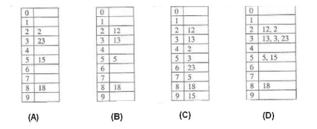
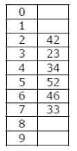

# 哈希练习题

> 原文：[https://www.geeksforgeeks.org/practice-problems-on-hashing/](https://www.geeksforgeeks.org/practice-problems-on-hashing/)

在本文中，我们将讨论基于哈希的问题类型。 在理解这一点之前，您应该对散列，散列函数，开放式寻址和链接技术有所了解（请参阅：[简介](https://www.geeksforgeeks.org/hashing-set-1-introduction/)，[单链接](https://www.geeksforgeeks.org/hashing-set-2-separate-chaining/)，[开放式寻址](https://www.geeksforgeeks.org/hashing-set-3-open-addressing/)）。

这些是散列中的一些关键点：

*   散列的目的是实现对`O(1)`的搜索，插入和删除复杂性。

*   哈希函数旨在将键均匀地分布在哈希表上。

*   哈希表中的负载因子`α`可以定义为哈希表中的插槽数与要插入的键的数目。

*   对于开放式寻址，负载系数`α`始终小于 1。

*   使用开放寻址的插入，删除和搜索的复杂度为`1 / (1 - α)`。

*   使用链接方法进行插入，删除和搜索的复杂度为`1 + α`。

这些是哈希中提出的问题类型。

**类型 1：给定键的哈希值计算**：

在此类问题中，通过在给定键上应用给定哈希函数来计算哈希值。

**问题 1**：给定以下输入`4322, 1334, 1471, 9679, 1989, 6171, 6173, 4199`和哈希函数`x mod 10`，以下哪个语句是正确的？ （GATE CS 2004）

i. 9679、1989、4199 散列为相同的值

ii. 1471、6171 具有相同的值

iii. 所有元素散列为相同的值

iv. 每个元素散列为不同的值

（A）只有 i

（B）只有 ii

（C）i 和 ii

（D）iii 或 iv

**解决方案**：使用给定的哈希函数`h(x) = x mod 10`。

```
h(9679) = 9679%10 = 9 
h(1989) = 1989%10 = 9 
h(4199) = 4199%10 = 9 
h(1471) = 1471%10 = 1 
h(6171) = 6171%10 = 1 

```

如我们所见，9679、1989 和 4199 散列为相同的值 9。而且，1471 和 6171 散列为相同的值 1。因此，与选项（C）匹配的语句（i）和（ii）是正确的。

**类型 2：使用线性探测作为冲突解决技术将键插入哈希表**：

在线性探测技术中，通过在哈希表中线性搜索直到找到空位置来解决冲突。

**问题 2**：给使用带有哈希函数`h(k) = k`的开放式寻址，将键 12、18、13、2、3、23、5 和 15 插入长度为 10 的初始空哈希表中。 `mod 10`和线性探测。 结果哈希表是什么？



**解决方案**：将键 12、18、13、2、3、23、5 和 15 插入哈希表中，如下所示：

对于键 12，`h(12)`为`12 % 10 =2`。因此，将 12 放在哈希表的第二个索引处。

对于键 18，`h(18)`为`18 % 10 =`8。因此，将 18 放置在哈希表的第 8 个索引处。

对于键 13，`h(13)`为`13 % 10 =3`。因此，将 13 放置在哈希表的第 3 个索引处。

对于键 2，`h(2)`为`2 % 10 =2`。但是，索引 2 已被 12 占用。因此，使用线性探测，由于索引 2 和 3 已被占用，因此将 2 放置在索引 4 处。

对于键 3，`h(3)`为`3 % 10 =3`。但是，索引 3 已被 13 占用。因此，使用线性探测，由于索引 3 和 4 已被占用，因此将 3 放置在索引 5 处。

同样，将 23、5 和 15 分别放置在索引 6、7、9 处。

因此，正确的选项是（C）。

替代方法：我们也可以使用消除方法解决此问题，方法是：

选项（A）和（B）不正确，因为所有键均未插入哈希表中。

选项（D）不正确，因为哈希表中的某些索引具有多个键，而使用线性探测永远不会发生这种情况。

剩余的选项是（C），这就是答案。

**类型 3：给定具有键的哈希表，请验证/查找可能产生哈希表的键序列**：

对于给定的哈希表，我们可以验证哪些键序列可以导致该哈希表 。 但是，要找到导致给定哈希表的可能序列，我们需要考虑所有可能性。

**问题 3**：给长度为 10 的哈希表使用哈希函数`h(k) = k mod 10`的开放式寻址和线性探测。 将 6 个值插入一个空的哈希表后，该表如下所示。



下列哪个选择给出了可能在表中插入键值的可能顺序？

（A）`46, 42, 34, 52, 23, 33`

（B）`34, 42, 23, 52, 33, 46`

（C）`46, 34, 42, 23, 52,  33`

（D）`42, 46, 33, 23, 34, 52`

**解决方案**：我们将检查选项 A 中给出的序列是否可以导致所讨论的哈希表。 选项 A 将 46、42、34、52、23、33 插入为：

对于键 46，`h(46)`为`46 % 10 = 6`。因此，将 46 放置在哈希表中的第 6 个索引处。

对于键 42，`h(42)`为`42 % 10 = 2`。因此，将 42 放置在哈希表的第二个索引处。

对于键 34，`h(34)`为`34 % 10 = 4`。因此，在哈希表中的第 4 个索引处放置了 34。

对于键 52，`h(52)`为`52 % 10 = 2`。但是，索引 2 被 42 占用。因此，将 52 放置在哈希表中的第 3 个索引处。 但是在给定的哈希表中，52 放置在第 5 个索引处。 因此，选项 A 中的序列无法生成有问题的哈希表。

以类似的方式，我们也可以检查其他选项，导致答案为（C）。

**问题 4**：给使用相同的哈希函数和线性探测的键值有多少个不同的插入序列将导致上面问题 3 中给出的哈希表？

（A）10

（B）20

（C）30

（D）40

**解决方案**：不在哈希函数计算的索引处的第一个键是 52。这意味着索引 2、3 和 4 已被占用，因此，键 52 被放置在索引 5。

键 42、23 和 34 分别位于索引 2、3 和 4。 由于这些键位于正确的位置，因此插入顺序无关紧要。 这 3 个键可以插入`3! = 6`种方式。 因此，序列将是（42，23，34）的任何顺序，后跟 52。

下一个不在哈希函数计算的索引上的键是 33。这意味着索引 3 至 6 已被占用，并且键 33 已放置在索引 7 上。因此，它是要插入到哈希表中的最后一个键。

键 46 存在于由哈希函数计算出的正确位置处。 因此，它可以插入到序列中 33 之前的任何位置。不包括 33 的序列具有 4 个元素 42、23、34、52，它们为 46 创建 5 个位置（3 个中间和 2 个角）。

路线总数为：`6 * 5 = 30`。

**类型 4：基于链接的冲突解决技术**：

在基于链接的冲突解决技术中，使用指针将生成相同哈希值的键放在同一存储桶中。 基于链接技术的不同类型的问题是：

**问题 5**：给考虑一个具有 100 个时隙的哈希表。 冲突使用链接解决。 假设简单的统一哈希，在前 3 次插入后前 3 个时隙未填充的概率是多少？ （GATE-CS-2014）

（A）`(97×97×97) / 100 ^ 3`

（B）`(99×98×97) / 100 ^ 3`

（C）`(97×96×95) / 100 ^ 3`

（D）`(97×96×95) / (3! × 100 ^ 3)`

**解决方案**：在统一哈希中，该函数将键均匀地分配到哈希表的插槽中。 同样，每个键都有同等的概率被放入插槽中，而与已经放置的其他元素无关。

因此，第一次插入时剩余前 3 个插槽为空的概率（选择 4 至 100 个插槽）为`97/100`。 由于下一次插入与上一次插入无关，因此下一次插入的概率也将为`97/100`。 所需的概率为`(97/100) ^ 3`。

**问题 6**：给以下整数中的以下哈希函数之一将在`i`的 0 到 2020 范围内的 10 个编号为 0 到 9 的存储桶中最均匀地分配键？ （GATE-CS-2015）

（A）`h(i) = i ^ 2 mod 10`

（B）`h(i) = i ^ 3 mod 10`

（C）`h(i) = (11 * i ^ 2) mod 10`

（D）`h(i) = (12 * i)mod 10`

**解决方案**：在均匀分发中，该函数将键均匀地分发到哈希表的插槽中。

对于给定的哈希函数，我们已计算键 0 到 9 的哈希值如下：


从表中可以看出，`i ^ 3 mod 10`从索引 0 到 9 均匀分布。其他函数没有使用所有索引。


本文由 **Sonal Tuteja** 提供。 如果您喜欢 GeeksforGeeks 并希望做出贡献，则还可以使用 [tribution.geeksforgeeks.org](https://contribute.geeksforgeeks.org/) 撰写文章，或将您的文章邮寄至 tribution@geeksforgeeks.org。 查看您的文章出现在 GeeksforGeeks 主页上，并帮助其他 Geeks。

