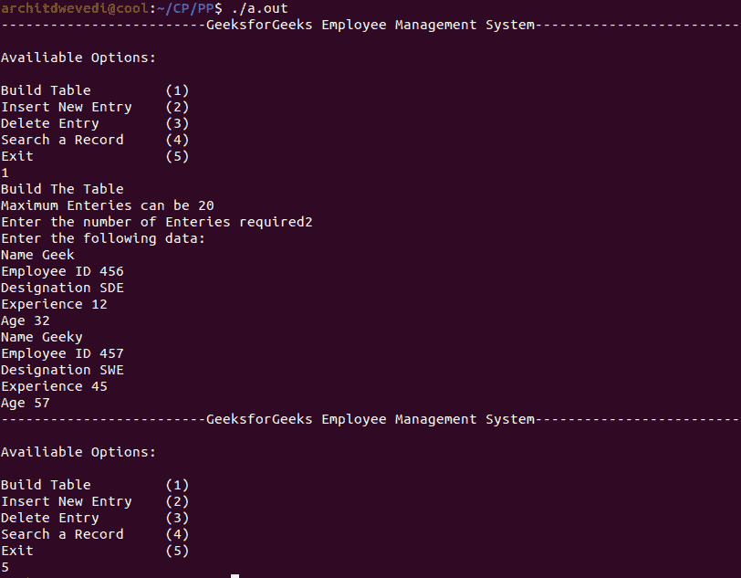

# 员工管理系统程序

> 原文:[https://www . geesforgeks . org/program-for-employee-management-system/](https://www.geeksforgeeks.org/program-for-employee-management-system/)

A **员工管理系统(EMS)** 是为处理公司的主要内务管理功能而构建的软件。EMS 帮助公司跟踪所有员工及其记录。它被用来使用计算机系统管理公司。

**员工管理体系目标:**

*   构建员工表。
*   插入新条目。
*   删除条目。
*   搜索记录。

**员工数据:**

*   名字
*   员工编号
*   指定
*   经验
*   年龄

**进场:**

1.  为了存储员工的数据，创建一个用户定义的数据类型来存储关于员工的信息。下面是数据类型的声明:

    ```
    struct employee {
      string name;
      long int code;
      string designation;
      int exp;
      int age;
    };

    ```

2.  **构建员工表:**构建员工表的想法是使用上面的**结构数据类型**的数组，该数组将用于存储关于员工的信息。为了在索引 I 存储信息，数据存储为:

    ```
    struct employee emp[10];
    emp[i].name = "GeeksforGeeks"
    emp[i].code = "12345"
    emp[i].designation = "Organisation"
    emp[i].exp = 10
    emp[i].age = 10

    ```

3.  **在记录中删除:**由于我们使用数组来存储数据，因此删除任意索引处的数据会将该索引处的所有数据移动 1，并通过将数组的大小减少 1 来删除数组的最后一个数据。
4.  **在记录中搜索:**对于基于任何参数在记录中搜索，其思想是遍历数据，如果在任何索引处参数值与存储的记录匹配，则打印该员工的所有信息。

下面是员工管理系统在 C 中的实现:

## C++

```
// C++ program for the above approach
#include <bits/stdc++.h>

#define max 20
using namespace std;

// Structure of Employee
struct employee {
    string name;
    long int code;
    string designation;
    int exp;
    int age;
};

int num;
void showMenu();

// Array of Employees to store the
// data in the form of the Structure
// of the Array
employee emp[max], tempemp[max],
    sortemp[max], sortemp1[max];

// Function to build the given datatype
void build()
{
    cout << "Build The Table\n";
    cout << "Maximum Entries can be "
         << max << "\n";

    cout << "Enter the number of "
         << "Entries required";
    cin >> num;

    if (num > 20) {
        cout << "Maximum number of "
             << "Entries are 20\n";
        num = 20;
    }
    cout << "Enter the following data:\n";

    for (int i = 0; i < num; i++) {
        cout << "Name ";
        cin >> emp[i].name;

        cout << "Employee ID ";
        cin >> emp[i].code;

        cout << "Designation ";
        cin >> emp[i].designation;

        cout << "Experience ";
        cin >> emp[i].exp;

        cout << "Age ";
        cin >> emp[i].age;
    }

    showMenu();
}

// Function to insert the data into
// given data type
void insert()
{
    if (num < max) {
        int i = num;
        num++;

        cout << "Enter the information "
             << "of the Employee\n";
        cout << "Name ";
        cin >> emp[i].name;

        cout << "Employee ID ";
        cin >> emp[i].code;

        cout << "Designation ";
        cin >> emp[i].designation;

        cout << "Experience ";
        cin >> emp[i].exp;

        cout << "Age ";
        cin >> emp[i].age;
    }
    else {
        cout << "Employee Table Full\n";
    }

    showMenu();
}

// Function to delete record at index i
void deleteIndex(int i)
{
    for (int j = i; j < num - 1; j++) {
        emp[j].name = emp[j + 1].name;
        emp[j].code = emp[j + 1].code;
        emp[j].designation
            = emp[j + 1].designation;
        emp[j].exp = emp[j + 1].exp;
        emp[j].age = emp[j + 1].age;
    }
    return;
}

// Function to delete record
void deleteRecord()
{
    cout << "Enter the Employee ID "
         << "to Delete Record";

    int code;

    cin >> code;
    for (int i = 0; i < num; i++) {
        if (emp[i].code == code) {
            deleteIndex(i);
            num--;
            break;
        }
    }
    showMenu();
}

void searchRecord()
{
    cout << "Enter the Employee"
         << " ID to Search Record";

    int code;
    cin >> code;

    for (int i = 0; i < num; i++) {

        // If the data is found
        if (emp[i].code == code) {
            cout << "Name "
                 << emp[i].name << "\n";

            cout << "Employee ID "
                 << emp[i].code << "\n";

            cout << "Designation "
                 << emp[i].designation << "\n";

            cout << "Experience "
                 << emp[i].exp << "\n";

            cout << "Age "
                 << emp[i].age << "\n";
            break;
        }
    }

    showMenu();
}

// Function to show menu
void showMenu()
{

    cout << "-------------------------"
         << "GeeksforGeeks Employee"
         << " Management System"
         << "-------------------------\n\n";

    cout << "Available Options:\n\n";
    cout << "Build Table         (1)\n";
    cout << "Insert New Entry    (2)\n";
    cout << "Delete Entry        (3)\n";
    cout << "Search a Record     (4)\n";
    cout << "Exit                (5)\n";

    int option;

    // Input Options
    cin >> option;

    // Call function on the bases of the
    // above option
    if (option == 1) {
        build();
    }
    else if (option == 2) {
        insert();
    }
    else if (option == 3) {
        deleteRecord();
    }
    else if (option == 4) {
        searchRecord();
    }
    else if (option == 5) {
        return;
    }
    else {
        cout << "Expected Options"
             << " are 1/2/3/4/5";
        showMenu();
    }
}

// Driver Code
int main()
{

    showMenu();
    return 0;
}
```

**Output:**
Below is the output of the above program:
[](https://media.geeksforgeeks.org/wp-content/uploads/20200709094445/emp.png)