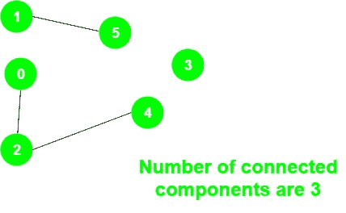

# 计算无向图中连接组件数量的程序

> 原文:[https://www . geesforgeks . org/program-to-count-number-of-connected-in-an-directed-graph/](https://www.geeksforgeeks.org/program-to-count-number-of-connected-components-in-an-undirected-graph/)

给定一个无向图 **g** ，任务是打印图中连接组件的数量。

**示例:**

> **输入:**
> 
> 
> 
> **输出:** 3
> 有三个相连的组件:
> 1–5、0–2–4 和 3

**进场:**

DFS 访问给定顶点的所有连通顶点。

当迭代所有顶点时，每当我们看到未访问的节点时，这是因为到目前为止，DFS 还没有访问过该节点。

这意味着它没有连接到任何以前访问过的节点，也就是说，它不是以前组件的一部分。

这意味着，在访问这个节点之前，我们刚刚访问完所有的

节点前一个组件，现在该组件已经完成，所以我们需要在完成一个组件时增加组件计数器

其思想是使用变量计数来存储连接组件的数量，并执行以下步骤:

1.  将所有顶点初始化为未访问。
2.  对于所有顶点，检查是否有顶点未被访问，然后对该顶点执行离散傅立叶变换，并将变量**计数**增加 1。

下面是上述方法的实现:

## C++

```
// C++ program for above approach
#include <bits/stdc++.h>
using namespace std;

// Graph class represents a undirected graph
// using adjacency list representation
class Graph {
    // No. of vertices
    int V;

    // Pointer to an array containing adjacency lists
    list<int>* adj;

    // A function used by DFS
    void DFSUtil(int v, bool visited[]);

public:
    // Constructor
    Graph(int V);

    void addEdge(int v, int w);
    int NumberOfconnectedComponents();
};

// Function to return the number of
// connected components in an undirected graph
int Graph::NumberOfconnectedComponents()
{

    // Mark all the vertices as not visited
    bool* visited = new bool[V];

    // To store the number of connected components
    int count = 0;
    for (int v = 0; v < V; v++)
        visited[v] = false;

    for (int v = 0; v < V; v++) {
        if (visited[v] == false) {
            DFSUtil(v, visited);
            count += 1;
        }
    }

    return count;
}

void Graph::DFSUtil(int v, bool visited[])
{

    // Mark the current node as visited
    visited[v] = true;

    // Recur for all the vertices
    // adjacent to this vertex
    list<int>::iterator i;

    for (i = adj[v].begin(); i != adj[v].end(); ++i)
        if (!visited[*i])
            DFSUtil(*i, visited);
}

Graph::Graph(int V)
{
    this->V = V;
    adj = new list<int>[V];
}

// Add an undirected edge
void Graph::addEdge(int v, int w)
{
    adj[v].push_back(w);
    adj[w].push_back(v);
}

// Driver code
int main()
{
    Graph g(5);
    g.addEdge(1, 0);
    g.addEdge(2, 3);
    g.addEdge(3, 4);

    cout << g.NumberOfconnectedComponents();

    return 0;
}
```

## Java 语言(一种计算机语言，尤用于创建网站)

```
import java.util.*;
class Graph {
    private int V; // No. of vertices in graph.

    private LinkedList<Integer>[] adj; // Adjacency List
                                       // representation

    ArrayList<ArrayList<Integer> > components
        = new ArrayList<>();

    @SuppressWarnings("unchecked") Graph(int v)
    {
        V = v;
        adj = new LinkedList[v];

        for (int i = 0; i < v; i++)
            adj[i] = new LinkedList();
    }

    void addEdge(int u, int w)
    {
        adj[u].add(w);
        adj[w].add(u); // Undirected Graph.
    }

    void DFSUtil(int v, boolean[] visited,
                 ArrayList<Integer> al)
    {
        visited[v] = true;
        al.add(v);
        System.out.print(v + " ");
        Iterator<Integer> it = adj[v].iterator();

        while (it.hasNext()) {
            int n = it.next();
            if (!visited[n])
                DFSUtil(n, visited, al);
        }
    }

    void DFS()
    {
        boolean[] visited = new boolean[V];

        for (int i = 0; i < V; i++) {
            ArrayList<Integer> al = new ArrayList<>();
            if (!visited[i]) {
                DFSUtil(i, visited, al);
                components.add(al);
            }
        }
    }

    int ConnecetedComponents() { return components.size(); }
}
public class Main {
    public static void main(String[] args)
    {
        Graph g = new Graph(6);

        g.addEdge(1, 5);
        g.addEdge(0, 2);
        g.addEdge(2, 4);
        System.out.println("Graph DFS:");
        g.DFS();
        System.out.println(
            "\nNumber of Conneceted Components: "
            + g.ConnecetedComponents());
    }
}
// Code contributed by Madhav Chittlangia.
```

## 蟒蛇 3

```
# Python3 program for above approach

# Graph class represents a undirected graph
# using adjacency list representation
class Graph:

    def __init__(self, V):

        # No. of vertices
        self.V = V

        # Pointer to an array containing
        # adjacency lists
        self.adj = [[] for i in range(self.V)]

    # Function to return the number of
    # connected components in an undirected graph
    def NumberOfconnectedComponents(self):

        # Mark all the vertices as not visited
        visited = [False for i in range(self.V)]

        # To store the number of connected
        # components
        count = 0

        for v in range(self.V):
            if (visited[v] == False):
                self.DFSUtil(v, visited)
                count += 1

        return count

    def DFSUtil(self, v, visited):

        # Mark the current node as visited
        visited[v] = True

        # Recur for all the vertices
        # adjacent to this vertex
        for i in self.adj[v]:
            if (not visited[i]):
                self.DFSUtil(i, visited)

    # Add an undirected edge
    def addEdge(self, v, w):

        self.adj[v].append(w)
        self.adj[w].append(v)

# Driver code       
if __name__=='__main__':

    g = Graph(5)
    g.addEdge(1, 0)
    g.addEdge(2, 3)
    g.addEdge(3, 4)

    print(g.NumberOfconnectedComponents())

# This code is contributed by rutvik_56
```

**Output**

```
2
```