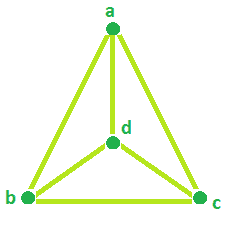

# 计算轮图直径、周期和边的程序

> 原文:[https://www . geesforgeks . org/program-to-find-diameter-cycles-and-edges-of-a-wheel-graph/](https://www.geeksforgeeks.org/program-to-find-the-diameter-cycles-and-edges-of-a-wheel-graph/)

**轮图:**轮图是将单个通用顶点连接到一个循环的所有顶点而形成的图。**属性:-**

*   轮图是平面图。
*   轮图中总有一个哈密顿圈。
*   如果 n 分别是奇数和偶数，色数是 3 和 4。

 **问题陈述:**给定轮盘图中的顶点数。任务是找到:

1.  车轮图中的循环数。
2.  轮盘图中的边数。
3.  轮图的直径。

    **示例:**

    ```
    Input: vertices = 4
    Output: Number of cycle = 7
             Number of edge = 6
             Diameter = 1

    Input: vertices = 6
    Output: Number of cycle = 21
             Number of edge = 10
             Diameter = 2

    ```

    **示例#1:** 对于顶点= 4 的轮盘图，**总周期为 7**:
    T5】

    **示例#2:** 对于顶点= 5 和 7 的轮盘图**边数分别= 8 和 12**:
    

    **示例#3:** 对于顶点= 4，**直径为 1** ，因为我们可以通过仅覆盖一条边从任何顶点到任何顶点。

    

    **计算循环、边和直径的公式:-**

    ```
    Number of Cycle = (vertices * vertices) - (3 * vertices) + 3
    Number of edge = 2 * (vertices - 1)
    Diameter = if vertices = 4, Diameter = 1
               if vertices > 4, Diameter = 2

    ```

    下面是需要的实现:

    ## C++

    ```
    // C++ Program to find the diameter, 
    // cycles and edges of a Wheel Graph
    #include <bits/stdc++.h>
    using namespace std;

    // Function that calculates the
    // Number of Cycle in Wheel Graph.
    int totalCycle(int vertices)
    {
        int result = 0;

        // calculates no. of Cycle.
        result = pow(vertices, 2) - (3 * vertices) + 3;

        return result;
    }

    // Function that calculates the
    // Number of Edges in Wheel graph.
    int Edges(int vertices)
    {
        int result = 0;

        result = 2 * (vertices - 1);

        return result;
    }

    // Function that calculates the
    // Diameter in Wheel Graph.
    int Diameter(int vertices)
    {
        int result = 0;

        // calculates Diameter.
        if (vertices == 4)
            result = 1;
        else
            result = 2;

        return result;
    }

    // Driver Code
    int main()
    {
        int vertices = 4;

        cout << "Number of Cycle = " << totalCycle(vertices) << endl;
        cout << "Number of Edges = " << Edges(vertices) << endl;
        cout << "Diameter = " << Diameter(vertices);

        return 0;
    }
    ```

    ## Java 语言(一种计算机语言，尤用于创建网站)

    ```
    //Java Program to find the diameter, 
    // cycles and edges of a Wheel Graph
    import java.io.*;

    class GFG
    {
        // Function that calculates the 
        // Number of Cycle in Wheel Graph. 
        static int totalCycle(double vertices) 
        { 
            double result = 0;
            int result1 = 0;

            // calculates no. of Cycle. 
            result = Math.pow(vertices, 2) - (3 * vertices) + 3; 

            result1 = (int)(result);
            return result1; 
        } 

        // Function that calculates the 
        // Number of Edges in Wheel graph. 
        static int Edges(int vertices) 
        { 
            int result = 0; 

            result = 2 * (vertices - 1); 

            return result; 
        } 

        // Function that calculates the 
        // Diameter in Wheel Graph. 
        static int Diameter(int vertices) 
        { 
            int result = 0; 

            // calculates Diameter. 
            if (vertices == 4) 
                result = 1; 
            else
                result = 2; 

            return result; 
        }

        //Driver Code
        public static void main(String[] args)
        {
            int vertices = 4;

            System.out.println("Number of Cycle = " + totalCycle(vertices));
            System.out.println("Number of Edges = " + Edges(vertices));
            System.out.println("Diameter = " + Diameter(vertices));
        }
    }
    ```

    ## 蟒蛇 3

    ```
    # Python3 Program to find the diameter, 
    # cycles and edges of a Wheel Graph 

    # Function that calculates the 
    # Number of Cycle in Wheel Graph. 
    def totalCycle(vertices): 

        result = 0

        # calculates no. of Cycle. 
        result = (pow(vertices, 2) - 
                 (3 * vertices) + 3)
        return result 

    # Function that calculates the 
    # Number of Edges in Wheel graph. 
    def Edges(vertices): 

        result = 0
        result = 2 * (vertices - 1) 
        return result 

    # Function that calculates the 
    # Diameter in Wheel Graph. 
    def Diameter(vertices): 

        result = 0

        # calculates Diameter. 
        if vertices == 4: 
            result = 1
        else:
            result = 2

        return result 

    # Driver Code 
    if __name__ == "__main__":

        vertices = 4

        print("Number of Cycle =", 
               totalCycle(vertices)) 
        print("Number of Edges =", Edges(vertices)) 
        print("Diameter =", Diameter(vertices)) 

    # This code is contributed by Rituraj Jain
    ```

    ## C#

    ```
    // C# Program to find the diameter, 
    // cycles and edges of a Wheel Graph
    using System;
    class GFG
    {
    // Function that calculates the 
    // Number of Cycle in Wheel Graph. 
    static int totalCycle(double vertices) 
    { 
        double result = 0;
        int result1 = 0;

        // calculates no. of Cycle. 
        result = Math.Pow(vertices, 2) -
                         (3 * vertices) + 3; 

        result1 = (int)(result);
        return result1; 
    } 

    // Function that calculates the 
    // Number of Edges in Wheel graph. 
    static int Edges(int vertices) 
    { 
        int result = 0; 

        result = 2 * (vertices - 1); 

        return result; 
    } 

    // Function that calculates the 
    // Diameter in Wheel Graph. 
    static int Diameter(int vertices) 
    { 
        int result = 0; 

        // calculates Diameter. 
        if (vertices == 4) 
            result = 1; 
        else
            result = 2; 

        return result; 
    }

    // Driver Code
    public static void Main()
    {
        int vertices = 4;

        Console.WriteLine("Number of Cycle = " + 
                          totalCycle(vertices));
        Console.WriteLine("Number of Edges = " + 
                               Edges(vertices));
        Console.WriteLine("Diameter = " + 
                           Diameter(vertices));
    }
    }

    // This code is contributed by inder_verma
    ```

    ## 服务器端编程语言（Professional Hypertext Preprocessor 的缩写）

    ```
    <?php
    // PHP Program to find the diameter, 
    // cycles and edges of a Wheel Graph

    // Function that calculates the
    // Number of Cycle in Wheel Graph.
    function totalCycle($vertices)
    {
        $result = 0;

        // calculates no. of Cycle.
        $result = pow($vertices, 2) - 
                     (3 * $vertices) + 3;

        return $result;
    }

    // Function that calculates the
    // Number of Edges in Wheel graph.
    function Edges($vertices)
    {
        $result = 0;

        $result = 2 * ($vertices - 1);

        return $result;
    }

    // Function that calculates the
    // Diameter in Wheel Graph.
    function Diameter($vertices)
    {
        $result = 0;

        // calculates Diameter.
        if ($vertices == 4)
            $result = 1;
        else
            $result = 2;

        return $result;
    }

    // Driver Code
    $vertices = 4;

    echo "Number of Cycle = " , 
          totalCycle($vertices), "\n";
    echo "Number of Edges = " , 
          Edges($vertices), "\n" ;
    echo "Diameter = " , Diameter($vertices);

    // This code is contributed by inder_verma
    ?>
    ```

    **Output:**

    ```
    Number of Cycle = 7
    Number of Edges = 6
    Diameter = 1

    ```