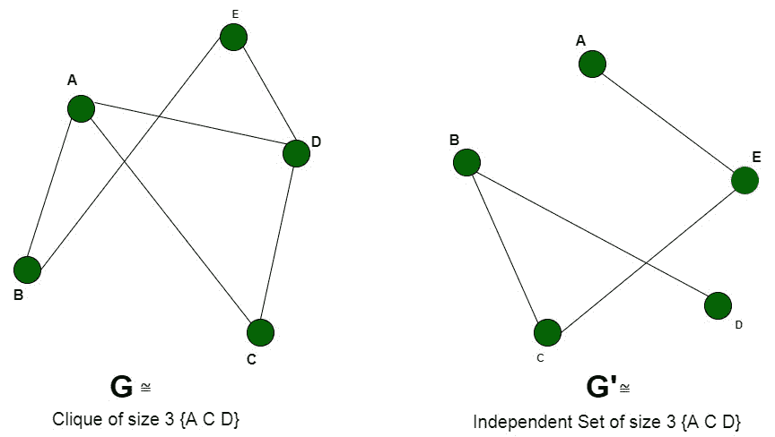

# 图论中独立集是 NP 完全的证明

> 原文:[https://www . geesforgeks . org/独立证明-图论中的集合-是-np-complete/](https://www.geeksforgeeks.org/proof-that-independent-set-in-graph-theory-is-np-complete/)

**先决条件:**[NP-完备性](https://www.geeksforgeeks.org/np-completeness-set-1/)[独立集](https://en.wikipedia.org/wiki/Independent_set_(graph_theory))。

图**的独立集**S**G =(V，E)** 是一组顶点，使得 S 中没有两个顶点彼此相邻。它由不相邻的顶点组成。

**问题:**给定一个图 G(V，E)和一个整数 k，问题是确定该图是否包含大小为> =k.
**的独立顶点集解释:**
问题的一个实例是指定给问题的输入。独立集问题的一个例子是图 G (V，E)和正整数 k，问题是检查 G 中是否存在大小为 k 的独立集。由于 NP-Complete 问题，顾名思义，是一个同时存在于 NP 和 NP-hard 中的问题，所以问题是 NP-Complete 这一说法的证明由两部分组成:

1.  问题本身在 NP 类。
2.  NP 类中的所有其他问题都可以在多项式时间内简化为这个问题。
    (B 可多项式时间约化为 C 表示为)

如果仅满足第二个条件，则问题称为 **NP-Hard** 。

但是不可能把每一个 NP 问题都化为另一个 NP 问题来一直展示它的 NP 完全性。这就是为什么如果我们想证明一个问题是 NP-Complete，我们只需要证明这个问题是在 NP 中，并且任何 NP-Complete 问题都可以简化为这个问题，那么我们就完成了，也就是说，如果 B 是 NP-Complete，并且对于 NP 中的 C 来说，那么 C 就是 NP-Complete。

1.  **独立集是 NP**
    如果有任何问题在 NP 中，那么，给定一个‘证书’，它是问题的解和问题的一个实例(在这种情况下是一个图 G 和一个正整数 k)，我们将能够在多项式时间内验证(检查给定的解是否正确)证书。
    证书是顶点的子集 V ’,它包括属于独立集合的顶点。我们可以通过检查属于该解决方案的每对顶点是否不相邻来验证该解决方案，只需验证它们彼此不共享一条边。这可以在多项式时间内完成，即使用图 G(V，E)的以下策略进行 O(V+E):

    ```
    flag=true
    For every pair {u, v} in the subset V’:
        Check that these two don’t
        have an edge between them
        If there is an edge,
        set flag to false and break
    If flag is true:
        Solution is correct
    Else:
        Solution is incorrect

    ```

2.  **Independent Set is NP-Hard.**
    In order to prove that the Independent Set problem is NP-Hard, we will perform a reduction from a known NP-Hard problem to this problem. We will carry out a reduction from which the Clique Problem can be reduced to the Independent Set problem.
    Every instance of the clique problem consisting of the graph G (V, E) and an integer k can be converted to the required graph G’ (V’, E’) and k’ of the Independent Set problem. We will construct the graph G’ in the following way:

    > V' = V，即图 G 的所有顶点都是图 G 的一部分'
    > E' =边 E 的补边，即原始图 G 中不存在的边

    图 G’是 G 的互补图。计算互补图 G’所需的时间需要遍历所有顶点和边。这个的时间复杂度是 O (V+E)。
    我们现在将证明计算独立集的问题确实归结为团的计算。这种简化可以通过以下两个命题来证明:

    *   让我们假设图 G 包含一个大小为 k 的团。团的存在意味着 G 中有 k 个顶点，其中每个顶点通过一条边与剩余的顶点相连。这进一步表明，由于这些边包含在 G 中，因此它们不能出现在 G’中。结果，这 k 个顶点在 G’中彼此不相邻，因此形成大小为 k 的独立集合
    *   我们假设互补图 G’有一组独立的大小为 k’的顶点。这些顶点都不与任何其他顶点共享一条边。当我们对图进行补运算以获得 G 时，这 k 个顶点将共享一条边，因此彼此相邻。因此，图 G 将有一个大小为 k 的团。


因此，如果 G’(补图)中存在大小为 k 的团，则可以说图 G 中存在大小为 k 的独立集合。因此，独立集问题的任何实例都可以简化为团问题的实例。因此，独立集是 **NP-Hard。**

**结论:**
*由于独立集问题既是 NP 难问题又是 NP 难问题，因此是 NP 完全问题。*