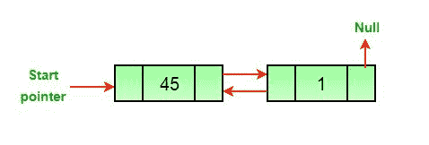

# 删除双向链表中节点的 Python 程序

> 原文:[https://www . geesforgeks . org/python-用于删除双链表中节点的程序/](https://www.geeksforgeeks.org/python-program-for-deleting-a-node-in-a-doubly-linked-list/)

**先决条件:** [双向链接列表集 1|介绍和插入](https://www.geeksforgeeks.org/doubly-linked-list/)

编写一个函数来删除双向链表中的给定节点。
**原双链表**


**方法:**双链表中节点的删除可以分为三大类:

*   **删除头节点后。**


*   **删除中间节点后。**



*   **删除最后一个节点后。**


**如果要删除的节点的指针和头指针已知，那么上述三种情况都可以分两步处理。**

1.  如果要删除的节点是头节点，则将下一个节点作为头。
2.  如果删除了一个节点，请连接已删除节点的下一个和上一个节点。


**算法**

*   让要删除的节点为 *del* 。
*   如果要删除的节点是头节点，则将头指针更改为下一个当前头。

```
if *headnode* == *del* then
      *headnode* =  *del*.nextNode
```

*   如果存在上一个 *del* ，则将上一个的*下一个*设置为 *del* 。

```
if *del*.nextNode != *none* 
      *del*.nextNode.previousNode = *del*.previousNode 
```

*   如果在 *del* 旁边，则设置 *del* 旁边的 *prev* 。

```
if *del*.previousNode != *none* 
      *del*.previousNode.nextNode = *del*.next
```

## 计算机编程语言

```
# Program to delete a node in a 
# doubly-linked list

# For Garbage collection
import gc

# A node of the doubly linked list
class Node:

    # Constructor to create a new node
    def __init__(self, data):
        self.data = data 
        self.next = None
        self.prev = None

class DoublyLinkedList:

     # Constructor for empty Doubly 
     # Linked List
    def __init__(self):
        self.head = None

   # Function to delete a node in a Doubly 
   # Linked List. head_ref --> pointer to 
   # head node pointer. dele --> pointer to 
   # node to be deleted.
    def deleteNode(self, dele):

        # Base Case
        if self.head is None or dele is None:
            return 

        # If node to be deleted is head node
        if self.head == dele:
            self.head = dele.next

        # Change next only if node to be 
        # deleted is NOT the last node
        if dele.next is not None:
            dele.next.prev = dele.prev

        # Change prev only if node to be 
        # deleted is NOT the first node
        if dele.prev is not None:
            dele.prev.next = dele.next

        # Finally, free the memory occupied 
        # by dele
        # Call python garbage collector
        gc.collect()

    # Given a reference to the head of a 
    # list and an integer, inserts a new 
    # node on the front of list
    def push(self, new_data):

        # 1\. Allocates node
        # 2\. Put the data in it
        new_node = Node(new_data)

        # 3\. Make next of new node as head 
        # and previous as None (already None)
        new_node.next = self.head

        # 4\. Change prev of head node to 
        # new_node
        if self.head is not None:
            self.head.prev = new_node

        # 5\. Move the head to point to the 
        # new node
        self.head = new_node

    def printList(self, node):
        while(node is not None):
            print node.data,
            node = node.next

# Driver code

# Start with empty list
dll = DoublyLinkedList()

# Let us create the doubly linked list 
# 10<->8<->4<->2
dll.push(2);
dll.push(4);
dll.push(8);
dll.push(10);

print "Original Linked List",
dll.printList(dll.head)

# Delete nodes from doubly linked list
dll.deleteNode(dll.head)
dll.deleteNode(dll.head.next)
dll.deleteNode(dll.head.next)

# Modified linked list will be NULL<-8->NULL
print "Modified Linked List",
dll.printList(dll.head)
# This code is contributed by Nikhil Kumar Singh(nickzuck_007)
```

**输出:**

```
Original Linked list 10 8 4 2 
Modified Linked list 8
```

**复杂度分析:**

*   **时间复杂度:** O(1)。
    因为不需要遍历链表，所以时间复杂度是恒定的。
*   **空间复杂度:** O(1)。
    由于不需要额外的空间，所以空间复杂度不变。

详情请参考[删除双向链表](https://www.geeksforgeeks.org/delete-a-node-in-a-doubly-linked-list/)中的一个节点的完整文章！