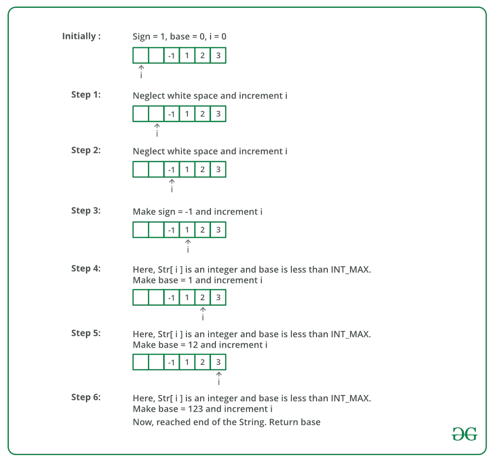

# 编写自己 atoi()的 Python 程序

> 原文:[https://www . geesforgeks . org/python-程序写自己的-atoi/](https://www.geeksforgeeks.org/python-program-to-write-your-own-atoi/)

C 语言中的 **atoi()函数**以一个字符串(代表一个整数)为参数，返回其 int 类型的值。所以基本上这个函数是用来把字符串参数转换成整数的。

**语法:**

```
int atoi(const char strn)
```

**参数:**函数接受一个参数 **strn** ，该参数是指需要转换为其整数等价物的字符串参数。

**返回值:**如果 strn 是有效的输入，则函数返回传递的字符串数字的等效整数。如果没有发生有效的转换，则函数返回零。

**现在让我们来理解一个人可以在各种条件支持下创建自己的 atoi()函数的各种方式:**

**<u>方法 1:</u>** 以下是一个简单的转换实现，不考虑任何特例。

*   将结果初始化为 0。
*   从第一个字符开始，更新每个字符的结果。
*   对于每个字符，将答案更新为*结果=结果* 10+(s[I]–‘0’)*

## 计算机编程语言

```
# Python program for implementation of atoi

# A simple atoi() function

def myAtoi(string):
    res = 0

    # Iterate through all characters of
    #  input string and update result
    for i in xrange(len(string)):
        res = res * 10 + (ord(string[i]) - ord('0'))

    return res

# Driver program
string = "89789"

# Function call
print myAtoi(string)

# This code is contributed by BHAVYA JAIN
```

**Output**

```
89789
```

**<u>方法 2:</u>** 这个实现处理负数。如果第一个字符是“-”，则将符号存储为负数，然后使用前面的方法将字符串的其余部分转换为数字，同时将符号与数字相乘。

## 计算机编程语言

```
# Python program for implementation of atoi

# A simple atoi() function

def myAtoi(string):
    res = 0
    # initialize sign as positive
    sign = 1
    i = 0

    # if number is negative then update sign
    if string[0] == '-':
        sign = -1
        i += 1

    # Iterate through all characters 
    # of input string and update result
    for j in xrange(i, len(string)):
        res = res*10+(ord(string[j])-ord('0'))

    return sign * res

# Driver code
string = "-123"

# Function call
print myAtoi(string)

# This code is contributed by BHAVYA JAIN
```

**Output**

```
-123
```

**<u>方法 3:</u>** 这个实现*处理各种类型的错误*。如果*字符串*为空或*字符串*包含非数字字符，则返回 0，因为该数字无效。

**Output**

```
 -134
```

**<u>进场 4:</u>** 需要处理的四角案件:

*   丢弃所有前导空格
*   数字的符号
*   泛滥
*   无效输入

要删除前导空格，请运行一个循环，直到到达数字的某个字符。如果该数字大于或等于 INT_MAX/10。然后如果符号为正，返回 INT_MAX，如果符号为负，返回 INT_MIN。其他情况在以前的方法中处理。

**试运行:**



下面是上述方法的实现:

## 蟒蛇 3

```
# A simple Python3 program for
# implementation of atoi
import sys

def myAtoi(Str):

    sign, base, i = 1, 0, 0

    # If whitespaces then ignore.
    while (Str[i] == ' '):
        i += 1

    # Sign of number
    if (Str[i] == '-' or Str[i] == '+'):
        sign = 1 - 2 * (Str[i] == '-')
        i += 1

    # Checking for valid input
    while (i < len(Str) and 
          Str[i] >= '0' and Str[i] <= '9'):

        # Handling overflow test case
        if (base > (sys.maxsize // 10) or
           (base == (sys.maxsize // 10) and 
           (Str[i] - '0') > 7)):
            if (sign == 1):
                return sys.maxsize
            else:
                return -(sys.maxsize)

        base = 10 * base + (ord(Str[i]) - ord('0'))
        i += 1

    return base * sign

# Driver Code
Str = list(" -123")

# Functional Code
val = myAtoi(Str)

print(val)

# This code is contributed by divyeshrabadiya07
```

**Output**

```
 -123
```

**上述所有方法的复杂性分析:**

*   **时间复杂度:** O(n)。
    只需要遍历一次字符串。
*   **空间复杂度:** O(1)。
    因为不需要额外的空间。

[atoi()](http://geeksquiz.com/recursive-implementation-of-atoi/)的递归程序。

**练习:**
写你的韩元 [atof()](http://www.cplusplus.com/reference/cstdlib/atof/) 该函数将一个字符串(代表一个浮点值)作为参数，并将其值作为 double 返回。

更多详情请参考[写自己的 atoi()](https://www.geeksforgeeks.org/write-your-own-atoi/) 整篇文章！