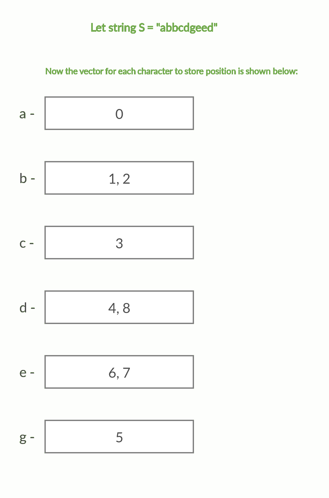

# 查询字符串 S 中 L 到 R 范围内的重复字符总数

> 原文:[https://www . geesforgeks . org/query-to-find-范围内重复字符总数-l-to-r-in-string-s/](https://www.geeksforgeeks.org/queries-to-find-total-number-of-duplicate-character-in-range-l-to-r-in-the-string-s/)

给定由小写字母和代表 S 查询次数的整数 Q 组成的大小为 N**的字符串 S**。我们的任务是打印所有查询 Q.
**的子串 L 到 R 中的重复字符数注:** *1 ≤N ≤ 10 <sup>6</sup> 和 1≤Q≤10<sup>6</sup>*
**示例:**

> **输入:**
> S = "geeksforgeeks "，Q = 2
> L = 1 R = 5
> L = 4 R = 8
> **输出:**
> 1
> 0
> **解释:**
> 对于第一个查询来说‘e’是 S 中范围 1 到 5 的唯一重复字符。
> 对于第二个查询，S 中没有重复的字符。
> **输入:**
> S =“Geekyy”，Q = 1
> L = 1 R = 6
> **输出:**
> 2
> **解释:**
> 对于第一个查询，“e”和“y”是从 1 到 6 的 S 中的重复字符。

**天真的方法:**
天真的方法是保持一个 26 大小的**频率阵列**，以存储每个字符的计数。对于每个查询，给定一个范围[L，R]，我们将遍历子串 S[L]到 S[R]，并继续统计每个字符的出现次数。现在，如果任何字符的频率大于 1，那么我们将添加 1 来回答。
**高效方法:**
为了高效地解决上述问题，我们将**存储每个字符**在动态数组中出现在字符串中时的位置。对于每个给定的查询，我们将遍历所有 26 个小写字母。如果当前字母在子串 S[L: R]中，那么第一个元素的下一个元素**大于或等于 L** 到在相应的向量中应该存在并且**小于或等于 R** 。
下图显示了我们如何在动态数组中存储字符:



以下是上述方法的实现:

## 卡片打印处理机（Card Print Processor 的缩写）

```
// CPP implementation to Find the total
// number of duplicate character in a
// range L to R for Q number of queries in a string S

#include <bits/stdc++.h>
using namespace std;

// Vector of vector to store
// position of all characters
// as they appear in string
vector<vector<int> > v(26);

// Function to store position of each character
void calculate(string s)
{
    for (int i = 0; i < s.size(); i++) {
        // Inserting position of each
        // character as they appear
        v[s[i] - 'a'].push_back(i);
    }
}

// Function to calculate duplicate
// characters for Q queries
void query(int L, int R)
{
    // Variable to count duplicates
    int duplicates = 0;

    // Iterate over all 26 characters
    for (int i = 0; i < 26; i++) {

        // Finding the first element which
        // is less than or equal to L
        auto first = lower_bound(v[i].begin(),
                                 v[i].end(), L - 1);

        // Check if first pointer exists
        // and is less than R
        if (first != v[i].end() && *first < R) {
            // Incrementing first pointer to check
            // if the next duplicate element exists
            first++;

            // Check if the next element exists
            // and is less than R
            if (first != v[i].end() && *first < R)
                duplicates++;
        }
    }

    cout << duplicates << endl;
}

// Driver Code
int main()
{
    string s = "geeksforgeeks";

    int Q = 2;

    int l1 = 1, r1 = 5;
    int l2 = 4, r2 = 8;

    calculate(s);

    query(l1, r1);
    query(l2, r2);

    return 0;
}
```

## 蟒蛇 3

```
# Python implementation to Find the total
# number of duplicate character in a
# range L to R for Q number of queries in a string S

import bisect

# Vector of vector to store
# position of all characters
# as they appear in string
v = [[] for _ in range(26)]

# Function to store position of each character
def calculate(s: str) -> None:

    for i in range(len(s)):
        # Inserting position of each
        # character as they appear
        v[ord(s[i]) - ord('a')].append(i)

# Function to calculate duplicate
# characters for Q queries
def query(L: int, R: int) -> None:

    # Variable to count duplicates
    duplicates = 0

    # Iterate over all 26 characters
    for i in range(26):

        # Finding the first element which
        # is less than or equal to L
        first = bisect.bisect_left(v[i], L - 1)

        # Check if first pointer exists
        # and is less than R
        if (first < len(v[i]) and v[i][first] < R):
            # Incrementing first pointer to check
            # if the next duplicate element exists
            first += 1

            # Check if the next element exists
            # and is less than R
            if (first < len(v[i]) and v[i][first] < R):
                duplicates += 1

    print(duplicates)

# Driver Code
if __name__ == "__main__":

    s = "geeksforgeeks"

    Q = 2

    l1 = 1
    r1 = 5
    l2 = 4
    r2 = 8

    calculate(s)

    query(l1, r1)
    query(l2, r2)

# This code is contributed by sanjeev2552
```

**Output:** 

```
1
0
```

`
**时间复杂度:** O( Q * 26 * log N)