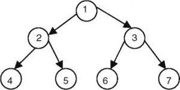

# 树中每个节点的右同级（以边数组表示）

> 原文： [https://www.geeksforgeeks.org/right-sibling-of-each-node-in-a-tree-given-as-array-of-edges/](https://www.geeksforgeeks.org/right-sibling-of-each-node-in-a-tree-given-as-array-of-edges/)

给定一棵树，其中 *N 个*节点和 *E* 个边（每个边由两个整数表示， *X，Y* 表示 X 是 Y 的父级）， 任务是将所有具有正确兄弟姐妹的节点打印在单独的行中。

如果特定节点没有右兄弟，则打印 *-1* 。

**示例**：

> 
> 
> 在上面显示的图像中，节点 3、5、6、7 分别是节点 2、4、5、6 的右同级，而节点 1、3 和 7 没有右同级。
> 
> **输入**：N = 7，E = 6
> edge [] [] = {{1，2}，{1，3}，{2，4}，{2，5}，{ 3，6}，{3，7}}
> **输出**：1 -1
> 2 3
> 3 -1
> 4 5
> 5 6
> 6 7
> 7 -1
> 
> **输入**：N = 5，E = 4
> edge [] [] = {{7，8}，{7，10}，{7，15}，{10，3}}}
> **输出**：7 -1
> 8 10
> 10 15
> 15 -1
> 3 -1

**方法**：的主要思想是使用[广度优先遍历](https://www.geeksforgeeks.org/breadth-first-search-or-bfs-for-a-graph/)。

*   最初，根节点和“ -1”值将被推入队列。 将树中特定级别的每个节点都推入队列后，必须推“ -1”以确保该级别中的最后一个节点没有右兄弟。

*   从队列中弹出每个节点后，队列前面的节点将始终是弹出节点的右兄弟节点。

*   如果弹出节点的值为-1，则表示当前级别已被访问；如果队列不为空，则表示该级别的先前节点中至少有一个未访问的子级。

*   当队列为非空时，请重复上述步骤。

下面是上述方法的实现：

## C++

```cpp

// C++ program to print right siblings
// of all the nodes in a tree
#include <bits/stdc++.h>
using namespace std;

void PrintSiblings(int root, int N, int E, vector<int> adj[])
{
    // boolean array to mark the visited nodes
    vector<bool> vis(N+1, false);

    // queue data structure to implement bfs
    queue<int> q;
    q.push(root);
    q.push(-1);
    vis[root] = 1;
    while (!q.empty()) {
        int node = q.front();
        q.pop();
        if (node == -1) {

            // if queue is empty then
            // the popped node is the last node
            // no need to push -1.
            if (!q.empty())
                q.push(-1);
            continue;
        }

        // node and its right sibling
        cout << node << " " << q.front() << "\n";
        for (auto s : adj[node]) {
            if (!vis[s]) {
                vis[s] = 1;
                q.push(s);
            }
        }
    }
}

// Driver code
int main()
{
    // nodes and edges
    int N = 7, E = 6;
    vector<int> adj[N+1];

    // The tree is represented in the form of
    // an adjacency list as there can be
    // multiple children of a node
    adj[1].push_back(2);
    adj[1].push_back(3);
    adj[2].push_back(4);
    adj[2].push_back(5);
    adj[3].push_back(6);
    adj[3].push_back(7);
    int root = 1;
    PrintSiblings(root, N, E, adj);
    return 0;
}

```

## Java

```java

// Java program to print right siblings
// of all the nodes in a tree
import java.util.*;

class GFG
{
static void PrintSiblings(int root, int N, 
                          int E, Vector<Integer> adj[])
{
    // boolean array to mark the visited nodes
    boolean []vis = new boolean[N + 1];

    // queue data structure to implement bfs
    Queue<Integer> q = new LinkedList<>();
    q.add(root);
    q.add(-1);
    vis[root] = true;
    while (!q.isEmpty()) 
    {
        int node = q.peek();
        q.remove();
        if (node == -1)
        {

            // if queue is empty then
            // the popped node is the last node
            // no need to push -1.
            if (!q.isEmpty())
                q.add(-1);
            continue;
        }

        // node and its right sibling
        System.out.print(node + " " +
                           q.peek() + "\n");
        for (Integer s : adj[node]) 
        {
            if (!vis[s]) 
            {
                vis[s] = true;
                q.add(s);
            }
        }
    }
}

// Driver code
public static void main(String[] args)
{
    // nodes and edges
    int N = 7, E = 6;
    Vector<Integer> []adj = new Vector[N + 1];
    for(int i = 0; i < N + 1; i++)
        adj[i] = new Vector<Integer>();

    // The tree is represented in the form of
    // an adjacency list as there can be
    // multiple children of a node
    adj[1].add(2);
    adj[1].add(3);
    adj[2].add(4);
    adj[2].add(5);
    adj[3].add(6);
    adj[3].add(7);
    int root = 1;
    PrintSiblings(root, N, E, adj);
}
}

// This code is contributed by Rajput-Ji

```

## Python

```py

# Python3 program to print right
# siblings of all the nodes in 
# a tree
def PrintSiblings(root, N, E, adj):

    # Boolean array to mark the 
    # visited nodes
    vis = [False for i in  range(N + 1)]

    # queue data structure to 
    # implement bfs
    q = []
    q.append(root)
    q.append(-1)
    vis[root] = 1

    while (len(q) != 0):
        node = q[0]
        q.pop(0)

        if (node == -1):

            # If queue is empty then the 
              # popped node is the last node
            # no need to append -1.
            if (len(q) != 0):
                q.append(-1)

            continue

        # Node and its right sibling
        print(str(node) + " " + str(q[0]))

        for s in adj[node]:
            if (not vis[s]):
                vis[s] = True
                q.append(s)

# Driver code
if __name__=='__main__':

    # Nodes and edges
    N = 7
    E = 6
    adj = [[] for i in range(N + 1)]

    # The tree is represented in the 
      # form of an adjacency list as 
    # there can be multiple children
    # of a node
    adj[1].append(2)
    adj[1].append(3)
    adj[2].append(4)
    adj[2].append(5)
    adj[3].append(6)
    adj[3].append(7)
    root = 1

    PrintSiblings(root, N, E, adj)

# This code is contributed by rutvik_56

```

## C#

```cs

// C# program to print right siblings
// of all the nodes in a tree
using System;
using System.Collections.Generic;

class GFG
{
static void PrintSiblings(int root, int N, 
                          int E, List<int> []adj)
{
    // bool array to mark the visited nodes
    bool []vis = new bool[N + 1];

    // queue data structure to implement bfs
    Queue<int> q = new Queue<int>();
    q.Enqueue(root);
    q.Enqueue(-1);
    vis[root] = true;
    while (q.Count != 0) 
    {
        int node = q.Peek();
        q.Dequeue();
        if (node == -1)
        {

            // if queue is empty then
            // the popped node is the last node
            // no need to push -1.
            if (q.Count != 0)
                q.Enqueue(-1);
            continue;
        }

        // node and its right sibling
        Console.Write(node + " " +
                      q.Peek() + "\n");
        foreach (int s in adj[node]) 
        {
            if (!vis[s]) 
            {
                vis[s] = true;
                q.Enqueue(s);
            }
        }
    }
}

// Driver code
public static void Main(String[] args)
{
    // nodes and edges
    int N = 7, E = 6;
    List<int> []adj = new List<int>[N + 1];
    for(int i = 0; i < N + 1; i++)
        adj[i] = new List<int>();

    // The tree is represented in the form of
    // an adjacency list as there can be
    // multiple children of a node
    adj[1].Add(2);
    adj[1].Add(3);
    adj[2].Add(4);
    adj[2].Add(5);
    adj[3].Add(6);
    adj[3].Add(7);
    int root = 1;
    PrintSiblings(root, N, E, adj);
}
}

// This code is contributed by Rajput-Ji

```

**Output:** 

```
1 -1
2 3
3 -1
4 5
5 6
6 7
7 -1
```


* * *

* * *

如果您喜欢 GeeksforGeeks 并希望做出贡献，则还可以使用 [tribution.geeksforgeeks.org](https://contribute.geeksforgeeks.org/) 撰写文章，或将您的文章邮寄至 tribution@geeksforgeeks.org。 查看您的文章出现在 GeeksforGeeks 主页上，并帮助其他 Geeks。

如果您发现任何不正确的地方，请单击下面的“改进文章”按钮，以改进本文。