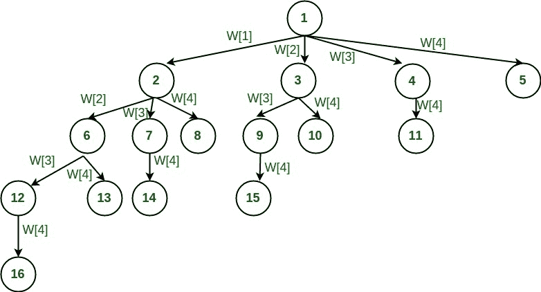

# 子集和|回溯-4

> 原文:[https://www.geeksforgeeks.org/subset-sum-backtracking-4/](https://www.geeksforgeeks.org/subset-sum-backtracking-4/)

子集和问题是寻找从给定集合中选择的元素的子集，该集合的和加起来等于给定的数 k。我们正在考虑该集合包含非负值。假设输入集是唯一的(没有重复)。

**子集和的穷举搜索算法**
寻找和为 K 的子集的一种方法是考虑所有可能的子集。一个[功率集](http://en.wikipedia.org/wiki/Power_set)包含从一个给定集合中产生的所有子集。这样的动力装置尺寸为 2 <sup>N</sup> 。

**子集和的回溯算法**
使用穷举搜索，我们考虑所有子集，不管它们是否满足给定的约束。回溯可以用来系统地考虑要选择的元素。
假设给定一组 4 个元素，比如 **w[1] … w[4]** 。树形图可以用来设计回溯算法。下面的树形图描述了生成可变大小元组的方法。



在上面的树中，一个节点代表函数调用，一个分支代表候选元素。根节点包含 4 个子节点。换句话说，root 将集合中的每个元素都视为不同的分支。下一级子树对应于包括父节点的子集。每一层的分支代表要考虑的元组元素。例如，如果我们处于级别 1，tuple_vector[1]可以取生成的四个分支的任何值。如果我们在最左边节点的第二层，tuple_vector[2]可以取生成的三个分支的任意值，以此类推…

例如，根的最左边的子代生成所有包含 w[1]的子集。类似地，根的第二个子代生成包括 w[2]但不包括 w[1]的所有子集。

随着我们沿着树的深度向下，我们添加元素，如果添加的总和满足显式约束，我们将继续进一步生成子节点。只要不满足约束，我们就停止进一步生成该节点的子树，并回溯到前一个节点，以探索尚未探索的节点。在许多情况下，它节省了大量的处理时间。

树应该触发一个线索来实现回溯算法(自己试试)。它打印所有那些总和等于给定数字的子集。我们需要沿着树的广度和深度探索节点。沿着宽度生成节点由循环控制，沿着深度的节点使用递归(后顺序遍历)生成。下面给出伪代码，

```
if(subset is satisfying the constraint)
    print the subset
    exclude the current element and consider next element
else
    generate the nodes of present level along breadth of tree and
    recur for next levels
```

下面是使用可变大小元组向量实现子集和。请注意，下面的程序探索了类似于穷举搜索的所有可能性。它是为了演示如何使用回溯。请看下一段代码来验证，我们如何优化回溯解决方案。

的拼写错误

当我们结合显式和隐式约束时，回溯的能力就显现出来了，当这些检查失败时，我们就停止生成节点。我们可以通过加强约束检查和数据预分类来改进上述算法。通过对初始数组进行排序，我们不需要考虑数组的其余部分，一旦到目前为止的总和大于目标数。我们可以回溯并检查其他可能性。

同样，假设数组是预先分类的，我们找到了一个子集。只有当包含下一个节点满足约束时，我们才能生成排除当前节点的下一个节点。下面给出的是优化的实现(如果子树不满足约束，它会修剪子树)。

## C++

```
#include <bits/stdc++.h>
using namespace std;

#define ARRAYSIZE(a) (sizeof(a))/(sizeof(a[0]))
static int total_nodes;

// prints subset found
void printSubset(int A[], int size)
{
    for(int i = 0; i < size; i++)
    {
        cout<<" "<< A[i];
    }
    cout<<"\n";
}

// qsort compare function
int comparator(const void *pLhs, const void *pRhs)
{
    int *lhs = (int *)pLhs;
    int *rhs = (int *)pRhs;
    return *lhs > *rhs;
}

// inputs
// s            - set vector
// t            - tuplet vector
// s_size       - set size
// t_size       - tuplet size so far
// sum          - sum so far
// ite          - nodes count
// target_sum   - sum to be found
void subset_sum(int s[], int t[],
                int s_size, int t_size,
                int sum, int ite,
                int const target_sum)
{
    total_nodes++;

    if( target_sum == sum )
    {
        // We found sum
        printSubset(t, t_size);

        // constraint check
        if( ite + 1 < s_size && sum - s[ite] + s[ite + 1] <= target_sum )
        {

            // Exclude previous added item and consider next candidate
            subset_sum(s, t, s_size, t_size - 1, sum - s[ite], ite + 1, target_sum);
        }
        return;
    }
    else
    {

        // constraint check
        if( ite < s_size && sum + s[ite] <= target_sum )
        {

            // generate nodes along the breadth
            for( int i = ite; i < s_size; i++ )
            {
                t[t_size] = s[i];
                if( sum + s[i] <= target_sum )
                {

                    // consider next level node (along depth)
                    subset_sum(s, t, s_size, t_size + 1, sum + s[i], i + 1, target_sum);
                }
            }
        }
    }
}

// Wrapper that prints subsets that sum to target_sum
void generateSubsets(int s[], int size, int target_sum)
{
    int *tuplet_vector = (int *)malloc(size * sizeof(int));
    int total = 0;

    // sort the set
    qsort(s, size, sizeof(int), &comparator);
    for( int i = 0; i < size; i++ )
    {
        total += s[i];
    }
    if( s[0] <= target_sum && total >= target_sum )
    {
        subset_sum(s, tuplet_vector, size, 0, 0, 0, target_sum);
    }
    free(tuplet_vector);
}

// Driver code
int main()
{
    int weights[] = {15, 22, 14, 26, 32, 9, 16, 8};
    int target = 53;
    int size = ARRAYSIZE(weights);
    generateSubsets(weights, size, target);
    cout << "Nodes generated " << total_nodes;
    return 0;
}

//This code is contributed by shivanisinghss2110
```

## C

```
#include <stdio.h>
#include <stdlib.h>

#define ARRAYSIZE(a) (sizeof(a))/(sizeof(a[0]))

static int total_nodes;

// prints subset found
void printSubset(int A[], int size)
{
    for(int i = 0; i < size; i++)
    {
        printf("%*d", 5, A[i]);
    }

    printf("\n");
}

// qsort compare function
int comparator(const void *pLhs, const void *pRhs)
{
    int *lhs = (int *)pLhs;
    int *rhs = (int *)pRhs;

    return *lhs > *rhs;
}

// inputs
// s            - set vector
// t            - tuplet vector
// s_size       - set size
// t_size       - tuplet size so far
// sum          - sum so far
// ite          - nodes count
// target_sum   - sum to be found
void subset_sum(int s[], int t[],
                int s_size, int t_size,
                int sum, int ite,
                int const target_sum)
{
    total_nodes++;

    if( target_sum == sum )
    {
        // We found sum
        printSubset(t, t_size);

        // constraint check
        if( ite + 1 < s_size && sum - s[ite] + s[ite+1] <= target_sum )
        {
            // Exclude previous added item and consider next candidate
            subset_sum(s, t, s_size, t_size-1, sum - s[ite], ite + 1, target_sum);
        }
        return;
    }
    else
    {
        // constraint check
        if( ite < s_size && sum + s[ite] <= target_sum )
        {
            // generate nodes along the breadth
            for( int i = ite; i < s_size; i++ )
            {
                t[t_size] = s[i];

                if( sum + s[i] <= target_sum )
                {
                    // consider next level node (along depth)
                    subset_sum(s, t, s_size, t_size + 1, sum + s[i], i + 1, target_sum);
                }
            }
        }
    }
}

// Wrapper that prints subsets that sum to target_sum
void generateSubsets(int s[], int size, int target_sum)
{
    int *tuplet_vector = (int *)malloc(size * sizeof(int));

    int total = 0;

    // sort the set
    qsort(s, size, sizeof(int), &comparator);

    for( int i = 0; i < size; i++ )
    {
        total += s[i];
    }

    if( s[0] <= target_sum && total >= target_sum )
    {

        subset_sum(s, tuplet_vector, size, 0, 0, 0, target_sum);

    }

    free(tuplet_vector);
}

int main()
{
    int weights[] = {15, 22, 14, 26, 32, 9, 16, 8};
    int target = 53;

    int size = ARRAYSIZE(weights);

    generateSubsets(weights, size, target);

    printf("Nodes generated %d\n", total_nodes);

    return 0;
}
```

**输出:**

```
8 9 14 22n 8 14 15 16n 15 16 22nNodes generated 68
```

作为另一种方法，我们可以生成二元模式的固定大小元组模拟树。当约束不满足时，我们将杀死子树。
–––[T2【文基】T4。](http://www.linkedin.com/in/ramanawithu)

如果你发现任何不正确的地方，或者你想分享更多关于上面讨论的话题的信息，请写评论。