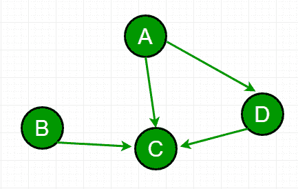

# 图

中的依存关系总和

> 原文： [https://www.geeksforgeeks.org/sum-dependencies-graph/](https://www.geeksforgeeks.org/sum-dependencies-graph/)

给定一个有 n 个节点的有向图和连通图。 如果 u 到 v 之间存在边，则 u 依赖 v。我们的任务是找出每个节点的依赖项总和。



**示例**：

对于图中的图形，

A 取决于 C 和 D，即 2

B 取决于 C，即 1

D 取决于 C，即 1

并且 C 不依赖任何内容。

因此回答-> 0 +1 + 1 + 2 = 4

询问： [Flipkart 面试](https://www.geeksforgeeks.org/flipkart-interview-set-11/)

想法是检查邻接列表，并从每个顶点中找到多少个边并返回边的总数。

## C++

```cpp

// C++ program to find the sum of dependencies 
#include <bits/stdc++.h> 
using namespace std; 

// To add an edge 
void addEdge(vector <int> adj[], int u,int v) 
{ 
    adj[u].push_back(v); 
} 

// find the sum of all dependencies 
int findSum(vector<int> adj[], int V) 
{ 
    int sum = 0; 

    // just find the size at each vector's index 
    for (int u = 0; u < V; u++) 
        sum += adj[u].size(); 

    return sum; 
} 

// Driver code 
int main() 
{ 
    int V = 4; 
    vector<int >adj[V]; 
    addEdge(adj, 0, 2); 
    addEdge(adj, 0, 3); 
    addEdge(adj, 1, 3); 
    addEdge(adj, 2, 3); 

    cout << "Sum of dependencies is "
         << findSum(adj, V); 
    return 0; 
} 

```

## Java

```java

// Java program to find the sum of dependencies 

import java.util.Vector; 

class Test 
{ 
    // To add an edge 
    static void addEdge(Vector <Integer> adj[], int u,int v) 
    { 
        adj[u].addElement((v)); 
    } 

    // find the sum of all dependencies 
    static int findSum(Vector<Integer> adj[], int V) 
    { 
        int sum = 0; 

        // just find the size at each vector's index 
        for (int u = 0; u < V; u++) 
            sum += adj[u].size(); 

        return sum; 
    } 

    // Driver method 
    public static void main(String[] args)  
    { 
        int V = 4; 
          @SuppressWarnings("unchecked") 
        Vector<Integer> adj[] = new Vector[V]; 

        for (int i = 0; i < adj.length; i++) { 
            adj[i] = new Vector<>(); 
        } 

        addEdge(adj, 0, 2); 
        addEdge(adj, 0, 3); 
        addEdge(adj, 1, 3); 
        addEdge(adj, 2, 3); 

        System.out.println("Sum of dependencies is " + 
                            findSum(adj, V)); 
    } 
} 
// This code is contributed by Gaurav Miglani 

```

## Python

```py

# Python3 program to find the sum  
# of dependencies 

# To add an edge 
def addEdge(adj, u, v): 

    adj[u].append(v) 

# Find the sum of all dependencies 
def findSum(adj, V): 

    sum = 0

    # Just find the size at each  
    # vector's index 
    for u in range(V): 
        sum += len(adj[u]) 

    return sum

# Driver code 
if __name__=='__main__': 

    V = 4
    adj = [[] for i in range(V)] 

    addEdge(adj, 0, 2) 
    addEdge(adj, 0, 3) 
    addEdge(adj, 1, 3) 
    addEdge(adj, 2, 3) 

    print("Sum of dependencies is", 
          findSum(adj, V)) 

# This code is contributed by rutvik_56

```

**输出**：

```
Sum of dependencies is 4
```

时间复杂度：`O(V)`，其中 V 是图形中的顶点数。

本文由 [**Sahil Chhabra(akku)**](https://www.facebook.com/sahil.chhabra.965) 贡献。 如果您喜欢 GeeksforGeeks 并希望做出贡献，则还可以使用 [tribution.geeksforgeeks.org](http://www.contribute.geeksforgeeks.org) 撰写文章，或将您的文章邮寄至 tribution@geeksforgeeks.org。 查看您的文章出现在 GeeksforGeeks 主页上，并帮助其他 Geeks。

如果发现任何不正确的内容，或者想分享有关上述主题的更多信息，请发表评论。

