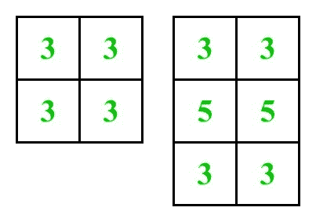

# M×N 网格中相邻方块数的总和

> 原文:[https://www . geeksforgeeks . org/相邻方格数之和/an-m-x-n-grid/](https://www.geeksforgeeks.org/sum-of-the-count-of-number-of-adjacent-squares-in-an-m-x-n-grid/)

给定一个 **M × N** 矩阵。任务是计算相邻单元格的数量并计算它们的总和。
如果两个细胞在水平、垂直或对角方向上相邻，则称它们是相连的。
**示例:**

> **输入:** m = 2，n = 2
> **输出:** 12
> **输入:** m = 3，n = 2
> **输出:** 22
> 见下图，上面写的数字表示相邻方块数。
> 
> 

**方法:**
在一个 m×n 的网格中可以有 3 种情况:

*   角单元接触 3 个单元，总有 4 个角单元。
*   边缘单元格接触 5 个单元格，始终有 2 * (m+n-4)个边缘单元格。
*   内部细胞接触 8 个细胞，总有(m-2) * (n-2)个内部细胞。

因此，

```
Sum = 3*4 + 5*2*(m+n-4) + 8*(m-2)*(n-2) 
    = 8mn - 6m - 6n +4
```

以下是上述方法的实现:

## C++

```
// C++ implementation of the above approach

#include <bits/stdc++.h>
using namespace std;

// function to calculate the sum of all cells adjacent value
int sum(int m, int n)
{
    return 8 * m * n - 6 * m - 6 * n + 4;
}

// Driver program to test above
int main()
{
    int m = 3, n = 2;
    cout << sum(m, n);

    return 0;
}
```

## Java 语言(一种计算机语言，尤用于创建网站)

```
// Java implementation of the above approach
class GFG
{

    // function to calculate the sum
    // of all cells adjacent value
    static int sum(int m, int n)
    {
        return 8 * m * n - 6 * m - 6 * n + 4;
    }

    // Driver Code
    public static void main (String[] args)
    {
        int m = 3, n = 2;
        System.out.println(sum(m, n));
    }
}

// This Code is contributed by AnkitRai01
```

## 蟒蛇 3

```
# Python3 implementation of the above approach

# function to calculate the sum
# of all cells adjacent value
def summ(m, n):
    return 8 * m * n - 6 * m - 6 * n + 4

# Driver Code
m = 3
n = 2
print(summ(m, n))

# This code is contributed by Mohit Kumar
```

## C#

```
// C# implementation of the above approach
using System;
class GFG
{

    // function to calculate the sum
    // of all cells adjacent value
    static int sum(int m, int n)
    {
        return 8 * m * n - 6 * m - 6 * n + 4;
    }

    // Driver Code
    public static void Main (String []args)
    {
        int m = 3, n = 2;
        Console.WriteLine(sum(m, n));
    }
}

// This code is contributed by andrew1234
```

## java 描述语言

```
<script>

// Javascript implementation of the above approach

// function to calculate the sum of all cells adjacent value
function sum(m, n)
{
    return 8 * m * n - 6 * m - 6 * n + 4;
}

// Driver program to test above
var m = 3, n = 2;
document.write(sum(m, n));

</script>
```

**Output:** 

```
22
```

**时间复杂度:** 