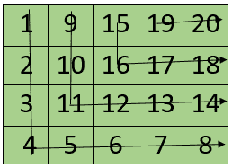

# L 形导线矩阵

> 原文:[https://www.geeksforgeeks.org/traverse-matrix-in-l-shape/](https://www.geeksforgeeks.org/traverse-matrix-in-l-shape/)

给定一个 **N * M** 矩阵。任务是遍历给定的 L 形矩阵，如下图所示。



**例:**

```
Input : n = 3, m = 3
a[][] = { { 1, 2, 3 },
          { 4, 5, 6 },
          { 7, 8, 9 } } 
Output : 1 4 7 8 9 2 5 6 3

Input : n = 3, m = 4
a[][] = { { 1, 2, 3 },
          { 4, 5, 6 },
          { 7, 8, 9 },
          { 10, 11, 12} } 
Output : 1 4 7 10 11 12 2 5 8 9 3 6 
```

请注意，需要遍历的 L 形数量为 m(列数)。所以我们将把每个 L 形分成两部分，首先是垂直的(从上到下)，然后是水平的(从左到右)。
要垂直遍历，观察每一列 **j** ，0<= j<= m–1，我们需要垂直遍历 n–j 个元素。所以对于每一列 j，从[0][j]遍历到[n-1-j][j]。
现在，要水平遍历每个 L 形，观察每列的对应行 j 将是第(n-1-j)行，并且从该行开始第一个元素将是第(j+1)个元素。因此，对于每一个 L 形或每一列 j，要水平遍历，从[n-1-j][j+1]遍历到[n-1-j][m-1]。
以下是本办法的实施情况:

## C++

```
// C++ program to traverse a m x n matrix in L shape.
#include <iostream>
using namespace std;

#define MAX 100

// Printing matrix in L shape
void traverseLshape(int a[][MAX], int n, int m)
{
    // for each column or each L shape
    for (int j = 0; j < m; j++) {

        // traversing vertically
        for (int i = 0; i <= n - j - 1; i++)
            cout << a[i][j] << " ";

        // traverse horizontally
        for (int k = j + 1; k < m; k++)
            cout << a[n - 1 - j][k] << " ";
    }
}

// Driven Program
int main()
{
    int n = 4;
    int m = 3;
    int a[][MAX] = { { 1, 2, 3 },
                     { 4, 5, 6 },
                     { 7, 8, 9 },
                     { 10, 11, 12 } };
    traverseLshape(a, n, m);
    return 0;
}
```

## Java 语言(一种计算机语言，尤用于创建网站)

```
// Java Program to traverse a m x n matrix in L shape.
public class GFG{

    static void traverseLshape(int a[][], int n, int m) {
        // for each column or each L shape
        for (int j = 0; j < m; j++) {

            // traversing vertically
            for (int i = 0; i <= n - j - 1; i++)
                System.out.print(a[i][j] + " ");

            // traverse horizontally
            for (int k = j + 1; k < m; k++)
                System.out.print(a[n - 1 - j][k] + " ");
        }
    }

    // Driver Code
    public static void main(String args[]) {
        int n = 4;
        int m = 3;
        int a[][] = { { 1, 2, 3 },
                        { 4, 5, 6 },
                        { 7, 8, 9 },
                        { 10, 11, 12 } };
        traverseLshape(a, n, m);
    }
}
```

## 蟒蛇 3

```
# Python3 program to traverse a
# m x n matrix in L shape.

# Printing matrix in L shape
def traverseLshape(a, n, m):

    # for each column or each L shape
    for j in range(0, m):

        # traversing vertically
        for i in range(0, n - j):
            print(a[i][j], end = " ");

        # traverse horizontally
        for k in range(j + 1, m):
            print(a[n - 1 - j][k], end = " ");

# Driven Code
if __name__ == '__main__':
    n = 4;
    m = 3;
    a = [[1, 2, 3],
         [4, 5, 6],
         [7, 8, 9],
         [10, 11, 12]];
    traverseLshape(a, n, m);

# This code is contributed by PrinciRaj1992
```

## C#

```
// C# Program to traverse a m x n matrix in L shape.

using System;

public class GFG{

    static void traverseLshape(int[,] a, int n, int m) {
        // for each column or each L shape
        for (int j = 0; j < m; j++) {

            // traversing vertically
            for (int i = 0; i <= n - j - 1; i++)
                Console.Write(a[i,j] + " ");

            // traverse horizontally
            for (int k = j + 1; k < m; k++)
                Console.Write(a[n - 1 - j,k] + " ");
        }
    }

    // Driver Code
    public static void Main() {
        int n = 4; 
        int m = 3; 
        int[,] a = { { 1, 2, 3 }, 
                        { 4, 5, 6 }, 
                        { 7, 8, 9 }, 
                        { 10, 11, 12 } }; 
        traverseLshape(a, n, m); 
    }
}
```

## java 描述语言

```
<script>

// Javascript program to traverse a m x n matrix in L shape.

var MAX = 100;

// Printing matrix in L shape
function traverseLshape(a, n, m)
{
    // for each column or each L shape
    for (var j = 0; j < m; j++) {

        // traversing vertically
        for (var i = 0; i <= n - j - 1; i++)
            document.write( a[i][j] + " ");

        // traverse horizontally
        for (var k = j + 1; k < m; k++)
            document.write( a[n - 1 - j][k] + " ");
    }
}

// Driven Program
var n = 4;
var m = 3;
var a = [ [ 1, 2, 3 ],
                 [ 4, 5, 6 ],
                 [ 7, 8, 9 ],
                 [ 10, 11, 12 ] ];
traverseLshape(a, n, m);

</script>   
```

**Output:** 

```
1 4 7 10 11 12 2 5 8 9 3 6
```

***时间复杂度:** O(n * m)*

***辅助空间:** O(1)*