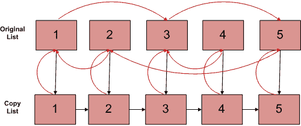

# 使用下一个随机指针克隆链表 | 系列 1

> 原文：[https://www.geeksforgeeks.org/a-linked-list-with-next-and-arbit-pointer/](https://www.geeksforgeeks.org/a-linked-list-with-next-and-arbit-pointer/)

您会得到一个双链表，每个节点的一个指针指向下一个节点，就像在单个链表中一样。 但是，第二个指针可以指向列表中的任何节点，而不仅仅是前一个节点。 现在以`O(n)`时间编写一个程序来复制此列表。 也就是说，编写一个程序来创建此列表的副本。

让我们将第二个指针称为仲裁指针，因为它可以指向链表中的任意节点。


图 1

任意指针显示为红色，下一个指针显示为黑色

**方法 1（使用`O(n)`多余的空间）**

此方法首先将（原始列表的）下一个和任意映射存储在数组中，然后修改原始的链表（以创建副本）， 创建一个副本。 最后恢复原始列表。

1.  使用下一个指针在复制链表中创建所有节点。

2.  存储节点及其原​​始链表的下一个指针映射。

3.  更改原始链表中所有节点的下一个指针，使其指向复制链表中的相应节点。

下图显示了经过上述 3 个步骤的两个链表的状态。 红色箭头显示仲裁指针，黑色箭头显示下一个指针。



图 2

4.  更改副本链表中所有节点的仲裁指针，使其指向原始链表中的相应节点。

5.  现在，如下所示在复制链表中构造仲裁指针，并恢复原始链表中节点的下一个指针。

```
       copy_list_node->arbit =
                      copy_list_node->arbit->arbit->next;
       copy_list_node = copy_list_node->next; 

```

6.  从存储的映射中还原原始链表中的下一个指针（在步骤 2 中）。

时间复杂度：`O(n)`

辅助空间：`O(n)`

**方法 2（使用常量额外空间）**

感谢 Saravanan Mani 提供此解决方案。 该解决方案使用恒定的空间。

1.  创建节点 1 的副本，并将其插入到原始链表中的节点 1 和节点 2 之间，创建 2 的副本，并将其插入 2 和 3 之间。.以这种方式继续，添加 复制第`N`个节点后的`N`

2.  现在，以这种方式复制任意链接

```
     original->next->arbitrary = original->arbitrary->next;  /*TRAVERSE 
TWO NODES*/

```

这是有效的，因为`original->next`只是原始副本，而`Original->arbitrary->next`只是任意副本。

3.  现在，以这种方式在单个循环中还原原始列表并复制链表。

```
     original->next = original->next->next;
     copy->next = copy->next->next;

```

4.  确保`original->next`的最后一个元素为`NULL`。

请参阅以下帖子以了解此方法的实现。

[**在`O(1)`空间中克隆带有下一个指针和随机指针的链表**](https://www.geeksforgeeks.org/clone-linked-list-next-random-pointer-o1-space/)

时间复杂度：`O(n)`

辅助空间：`O(1)`

有关基于哈希的实现，请参见后续文章。

[克隆带有下一个随机指针的链表 | 系列 2](https://www.geeksforgeeks.org/clone-linked-list-next-arbit-pointer-set-2/)

由 Varun Bhatia 询问。 如果发现任何不正确的地方，或者您想分享有关上述主题的更多信息，请发表评论。

