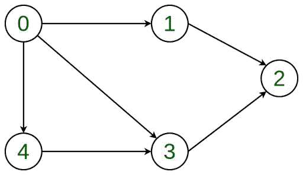
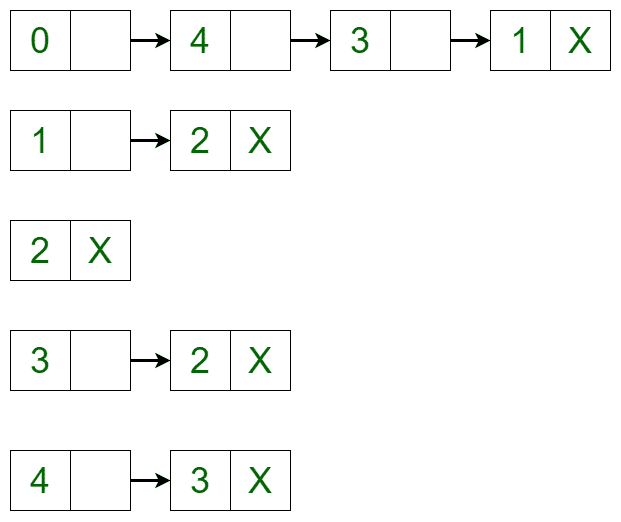

# 在图

的邻接列表表示中添加和删除顶点

> 原文： [https://www.geeksforgeeks.org/add-and-remove-vertex-in-adjacency-list-representation-of-graph/](https://www.geeksforgeeks.org/add-and-remove-vertex-in-adjacency-list-representation-of-graph/)

**先决条件**：[链表](http://www.geeksforgeeks.org/data-structures/linked-list/)，[图形数据结构](https://www.geeksforgeeks.org/graph-data-structure-and-algorithms/)

在本文中，将以给定的邻接表表示形式讨论添加和删除顶点。

令[有向图](https://www.geeksforgeeks.org/graph-data-structure-and-algorithms/)为：



该图可以在邻接列表表示中表示为：



它是[链表](http://www.geeksforgeeks.org/data-structures/linked-list/)表示形式，其中链表的头是图中的一个顶点，所有连接的节点都是第一个顶点所连接到的顶点。 例如，从图中可以清楚地看出，顶点`0`连接到顶点`4`，`3`和`1`。 在邻接列表（或链接列表）表示中表示相同。

**方法**：

*   **Adding a Vertex in the Graph:** To add a vertex in the graph, the adjacency list can be iterated to the place where the insertion is required and the new node can be created using linked list implementation. For example, if 5 needs to be added between vertex 2 and vertex 3 such that vertex 3 points to vertex 5 and vertex 5 points to vertex 2, then a new edge is created between vertex 5 and vertex 3 and a new edge is created from vertex 5 and vertex 2\. After adding the vertex, the adjacency list changes to:
    
*   **Removing a Vertex in the Graph**: To delete a vertex in the graph, iterate through the list of each vertex if an edge is present or not. If the edge is present, then delete the vertex in the same way as delete is performed in a linked list. For example, the adjacency list translates to the below list if vertex 4 is deleted from the list:
    

下面是上述方法的实现：

```py

# Python implementation of the above approach 
# Implementing Linked List representation 
class AdjNode(object): 
    def __init__(self, data): 
        self.vertex = data 
        self.next = None

# Adjacency List representation 
class AdjList(object): 

    def __init__(self, vertices): 
        self.v = vertices 
        self.graph =[None]*self.v 

# Function to add an edge from a source vertex  
# to a destination vertex 
    def addedge(self, source, destination): 
        node = AdjNode(destination) 
        node.next = self.graph 
        self.graph= node 

# Function to call the above function. 
    def addvertex(self, vk, source, destination): 
        graph.addedge(source, vk)  
        graph.addedge(vk, destination) 

# Function to print the graph 
    def print_graph(self): 
        for i in range(self.v): 
            print(i, end ="") 
            temp = self.graph[i] 
            while temp: 
               print("->", temp.vertex, end ="") 
               temp = temp.next
            print("\n") 

# Function to delete a vertex 
    def delvertex(self, k): 

# Iterating through all the vertices of the graph 
        for i in range(self.v): 
            temp = self.graph[i] 
            if i == k: 
                while temp: 
                    self.graph[i]= temp.next
                    temp = self.graph[i] 

            # Delete the vertex  
            # using linked list concept         
            if temp: 
                if temp.vertex == k: 
                    self.graph[i]= temp.next
                    temp = None
            while temp: 
                if temp.vertex == k: 
                    break
                prev = temp 
                temp = temp.next

            if temp == None: 
                continue

            prev.next = temp.next
            temp = None

# Driver code 
if __name__ == "__main__": 

    V = 6
    graph = AdjList(V)  
    graph.addedge(0, 1) 
    graph.addedge(0, 3) 
    graph.addedge(0, 4) 
    graph.addedge(1, 2) 
    graph.addedge(3, 2) 
    graph.addedge(4, 3) 

print("Initial adjacency list") 
graph.print_graph()  

# Add vertex 
graph.addvertex(5, 3, 2) 
print("Adjacency list after adding vertex") 
graph.print_graph()  

# Delete vertex 
graph.delvertex(4) 
print("Adjacency list after deleting vertex") 
graph.print_graph() 

```

**输出**：

```
Initial adjacency list
0-> 4-> 3-> 1

1-> 2

2

3-> 2

4-> 3

5

Adjacency list after adding vertex
0-> 4-> 3-> 1

1-> 2

2

3-> 5-> 2

4-> 3

5-> 2

Adjacency list after deleting vertex
0-> 3-> 1

1-> 2

2

3-> 5-> 2

4

5-> 2

```


* * *

* * *

如果您喜欢 GeeksforGeeks 并希望做出贡献，则还可以使用 [tribution.geeksforgeeks.org](https://contribute.geeksforgeeks.org/) 撰写文章，或将您的文章邮寄至 tribution@geeksforgeeks.org。 查看您的文章出现在 GeeksforGeeks 主页上，并帮助其他 Geeks。

如果您发现任何不正确的地方，请单击下面的“改进文章”按钮，以改进本文。