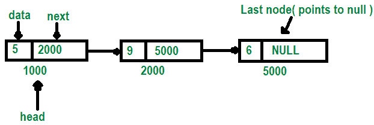

# C 语言中数组的优缺点

> 原文：[https://www.geeksforgeeks.org/advantages-and-disadvantages-of-array-in-c/](https://www.geeksforgeeks.org/advantages-and-disadvantages-of-array-in-c/)

[数组](https://www.geeksforgeeks.org/array-data-structure/)是相似类型元素的集合。 例如，整数数组保存[`int`类型](https://www.geeksforgeeks.org/c-data-types/)的元素，而字符数组保存`char`型的元素。 下面是数组的表示形式：


虽然，数组有其自己的优点和缺点。

### **数组的优势**

以下是数组的一些优点：

*   在数组中，使用索引号很容易访问元素。

*   搜索过程可以轻松地应用于数组。

*   2D 数组用于表示矩阵。

*   由于任何原因，用户希望存储相似类型的多个值，则可以有效地使用和利用数组。

### **数组的缺点**

现在，让我们看一下数组的一些缺点以及如何克服它：

**数组大小是固定的**：数组是静态的，这意味着其大小始终是固定的。 分配给它的内存不能增加或减少。 下面是相同的程序：

## C

```c

// C program to illustrate that the 
// array size is fixed 
#include <stdio.h> 

// Driver Code 
int main() 
{ 
    int arr[10]; 

    // Assign values to array 
    arr[0] = 5; 
    arr[5] = 6; 
    arr[7] = -9; 

    // Print array element at index 0 
    printf("Element at index 0"
           " is %d\n", 
           arr[0]); 

    // Print array element at index 11 
    printf("Element at index 11"
           " is %d", 
           arr[11]); 

    return 0; 
} 

```

**Output:**

```
Element at index 0 is 5
Element at index 11 is -1176897384

```

**说明**：在上述程序中，声明了大小为 10 的数组，并将该值分配给了特定的索引。 但是，当打印索引 11 处的值时，它会打印[垃圾值](https://www.geeksforgeeks.org/accessing-array-bounds-ccpp/)，因为已从绑定索引中访问了[数组](https://www.geeksforgeeks.org/accessing-array-bounds-ccpp/)。 在某些编译器中，它给出错误“数组索引超出范围”。

**如何克服**：要克服该问题，请使用[动态内存分配](https://www.geeksforgeeks.org/what-is-dynamic-memory-allocation/)，例如[`malloc()`和`calloc()`](https://www.geeksforgeeks.org/dynamic-memory-allocation-in-c-using-malloc-calloc-free-and-realloc/)。 它还有助于我们使用[`free()`](https://www.geeksforgeeks.org/dynamic-memory-allocation-in-c-using-malloc-calloc-free-and-realloc/)方法释放内存，该方法有助于通过释放内存来减少内存浪费。 下面是相同的程序：

## C

```c

// C program to illustrate the use of 
// array using Dynamic Memory Allocation 
#include <stdio.h> 
#include <stdlib.h> 

// Driver Code 
int main() 
{ 
    // Pointer will hold the base address 
    int* ptr; 
    int n = 10; 

    // Dynamically allocates memory 
    // using malloc() function 
    ptr = (int*)malloc(n * sizeof(int)); 

    // Assign values to the array 
    for (int i = 0; i < n; i++) { 
        ptr[i] = i + 1; 
    } 

    // Print the array 
    printf("The elements are: "); 

    for (int i = 0; i < n; i++) { 
        printf("%d ", ptr[i]); 
    } 

    // Free the dynamically 
    // allocated memory 
    free(ptr); 

    return 0; 
} 

```

**Output:**

```
The elements are: 1 2 3 4 5 6 7 8 9 10

```

**数组是同构的**：数组是同构的，即，数组中只能存储一种类型的值。 例如，如果数组类型为`int`，则只能存储整数元素，而不能允许其他类型的元素，例如`double`，`float`，`char`等。 下面是相同的程序：

## C

```c

// C++ program to illustrate that 
// the array is homogeneous 
#include <stdio.h> 

// Driver Code 
int main() 
{ 
    // Below declaration will give 
    // Compilation Error 
    int a[5] = { 0, 1, 2, "string", 9, 4.85 }; 

    return 0; 
} 

```

**Output:**

```
100
547.000000
Ram

```

**输出**：


**说明**：上面的代码给出了“[编译错误](https://www.geeksforgeeks.org/how-to-avoid-compile-error-while-defining-variables/)”，因为整数类型数组已为**字符串**和`float`类型赋值。

**如何克服**：为了克服该问题，我们的想法是[结构](https://www.geeksforgeeks.org/structures-c/)，可以在其中存储非均匀（异构）值。 下面是相同的程序：

## C

```c

// C program to illustrate the use of 
// structure to store heterogeneous 
// variables 
#include <stdio.h> 

// Structure students 
struct student { 

    int student_id; 
    float marks; 
    char name[30]; 
}; 

// Driver Code 
int main() 
{ 
    // Structure variable s1 
    struct student s1 = { 100, 547, "Ram" }; 

    // Accessing structure members 
    // using structure pointer 
    printf("%d\n", s1.student_id); 
    printf("%f\n", s1.marks); 

    for (int i = 0; 
         s1.name[i] != '\0'; i++) { 
        printf("%c", s1.name[i]); 
    } 

    return 0; 
} 

```

**Output:**

```
100
547.000000
Ram

```

**数组是内存的连续块**：数组将数据存储在连续的（一对一）存储位置中。 下面是相同的表示形式：


**如何克服：** 为了克服对数组的顺序访问，其思想是使用 [**链表**](https://www.geeksforgeeks.org/data-structures/linked-list/) 。 在**链表** *和*中，元素未存储在连续的存储位置中。 下面是相同的表示形式：



**在数组中插入和删除不容易**：在数组中进行插入和删除操作存在问题，因为要在数组中的任何位置插入或删除，必须先遍历数组，然后再进行 根据操作移动其余元素。 该操作成本更高。

**示例**：将`22`插入数组的**第三位置**的步骤如下：


下面是说明相同内容的程序：

## C

```c

// C Program to insert an element at 
// a specific position in an array 
#include <stdio.h> 

// Driver Code 
int main() 
{ 
    int arr[100] = { 0 }; 
    int i, x, pos, n = 10; 

    // Initial array of size 10 
    for (i = 0; i < 10; i++) { 
        arr[i] = i + 1; 
    } 

    // Print the original array 
    for (i = 0; i < n; i++) { 
        printf("%d ", arr[i]); 
    } 
    printf("\n"); 

    // Element to be inserted 
    x = 50; 

    // Position at which element 
    // is to be inserted 
    pos = 5; 

    printf("Array after inserting %d"
           " at position %d\n", 
           x, pos); 

    // Increase the size by 1 
    n++; 

    // Shift elements forward 
    for (i = n - 1; i >= pos; i--) { 

        arr[i] = arr[i - 1]; 
    } 

    // Insert x at pos 
    arr[pos - 1] = x; 

    // Print the updated array 
    for (i = 0; i < n; i++) { 
        printf("%d ", arr[i]); 
    } 

    return 0; 
} 

```

**Output:**

```
1 2 3 4 5 6 7 8 9 10 
Array after inserting 50 at position 5
1 2 3 4 50 5 6 7 8 9 10

```

**如何克服：** 使用**链表** *克服上述问题。* 以下是相同的表示：


下面是实现相同的程序：

## C

```c

// C program to insert an element at 
// a position using linked list 
#include <stdio.h> 
#include <stdlib.h> 

// Structure for the linked list 
struct node { 
    int data; 
    struct node* next; 
}; 

// head Node 
struct node* head; 

// Function to insert any element 
// at the end of the linked list 
int insert_last(int k) 
{ 
    struct node *ptr, *s; 
    ptr = (struct node*) 
        malloc(sizeof(struct node)); 
    ptr->data = k; 
    ptr->next = NULL; 

    // If head is NULL 
    if (head == NULL) { 
        head = ptr; 
    } 

    // Else 
    else { 

        s = head; 

        // Traverse the LL to last 
        while (s->next != NULL) { 
            s = s->next; 
        } 
        s->next = ptr; 
    } 
} 

// Function to display linked list 
void display() 
{ 
    struct node* s; 

    // Store the head 
    s = head; 

    // Traverse till s is NULL 
    while (s != NULL) { 

        // Print the data 
        printf("%d ", s->data); 
        s = s->next; 
    } 
    printf("\n"); 
} 

// Function to insert any element at 
// the given position of linked list 
int insert_position(int a, int b) 
{ 
    int f = 0, i; 
    struct node *ptr, *s; 

    // Allocate new Node 
    ptr = (struct node*) 
        malloc(sizeof(struct node)); 
    ptr->data = a; 

    // If first position 
    if (b == 1) { 
        ptr->next = head; 
        head = ptr; 
    } 

    // Otherwise 
    else { 
        s = head; 

        // Move to (b - 1) position 
        for (i = 0; i < b - 2; i++) { 
            s = s->next; 
        } 

        // Assign node 
        ptr->next = s->next; 
        s->next = ptr; 
    } 

    return 0; 
} 

// Driver Code 
int main() 
{ 
    // Given Linked List 
    insert_last(3); 
    insert_last(1); 
    insert_last(5); 
    insert_last(7); 

    printf("Current Linked List is: "); 

    // Display the LL 
    display(); 

    // Insert 6 at position 4 
    insert_position(6, 4); 
    printf("\n Linked List after insert"
           " 6 in 4th position: "); 

    // Display the LL 
    display(); 

    return 0; 
} 

```

**Output:**

```
Current Linked List is: 3 1 5 7 

 Linked List after insert 6 in 4th position: 3 1 5 6 7

```


* * *

* * *

如果您喜欢 GeeksforGeeks 并希望做出贡献，则还可以使用 [tribution.geeksforgeeks.org](https://contribute.geeksforgeeks.org/) 撰写文章，或将您的文章邮寄至 tribution@geeksforgeeks.org。 查看您的文章出现在 GeeksforGeeks 主页上，并帮助其他 Geeks。

如果您发现任何不正确的地方，请单击下面的“改进文章”按钮，以改进本文。