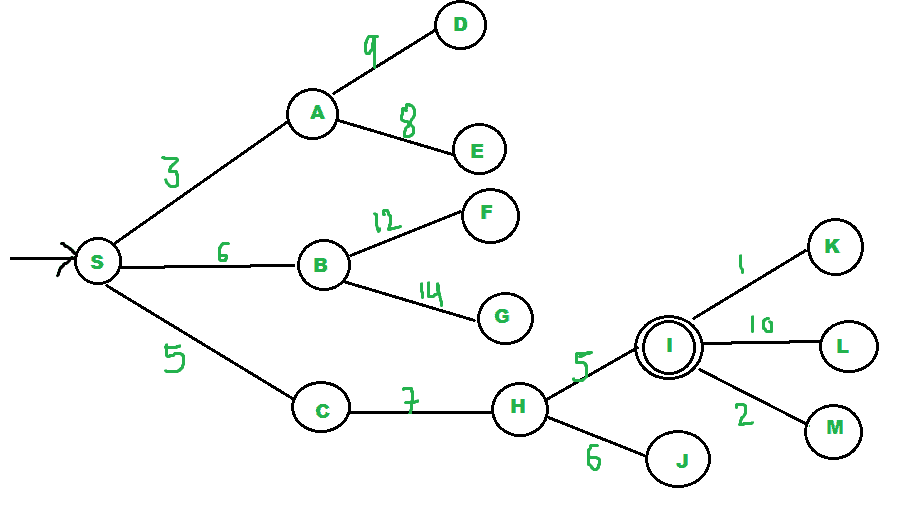

# 最佳优先搜索（知情搜索）

> 原文： [https://www.geeksforgeeks.org/best-first-search-informed-search/](https://www.geeksforgeeks.org/best-first-search-informed-search/)

先决条件： [BFS](https://www.geeksforgeeks.org/breadth-first-traversal-for-a-graph/) ， [DFS](https://www.geeksforgeeks.org/depth-first-traversal-for-a-graph/)
在 BFS 和 DFS 中，当我们在一个节点上时，可以将任何相邻节点视为下一个节点。 因此，BFS 和 DFS 都在不考虑任何成本函数的情况下盲目探索路径。 最佳优先搜索的想法是使用评估函数来确定哪个最有前途，然后再进行探索。 最佳优先搜索属于启发式搜索或知情搜索类别。

我们使用优先级队列来存储节点成本。 因此，实现是 BFS 的变体，我们只需要将 Queue 更改为 PriorityQueue。

```
// This pseudocode is adapted from below 
// source:
// https://courses.cs.washington.edu/
Best-First-Search(Grah g, Node start)
    1) Create an empty PriorityQueue
       PriorityQueue pq;
    2) Insert "start" in pq.
       pq.insert(start)
    3) Until PriorityQueue is empty
          u = PriorityQueue.DeleteMin
          If u is the goal
             Exit
          Else
             Foreach neighbor v of u
                If v "Unvisited"
                    Mark v "Visited"                    
                    pq.insert(v)
             Mark u "Examined"                    
End procedure

```

让我们考虑以下示例。

[](https://media.geeksforgeeks.org/wp-content/uploads/BFS2.png)

```
We start from source "S" and search for
goal "I" using given costs and Best
First search.

pq initially contains S
We remove s from and process unvisited
neighbors of S to pq.
pq now contains {A, C, B} (C is put
before B because C has lesser cost)

We remove A from pq and process unvisited
neighbors of A to pq.
pq now contains {C, B, E, D}

We remove C from pq and process unvisited
neighbors of C to pq.
pq now contains {B, H, E, D}

We remove B from pq and process unvisited
neighbors of B to pq.
pq now contains {H, E, D, F, G}

We remove H from pq.  Since our goal
"I" is a neighbor of H, we return.

```

以下是上述想法的实现：

## C ++

```

// C++ program to implement Best First Search using priority
// queue
#include <bits/stdc++.h>
using namespace std;
typedef pair<int, int> pi;

vector<vector<pi> > graph;

// Function for adding edges to graph
void addedge(int x, int y, int cost)
{
    graph[x].push_back(make_pair(cost, y));
    graph[y].push_back(make_pair(cost, x));
}

// Function For Implementing Best First Search
// Gives output path having lowest cost
void best_first_search(int source, int target, int n)
{
    vector<bool> visited(n, false);
    // MIN HEAP priority queue
    priority_queue<pi, vector<pi>, greater<pi> > pq;
    // sorting in pq gets done by first value of pair
    pq.push(make_pair(0, source));
    visited = true;

    while (!pq.empty()) {
        int x = pq.top().second;
        // Displaying the path having lowest cost
        cout << x << " ";
        pq.pop();
        if (x == target)
            break;

        for (int i = 0; i < graph[x].size(); i++) {
            if (!visited[graph[x][i].second]) {
                visited[graph[x][i].second] = true;
                pq.push(graph[x][i]);
            }
        }
    }
}

// Driver code to test above methods
int main()
{
    // No. of Nodes
    int v = 14;
    graph.resize(v);

    // The nodes shown in above example(by alphabets) are
    // implemented using integers addedge(x,y,cost);
    addedge(0, 1, 3);
    addedge(0, 2, 6);
    addedge(0, 3, 5);
    addedge(1, 4, 9);
    addedge(1, 5, 8);
    addedge(2, 6, 12);
    addedge(2, 7, 14);
    addedge(3, 8, 7);
    addedge(8, 9, 5);
    addedge(8, 10, 6);
    addedge(9, 11, 1);
    addedge(9, 12, 10);
    addedge(9, 13, 2);

    int source = 0;
    int target = 9;

    // Function call
    best_first_search(source, target, v);

    return 0;
}

```

## 蟒蛇

```

from queue import PriorityQueue
v = 14
graph = [[] for i in range(v)]

# Function For Implementing Best First Search
# Gives output path having lowest cost

def best_first_search(source, target, n):
    visited = [0] * n
    visited = True
    pq = PriorityQueue()
    pq.put((0, source))
    while pq.empty() == False:
        u = pq.get()[1]
        # Displaying the path having lowest cost
        print(u, end=" ")
        if u == target:
            break

        for v, c in graph[u]:
            if visited[v] == False:
                visited[v] = True
                pq.put((c, v))
    print()

# Function for adding edges to graph

def addedge(x, y, cost):
    graph[x].append((y, cost))
    graph[y].append((x, cost))

# The nodes shown in above example(by alphabets) are
# implemented using integers addedge(x,y,cost);
addedge(0, 1, 3)
addedge(0, 2, 6)
addedge(0, 3, 5)
addedge(1, 4, 9)
addedge(1, 5, 8)
addedge(2, 6, 12)
addedge(2, 7, 14)
addedge(3, 8, 7)
addedge(8, 9, 5)
addedge(8, 10, 6)
addedge(9, 11, 1)
addedge(9, 12, 10)
addedge(9, 13, 2)

source = 0
target = 9
best_first_search(source, target, v)

# This code is contributed by Jyotheeswar Ganne

```

**Output**

```
0 1 3 2 8 9 
```

**分析：**

*   最佳优先搜索的最坏情况时间复杂度是 O（n * Log n），其中 n 是节点数。 最坏的情况是，在达到目标之前，我们可能必须访问所有节点。 请注意，优先级队列是使用最小（或最大）堆实现的，插入和删除操作需要 O（log n）时间。
*   算法的性能取决于设计成本或评估功能的程度。

**相关文章：**
[A *搜索算法](https://www.geeksforgeeks.org/a-search-algorithm/)
本文由 **Shambhavi Singh** 提供。 如果您喜欢 GeeksforGeeks 并希望做出贡献，则还可以使用 [tribution.geeksforgeeks.org](http://www.contribute.geeksforgeeks.org) 撰写文章，或将您的文章邮寄至 tribution@geeksforgeeks.org。 查看您的文章出现在 GeeksforGeeks 主页上，并帮助其他 Geeks。

如果发现任何不正确的地方，或者想分享有关上述主题的更多信息，请写评论。

