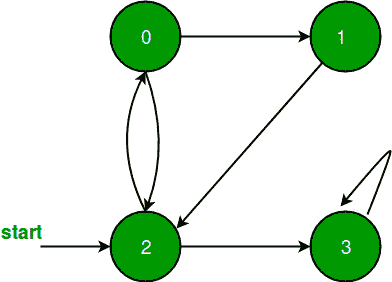
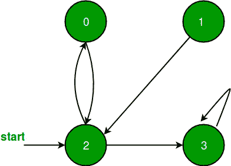

# BFS 用于断开连接的图表

> 原文： [https://www.geeksforgeeks.org/bfs-disconnected-graph/](https://www.geeksforgeeks.org/bfs-disconnected-graph/)

在先前的[之后的](https://www.geeksforgeeks.org/breadth-first-traversal-for-a-graph/)中，仅执行具有特定顶点的 BFS，即，假定所有顶点都可以从起始顶点到达。 但是在断开图或从所有顶点无法访问的任何顶点的情况下，先前的实现将不会提供所需的输出，因此在本文中，将在 BFS 中进行修改。


所有顶点都是可到达的。 因此，对于以上图形，简单的 [BFS](https://www.geeksforgeeks.org/breadth-first-traversal-for-a-graph/) 将起作用。

[](https://media.geeksforgeeks.org/wp-content/uploads/graph4.png) 
如上图所示，顶点 1 不能从所有顶点到达，因此简单的 BFS 不适用于该顶点。

```
Just to modify BFS, perform simple BFS from each 
unvisited vertex of given graph.

```

## C ++

```

// C++ implementation of modified BFS 
#include<bits/stdc++.h> 
using namespace std; 

// A utility function to add an edge in an 
// undirected graph. 
void addEdge(vector<int> adj[], int u, int v) 
{ 
    adj[u].push_back(v); 
} 

// A utility function to do BFS of graph 
// from a given vertex u. 
void BFSUtil(int u, vector<int> adj[], 
            vector<bool> &visited) 
{ 

    // Create a queue for BFS 
    list<int> q; 

    // Mark the current node as visited and enqueue it 
    visited[u] = true; 
    q.push_back(u); 

    // 'i' will be used to get all adjacent vertices 4 
    // of a vertex list<int>::iterator i; 

    while(!q.empty()) 
    { 
        // Dequeue a vertex from queue and print it 
        u = q.front(); 
        cout << u << " "; 
        q.pop_front(); 

        // Get all adjacent vertices of the dequeued 
        // vertex s. If an adjacent has not been visited,  
        // then mark it visited and enqueue it 
        for (int i = 0; i != adj[u].size(); ++i) 
        { 
            if (!visited[adj[u][i]]) 
            { 
                visited[adj[u][i]] = true; 
                q.push_back(adj[u][i]); 
            } 
        } 
    } 
} 

// This function does BFSUtil() for all  
// unvisited vertices. 
void BFS(vector<int> adj[], int V) 
{ 
    vector<bool> visited(V, false); 
    for (int u=0; u<V; u++) 
        if (visited[u] == false) 
            BFSUtil(u, adj, visited); 
} 

// Driver code 
int main() 
{ 
    int V = 5; 
    vector<int> adj[V]; 

    addEdge(adj, 0, 4); 
    addEdge(adj, 1, 2); 
    addEdge(adj, 1, 3); 
    addEdge(adj, 1, 4); 
    addEdge(adj, 2, 3); 
    addEdge(adj, 3, 4); 
    BFS(adj, V); 
    return 0; 
}

```

## 爪哇

```

// Java implementation of modified BFS  
import java.util.*; 
public class graph  
{ 
    //Implementing graph using HashMap 
    static HashMap<Integer,LinkedList<Integer>> graph=new HashMap<>(); 

    //utility function to add edge in an undirected graph 
public static void addEdge(int a,int b) 
{ 
    if(graph.containsKey(a)) 
    { 
        LinkedList<Integer> l=graph.get(a); 
        l.add(b); 
        graph.put(a,l); 
    } 
    else
    { 
        LinkedList<Integer> l=new LinkedList<>(); 
        l.add(b); 
        graph.put(a,l); 
    } 
} 

//Helper function for BFS  
public static void bfshelp(int s,ArrayList<Boolean> visited) 
{ 
    // Create a queue for BFS  
    LinkedList<Integer> q=new LinkedList<>(); 

    // Mark the current node as visited and enqueue it  
    q.add(s); 
    visited.set(s,true); 

    while(!q.isEmpty()) 
    { 
        // Dequeue a vertex from queue and print it  
        int f=q.poll(); 
        System.out.print(f+" "); 

        //Check whether the current node is  
                //connected to any other node or not 
        if(graph.containsKey(f)) 
        { 
        Iterator<Integer> i=graph.get(f).listIterator(); 

        // Get all adjacent vertices of the dequeued  
        // vertex f. If an adjacent has not been visited,   
        // then mark it visited and enqueue it  

            while(i.hasNext()) 
            { 
                int n=i.next(); 
                if(!visited.get(n)) 
                { 
                visited.set(n,true); 
                q.add(n); 
                } 
            } 
        } 
    } 

} 

//BFS function to check each node 
public static void bfs(int vertex) 
{ 
    ArrayList<Boolean> visited=new ArrayList<Boolean>(); 
    //Marking each node as unvisited 
    for(int i=0;i<vertex;i++) 
    { 
        visited.add(i,false); 
    } 
    for(int i=0;i<vertex;i++) 
    { 
        //Checking whether the node is visited or not 
        if(!visited.get(i)) 
        { 
            bfshelp(i,visited); 
        } 
    } 
} 

//Driver Code-The main function 
    public static void main(String[] args)  
    { 
        int v=5; 
        addEdge(0, 4);  
        addEdge(1, 2);  
        addEdge(1, 3);  
        addEdge(1, 4);  
        addEdge(2, 3);  
        addEdge(3, 4);  
        bfs(v); 
    } 

} 

```

## Python3

```

# Python3 implementation of modified BFS  
import queue 

# A utility function to add an edge  
# in an undirected graph.  
def addEdge(adj, u, v): 
    adj[u].append(v) 

# A utility function to do BFS of  
# graph from a given vertex u.  
def BFSUtil(u, adj, visited): 

    # Create a queue for BFS  
    q = queue.Queue() 

    # Mark the current node as visited 
    # and enqueue it  
    visited[u] = True
    q.put(u)  

    # 'i' will be used to get all adjacent  
    # vertices 4 of a vertex list<int>::iterator i  

    while(not q.empty()): 

        # Dequeue a vertex from queue  
        # and print it  
        u = q.queue[0]  
        print(u, end = " ")  
        q.get()  

        # Get all adjacent vertices of the  
        # dequeued vertex s. If an adjacent  
        # has not been visited, then mark  
        # it visited and enqueue it  
        i = 0
        while i != len(adj[u]): 
            if (not visited[adj[u][i]]): 
                    visited[adj[u][i]] = True
                    q.put(adj[u][i]) 
            i += 1

# This function does BFSUtil() for all  
# unvisited vertices.  
def BFS(adj, V): 
    visited = [False] * V  
    for u in range(V): 
        if (visited[u] == False):  
            BFSUtil(u, adj, visited) 

# Driver code  
if __name__ == '__main__': 

    V = 5
    adj = [[] for i in range(V)]  

    addEdge(adj, 0, 4)  
    addEdge(adj, 1, 2)  
    addEdge(adj, 1, 3)  
    addEdge(adj, 1, 4)  
    addEdge(adj, 2, 3)  
    addEdge(adj, 3, 4)  
    BFS(adj, V) 

# This code is contributed by PranchalK 

```

## C＃

```

// C# implementation of modified BFS  
using System; 
using System.Collections.Generic; 

class Graph  
{  
    //Implementing graph using Dictionary  
    static Dictionary<int,List<int>> graph =  
            new Dictionary<int,List<int>>();  

//utility function to add edge in an undirected graph  
public static void addEdge(int a, int b)  
{  
    if(graph.ContainsKey(a))  
    {  
        List<int> l = graph[a];  
        l.Add(b);  
        if(graph.ContainsKey(a)) 
            graph[a] = l; 
        else
            graph.Add(a,l);  
    }  
    else
    {  
        List<int> l = new List<int>();  
        l.Add(b);  
        graph.Add(a, l);  
    }  
}  

// Helper function for BFS  
public static void bfshelp(int s, List<Boolean> visited)  
{  
    // Create a queue for BFS  
    List<int> q = new List<int>();  

    // Mark the current node as visited and enqueue it  
    q.Add(s);  
    visited.RemoveAt(s); 
    visited.Insert(s,true);  

    while(q.Count != 0)  
    {  
        // Dequeue a vertex from queue and print it  
        int f = q[0];  
        q.RemoveAt(0); 
        Console.Write(f + " ");  

        //Check whether the current node is  
        //connected to any other node or not  
        if(graph.ContainsKey(f))  
        {  

        // Get all adjacent vertices of the dequeued  
        // vertex f. If an adjacent has not been visited,  
        // then mark it visited and enqueue it  

            foreach(int iN in graph[f])  
            {  
                int n = iN;  
                if(!visited[n])  
                {  
                    visited.RemoveAt(n); 
                    visited.Insert(n, true);  
                    q.Add(n);  
                }  
            }  
        }  
    }  

}  

// BFS function to check each node  
public static void bfs(int vertex)  
{  
    List<Boolean> visited = new List<Boolean>();  

    // Marking each node as unvisited  
    for(int i = 0; i < vertex; i++)  
    {  
        visited.Insert(i, false);  
    }  
    for(int i = 0; i < vertex; i++)  
    {  
        // Checking whether the node is visited or not  
        if(!visited[i])  
        {  
            bfshelp(i, visited);  
        }  
    }  
}  

// Driver Code  
public static void Main(String[] args)  
{  
    int v = 5;  
    addEdge(0, 4);  
    addEdge(1, 2);  
    addEdge(1, 3);  
    addEdge(1, 4);  
    addEdge(2, 3);  
    addEdge(3, 4);  
    bfs(v);  
}  
}  

// This code is contributed by Rajput-Ji 

```

**Output:**

```
0 4 1 2 3

```

本文由 **[Sahil Chhabra（akku）](https://www.facebook.com/sahil.chhabra.965)** 贡献。 如果您喜欢 GeeksforGeeks 并希望做出贡献，则还可以使用 [tribution.geeksforgeeks.org](http://www.contribute.geeksforgeeks.org) 撰写文章，或将您的文章邮寄至 tribution@geeksforgeeks.org。 查看您的文章出现在 GeeksforGeeks 主页上，并帮助其他 Geeks。

如果发现任何不正确的地方，或者想分享有关上述主题的更多信息，请写评论。

