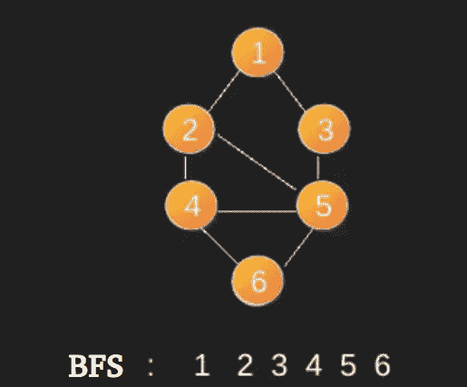

# 使用 STL 进行竞争编码的 BFS

> 原文： [https://www.geeksforgeeks.org/bfs-using-stl-competitive-coding/](https://www.geeksforgeeks.org/bfs-using-stl-competitive-coding/)

使用 STL 中的[队列](https://www.geeksforgeeks.org/queue-cpp-stl/)和[向量](https://www.geeksforgeeks.org/vector-in-cpp-stl/)的 BFS 基于 STL 的简单实现。 邻接表是使用向量表示的。

```
In BFS, we start with a node.
1) Create a queue and enqueue source into it. 
   Mark source as visited.
2) While queue is not empty, do following
    a) Dequeue a vertex from queue. Let this 
       be f.
    b) Print f
    c) Enqueue all not yet visited adjacent
       of f and mark them visited.

```

下面是一个从源顶点 1 开始的 BFS 示例。请注意，图形可能存在多个 BFS（甚至来自特定顶点）。



有关 BFS 的更多详细信息，请参阅此帖子的[。](https://www.geeksforgeeks.org/breadth-first-traversal-for-a-graph)

此处的代码经过简化，可用于竞争性编码。

```

// A Quick implementation of BFS using 
// vectors and queue 
#include <bits/stdc++.h> 
#define pb push_back 

using namespace std; 

vector<bool> v; 
vector<vector<int> > g; 

void edge(int a, int b) 
{ 
    g[a].pb(b); 

    // for undirected graph add this line 
    // g[b].pb(a); 
} 

void bfs(int u) 
{ 
    queue<int> q; 

    q.push(u); 
    v[u] = true; 

    while (!q.empty()) { 

        int f = q.front(); 
        q.pop(); 

        cout << f << " "; 

        // Enqueue all adjacent of f and mark them visited  
        for (auto i = g[f].begin(); i != g[f].end(); i++) { 
            if (!v[*i]) { 
                q.push(*i); 
                v[*i] = true; 
            } 
        } 
    } 
} 

// Driver code 
int main() 
{ 
    int n, e; 
    cin >> n >> e; 

    v.assign(n, false); 
    g.assign(n, vector<int>()); 

    int a, b; 
    for (int i = 0; i < e; i++) { 
        cin >> a >> b; 
        edge(a, b); 
    } 

    for (int i = 0; i < n; i++) { 
        if (!v[i]) 
            bfs(i); 
    } 

    return 0; 
} 

```

```
Input:
8 10
0 1
0 2
0 3
0 4
1 5
2 5
3 6
4 6
5 7
6 7

Output:
0 1 2 3 4 5 6 7

```

本文由 [**Nikhil Mahendran**](https://auth.geeksforgeeks.org/profile.php?user=Nikhil Mahendran) 提供。 如果您喜欢 GeeksforGeeks 并希望做出贡献，则还可以使用 [tribution.geeksforgeeks.org](http://www.contribute.geeksforgeeks.org) 撰写文章，或将您的文章邮寄至 tribution@geeksforgeeks.org。 查看您的文章出现在 GeeksforGeeks 主页上，并帮助其他 Geeks。

如果发现任何不正确的地方，或者想分享有关上述主题的更多信息，请写评论。

