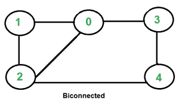
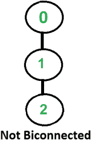
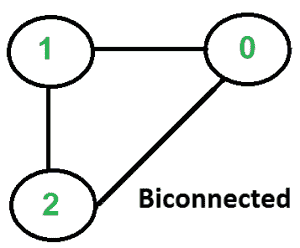

# 双向图

> 原文： [https://www.geeksforgeeks.org/biconnectivity-in-a-graph/](https://www.geeksforgeeks.org/biconnectivity-in-a-graph/)

如果任意两个顶点之间有两条不相交的路径，则无向图称为 Biconnected。 在“双向图”中，任意两个顶点之间都有一个简单的循环。

按照惯例，由一条边连接的两个节点形成一个双向图，但这不能验证上述属性。 对于具有两个以上顶点的图形，必须具有上述属性才能进行双向连接。

或换句话说：

在以下情况下，图被称为 Biconnected：

1.  它是已连接的，即可以通过一条简单的路径从每个其他顶点到达每个顶点。

2.  即使删除了任何顶点，图形仍保持连接状态。

以下是一些示例。









**有关更多示例，请参见** [**此**](http://mathworld.wolfram.com/BiconnectedGraph.html) **。**

**如何查找给定图是否为 Biconnected？**

*如果一个已连接的图已连接并且没有任何* [*铰接点*](https://www.geeksforgeeks.org/articulation-points-or-cut-vertices-in-a-graph/) ，则该图为 Biconnected。 我们主要需要检查图中的两件事。

1.  图形已连接。

2.  图中没有连接点。

我们从任何顶点开始进行 DFS 遍历。 在 DFS 遍历中，我们检查是否存在任何铰接点。 如果找不到任何铰接点，则该图为 Biconnected。 最后，我们需要检查 DFS 中是否所有顶点均可到达。 如果所有顶点都不可达，则该图甚至没有连接。

以下是上述方法的实现。

## C++

```cpp

// A C++ program to find if a given undirected graph is
// biconnected
#include<iostream>
#include <list>
#define NIL -1
using namespace std;

// A class that represents an undirected graph
class Graph
{
    int V;    // No. of vertices
    list<int> *adj;    // A dynamic array of adjacency lists
    bool isBCUtil(int v, bool visited[], int disc[], int low[],
                 int parent[]);
public:
    Graph(int V);   // Constructor
    void addEdge(int v, int w); // to add an edge to graph
    bool isBC();    // returns true if graph is Biconnected
};

Graph::Graph(int V)
{
    this->V = V;
    adj = new list<int>[V];
}

void Graph::addEdge(int v, int w)
{
    adj[v].push_back(w);
    adj[w].push_back(v);  // Note: the graph is undirected
}

// A recursive function that returns true if there is an articulation
// point in given graph, otherwise returns false.
// This function is almost same as isAPUtil() here ( http://goo.gl/Me9Fw )
// u --> The vertex to be visited next
// visited[] --> keeps tract of visited vertices
// disc[] --> Stores discovery times of visited vertices
// parent[] --> Stores parent vertices in DFS tree
bool Graph::isBCUtil(int u, bool visited[], int disc[],int low[],int parent[])
{
    // A static variable is used for simplicity, we can avoid use of static
    // variable by passing a pointer.
    static int time = 0;

    // Count of children in DFS Tree
    int children = 0;

    // Mark the current node as visited
    visited[u] = true;

    // Initialize discovery time and low value
    disc[u] = low[u] = ++time;

    // Go through all vertices aadjacent to this
    list<int>::iterator i;
    for (i = adj[u].begin(); i != adj[u].end(); ++i)
    {
        int v = *i;  // v is current adjacent of u

        // If v is not visited yet, then make it a child of u
        // in DFS tree and recur for it
        if (!visited[v])
        {
            children++;
            parent[v] = u;

            // check if subgraph rooted with v has an articulation point
            if (isBCUtil(v, visited, disc, low, parent))
               return true;

            // Check if the subtree rooted with v has a connection to
            // one of the ancestors of u
            low[u]  = min(low[u], low[v]);

            // u is an articulation point in following cases

            // (1) u is root of DFS tree and has two or more chilren.
            if (parent[u] == NIL && children > 1)
               return true;

            // (2) If u is not root and low value of one of its child is
            // more than discovery value of u.
            if (parent[u] != NIL && low[v] >= disc[u])
               return true;
        }

        // Update low value of u for parent function calls.
        else if (v != parent[u])
            low[u]  = min(low[u], disc[v]);
    }
    return false;
}

// The main function that returns true if graph is Biconnected, 
// otherwise false. It uses recursive function isBCUtil()
bool Graph::isBC()
{
    // Mark all the vertices as not visited
    bool *visited = new bool[V];
    int *disc = new int[V];
    int *low = new int[V];
    int *parent = new int[V];

    // Initialize parent and visited, and ap(articulation point) 
    //  arrays
    for (int i = 0; i < V; i++)
    {
        parent[i] = NIL;
        visited[i] = false;
    }

    // Call the recursive helper function to find if there is an articulation 
    // point in given graph. We do DFS traversal starring from vertex 0
    if (isBCUtil(0, visited, disc, low, parent) == true)
        return false;

    // Now check whether the given graph is connected or not. An undirected
    // graph is connected if all vertices are reachable from any starting 
    // point (we have taken 0 as starting point)
    for (int i = 0; i < V; i++)
        if (visited[i] == false)
            return false;

    return true;
}

// Driver program to test above function
int main()
{
    // Create graphs given in above diagrams
    Graph g1(2);
    g1.addEdge(0, 1);
    g1.isBC()? cout << "Yes\n" : cout << "No\n";

    Graph g2(5);
    g2.addEdge(1, 0);
    g2.addEdge(0, 2);
    g2.addEdge(2, 1);
    g2.addEdge(0, 3);
    g2.addEdge(3, 4);
    g2.addEdge(2, 4);
    g2.isBC()? cout << "Yes\n" : cout << "No\n";

    Graph g3(3);
    g3.addEdge(0, 1);
    g3.addEdge(1, 2);
    g3.isBC()? cout << "Yes\n" : cout << "No\n";

    Graph g4(5);
    g4.addEdge(1, 0);
    g4.addEdge(0, 2);
    g4.addEdge(2, 1);
    g4.addEdge(0, 3);
    g4.addEdge(3, 4);
    g4.isBC()? cout << "Yes\n" : cout << "No\n";

    Graph g5(3);
    g5.addEdge(0, 1);
    g5.addEdge(1, 2);
    g5.addEdge(2, 0);
    g5.isBC()? cout << "Yes\n" : cout << "No\n";

    return 0;
}

```

## Java

```java

// A Java program to find if a given undirected graph is
// biconnected
import java.io.*;
import java.util.*;
import java.util.LinkedList;

// This class represents a directed graph using adjacency
// list representation
class Graph
{
    private int V;   // No. of vertices

    // Array  of lists for Adjacency List Representation
    private LinkedList<Integer> adj[];

    int time = 0;
    static final int NIL = -1;

    // Constructor
    Graph(int v)
    {
        V = v;
        adj = new LinkedList[v];
        for (int i=0; i<v; ++i)
            adj[i] = new LinkedList();
    }

    //Function to add an edge into the graph
    void addEdge(int v, int w)
    {
        adj[v].add(w);  //Note that the graph is undirected.
        adj[w].add(v);
    }

    // A recursive function that returns true if there is an articulation
    // point in given graph, otherwise returns false.
    // This function is almost same as isAPUtil() @ http://goo.gl/Me9Fw
    // u --> The vertex to be visited next
    // visited[] --> keeps tract of visited vertices
    // disc[] --> Stores discovery times of visited vertices
    // parent[] --> Stores parent vertices in DFS tree
    boolean isBCUtil(int u, boolean visited[], int disc[],int low[],
                     int parent[])
    {

        // Count of children in DFS Tree
        int children = 0;

        // Mark the current node as visited
        visited[u] = true;

        // Initialize discovery time and low value
        disc[u] = low[u] = ++time;

        // Go through all vertices aadjacent to this
        Iterator<Integer> i = adj[u].iterator();
        while (i.hasNext())
        {
            int v = i.next();  // v is current adjacent of u

            // If v is not visited yet, then make it a child of u
            // in DFS tree and recur for it
            if (!visited[v])
            {
                children++;
                parent[v] = u;

                // check if subgraph rooted with v has an articulation point
                if (isBCUtil(v, visited, disc, low, parent))
                    return true;

                // Check if the subtree rooted with v has a connection to
                // one of the ancestors of u
                low[u]  = Math.min(low[u], low[v]);

                // u is an articulation point in following cases

                // (1) u is root of DFS tree and has two or more chilren.
                if (parent[u] == NIL && children > 1)
                    return true;

                // (2) If u is not root and low value of one of its
                //  child is more than discovery value of u.
                if (parent[u] != NIL && low[v] >= disc[u])
                    return true;
            }

            // Update low value of u for parent function calls.
            else if (v != parent[u])
                low[u]  = Math.min(low[u], disc[v]);
        }
        return false;
    }

    // The main function that returns true if graph is Biconnected,
    // otherwise false. It uses recursive function isBCUtil()
    boolean isBC()
    {
        // Mark all the vertices as not visited
        boolean visited[] = new boolean[V];
        int disc[] = new int[V];
        int low[] = new int[V];
        int parent[] = new int[V];

        // Initialize parent and visited, and ap(articulation point)
        // arrays
        for (int i = 0; i < V; i++)
        {
            parent[i] = NIL;
            visited[i] = false;
        }

        // Call the recursive helper function to find if there is an
        // articulation/ point in given graph. We do DFS traversal
        // starring from vertex 0
        if (isBCUtil(0, visited, disc, low, parent) == true)
            return false;

        // Now check whether the given graph is connected or not.
        // An undirected graph is connected if all vertices are
        // reachable from any starting point (we have taken 0 as
        // starting point)
        for (int i = 0; i < V; i++)
            if (visited[i] == false)
                return false;

        return true;
    }

    // Driver method
    public static void main(String args[])
    {
        // Create graphs given in above diagrams
        Graph g1 =new Graph(2);
        g1.addEdge(0, 1);
        if (g1.isBC())
            System.out.println("Yes");
        else
            System.out.println("No");

        Graph g2 =new Graph(5);
        g2.addEdge(1, 0);
        g2.addEdge(0, 2);
        g2.addEdge(2, 1);
        g2.addEdge(0, 3);
        g2.addEdge(3, 4);
        g2.addEdge(2, 4);
        if (g2.isBC())
            System.out.println("Yes");
        else
            System.out.println("No");

        Graph g3 = new Graph(3);
        g3.addEdge(0, 1);
        g3.addEdge(1, 2);
        if (g3.isBC())
            System.out.println("Yes");
        else
            System.out.println("No");

        Graph g4 = new Graph(5);
        g4.addEdge(1, 0);
        g4.addEdge(0, 2);
        g4.addEdge(2, 1);
        g4.addEdge(0, 3);
        g4.addEdge(3, 4);
        if (g4.isBC())
            System.out.println("Yes");
        else
            System.out.println("No");

        Graph g5= new Graph(3);
        g5.addEdge(0, 1);
        g5.addEdge(1, 2);
        g5.addEdge(2, 0);
        if (g5.isBC())
            System.out.println("Yes");
        else
            System.out.println("No");
    }
}
// This code is contributed by Aakash Hasija

```

## Python

```py

# A Python program to find if a given undirected graph is
# biconnected

from collections import defaultdict

#This class represents an undirected graph using adjacency list representation
class Graph:

    def __init__(self,vertices):
        self.V= vertices #No. of vertices
        self.graph = defaultdict(list) # default dictionary to store graph
        self.Time = 0

    # function to add an edge to graph
    def addEdge(self,u,v):
        self.graph[u].append(v)
        self.graph[v].append(u)

    '''A recursive function that returns true if there is an articulation
    point in given graph, otherwise returns false.
    This function is almost same as isAPUtil()
    u --> The vertex to be visited next
    visited[] --> keeps tract of visited vertices
    disc[] --> Stores discovery times of visited vertices
    parent[] --> Stores parent vertices in DFS tree'''
    def isBCUtil(self,u, visited, parent, low, disc):

        #Count of children in current node 
        children =0

        # Mark the current node as visited and print it
        visited[u]= True

        # Initialize discovery time and low value
        disc[u] = self.Time
        low[u] = self.Time
        self.Time += 1

        #Recur for all the vertices adjacent to this vertex
        for v in self.graph[u]:
            # If v is not visited yet, then make it a child of u
            # in DFS tree and recur for it
            if visited[v] == False :
                parent[v] = u
                children += 1
                if self.isBCUtil(v, visited, parent, low, disc):
                    return True

                # Check if the subtree rooted with v has a connection to
                # one of the ancestors of u
                low[u] = min(low[u], low[v])

                # u is an articulation point in following cases
                # (1) u is root of DFS tree and has two or more chilren.
                if parent[u] == -1 and children > 1:
                    return True

                #(2) If u is not root and low value of one of its child is more
                # than discovery value of u.
                if parent[u] != -1 and low[v] >= disc[u]:
                    return True   

            elif v != parent[u]: # Update low value of u for parent function calls.
                low[u] = min(low[u], disc[v])

        return False

    # The main function that returns true if graph is Biconnected,
    # otherwise false. It uses recursive function isBCUtil()
    def isBC(self):

        # Mark all the vertices as not visited and Initialize parent and visited, 
        # and ap(articulation point) arrays
        visited = [False] * (self.V)
        disc = [float("Inf")] * (self.V)
        low = [float("Inf")] * (self.V)
        parent = [-1] * (self.V)

        # Call the recursive helper function to find if there is an 
        # articulation points in given graph. We do DFS traversal starting
        # from vertex 0
        if self.isBCUtil(0, visited, parent, low, disc):
            return False

        '''Now check whether the given graph is connected or not.
        An undirected graph is connected if all vertices are
        reachable from any starting point (we have taken 0 as
        starting point)'''
        if any(i == False for i in visited):
            return False

        return True

# Create a graph given in the above diagram
g1 =  Graph(2)
g1.addEdge(0, 1)
print "Yes" if g1.isBC() else "No"

g2 = Graph(5)
g2.addEdge(1, 0)
g2.addEdge(0, 2)
g2.addEdge(2, 1)
g2.addEdge(0, 3)
g2.addEdge(3, 4)
g2.addEdge(2, 4)
print "Yes" if g2.isBC() else "No"

g3 = Graph(3)
g3.addEdge(0, 1)
g3.addEdge(1, 2)
print "Yes" if g3.isBC() else "No"

g4 = Graph (5)
g4.addEdge(1, 0)
g4.addEdge(0, 2)
g4.addEdge(2, 1)
g4.addEdge(0, 3)
g4.addEdge(3, 4)
print "Yes" if g4.isBC() else "No"

g5 = Graph(3)
g5.addEdge(0, 1)
g5.addEdge(1, 2)
g5.addEdge(2, 0)
print "Yes" if g5.isBC() else "No"

#This code is contributed by Neelam Yadav

```

## C#

```cs

// A C# program to find if a given undirected
// graph is biconnected
using System;
using System.Collections.Generic;

// This class represents a directed graph
// using adjacency list representation
class Graph{

// No. of vertices
public int V;   

// Array  of lists for Adjacency
// List Representation
public List<int> []adj;

int time = 0;
static readonly int NIL = -1;

// Constructor
Graph(int v)
{
    V = v;
    adj = new List<int>[v];

    for(int i = 0; i < v; ++i)
        adj[i] = new List<int>();
}

// Function to add an edge into the graph
void addEdge(int v, int w)
{

    // Note that the graph is undirected.
    adj[v].Add(w);  
    adj[w].Add(v);
}

// A recursive function that returns true
// if there is an articulation point in 
// given graph, otherwise returns false.
// This function is almost same as isAPUtil()
// @ http://goo.gl/Me9Fw
// u --> The vertex to be visited next
// visited[] --> keeps tract of visited vertices
// disc[] --> Stores discovery times of visited vertices
// parent[] --> Stores parent vertices in DFS tree
bool isBCUtil(int u, bool []visited, 
              int []disc,int []low,
              int []parent)
{

    // Count of children in DFS Tree
    int children = 0;

    // Mark the current node as visited
    visited[u] = true;

    // Initialize discovery time and low value
    disc[u] = low[u] = ++time;

    // Go through all vertices aadjacent to this
    foreach(int i in adj[u])
    {

        // v is current adjacent of u
        int v = i;  

        // If v is not visited yet, then
        // make it a child of u in DFS 
        // tree and recur for it
        if (!visited[v])
        {
            children++;
            parent[v] = u;

            // Check if subgraph rooted with v
            // has an articulation point
            if (isBCUtil(v, visited, disc, 
                         low, parent))
                return true;

            // Check if the subtree rooted with
            // v has a connection to one of 
            // the ancestors of u
            low[u]  = Math.Min(low[u], low[v]);

            // u is an articulation point in
            // following cases

            // (1) u is root of DFS tree and 
            // has two or more chilren.
            if (parent[u] == NIL && children > 1)
                return true;

            // (2) If u is not root and low 
            // value of one of its child is
            // more than discovery value of u.
            if (parent[u] != NIL && low[v] >= disc[u])
                return true;
        }

        // Update low value of u for 
        // parent function calls.
        else if (v != parent[u])
            low[u]  = Math.Min(low[u], disc[v]);
    }
    return false;
}

// The main function that returns true
// if graph is Biconnected, otherwise
// false. It uses recursive function
// isBCUtil()
bool isBC()
{

    // Mark all the vertices as not visited
    bool []visited = new bool[V];
    int []disc = new int[V];
    int []low = new int[V];
    int []parent = new int[V];

    // Initialize parent and visited,
    // and ap(articulation point)
    // arrays
    for(int i = 0; i < V; i++)
    {
        parent[i] = NIL;
        visited[i] = false;
    }

    // Call the recursive helper function to 
    // find if there is an articulation/ point
    // in given graph. We do DFS traversal
    // starring from vertex 0
    if (isBCUtil(0, visited, disc,
                 low, parent) == true)
        return false;

    // Now check whether the given graph
    // is connected or not. An undirected
    // graph is connected if all vertices are
    // reachable from any starting point 
    // (we have taken 0 as starting point)
    for(int i = 0; i < V; i++)
        if (visited[i] == false)
            return false;

    return true;
}

// Driver code
public static void Main(String []args)
{

    // Create graphs given in above diagrams
    Graph g1 = new Graph(2);
    g1.addEdge(0, 1);

    if (g1.isBC())
        Console.WriteLine("Yes");
    else
        Console.WriteLine("No");

    Graph g2 = new Graph(5);
    g2.addEdge(1, 0);
    g2.addEdge(0, 2);
    g2.addEdge(2, 1);
    g2.addEdge(0, 3);
    g2.addEdge(3, 4);
    g2.addEdge(2, 4);

    if (g2.isBC())
        Console.WriteLine("Yes");
    else
        Console.WriteLine("No");

    Graph g3 = new Graph(3);
    g3.addEdge(0, 1);
    g3.addEdge(1, 2);

    if (g3.isBC())
        Console.WriteLine("Yes");
    else
        Console.WriteLine("No");

    Graph g4 = new Graph(5);
    g4.addEdge(1, 0);
    g4.addEdge(0, 2);
    g4.addEdge(2, 1);
    g4.addEdge(0, 3);
    g4.addEdge(3, 4);

    if (g4.isBC())
        Console.WriteLine("Yes");
    else
        Console.WriteLine("No");

    Graph g5 = new Graph(3);
    g5.addEdge(0, 1);
    g5.addEdge(1, 2);
    g5.addEdge(2, 0);

    if (g5.isBC())
        Console.WriteLine("Yes");
    else
        Console.WriteLine("No");
}
}

// This code is contributed by Amit Katiyar

```

**输出**：

```
Yes
Yes
No
No
Yes

```

**时间复杂度**：上面的功能是带有附加数组的简单 DFS。 因此，时间复杂度与 DFS 相同，对于图的邻接表表示，它的时间复杂度为 O（V + E）。

**参考**：

[http://www.cs.purdue.edu/homes/ayg/CS251/slides/chap9d.pdf](http://www.cs.purdue.edu/homes/ayg/CS251/slides/chap9d.pdf)

如果发现任何内容，请写评论 错误，或者您想共享有关上述主题的更多信息。

