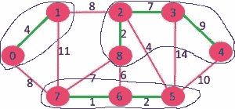
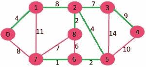

# Boruvka 的算法| 贪婪的 Algo-9

> 原文： [https://www.geeksforgeeks.org/boruvkas-algorithm-greedy-algo-9/](https://www.geeksforgeeks.org/boruvkas-algorithm-greedy-algo-9/)

我们已经讨论了以下有关最小生成树的主题。

[最小生成树问题的应用](https://www.geeksforgeeks.org/applications-of-minimum-spanning-tree/)
[Kruskal 的最小生成树算法](https://www.geeksforgeeks.org/greedy-algorithms-set-2-kruskals-minimum-spanning-tree-mst/)
[Prim 的最小生成树算法](https://www.geeksforgeeks.org/greedy-algorithms-set-5-prims-minimum-spanning-tree-mst-2/)

在这篇文章中，讨论了 Boruvka 的算法。 与 Prim 和 Kruskal 一样，Borvuka 的算法也是 Greedy 算法。 下面是完整的算法。

```
1) Input is a connected, weighted and un-directed graph.
2) Initialize all vertices as individual components (or sets).
3) Initialize MST as empty.
4) While there are more than one components, do following
   for each component.
      a)  Find the closest weight edge that connects this 
          component to any other component.
      b)  Add this closest edge to MST if not already added.  
5) Return MST.

```

以下是上述算法的思想（该思想与 [Prim 的 MST 算法](https://www.geeksforgeeks.org/greedy-algorithms-set-5-prims-minimum-spanning-tree-mst-2/)相同）。

*生成树表示必须连接所有顶点。 因此必须将两个不相交的顶点子集（上面讨论过）连接起来以生成生成树。 并且它们必须以最小的重量边连接，以使其成为最小的生成树。*

让我们通过以下示例来了解算法。

[](https://media.geeksforgeeks.org/wp-content/cdn-uploads/Fig-0.jpg) 
最初，MST 为空。 每个顶点都是单一成分，在下图中以蓝色突出显示。
[](https://media.geeksforgeeks.org/wp-content/cdn-uploads/4.jpg)

对于每个组件，找到将其连接到其他组件的最便宜的边。

```
Component                Cheapest Edge that connects 
                         it to some other component
  {0}                           0-1
  {1}                           0-1
  {2}                           2-8
  {3}                           2-3
  {4}                           3-4
  {5}                           5-6
  {6}                           6-7
  {7}                           6-7
  {8}                           2-8 
```

最便宜的边缘以绿色突出显示。 现在，MST 变为{0-1、2-8、2-3、3-4、5-6、6-7}。
[](https://media.geeksforgeeks.org/wp-content/cdn-uploads/13.jpg) 
在上述步骤之后，成分为{{0,1}，{2,3,4,8}，{5,6,7}}。 组件被蓝色包围。
[](https://media.geeksforgeeks.org/wp-content/cdn-uploads/131.jpg)

我们再次重复该步骤，即对于每个组件，找到将其连接到其他组件的最便宜的边。

```
Component                Cheapest Edge that connects 
                         it to some other component
  {0,1}                        1-2 (or 0-7)
  {2,3,4,8}                    2-5
  {5,6,7}                      2-5
```

最便宜的边缘以绿色突出显示。 现在，MST 变为{0-1、2-8、2-3、3-4、5-6、6-7、1-2、2-5}
[](https://media.geeksforgeeks.org/wp-content/cdn-uploads/14.jpg)

在这一阶段，只有一个具有全部边缘的分量{0、1、2、3、4、5、6、7、8}。 由于仅剩一个组件，因此我们停止并返回 MST。

**实现**：
下面是上述算法的实现。 输入图表示为边的集合，[联合查找数据结构](https://www.geeksforgeeks.org/union-find-algorithm-set-2-union-by-rank/)用于跟踪组件。

## C / C ++

```

// Boruvka's algorithm to find Minimum Spanning 
// Tree of a given connected, undirected and 
// weighted graph 
#include <stdio.h> 

// a structure to represent a weighted edge in graph 
struct Edge 
{ 
    int src, dest, weight; 
}; 

// a structure to represent a connected, undirected 
// and weighted graph as a collection of edges. 
struct Graph 
{ 
    // V-> Number of vertices, E-> Number of edges 
    int V, E; 

    // graph is represented as an array of edges. 
    // Since the graph is undirected, the edge 
    // from src to dest is also edge from dest 
    // to src. Both are counted as 1 edge here. 
    Edge* edge; 
}; 

// A structure to represent a subset for union-find 
struct subset 
{ 
    int parent; 
    int rank; 
}; 

// Function prototypes for union-find (These functions are defined 
// after boruvkaMST() ) 
int find(struct subset subsets[], int i); 
void Union(struct subset subsets[], int x, int y); 

// The main function for MST using Boruvka's algorithm 
void boruvkaMST(struct Graph* graph) 
{ 
    // Get data of given graph 
    int V = graph->V, E = graph->E; 
    Edge *edge = graph->edge; 

    // Allocate memory for creating V subsets. 
    struct subset *subsets = new subset[V]; 

    // An array to store index of the cheapest edge of 
    // subset.  The stored index for indexing array 'edge[]' 
    int *cheapest = new int[V]; 

    // Create V subsets with single elements 
    for (int v = 0; v < V; ++v) 
    { 
        subsets[v].parent = v; 
        subsets[v].rank = 0; 
        cheapest[v] = -1; 
    } 

    // Initially there are V different trees. 
    // Finally there will be one tree that will be MST 
    int numTrees = V; 
    int MSTweight = 0; 

    // Keep combining components (or sets) until all 
    // compnentes are not combined into single MST. 
    while (numTrees > 1) 
    { 
         // Everytime initialize cheapest array 
          for (int v = 0; v < V; ++v) 
           { 
               cheapest[v] = -1; 
           } 

        // Traverse through all edges and update 
        // cheapest of every component 
        for (int i=0; i<E; i++) 
        { 
            // Find components (or sets) of two corners 
            // of current edge 
            int set1 = find(subsets, edge[i].src); 
            int set2 = find(subsets, edge[i].dest); 

            // If two corners of current edge belong to 
            // same set, ignore current edge 
            if (set1 == set2) 
                continue; 

            // Else check if current edge is closer to previous 
            // cheapest edges of set1 and set2 
            else
            { 
               if (cheapest[set1] == -1 || 
                   edge[cheapest[set1]].weight > edge[i].weight) 
                 cheapest[set1] = i; 

               if (cheapest[set2] == -1 || 
                   edge[cheapest[set2]].weight > edge[i].weight) 
                 cheapest[set2] = i; 
            } 
        } 

        // Consider the above picked cheapest edges and add them 
        // to MST 
        for (int i=0; i<V; i++) 
        { 
            // Check if cheapest for current set exists 
            if (cheapest[i] != -1) 
            { 
                int set1 = find(subsets, edge[cheapest[i]].src); 
                int set2 = find(subsets, edge[cheapest[i]].dest); 

                if (set1 == set2) 
                    continue; 
                MSTweight += edge[cheapest[i]].weight; 
                printf("Edge %d-%d included in MST\n", 
                       edge[cheapest[i]].src, edge[cheapest[i]].dest); 

                // Do a union of set1 and set2 and decrease number 
                // of trees 
                Union(subsets, set1, set2); 
                numTrees--; 
            } 
        } 
    } 

    printf("Weight of MST is %d\n", MSTweight); 
    return; 
} 

// Creates a graph with V vertices and E edges 
struct Graph* createGraph(int V, int E) 
{ 
    Graph* graph = new Graph; 
    graph->V = V; 
    graph->E = E; 
    graph->edge = new Edge[E]; 
    return graph; 
} 

// A utility function to find set of an element i 
// (uses path compression technique) 
int find(struct subset subsets[], int i) 
{ 
    // find root and make root as parent of i 
    // (path compression) 
    if (subsets[i].parent != i) 
      subsets[i].parent = 
             find(subsets, subsets[i].parent); 

    return subsets[i].parent; 
} 

// A function that does union of two sets of x and y 
// (uses union by rank) 
void Union(struct subset subsets[], int x, int y) 
{ 
    int xroot = find(subsets, x); 
    int yroot = find(subsets, y); 

    // Attach smaller rank tree under root of high 
    // rank tree (Union by Rank) 
    if (subsets[xroot].rank < subsets[yroot].rank) 
        subsets[xroot].parent = yroot; 
    else if (subsets[xroot].rank > subsets[yroot].rank) 
        subsets[yroot].parent = xroot; 

    // If ranks are same, then make one as root and 
    // increment its rank by one 
    else
    { 
        subsets[yroot].parent = xroot; 
        subsets[xroot].rank++; 
    } 
} 

// Driver program to test above functions 
int main() 
{ 
    /* Let us create following weighted graph 
             10 
        0--------1 
        |  \     | 
       6|   5\   |15 
        |      \ | 
        2--------3 
            4       */
    int V = 4;  // Number of vertices in graph 
    int E = 5;  // Number of edges in graph 
    struct Graph* graph = createGraph(V, E); 

    // add edge 0-1 
    graph->edge[0].src = 0; 
    graph->edge[0].dest = 1; 
    graph->edge[0].weight = 10; 

    // add edge 0-2 
    graph->edge[1].src = 0; 
    graph->edge[1].dest = 2; 
    graph->edge[1].weight = 6; 

    // add edge 0-3 
    graph->edge[2].src = 0; 
    graph->edge[2].dest = 3; 
    graph->edge[2].weight = 5; 

    // add edge 1-3 
    graph->edge[3].src = 1; 
    graph->edge[3].dest = 3; 
    graph->edge[3].weight = 15; 

    // add edge 2-3 
    graph->edge[4].src = 2; 
    graph->edge[4].dest = 3; 
    graph->edge[4].weight = 4; 

    boruvkaMST(graph); 

    return 0; 
} 

// Thanks to Anukul Chand for modifying above code. 

```