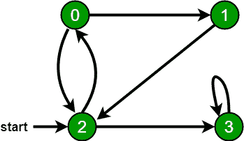

# 不使用队列

的广度优先搜索

> 原文： [https://www.geeksforgeeks.org/breadth-first-search-without-using-queue/](https://www.geeksforgeeks.org/breadth-first-search-without-using-queue/)

[广度优先搜索](https://www.geeksforgeeks.org/breadth-first-search-or-bfs-for-a-graph/)是一种图形遍历算法，它逐级遍历图形或树。 在本文中，使用[邻接表](https://www.geeksforgeeks.org/prims-mst-for-adjacency-list-representation-greedy-algo-6/)实现了图形的 [BFS，而不使用](https://www.geeksforgeeks.org/breadth-first-search-or-bfs-for-a-graph/)[队列](http://www.geeksforgeeks.org/queue-data-structure/)。

**示例**：

> **输入**： 
>
> **输出**：`BFS = 2, 0, 3, 1`
>
> **说明**：
>
> 在下图中，我们从顶点 2 开始遍历。当到达顶点 0 时，我们将寻找它的所有相邻顶点。 2 也是 0 的相邻顶点。如果我们不标记访问的顶点，那么 2 将再次被处理，它将成为一个非终止过程。 因此，下图的广度优先遍历为 2、0、3、1。

**方法**：可以使用来自给定源的简单的广度优先遍历来解决此问题。 该实现使用图 的 [**邻接表表示。**](https://www.geeksforgeeks.org/prims-mst-for-adjacency-list-representation-greedy-algo-6/)

这里：

*   [STL 向量容器](https://www.geeksforgeeks.org/vector-in-cpp-stl/)用于存储 BFS 遍历所需的相邻节点列表和节点队列。

*   **[DP 阵列](https://www.geeksforgeeks.org/dynamic-programming/)** 用于存储节点到源的距离。 每次我们从一个节点移动到另一个节点时，距离都会增加 1。如果到达节点的距离小于以前的距离，我们将更新`DP[node]`中存储的值。

**下面是上述方法的实现**：

```

// C++ implementation to demonstrate 
// the above mentioned approach 

#include <bits/stdc++.h> 
using namespace std; 

// Function to find the distance 
// from the source to other nodes 
void BFS(int curr, int N, vector<bool>& vis, 
         vector<int>& dp, vector<int>& v, 
         vector<vector<int> >& adj) 
{ 

    while (curr <= N) { 

        // Current node 
        int node = v[curr - 1]; 
        cout << node << ", "; 

        for (int i = 0; i < adj[node].size(); i++) { 

            // Adjacent node 
            int next = adj[node][i]; 

            if ((!vis[next]) 
                && (dp[next] < dp[node] + 1)) { 

                // Stores the adjacent node 
                v.push_back(next); 

                // Increases the distance 
                dp[next] = dp[node] + 1; 

                // Mark it as visited 
                vis[next] = true; 
            } 
        } 
        curr += 1; 
    } 
} 

// Function to print the distance 
// from source to other nodes 
void bfsTraversal( 
    vector<vector<int> >& adj, 
    int N, int source) 
{ 
    // Initially mark all nodes as false 
    vector<bool> vis(N + 1, false); 

    // Initialize distance array with 0 
    vector<int> dp(N + 1, 0), v; 

    v.push_back(source); 

    // Initially mark the starting 
    // source as 0 and visited as true 
    dp = 0; 
    vis = true; 

    // Call the BFS function 
    BFS(1, N, vis, dp, v, adj); 
} 

// Driver code 
int main() 
{ 
    // No. of nodes in graph 
    int N = 4; 

    // Creating adjacency list 
    // for representing graph 
    vector<vector<int> > adj(N + 1); 
    adj[0].push_back(1); 
    adj[0].push_back(2); 
    adj[1].push_back(2); 
    adj[2].push_back(0); 
    adj[2].push_back(3); 
    adj[3].push_back(3); 

    // Following is BFS Traversal 
    // starting from vertex 2 
    bfsTraversal(adj, N, 2); 

    return 0; 
} 

```

**Output:**

```
2, 0, 3, 1,

```


* * *

* * *

如果您喜欢 GeeksforGeeks 并希望做出贡献，则还可以使用 [tribution.geeksforgeeks.org](https://contribute.geeksforgeeks.org/) 撰写文章，或将您的文章邮寄至 tribution@geeksforgeeks.org。 查看您的文章出现在 GeeksforGeeks 主页上，并帮助其他 Geeks。

如果您发现任何不正确的地方，请单击下面的“改进文章”按钮，以改进本文。