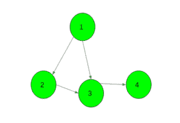

# 检查是否连接了有向图

> 原文： [https://www.geeksforgeeks.org/check-if-a-directed-graph-is-connected-or-not/](https://www.geeksforgeeks.org/check-if-a-directed-graph-is-connected-or-not/)

给定有向图。 任务是检查给定的图形是否已连接。

**示例**：

> **输入**：
> 
> **输出**：是
> 
> **输入**：
> 
> **输出**：否

**方法**：

1.  取两个数组 **vis1** 和 **vis2** ，大小为`N`（图形的节点数），并在所有索引中保持 false。
2.  从图 G 的随机顶点`v`开始，然后运行 DFS（G，v）。
3.  将所有访问的顶点`v`设置为 **vis1 [v] = true** 。
4.  现在反转所有边缘的方向。
5.  在步骤 2 中选择的顶点处启动 DFS。
6.  将所有访问的顶点`v`设置为 **vis2 [v] = true** 。
7.  如果任何顶点`v`的 **vis1 [v] =假**和 **vis2 [v] =假**，则该图未连接。

下面是上述方法的实现：

## C ++

```

// C++ implementation of the approach 
#include <bits/stdc++.h> 
using namespace std; 
#define N 100000 

// To keep correct and reverse direction 
vector<int> gr1[N], gr2[N]; 

bool vis1[N], vis2[N]; 

// Function to add edges 
void Add_edge(int u, int v) 
{ 
    gr1[u].push_back(v); 
    gr2[v].push_back(u); 
} 

// DFS function 
void dfs1(int x) 
{ 
    vis1[x] = true; 

    for (auto i : gr1[x]) 
        if (!vis1[i]) 
            dfs1(i); 
} 

// DFS function 
void dfs2(int x) 
{ 
    vis2[x] = true; 

    for (auto i : gr2[x]) 
        if (!vis2[i]) 
            dfs2(i); 
} 

bool Is_Connected(int n) 
{ 
    // Call for correct direction 
    memset(vis1, false, sizeof vis1); 
    dfs1(1); 

    // Call for reverse direction 
    memset(vis2, false, sizeof vis2); 
    dfs2(1); 

    for (int i = 1; i <= n; i++) { 

        // If any vertex it not visited in any direction 
        // Then graph is not connected 
        if (!vis1[i] and !vis2[i]) 
            return false; 
    } 

    // If graph is connected 
    return true; 
} 

// Driver code 
int main() 
{ 
    int n = 4; 

    // Add edges 
    Add_edge(1, 2); 
    Add_edge(1, 3); 
    Add_edge(2, 3); 
    Add_edge(3, 4); 

    // Function call 
    if (Is_Connected(n)) 
        cout << "Yes"; 
    else
        cout << "No"; 

    return 0; 
} 

```