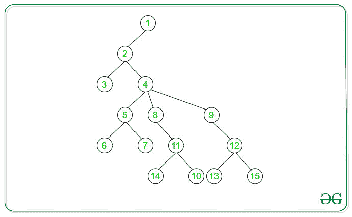
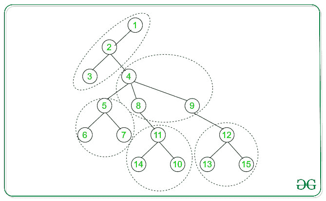

# 检查树是否可以拆分为 K 个相等连通组件

> 原文： [https://www.geeksforgeeks.org/check-if-a-tree-can-be-split-into-k-equal-connected-components/](https://www.geeksforgeeks.org/check-if-a-tree-can-be-split-into-k-equal-connected-components/)

给定一棵树的[邻接表](https://www.geeksforgeeks.org/add-and-remove-vertex-in-adjacency-list-representation-of-graph/)表示和一个整数`K`，任务是查找给定的树是否可以分为`K`等于 [是否使用组件](https://www.geeksforgeeks.org/connected-components-in-an-undirected-graph/)。

**注意**：如果两个连通组件包含相等数量的节点，则称它们相等。

**示例**：

> **输入**：N = 15，K = 5
> Beow 是给定的树，其 Number 节点= 15
> 
> 
> 
> **输出**：`Yes`
> **说明**：
> 以下是可制作的 5 个连接组件数：
> 
> 

**方法**：

的想法是在`N`个节点的给定树上使用[深度优先搜索（DFS）](https://www.geeksforgeeks.org/depth-first-search-or-dfs-for-a-graph/)遍历，以查找给定树是否可以 分为`K`等于[连通组件](https://www.geeksforgeeks.org/connected-components-in-an-undirected-graph/)。 以下是步骤：

1.  从树的根开始 [DFS 遍历](https://www.geeksforgeeks.org/depth-first-search-or-dfs-for-a-graph/)。

2.  对于在 [DFS 遍历](https://www.geeksforgeeks.org/depth-first-search-or-dfs-for-a-graph/)期间未访问的每个顶点，对该顶点递归调用 [DFS](http://www.geeksforgeeks.org/depth-first-traversal-for-a-graph/) ，以在每个 DFS 递归调用期间保持遍历的节点数。

3.  如果节点数等于**（N / K）**，则我们得到了[连接组件](https://www.geeksforgeeks.org/connected-components-in-an-undirected-graph/)中的一个。

4.  如果（ **N / K** ）个节点的[个连接组件](https://www.geeksforgeeks.org/connected-components-in-an-undirected-graph/)的集合总数等于`K`。 然后，可以将给定的图分解为`K`等于[连通组件](https://www.geeksforgeeks.org/connected-components-in-an-undirected-graph/)。

下面是上述方法的实现：

## C++

```cpp

// C++ program to detect whether
// the given Tree can be split
// into K equals components
#include <bits/stdc++.h>
using namespace std;

// For checking if the graph
// can be split into K equal
// Connected Components
int flag = 0;

// DFS Traversal
int DFS(vector<int> adj[], int k,
        int i, int x)
{

    // Intialise ans to 1
    int ans = 1;

    // Traverse the adjacency
    // for vertex i
    for (auto& it : adj[i]) {
        if (it != k) {
            ans += DFS(adj, i, it, x);
        }
    }

    // If number of nodes is
    // greater than x, then
    // the tree cannot be split
    if (ans > x) {
        flag = 1;
        return 0;
    }

    // Check for requirement
    // of nodes
    else if (ans == x) {
        ans = 0;
    }
    return ans;
}

// A utility function to add
// an edge in an undirected
// Tree
void addEdge(vector<int> adj[],
             int u, int v)
{
    adj[u].push_back(v);
    adj[v].push_back(u);
}

// Driver's Code
int main()
{
    int N = 15, K = 5;

    // Adjacency List
    vector<int> adj[N + 1];

    // Adding edges to List
    addEdge(adj, 1, 2);
    addEdge(adj, 2, 3);
    addEdge(adj, 2, 4);
    addEdge(adj, 4, 5);
    addEdge(adj, 5, 6);
    addEdge(adj, 5, 7);
    addEdge(adj, 4, 8);
    addEdge(adj, 4, 9);
    addEdge(adj, 8, 11);
    addEdge(adj, 10, 11);
    addEdge(adj, 11, 14);
    addEdge(adj, 9, 12);
    addEdge(adj, 12, 15);
    addEdge(adj, 12, 13);

    // Check if tree can be split
    // into K Connected Components
    // of equal number of nodes
    if (N % K == 0) {
        // DFS call to Check
        // if tree can be split
        DFS(adj, -1, 1, N / K);
    }

    // If flag is 0, then the
    // given can be split to
    // Connected Components
    cout << (flag ? "NO" : "YES");

    return 0;
}

```

## Java

```java

// Java program to detect whether
// the given Tree can be split
// into K equals components
import java.util.*;

class GFG
{

// For checking if the graph
// can be split into K equal
// Connected Components
static int flag = 0;

// DFS Traversal
static int DFS(Vector<Integer> adj[], int k,
        int i, int x)
{

    // Intialise ans to 1
    int ans = 1;

    // Traverse the adjacency
    // for vertex i
    for (int it : adj[i]) {
        if (it != k) {
            ans += DFS(adj, i, it, x);
        }
    }

    // If number of nodes is
    // greater than x, then
    // the tree cannot be split
    if (ans > x) {
        flag = 1;
        return 0;
    }

    // Check for requirement
    // of nodes
    else if (ans == x) {
        ans = 0;
    }
    return ans;
}

// A utility function to add
// an edge in an undirected
// Tree
static void addEdge(Vector<Integer> adj[],
             int u, int v)
{
    adj[u].add(v);
    adj[v].add(u);
}

// Driver's Code
public static void main(String[] args)
{
    int N = 15, K = 5;

    // Adjacency List
    Vector<Integer> []adj = new Vector[N + 1];
    for(int i= 0; i < N + 1; i++)
        adj[i] = new Vector<Integer>();

    // Adding edges to List
    addEdge(adj, 1, 2);
    addEdge(adj, 2, 3);
    addEdge(adj, 2, 4);
    addEdge(adj, 4, 5);
    addEdge(adj, 5, 6);
    addEdge(adj, 5, 7);
    addEdge(adj, 4, 8);
    addEdge(adj, 4, 9);
    addEdge(adj, 8, 11);
    addEdge(adj, 10, 11);
    addEdge(adj, 11, 14);
    addEdge(adj, 9, 12);
    addEdge(adj, 12, 15);
    addEdge(adj, 12, 13);

    // Check if tree can be split
    // into K Connected Components
    // of equal number of nodes
    if (N % K == 0) {
        // DFS call to Check
        // if tree can be split
        DFS(adj, -1, 1, N / K);
    }

    // If flag is 0, then the
    // given can be split to
    // Connected Components
    System.out.print(flag==1 ? "NO" : "YES"); 
}
}

// This code is contributed by Rajput-Ji

```

## Python

```py

# Python3 program to detect whether 
# the given Tree can be split 
# into K equals components

# For checking if the graph 
# can be split into K equal 
# Connected Components 
flag = 0

# DFS Traversal 
def DFS(adj, k, i, x):

    # Intialise ans to 1 
    ans = 1

    # Traverse the adjacency 
    # for vertex i 
    for it in adj[i]:
        if it is not k:
            ans += DFS(adj, i, it, x)

    # If number of nodes is 
    # greater than x, then 
    # the tree cannot be split 
    if (ans > x):
        flag = 1
        return 0

    # Check for requirement 
    # of nodes 
    elif (ans == x): 
        ans = 0

    return ans

# A utility function to add 
# an edge in an undirected 
# Tree 
def addEdge(adj, u, v): 

    adj[u].append(v)
    adj[v].append(u)

# Driver code
if __name__=="__main__":

    (N, K) = (15, 5)

    # Adjacency List 
    adj = [[] for i in range(N + 1)]

    # Adding edges to List 
    addEdge(adj, 1, 2); 
    addEdge(adj, 2, 3); 
    addEdge(adj, 2, 4); 
    addEdge(adj, 4, 5); 
    addEdge(adj, 5, 6); 
    addEdge(adj, 5, 7); 
    addEdge(adj, 4, 8); 
    addEdge(adj, 4, 9); 
    addEdge(adj, 8, 11); 
    addEdge(adj, 10, 11); 
    addEdge(adj, 11, 14); 
    addEdge(adj, 9, 12); 
    addEdge(adj, 12, 15); 
    addEdge(adj, 12, 13); 

    # Check if tree can be split 
    # into K Connected Components 
    # of equal number of nodes 
    if (N % K == 0):

        # DFS call to Check 
        # if tree can be split 
        DFS(adj, -1, 1, N // K) 

    # If flag is 0, then the 
    # given can be split to 
    # Connected Components
    if flag == 1:
        print("NO")
    else:
        print("YES")

# This code is contributed by rutvik_56

```

## C#

```cs

// C# program to detect whether
// the given Tree can be split
// into K equals components
using System;
using System.Collections.Generic;

class GFG
{

// For checking if the graph
// can be split into K equal
// Connected Components
static int flag = 0;

// DFS Traversal
static int DFS(List<int> []adj, int k,
        int i, int x)
{

    // Intialise ans to 1
    int ans = 1;

    // Traverse the adjacency
    // for vertex i
    foreach (int it in adj[i]) {
        if (it != k) {
            ans += DFS(adj, i, it, x);
        }
    }

    // If number of nodes is
    // greater than x, then
    // the tree cannot be split
    if (ans > x) {
        flag = 1;
        return 0;
    }

    // Check for requirement
    // of nodes
    else if (ans == x) {
        ans = 0;
    }
    return ans;
}

// A utility function to add
// an edge in an undirected
// Tree
static void addEdge(List<int> []adj,
             int u, int v)
{
    adj[u].Add(v);
    adj[v].Add(u);
}

// Driver's Code
public static void Main(String[] args)
{
    int N = 15, K = 5;

    // Adjacency List
    List<int> []adj = new List<int>[N + 1];
    for(int i= 0; i < N + 1; i++)
        adj[i] = new List<int>();

    // Adding edges to List
    addEdge(adj, 1, 2);
    addEdge(adj, 2, 3);
    addEdge(adj, 2, 4);
    addEdge(adj, 4, 5);
    addEdge(adj, 5, 6);
    addEdge(adj, 5, 7);
    addEdge(adj, 4, 8);
    addEdge(adj, 4, 9);
    addEdge(adj, 8, 11);
    addEdge(adj, 10, 11);
    addEdge(adj, 11, 14);
    addEdge(adj, 9, 12);
    addEdge(adj, 12, 15);
    addEdge(adj, 12, 13);

    // Check if tree can be split
    // into K Connected Components
    // of equal number of nodes
    if (N % K == 0) {
        // DFS call to Check
        // if tree can be split
        DFS(adj, -1, 1, N / K);
    }

    // If flag is 0, then the
    // given can be split to
    // Connected Components
    Console.Write(flag==1 ? "NO" : "YES"); 
}
}

// This code contributed by Rajput-Ji

```

**Output:** 

```
YES

```

**时间复杂度**：`O(V + E)`，其中 V 是顶点数，E 是边数


* * *

* * *

如果您喜欢 GeeksforGeeks 并希望做出贡献，则还可以使用 [tribution.geeksforgeeks.org](https://contribute.geeksforgeeks.org/) 撰写文章，或将您的文章邮寄至 tribution@geeksforgeeks.org。 查看您的文章出现在 GeeksforGeeks 主页上，并帮助其他 Geeks。

如果您发现任何不正确的地方，请单击下面的“改进文章”按钮，以改进本文。