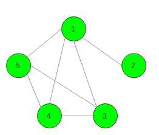

# 检查是否存在满足给定条件的连接图

> 原文： [https://www.geeksforgeeks.org/check-if-there-exists-a-connected-graph-that-satisfies-the-given-conditions/](https://www.geeksforgeeks.org/check-if-there-exists-a-connected-graph-that-satisfies-the-given-conditions/)

给定两个整数`N`和`K`。 任务是找到一个具有`N`个顶点的连通图，以使得精确地存在`K`对**（i，j）**对，其中它们之间的最短距离为`2`。 如果不存在这样的图形，则打印 **-1** 。

**注意**：

1.  第一行输出应为图形中的边数（例如 m），接下来的 m 行应包含两个数字，代表顶点之间的边。
2.  如果有多个答案，请打印其中的任何一个。

**示例**：

> **输入**：N = 5，K = 3
> **输出**：7
> 1 2
> 1 3
> 1 4
> 1 5
> 3 4
> 3 5
> 4 5
> 
> 
> **输入**：N = 5，K = 8
> **输出**：-1

**方法**：一个 N 顶点连通的图至少具有 **N-1** 个边。 每对的最短距离等于`1`。 显然，很明显，如果 **K > N *（N – 1）/ 2 –（N – 1）=（N – 1）*（N – 2）/ 2** 。
相反，可以通过构建满足条件的图来证明 **K≤（N – 1）*（N – 2）/ 2** 。 首先，让我们考虑一下图，其中每个顶点都与所有其他顶点相连，然后两个顶点之间最短的是`1`。 现在，删除所有`K`边，然后精确存在`K`这样的对。

下面是上述方法的实现：

## C++

```cpp

// C++ implementation of the approach 
#include <bits/stdc++.h> 
using namespace std; 

// Function to find the required graph 
void connected_graph(int n, int k) 
{ 
    // If no such graph exists 
    if (k > (n - 1) * (n - 2) / 2) { 
        cout << -1 << endl; 
        return; 
    } 

    // Consider edge between all vertices 
    bool isEdge[n][n] = {}; 
    for (int i = 0; i < n; i++) { 
        for (int j = i + 1; j < n; j++) 
            isEdge[i][j] = true; 
    } 

    // Remove K vertices 
    int cnt = 0; 
    for (int i = 1; i < n; i++) { 
        for (int j = i + 1; j < n; j++) { 
            if (cnt < k) { 
                isEdge[i][j] = false; 
                cnt++; 
            } 
        } 
    } 

    // Store all the edges 
    vector<pair<int, int> > vec; 
    for (int i = 0; i < n; i++) { 
        for (int j = i + 1; j < n; j++) { 
            if (isEdge[i][j]) 
                vec.emplace_back(i, j); 
        } 
    } 

    // Print all the edges 
    cout << vec.size() << endl; 
    for (int i = 0; i < vec.size(); i++) { 
        cout << vec[i].first + 1 << " "
             << vec[i].second + 1 << endl; 
    } 
} 

// Driver code 
int main() 
{ 
    int n = 5, k = 3; 

    // Function call 
    connected_graph(n, k); 

    return 0; 
} 

```