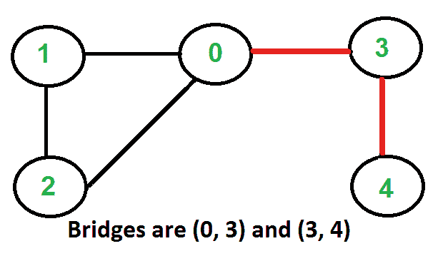
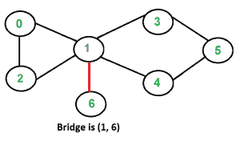

# 检查是否删除给定边会断开图形

> 原文： [https://www.geeksforgeeks.org/check-removing-given-edge-disconnects-given-graph/](https://www.geeksforgeeks.org/check-removing-given-edge-disconnects-given-graph/)

给定无向图和边，任务是查找给定边是否为图中的[桥](https://www.geeksforgeeks.org/bridge-in-a-graph/)，即删除边会断开图的连接。

以下是一些示例图，其中的桥用红色突出显示。

 ](https://www.geeksforgeeks.org/wp-content/uploads/Bridge1.png) [  ](https://www.geeksforgeeks.org/wp-content/uploads/Bridge2.png) [ 

一种解决方案是[在给定图](https://www.geeksforgeeks.org/bridge-in-a-graph/)中找到所有桥，然后检查给定边是否为桥。

一个更简单的解决方案是删除边，删除后检查图形是否保持连接，最后再添加边。 我们总是可以通过从任何顶点找到所有可到达的顶点来找到无向的连接。 如果可达到的顶点数等于图中的顶点数，则图被连接，否则不连通。 我们可以使用 BFS 或 DFS 找到所有可到达的顶点。 以下是完整的步骤。

1）删除给定的边

2）从任何顶点查找所有可到达的顶点。 在下面的实现中，我们选择了第一个顶点。

3）如果可达节点数为 V，则返回 false [给出的不是网桥]。 其他返回是。

## C++

```cpp

// C++ program to check if removing an 
// edge disconnects a graph or not. 
#include<bits/stdc++.h> 
using namespace std; 

// Graph class represents a directed graph 
// using adjacency list representation 
class Graph 
{ 
    int V;    // No. of vertices 
    list<int> *adj; 
    void DFS(int v, bool visited[]); 
public: 
    Graph(int V);   // Constructor 

    // function to add an edge to graph 
    void addEdge(int v, int w); 

    // Returns true if graph is connected 
    bool isConnected(); 

    bool isBridge(int u, int v); 
}; 

Graph::Graph(int V) 
{ 
    this->V = V; 
    adj = new list<int>[V]; 
} 

void Graph::addEdge(int u, int v) 
{ 
    adj[u].push_back(v); // Add w to v’s list. 
    adj[v].push_back(u); // Add w to v’s list. 
} 

void Graph::DFS(int v, bool visited[]) 
{ 
    // Mark the current node as visited and print it 
    visited[v] = true; 

    // Recur for all the vertices adjacent to 
    // this vertex 
    list<int>::iterator i; 
    for (i = adj[v].begin(); i != adj[v].end(); ++i) 
        if (!visited[*i]) 
            DFS(*i, visited); 
} 

// Returns true if given graph is connected, else false 
bool Graph::isConnected() 
{ 
    bool visited[V]; 
    memset(visited, false, sizeof(visited)); 

    // Find all reachable vertices from first vertex 
    DFS(0, visited); 

    // If set of reachable vertices includes all, 
    // return true. 
    for (int i=1; i<V; i++) 
       if (visited[i] == false) 
           return false; 

    return true; 
} 

// This function assumes that edge (u, v) 
// exists in graph or not, 
bool Graph::isBridge(int u, int v) 
{ 
    // Remove edge from undirected graph 
    adj[u].remove(v); 
    adj[v].remove(u); 

    bool res = isConnected(); 

    // Adding the edge back 
    addEdge(u, v); 

    // Return true if graph becomes disconnected 
    // after removing the edge. 
    return (res == false); 
} 

// Driver code 
int main() 
{ 
    // Create a graph given in the above diagram 
    Graph g(4); 
    g.addEdge(0, 1); 
    g.addEdge(1, 2); 
    g.addEdge(2, 3); 

    g.isBridge(1, 2)? cout << "Yes" : cout << "No"; 

    return 0; 
} 

```