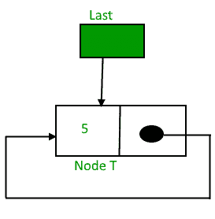
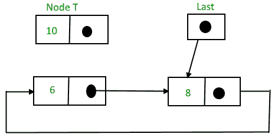
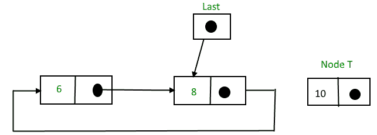
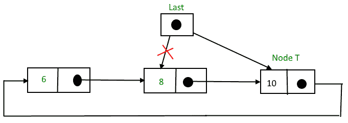

# 循环单链表| 插入

> 原文：[https://www.geeksforgeeks.org/circular-singly-linked-list-insertion/](https://www.geeksforgeeks.org/circular-singly-linked-list-insertion/)

我们在以下文章中讨论了单链和循环链表：

[单链表](http://quiz.geeksforgeeks.org/linked-list-set-1-introduction/)

[链链表](http://quiz.geeksforgeeks.org/circular-linked-list/)

**为什么要循环？** 在单链列表中，为了访问链列表的任何节点，我们从第一个节点开始遍历。 如果我们位于列表中间的任何节点，则不可能访问给定节点之前的节点。 这个问题可以通过稍微改变单链表的结构来解决。 在单链列表中，下一部分（指向下一个节点的指针）为 NULL，如果我们利用此链接指向第一个节点，则可以到达前一个节点。 有关循环链表的更多优点，请参考此的[。

这样形成的结构是圆形单链表，如下所示：](http://quiz.geeksforgeeks.org/circular-linked-list/)


在这篇文章中，说明了使用单链表在循环链表中实现和插入节点的过程。

**实现**

要实现循环单链列表，我们采用指向列表最后一个节点的外部指针。 如果我们的指针最后指向最后一个节点，则最后一个-> next 将指向第一个节点。


指针*的最后*指向节点 Z，而指针->的下一个指向节点 P。

***为什么我们采用了指向最后一个节点而不是第一个节点的指针？***

为了在开始时插入节点，我们需要遍历整个列表。 同样，要插入到末尾，必须遍历整个列表。 如果我们不是使用*而是使用*指针，而是使用指向最后一个节点的指针，则在两种情况下都不需要遍历整个列表。 因此，无论列表的长度如何，插入乞讨或结尾处都会花费固定的时间。

**插入**，

可以通过三种方式添加节点：

*   插入空白列表

*   插入列表的开头

*   在列表末尾插入

*   在节点之间插入

**插入到空列表**中

最初，当列表为空时，*的最后一个*指针将为 NULL。


插入节点 T 后，



插入后，T 是最后一个节点，因此指针*的最后一个*指向节点 T。节点 T 是第一个和最后一个节点，因此 T 指向自身。

用于将节点插入空列表的功能，

## C++

```cpp

struct Node *addToEmpty(struct Node *last, int data)
{
    // This function is only for empty list
    if (last != NULL)
      return last;

    // Creating a node dynamically.
    struct Node *last =
          (struct Node*)malloc(sizeof(struct Node));

    // Assigning the data.
    last -> data = data;

    // Note : list was empty. We link single node
    // to itself.
    last -> next = last;

    return last;
}

```

**在列表的开头插入**。

要在列表的开头插入节点，请按照下列步骤操作：

1.创建一个节点，例如 T。

2 。使 T->下一个=最后->下一个。

3.末页->下一个=T。



插入后，


将节点插入列表开头的功能，

## C++

```cpp

struct Node *addBegin(struct Node *last, int data)
{
  if (last == NULL)
     return addToEmpty(last, data);

  // Creating a node dynamically.
  struct Node *temp
        = (struct Node *)malloc(sizeof(struct Node));

  // Assigning the data.
  temp -> data = data;

  // Adjusting the links.
  temp -> next = last -> next;
  last -> next = temp;

  return last;
}

```

**在列表末尾插入**。

要在列表末尾插入节点，请执行以下步骤：

1.创建一个节点，例如 T。

2 。将 T->下一个=上一个->下一个；

3.最后-> next =T。

4\. last =T。



插入后，



将节点插入列表末尾的功能，

## C++

```cpp

struct Node *addEnd(struct Node *last, int data)
{
  if (last == NULL)
     return addToEmpty(last, data);

  // Creating a node dynamically.
  struct Node *temp = 
        (struct Node *)malloc(sizeof(struct Node));

  // Assigning the data.
  temp -> data = data;

  // Adjusting the links.
  temp -> next = last -> next;
  last -> next = temp;
  last = temp;

  return last;
}

```

**在节点之间插入**。

要在列表的末尾插入节点，请执行以下步骤：

1.创建一个节点，例如 T。

2.搜索

3.使 T-> next = P-> next；将要插入 T 的节点称为 P。

4\. P-> next =T。

假设在值 10 的节点后需要插入 12，


搜索并插入后，


将节点插入列表末尾的功能，

## C++

```cpp

struct Node *addAfter(struct Node *last, int data, int item)
{
    if (last == NULL)
       return NULL;

    struct Node *temp, *p;
    p = last -> next;

    // Searching the item.
    do
    {
        if (p ->data == item)
        {
            // Creating a node dynamically.
            temp = (struct Node *)malloc(sizeof(struct Node));

            // Assigning the data.
            temp -> data = data;

            // Adjusting the links.
            temp -> next = p -> next;

            // Adding newly allocated node after p.
            p -> next = temp;

            // Checking for the last node.
            if (p == last)
                last = temp;

            return last;
        }
        p = p -> next;
    } while (p != last -> next);

    cout << item << " not present in the list." << endl;
    return last;
}

```

以下是一个完整的程序，该程序使用上述所有方法来创建循环单链表。

## C++

```cpp

#include<bits/stdc++.h>
using namespace std;

struct Node
{
    int data;
    struct Node *next;
};

struct Node *addToEmpty(struct Node *last, int data)
{
    // This function is only for empty list
    if (last != NULL)
      return last;

    // Creating a node dynamically.
    struct Node *temp = 
           (struct Node*)malloc(sizeof(struct Node));

    // Assigning the data.
    temp -> data = data;
    last = temp;

    // Creating the link.
    last -> next = last;

    return last;
}

struct Node *addBegin(struct Node *last, int data)
{
    if (last == NULL)
        return addToEmpty(last, data);

    struct Node *temp = 
            (struct Node *)malloc(sizeof(struct Node));

    temp -> data = data;
    temp -> next = last -> next;
    last -> next = temp;

    return last;
}

struct Node *addEnd(struct Node *last, int data)
{
    if (last == NULL)
        return addToEmpty(last, data);

    struct Node *temp = 
        (struct Node *)malloc(sizeof(struct Node));

    temp -> data = data;
    temp -> next = last -> next;
    last -> next = temp;
    last = temp;

    return last;
}

struct Node *addAfter(struct Node *last, int data, int item)
{
    if (last == NULL)
        return NULL;

    struct Node *temp, *p;
    p = last -> next;
    do
    {
        if (p ->data == item)
        {
            temp = (struct Node *)malloc(sizeof(struct Node));
            temp -> data = data;
            temp -> next = p -> next;
            p -> next = temp;

            if (p == last)
                last = temp;
            return last;
        }
        p = p -> next;
    }  while(p != last -> next);

    cout << item << " not present in the list." << endl;
    return last;

}

void traverse(struct Node *last)
{
    struct Node *p;

    // If list is empty, return.
    if (last == NULL)
    {
        cout << "List is empty." << endl;
        return;
    }

    // Pointing to first Node of the list.
    p = last -> next;

    // Traversing the list.
    do
    {
        cout << p -> data << " ";
        p = p -> next;

    }
    while(p != last->next);

}

// Driven Program
int main()
{
    struct Node *last = NULL;

    last = addToEmpty(last, 6);
    last = addBegin(last, 4);
    last = addBegin(last, 2);
    last = addEnd(last, 8);
    last = addEnd(last, 12);
    last = addAfter(last, 10, 8);

    traverse(last);

    return 0;
}

```

## Java

```java

class GFG 
{

static class Node
{
    int data;
    Node next;
};

static Node addToEmpty(Node last, int data)
{
    // This function is only for empty list
    if (last != null)
    return last;

    // Creating a node dynamically.
    Node temp = new Node();

    // Assigning the data.
    temp.data = data;
    last = temp;

    // Creating the link.
    last.next = last;

    return last;
}

static Node addBegin(Node last, int data)
{
    if (last == null)
        return addToEmpty(last, data);

    Node temp = new Node();

    temp.data = data;
    temp.next = last.next;
    last.next = temp;

    return last;
}

static Node addEnd(Node last, int data)
{
    if (last == null)
        return addToEmpty(last, data);

    Node temp = new Node();

    temp.data = data;
    temp.next = last.next;
    last.next = temp;
    last = temp;

    return last;
}

static Node addAfter(Node last, int data, int item)
{
    if (last == null)
        return null;

    Node temp, p;
    p = last.next;
    do
    {
        if (p.data == item)
        {
            temp = new Node();
            temp.data = data;
            temp.next = p.next;
            p.next = temp;

            if (p == last)
                last = temp;
            return last;
        }
        p = p.next;
    } while(p != last.next);

    System.out.println(item + " not present in the list.");
    return last;

}

static void traverse(Node last)
{
    Node p;

    // If list is empty, return.
    if (last == null)
    {
        System.out.println("List is empty.");
        return;
    }

    // Pointing to first Node of the list.
    p = last.next;

    // Traversing the list.
    do
    {
        System.out.print(p.data + " ");
        p = p.next;

    }
    while(p != last.next);

}

// Driven code
public static void main(String[] args)
{
    Node last = null;

    last = addToEmpty(last, 6);
    last = addBegin(last, 4);
    last = addBegin(last, 2);
    last = addEnd(last, 8);
    last = addEnd(last, 12);
    last = addAfter(last, 10, 8);

    traverse(last);
}
}

/* This code contributed by PrinciRaj1992 */

```

## Python3

```py

class Node:
    def __init__(self, data):
        self.data = data
        self.next = None

class CircularLinkedList:
    def __init__(self):
        self.last = None

    # This function is only for empty list
    def addToEmpty(self, data):

        if (self.last != None):
            return self.last

        # Creating the newnode temp
        temp = Node(data)
        self.last = temp

        # Creating the link
        self.last.next = self.last
        return self.last

    def addBegin(self, data):

        if (self.last == None):
            return self.addToEmpty(data)

        temp = Node(data)
        temp.next = self.last.next
        self.last.next = temp

        return self.last

    def addEnd(self, data):

        if (self.last == None):
            return self.addToEmpty(data)

        temp = Node(data)
        temp.next = self.last.next
        self.last.next = temp
        self.last = temp

        return self.last

    def addAfter(self, data, item):

        if (self.last == None):
            return None

        temp = Node(data)
        p = self.last.next
        while p:
            if (p.data == item):
                temp.next = p.next
                p.next = temp

                if (p == self.last):
                    self.last = temp
                    return self.last
                else:
                    return self.last
            p = p.next
            if (p == self.last.next):
                print(item, "not present in the list")
                break

    def traverse(self):
        if (self.last == None):
            print("List is empty")
            return

        temp = self.last.next
        while temp:
            print(temp.data, end = " ")
            temp = temp.next
            if temp == self.last.next:
                break

# Driver Code
if __name__ == '__main__':

    llist = CircularLinkedList()

    last = llist.addToEmpty(6)
    last = llist.addBegin(4)
    last = llist.addBegin(2)
    last = llist.addEnd(8)
    last = llist.addEnd(12)
    last = llist.addAfter(10,8)

    llist.traverse()

# This code is contributed by
# Aditya Singh

```

## C#

```cs

using System;

public class GFG 
{

public class Node
{
    public int data;
    public Node next;
};

static Node addToEmpty(Node last, int data)
{
    // This function is only for empty list
    if (last != null)
    return last;

    // Creating a node dynamically.
    Node temp = new Node();

    // Assigning the data.
    temp.data = data;
    last = temp;

    // Creating the link.
    last.next = last;

    return last;
}

static Node addBegin(Node last, int data)
{
    if (last == null)
        return addToEmpty(last, data);

    Node temp = new Node();

    temp.data = data;
    temp.next = last.next;
    last.next = temp;

    return last;
}

static Node addEnd(Node last, int data)
{
    if (last == null)
        return addToEmpty(last, data);

    Node temp = new Node();

    temp.data = data;
    temp.next = last.next;
    last.next = temp;
    last = temp;

    return last;
}

static Node addAfter(Node last, int data, int item)
{
    if (last == null)
        return null;

    Node temp, p;
    p = last.next;
    do
    {
        if (p.data == item)
        {
            temp = new Node();
            temp.data = data;
            temp.next = p.next;
            p.next = temp;

            if (p == last)
                last = temp;
            return last;
        }
        p = p.next;
    } while(p != last.next);

    Console.WriteLine(item + " not present in the list.");
    return last;

}

static void traverse(Node last)
{
    Node p;

    // If list is empty, return.
    if (last == null)
    {
        Console.WriteLine("List is empty.");
        return;
    }

    // Pointing to first Node of the list.
    p = last.next;

    // Traversing the list.
    do
    {
        Console.Write(p.data + " ");
        p = p.next;

    }
    while(p != last.next);

}

// Driven code
public static void Main(String[] args)
{
    Node last = null;

    last = addToEmpty(last, 6);
    last = addBegin(last, 4);
    last = addBegin(last, 2);
    last = addEnd(last, 8);
    last = addEnd(last, 12);
    last = addAfter(last, 10, 8);

    traverse(last);
}
}
// This code contributed by Rajput-Ji

```

**输出**：

```
2 4 6 8 10 12 

```

本文由  提供。 如果您喜欢 GeeksforGeeks 并希望做出贡献，则还可以使用 [tribution.geeksforgeeks.org](http://www.contribute.geeksforgeeks.org) 撰写文章，或将您的文章邮寄至 tribution@geeksforgeeks.org。 查看您的文章出现在 GeeksforGeeks 主页上，并帮助其他 Geeks。

如果发现任何不正确的内容，或者想分享有关上述主题的更多信息，请发表评论。

