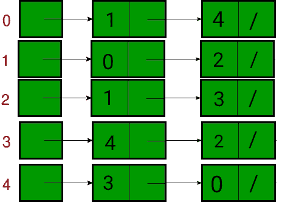

# 图

的邻接表和邻接矩阵表示之间的比较

> 原文： [https://www.geeksforgeeks.org/comparison-between-adjacency-list-and-adjacency-matrix-representation-of-graph/](https://www.geeksforgeeks.org/comparison-between-adjacency-list-and-adjacency-matrix-representation-of-graph/)

[图](https://www.geeksforgeeks.org/graph-data-structure-and-algorithms/)是由节点和边组成的非线性数据结构。 节点有时也称为顶点，边缘是连接图形中任意两个节点的线或圆弧。 在本文中，我们将了解图形表示方式之间的差异。

[图可以主要以两种方式表示](https://www.geeksforgeeks.org/graph-and-its-representations/)。 他们是：

1.  **邻接列表**：邻接列表是由所有[链接列表](https://www.geeksforgeeks.org/data-structures/linked-list/)的地址组成的数组。 链接列表的第一个节点表示顶点，连接到该节点的其余列表表示此节点连接到的顶点。 该表示也可以用于表示加权图。 可以稍微更改链表，甚至存储边缘的重量。
2.  **邻接矩阵**：邻接矩阵是大小为 V x V 的 [2D 数组](https://www.geeksforgeeks.org/multidimensional-arrays-in-java/)，其中 V 是图形中的顶点数。 假设 2D 数组为 adj [] []，则槽 adj [i] [j] = 1 表示从顶点 i 到顶点 j 有一条边。 无向图的邻接矩阵始终是对称的。 邻接矩阵也用于表示加权图。 如果 adj [i] [j] = w，则从顶点 i 到顶点 j 的权重为 w 的边。

让我们考虑一个图，以了解邻接表和邻接矩阵表示。 令无向图为：

下图在上述表示中表示为：

1.  **Adjacency Matrix:** In the adjacency matrix representation, a graph is represented in the form of a two-dimensional array. The size of the array is **V x V**, where V is the set of vertices. The following image represents the adjacency matrix representation:

    

2.  **Adjacency List:** In the adjacency list representation, a graph is represented as an array of linked list. The index of the array represents a vertex and each element in its linked list represents the  vertices that form an edge with the vertex. The following image represents the adjacency list representation:

    

下表描述了邻接矩阵和邻接表之间的区别：

表格{
表格布局：固定；
宽度：100％；
}
td {
宽度：25％；
}

<figure class="table">

| 运作方式 | 邻接矩阵 | 邻接表 |
| --- | --- | --- |
| 储存空间 | 此表示使用 VxV 矩阵，因此在最坏情况下所需的空间为 **O（&#124; V &#124; 2 ）**。 | 在这种表示形式中，对于每个顶点，我们存储其邻居。 在最坏的情况下，如果连接了图，则顶点需要 O（V），而存储每个顶点对应的邻居需要 O（E）。因此，整体空间复杂度为 O（&#124; V &#124; + &#124; E &#124;） 。 |
| 添加一个顶点 | 为了向 VxV 矩阵添加新的顶点，必须将存储增加到（&#124; V &#124; +1） 2 。 为此，我们需要复制整个矩阵。 因此，复杂度为 **O（&#124; V &#124; 2 ）**。 | 邻接表中有两个指针，第一个指向前节点，另一个指向后节点。因此，可以在 **O（1）时间直接插入顶点。** |
| 添加边缘 | 为了将从 i 到 j 的边长相加，矩阵[i] [j] = 1，这需要 **O（1）**时间。 | 与插入顶点类似，此处还使用了两个指针来指向列表的后面和前面。 因此，可以在 **O（1）**时间插入一条边。 |
| 移除顶点 | 为了从 V * V 矩阵中删除一个顶点，必须将存储减少到&#124; V &#124;。 [&#124; V &#124; +1）中的 2 2 。 为此，我们需要复制整个矩阵。 因此，复杂度为 **O（&#124; V &#124; 2 ）**。 | 为了删除顶点，我们需要搜索最坏情况下需要 O（&#124; V &#124;）时间的顶点，此后我们需要遍历边缘，最坏情况下需要 O（&#124; E &#124;）时间 因此，总时间复杂度为 **O（&#124; V &#124; + &#124; E &#124;）**。 |
| 去除边缘 | 要删除从 i 到 j 的边，矩阵[i] [j] = 0，这需要 **O（1）**时间。 | 要删除一条穿过边缘的边缘，最坏的情况是我们需要穿过所有边缘。因此，时间复杂度为 **O（&#124; E &#124;）**。 |
| 查询方式 | 为了找到现有的边缘，需要检查矩阵的内容。 给定两个顶点，可以在 **O（1）**时间检查 i 和 j matrix [i] [j]。 | 在邻接列表中，每个顶点都与相邻顶点的列表相关联。 对于给定的图形，为了检查边缘，我们需要检查与给定顶点相邻的顶点。 一个顶点最多可以有 O（&#124; V &#124;）个邻居，最糟糕的是，我们必须检查每个相邻的顶点。 因此，时间复杂度为 **O（&#124; V &#124;）**。 |

</figure>

* * *

* * *

如果您喜欢 GeeksforGeeks 并希望做出贡献，则还可以使用 [tribution.geeksforgeeks.org](https://contribute.geeksforgeeks.org/) 撰写文章，或将您的文章邮寄至 tribution@geeksforgeeks.org。 查看您的文章出现在 GeeksforGeeks 主页上，并帮助其他 Geeks。

如果您发现任何不正确的地方，请单击下面的“改进文章”按钮，以改进本文。