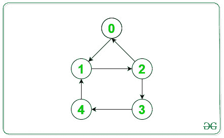
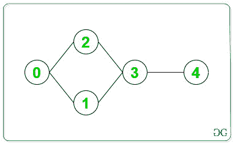

# 将无向连接图转换为强连接有向图

> 原文： [https://www.geeksforgeeks.org/convert-undirected-connected-graph-to-strongly-connected-directed-graph/](https://www.geeksforgeeks.org/convert-undirected-connected-graph-to-strongly-connected-directed-graph/)

给定`N`个顶点和`M`边的[无向图](https://www.geeksforgeeks.org/graph-data-structure-and-algorithms/)，任务是向给定的 M 边分配方向，以使图成为[强连通 组件](https://www.geeksforgeeks.org/strongly-connected-components/)。 如果图形无法转换为牢固连接的组件，则打印**“ -1”** 。
**范例**：

> **输入**：N = 5，Edges [] [] = {{0，1}，{0，2}，{1，2}，{1，4}，{2，3}，{ 3，4}}
> **输出**：
> 0- > 1
> 2- > 0
> 4- > 1
> 3- > 4
> 2- > 3
> 1- > 2
> **说明**：
> 下面是上述无向图的指定边：
> 
> 
> 
> **输入**：N = 5，Edges [] [] = {{0，1}，{0，2}，{1，3}，{2，3}，{3，4}} [
> **输出**：-1
> **说明**：
> 下图是上述信息的图表：
> 
> 
> 
> 由于上面未定向的图中存在桥。 因此，该图无法转换为 SCC。

**方法**：我们知道在任何有向图中，只要该图的所有顶点都是某个循环的一部分，就可以说它在**强连接组件（SCC）**中。 当且仅当[图中包含任何桥](https://www.geeksforgeeks.org/bridge-in-a-graph/)时，给定的无向图才构成 SCC。 步骤如下：

*   我们将使用数组 **mark []** 来存储 DFS 遍历期间的访问节点， **order []** 来存储访问节点的索引号，以及 **bridge_detect [] [** 以存储给定图中存在的任何桥。
*   从顶点`1`开始 [DFS 遍历](https://www.geeksforgeeks.org/depth-first-search-or-dfs-for-a-graph/)。
*   遍历当前节点的[邻接列表](https://www.geeksforgeeks.org/convert-adjacency-matrix-to-adjacency-list-representation-of-graph/)并执行以下操作：
    *   如果在调用 DFS 时再次遍历任何边，则忽略该边。
    *   如果子节点（**节点 u** ）的顺序大于父节点（**节点 v** ）的顺序，则忽略此当前边，就像 **Edges（v，u ）**已被处理。
    *   如果找到任何后边缘，则将当前父节点（**节点 v** ）的桥边缘更新为：

```
 bridge_detect[v] = min(order[u], bridge_detect[v]); 

```

*   否则，对当前子节点执行 DFS 遍历，然后对当前节点重复步骤 3。
*   在更新 DFS 调用当前节点之后，将网桥更新为：

```
bridge_detect[v] = min(bridge_detect[u], bridge_detect[v])

```

*   将当前的 **Edges（v，u）**对作为从节点 v 到节点 u 的有向边存储在对阵列中（例如 **arr [] []** ）。
*   如果给定图中存在任何桥接，则打印**“ -1”** 。
*   否则打印存储在 **arr [] []** 中的有向边。

下面是上述方法的实现：

## C++

```cpp

// C++ program for the above approach

#include <bits/stdc++.h>
using namespace std;

// To store the assigned Edges
vector<pair<int, int> > ans;

// Flag variable to check Bridges
int flag = 1;

// Function to implement DFS Traversal
int dfs(vector<int> adj[],
        int* order, int* bridge_detect,
        bool* mark, int v, int l)
{

    // Mark the current node as visited
    mark[v] = 1;

    // Update the order of node v
    order[v] = order[l] + 1;

    // Update the bridge_detect for node v
    bridge_detect[v] = order[v];

    // Traverse the adjacency list of
    // Node v
    for (int i = 0; i < adj[v].size(); i++) {
        int u = adj[v][i];

        // Ignores if same edge is traversed
        if (u == l) {
            continue;
        }

        // Ignores the edge u --> v as
        // v --> u is already processed
        if (order[v] < order[u]) {
            continue;
        }

        // Finds a back Edges, cycle present
        if (mark[u]) {

            // Update the bridge_detect[v]
            bridge_detect[v]
                = min(order[u],
                      bridge_detect[v]);
        }

        // Else DFS traversal for current
        // node in the adjacency list
        else {

            dfs(adj, order, bridge_detect,
                mark, u, v);
        }

        // Update the bridge_detect[v]
        bridge_detect[v]
            = min(bridge_detect[u],
                  bridge_detect[v]);

        // Store the current directed Edge
        ans.push_back(make_pair(v, u));
    }

    // Condition for Bridges
    if (bridge_detect[v] == order[v]
        && l != 0) {
        flag = 0;
    }

    // Return flag
    return flag;
}

// Function to print the direction
// of edges to make graph SCCs
void convert(vector<int> adj[], int n)
{

    // Arrays to store the visited,
    // bridge_detect and order of
    // Nodes
    int order[n] = { 0 };
    int bridge_detect[n] = { 0 };
    bool mark[n];

    // Intialise marks[] as false
    memset(mark, false, sizeof(mark));

    // DFS Traversal from vertex 1
    int flag = dfs(adj, order,
                   bridge_detect,
                   mark, 1, 0);

    // If flag is zero, then Bridge
    // is present in the graph
    if (flag == 0) {
        cout << "-1";
    }

    // Else print the direction of
    // Edges assigned
    else {
        for (auto& it : ans) {
            cout << it.first << "->"
                 << it.second << '\n';
        }
    }
}

// Function to create graph
void createGraph(int Edges[][2],
                 vector<int> adj[],
                 int M)
{

    // Traverse the Edges
    for (int i = 0; i < M; i++) {

        int u = Edges[i][0];
        int v = Edges[i][1];

        // Push the edges in an
        // adjacency list
        adj[u].push_back(v);
        adj[v].push_back(u);
    }
}

// Driver Code
int main()
{
    // N vertices and M Edges
    int N = 5, M = 6;
    int Edges[M][2]
        = { { 0, 1 }, { 0, 2 },
            { 1, 2 }, { 1, 4 },
            { 2, 3 }, { 3, 4 } };

    // To create Adjacency List
    vector<int> adj[N];

    // Create an undirected graph
    createGraph(Edges, adj, M);

    // Function Call
    convert(adj, N);
    return 0;
}

```

## Java

```java

// Java program for the above approach
import java.util.*;
import java.lang.*;

class GFG{

// To store the assigned Edges
static ArrayList<int[]> ans;

// Flag variable to check Bridges
static int flag = 1;

// Function to implement DFS Traversal
static int dfs(ArrayList<ArrayList<Integer>> adj,
               int[] order, int[] bridge_detect,
               boolean[] mark, int v, int l)
{

    // Mark the current node as visited
    mark[v] = true;

    // Update the order of node v
    order[v] = order[l] + 1;

    // Update the bridge_detect for node v
    bridge_detect[v] = order[v];

    // Traverse the adjacency list of
    // Node v
    for(int i = 0; i < adj.get(v).size(); i++)
    {
        int u = adj.get(v).get(i);

        // Ignores if same edge is traversed
        if (u == l)
        {
            continue;
        }

        // Ignores the edge u --> v as
        // v --> u is already processed
        if (order[v] < order[u])
        {
            continue;
        }

        // Finds a back Edges, cycle present
        if (mark[u]) 
        {

            // Update the bridge_detect[v]
            bridge_detect[v] = Math.min(order[u],
                                bridge_detect[v]);
        }

        // Else DFS traversal for current
        // node in the adjacency list
        else
        {
            dfs(adj, order, bridge_detect,
                mark, u, v);
        }

        // Update the bridge_detect[v]
        bridge_detect[v] = Math.min(bridge_detect[u],
                                    bridge_detect[v]);

        // Store the current directed Edge
        ans.add(new int[]{v, u});
    }

    // Condition for Bridges
    if (bridge_detect[v] == order[v] && l != 0)
    {
        flag = 0;
    }

    // Return flag
    return flag;
}

// Function to print the direction
// of edges to make graph SCCs
static void convert(ArrayList<ArrayList<Integer>> adj, 
                    int n)
{

    // Arrays to store the visited,
    // bridge_detect and order of
    // Nodes
    int[] order = new int[n];
    int[] bridge_detect = new int[n];
    boolean mark[] = new boolean[n];

    // DFS Traversal from vertex 1
    int flag = dfs(adj, order,
                   bridge_detect,
                   mark, 1, 0);

    // If flag is zero, then Bridge
    // is present in the graph
    if (flag == 0) 
    {
        System.out.print("-1");
    }

    // Else print the direction of
    // Edges assigned
    else
    {
        for(int[] it : ans)
        {
            System.out.println(it[0] + "->" + 
                               it[1]);
        }
    }
}

// Function to create graph
static void createGraph(int Edges[][],
                        ArrayList<ArrayList<Integer>> adj,
                        int M)
{

    // Traverse the Edges
    for(int i = 0; i < M; i++) 
    {
        int u = Edges[i][0];
        int v = Edges[i][1];

        // Push the edges in an
        // adjacency list
        adj.get(u).add(v);
        adj.get(v).add(u);
    }
}

// Driver code
public static void main(String[] args)
{

    // N vertices and M Edges
    int N = 5, M = 6;

    int Edges[][] = { { 0, 1 }, { 0, 2 },
                      { 1, 2 }, { 1, 4 },
                      { 2, 3 }, { 3, 4 } };

    // To create Adjacency List
    ArrayList<ArrayList<Integer>> adj = new ArrayList<>();
    ans = new ArrayList<>();

    for(int i = 0; i < N; i++)
        adj.add(new ArrayList<>());

    // Create an undirected graph
    createGraph(Edges, adj, M);

    // Function Call
    convert(adj, N);
}
}

// This code is contributed by offbeat

```

## Python

```py

# Python3 program for 
# the above approach

# To store the assigned 
# Edges
ans = []

# Flag variable to 
# check Bridges
flag = 1;

# Function to implement 
# DFS Traversal
def dfs(adj, order, 
        bridge_detect, 
        mark, v, l):

    global flag

    # Mark the current 
    # node as visited
    mark[v] = 1;

    # Update the order of 
    # node v
    order[v] = order[l] + 1;

    # Update the bridge_detect 
    # for node v
    bridge_detect[v] = order[v];

    # Traverse the adjacency list of
    # Node v
    for i in range(len(adj[v])):        
        u = adj[v][i];

        # Ignores if same edge 
        # is traversed
        if (u == l):
            continue;       

        # Ignores the edge u --> v as
        # v --> u is already processed
        if (order[v] < order[u]):
            continue;        

        # Finds a back Edges, 
        # cycle present
        if (mark[u]):

            # Update the bridge_detect[v]
            bridge_detect[v] = min(order[u],
                                  bridge_detect[v]);

        # Else DFS traversal for current
        # node in the adjacency list
        else:

            dfs(adj, order, 
                bridge_detect,
                mark, u, v);        

        # Update the bridge_detect[v]
        bridge_detect[v] = min(bridge_detect[u],
                              bridge_detect[v]);

        # Store the current 
        # directed Edge
        ans.append([v, u]);

    # Condition for Bridges
    if (bridge_detect[v] ==
        order[v] and l != 0):
        flag = 0;

    # Return flag
    return flag;

# Function to print the 
# direction of edges to 
# make graph SCCs
def convert(adj, n):

    # Arrays to store the visited,
    # bridge_detect and order of
    # Nodes
    order = [0 for i in range(n)]
    bridge_detect = [0 for i in range(n)]
    mark = [False for i in range(n)]

    # DFS Traversal from 
    # vertex 1
    flag = dfs(adj, order,
               bridge_detect,
               mark, 1, 0);

    # If flag is zero, then Bridge
    # is present in the graph
    if (flag == 0):
        print(-1)

    # Else print the direction 
    # of Edges assigned
    else:
        for it in ans:
            print("{} -> {}".format(it[0],
                                    it[1]))

# Function to create graph
def createGraph(Edges,adj, M):

    # Traverse the Edges
    for i in range(M):

        u = Edges[i][0];
        v = Edges[i][1];

        # Push the edges in an
        # adjacency list
        adj[u].append(v);
        adj[v].append(u);

# Driver code
if __name__ == "__main__":

    # N vertices and M Edges
    N = 5
    M = 6;
    Edges = [[0, 1], [0, 2],
            [1, 2], [1, 4],
            [2, 3], [3, 4]];

    # To create Adjacency List
    adj = [[] for i in range(N)]

    # Create an undirected graph
    createGraph(Edges, adj, M);

    # Function Call
    convert(adj, N);

# This code is contributed by rutvik_56

```

**Output:** 

```
0->1
2->0
4->1
3->4
2->3
1->2

```


* * *

* * *

如果您喜欢 GeeksforGeeks 并希望做出贡献，则还可以使用 [tribution.geeksforgeeks.org](https://contribute.geeksforgeeks.org/) 撰写文章，或将您的文章邮寄至 tribution@geeksforgeeks.org。 查看您的文章出现在 GeeksforGeeks 主页上，并帮助其他 Geeks。

如果您发现任何不正确的地方，请单击下面的“改进文章”按钮，以改进本文。