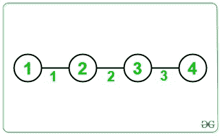
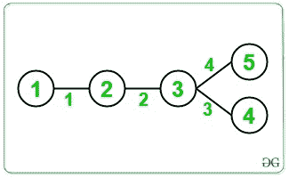
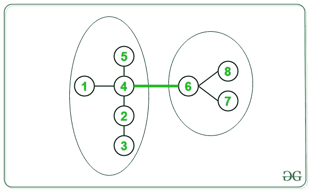

# 计算每个边在给定树的所有可能路径中出现的次数

> 原文：[https://www.geeksforgeeks.org/count-number-of-times-each-edge-appears-in-all-possible-paths-of-a-given-tree/](https://www.geeksforgeeks.org/count-number-of-times-each-edge-appears-in-all-possible-paths-of-a-given-tree/)

给定一个[**无向连通图**](https://www.geeksforgeeks.org/connected-components-in-an-undirected-graph/)，形式为[**树**](https://www.geeksforgeeks.org/binary-tree-data-structure/)，该树由`N`个**节点**和`N – 1`个边组成，每个边的任务是计算它在树中所有可能路径上出现的次数。

**示例**：

> **输入**：
> 
> 
> 
> **输出**：`3 4 3`
> 
> **说明**：给定树的所有路径为`{(1, 2), (1, 3), (1, 4), (2, 3), (2, 4), (3, 4)}`。
> 
> 边 1 出现在路径`{(1, 2), (1, 3), (1, 4)}`中。 因此，边的频率为 3。
> 
> 边 2 出现在路径`{(1, 3), (1, 4), (2, 3), (2, 4)}`中。 因此，边的频率为 4。
> 
> 边 3 出现在路径`{(1, 4), (2, 4), (3, 4)}`中。 因此，边的频率为 3。
> 
> **输入**：
> 
> 
> 
> **输出**：`4 6 4 4`
> 
> **说明**：
> 
> 边 1 出现在路径`{(1, 2), (1, 3), (1, 4), (1, 5)}`。 因此，边的频率为 4。
> 
> 边 2 出现在路径`{(1, 3), (1, 4), (1, 5), (2, 3), (2, 4), (2, 5)}`。 因此，边的频率为 6。
> 
> 边 3 出现在路径`{(1, 4), (2, 4), (3, 4), (4, 5)}`中。 因此，边的频率为 4。
> 
> 边 4 出现在路径`{(1, 5), (2, 5), (3, 5), (4, 5)}`中。 因此，边的频率为 4。

**朴素的方法**：最简单的方法是从给定图的每个节点生成所有可能的路径，并通过 [HashMap](http://www.geeksforgeeks.org/java-util-hashmap-in-java/) 存储在这些路径中出现的边数。 最后，打印每个边的频率。

**时间复杂度**：`O(N ^ 2)`

**辅助空间**：`O(n)`

**有效方法**：为了优化上述方法，需要进行以下观察：

> [](https://media.geeksforgeeks.org/wp-content/cdn-uploads/20200824055300/ApproachGraph.jpg)
> 
> **绿色边**将出现在**所有路径**中，这些路径将左侧子树的任何顶点连接到右侧子树的任何顶点。
> 因此，发生边的路径数等于两个子树中节点数的乘积`= 5 * 3 = 15`。

请按照以下步骤解决问题：

*   将树根在任意随机顶点处，例如 1。

*   在根目录下执行 [DFS](https://www.geeksforgeeks.org/depth-first-search-or-dfs-for-a-graph/)。 使用 DFS 计算连接到边的子树大小。

*   连接到子树的每个边的频率为`子树大小 * (N – 子树大小)`。

*   将上面为每个节点计算的值存储在[`HashMap`](http://www.geeksforgeeks.org/java-util-hashmap-in-java/)中。 最后，完成树的遍历后，遍历`HashMap`以打印结果。

下面是上述方法的实现：

## C++

```cpp

// C++ Program to implement
// the above approach
#include <bits/stdc++.h>
using namespace std;

// Number of nodes
int N;

// Structure of a Node
struct Node {
    int node;
    int edgeLabel;
};

// Adjacency List to
// represent the Tree
vector<Node> adj[100005];

// Stores the frequencies
// of every edge
vector<int> freq;

// Function to perform DFS
int dfs(int u = 1, int p = 1)
{
    // Add the current node to
    // size of subtree rooted at u
    int sz = 1;

    // Iterate over its childern
    for (auto a : adj[u]) {

        // Check if child is not parent
        if (a.node != p) {

            // Get the subtree size
            // for the child
            int val = dfs(a.node, u);

            // Set the frequency
            // of the current edge
            freq[a.edgeLabel]
                = val * (N - val);

            // Add the subtree size
            // to itself
            sz += val;
        }
    }

    // Return the subtree size
    return sz;
}

// Function to add edge between nodes
void addEdge(int u, int v, int label)
{
    adj[u].push_back({ v, label });
    adj[v].push_back({ u, label });
}

// Function to print the frequencies
// of each edge in all possible paths
void printFrequencies()
{

    // Stores the frequency
    // of all the edges
    freq = vector<int>(N);

    // Perform DFS
    dfs();

    for (int i = 1; i < N; i++) {
        cout << freq[i] << " ";
    }
}

// Driver Code
int main()
{
    N = 4;
    addEdge(1, 2, 1);
    addEdge(2, 3, 2);
    addEdge(3, 4, 3);

    printFrequencies();

    return 0;
}

```

## Java

```java

// Java Program to implement
// the above approach
import java.util.*;
class GFG{

// Number of nodes
static int N;

// Structure of a Node
static class Node 
{
    int node;
    int edgeLabel;
    public Node(int node, int edgeLabel) 
    {
        super();
        this.node = node;
        this.edgeLabel = edgeLabel;
    }
};

// Adjacency List to
// represent the Tree
static Vector<Node> []adj = new Vector[100005];

// Stores the frequencies
// of every edge
static int []freq;

// Function to perform DFS
static int dfs(int u , int p)
{  
    // Add the current node to
    // size of subtree rooted at u
    int sz = 1;

    // Iterate over its childern
    for (Node a : adj[u]) 
    {
        // Check if child is not parent
        if (a.node != p) 
        {
            // Get the subtree size
            // for the child
            int val = dfs(a.node, u);

            // Set the frequency
            // of the current edge
            freq[a.edgeLabel] = val * (N - val);

            // Add the subtree size
            // to itself
            sz += val;
        }
    }

    // Return the subtree size
    return sz;
}

// Function to add edge between nodes
static void addEdge(int u, int v, int label)
{
    adj[u].add(new Node( v, label ));
    adj[v].add(new Node( u, label));
}

// Function to print the frequencies
// of each edge in all possible paths
static void printFrequencies()
{

    // Stores the frequency
    // of all the edges
    freq = new int[N];

    // Perform DFS
    dfs(1, 1);

    for (int i = 1; i < N; i++) 
    {
        System.out.print(freq[i] + " ");
    }
}

// Driver Code
public static void main(String[] args)
{
    N = 4;
    for (int i = 0; i < adj.length; i++)
        adj[i] = new Vector<Node>();
    addEdge(1, 2, 1);
    addEdge(2, 3, 2);
    addEdge(3, 4, 3);

    printFrequencies();
}
}

// This code is contributed by shikhasingrajput

```

## Python3

```py

# Python3 program to implement
# the above approach

# Number of nodes
N = 4

# Structure of a Node
class Node:

    def __init__(self, v, label):

        self.node = v
        self.edgeLabel = label

# Adjacency list to 
# represent the Tree
adj = []
for i in range(100005):
    adj.append([])

# Stores the frequencies 
# of each edge
freq = [0] * N

# Function to perform DFS
def dfs(u = 1, p = 1):

    global N

    # Add the current node to 
    # size of subtree rooted at u
    sz = 1

    # Iterate over its childern
    for a in adj[u]:

        # Check if child is not parent
        if a.node != p:

            # Get the subtree size 
            # for the child 
            val = dfs(a.node, u)

            # Set the frequency 
            # of the current edge 
            freq[a.edgeLabel] = val * (N - val)

            # Add the subtree size 
            # to itself
            sz += val

    # Return the subtree size 
    return sz

# Function to add edge between nodes
def addEdge(u, v, label):

    adj[u].append(Node(v, label))
    adj[v].append(Node(u, label))

# Function to print the frequencies 
# of each edge in all possible paths 
def printFrequencies():

    # Stores the frequency 
    # of all the edges
    global N

    # Perform DFS
    dfs()

    for i in range(1, N):
        print(freq[i], end = " ")

# Driver code
N = 4
addEdge(1, 2, 1)
addEdge(2, 3, 2)
addEdge(3, 4, 3)

printFrequencies()

# This code is contributed by Stuti Pathak

```

## C#

```cs

// C# Program to implement
// the above approach
using System;
using System.Collections.Generic;
class GFG{

// Number of nodes
static int N;

// Structure of a Node
public class Node 
{
  public int node;
  public int edgeLabel;
  public Node(int node, 
              int edgeLabel) 
  {
    this.node = node;
    this.edgeLabel = edgeLabel;
  }
};

// Adjacency List to
// represent the Tree
static List<Node> []adj = 
       new List<Node>[100005];

// Stores the frequencies
// of every edge
static int []freq;

// Function to perform DFS
static int dfs(int u, int p)
{  
    // Add the current node to
    // size of subtree rooted at u
    int sz = 1;

    // Iterate over its childern
    foreach (Node a in adj[u]) 
    {
        // Check if child is not parent
        if (a.node != p) 
        {
            // Get the subtree size
            // for the child
            int val = dfs(a.node, u);

            // Set the frequency
            // of the current edge
            freq[a.edgeLabel] = val * (N - val);

            // Add the subtree size
            // to itself
            sz += val;
        }
    }

    // Return the subtree size
    return sz;
}

// Function to add edge between nodes
static void addEdge(int u, int v, 
                    int label)
{
  adj[u].Add(new Node(v, label));
  adj[v].Add(new Node(u, label));
}

// Function to print the frequencies
// of each edge in all possible paths
static void printFrequencies()
{
  // Stores the frequency
  // of all the edges
  freq = new int[N];

  // Perform DFS
  dfs(1, 1);

  for (int i = 1; i < N; i++) 
  {
    Console.Write(freq[i] + " ");
  }
}

// Driver Code
public static void Main(String[] args)
{
  N = 4;
  for (int i = 0; i < adj.Length; i++)
    adj[i] = new List<Node>();
  addEdge(1, 2, 1);
  addEdge(2, 3, 2);
  addEdge(3, 4, 3);
  printFrequencies();
}
}

// This code is contributed by gauravrajput1

```

**输出**： 

```
3 4 3

```

**时间复杂度**：`O(n)`

**辅助空间**：`O(n)`


* * *

* * *


