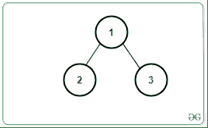
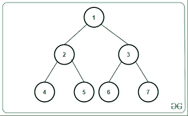

# 在一棵二叉树中对具有完全`K`个不同节点的根到叶路径进行计数

> 原文：[https://www.geeksforgeeks.org/count-root-to-leaf-paths-having-exactly-k-distinct-nodes-in-a-binary-tree/](https://www.geeksforgeeks.org/count-root-to-leaf-paths-having-exactly-k-distinct-nodes-in-a-binary-tree/)

给定一个[二叉树](https://www.geeksforgeeks.org/binary-tree-data-structure/)，该树由`N`个节点组成，以 **1** 为根，整数`K`和数组`arr[]`，由分配给每个节点的值组成，任务是计算给定二叉树中具有`K`个不同节点的根到叶子的路径的[数量](https://www.geeksforgeeks.org/given-a-binary-tree-print-all-root-to-leaf-paths/)。

**示例**：

> **输入**：`N = 3, Edges[][] = {{1, 2}, {1, 3}}, arr[] = {3, 3, 2}, K = 2`，下面是 给定的树：
> 
> 
> 
> **输出**：1
>
> **说明**：
>
> 仅存在 1 个不同的路径，即路径`1 -> 3`包含 2 个不同的节点。
>
> 因此，答案是 1。
> 
> **输入**：`N = 7, Edges[][] = {{1, 2}, {1, 3}, {2, 4}, {2, 5}, {3, 6}, { 3, 7}}, arr[] = {2, 2, 2, 2, 3, 5, 2}, K = 1`，以下是给定的树：
> 
> 
> 
> **输出**：2
>
> **说明**：
>
> 仅存在 2 个不同的路径，其中包含 1 个不同的节点：
>
> 1）路径`1 -> 2 -> 4`，
>
> 2）路径`1 -> 3 -> 7`。
>
> 因此，答案是 2。

**朴素的方法**：最简单的方法是[生成从根到叶节点](https://www.geeksforgeeks.org/given-a-binary-tree-print-all-root-to-leaf-paths/)的所有可能路径，并针对每个路径检查其是否包含 **K** 个不同的节点或 不。 最后，打印此类路径的计数。

**时间复杂度**：`O(N * H ^ 2)`，其中`H`表示树的高度。

**辅助空间**：`O(n)`；

**高效方法**：的想法是使用[前置遍历](https://www.geeksforgeeks.org/tree-traversals-inorder-preorder-and-postorder/)和[映射](http://www.geeksforgeeks.org/map-associative-containers-the-c-standard-template-library-stl/)来计算从根到当前节点的路径中的不同节点。 请按照以下步骤解决问题：

*   初始化变量`distinct_nodes`为 **0**，以存储从根到当前节点的不同节点的计数，而将`ans`初始化为 0，以将总的不同根存储到 具有`K`个不同节点的叶路径。

*   在给定的二叉树中执行[前置遍历](http://www.geeksforgeeks.org/tree-traversals-inorder-preorder-and-postorder/)，并将从根到当前节点的不同节点的计数存储在映射`M`中。

*   每当节点首次出现在路径上时，将不同节点的数量增加 **1**。

*   如果路径上不同节点的数量大于`K`，则返回当前节点的父节点。

*   否则，继续访问当前节点的子节点，使当前节点值的频率增加 **1**。

*   在上述步骤中，如果从根到叶的路径上不同节点的计数正好等于`K`，则将`ans`递增 **1**。

*   完成上述步骤后，将`ans`的值打印为结果计数。

下面是上述方法的实现：

## C++

```cpp

// C++ program for the above approach
#include <bits/stdc++.h>
using namespace std;

// Structure of a Tree Node
struct Node {
    int key;
    Node *left, *right;
};

// Function to create new tree node
Node* newNode(int key)
{
    Node* temp = new Node;
    temp->key = key;
    temp->left = temp->right = NULL;
    return temp;
}

// Function to count all root to leaf
// paths having K distinct nodes
void findkDistinctNodePaths(
    Node* root, unordered_map<int, int> freq,
    int distinct_nodes, int k, int& ans)
{
    // If current node is null
    if (root == NULL)
        return;

    // Update count of distinct nodes
    if (freq[root->key] == 0)
        distinct_nodes++;

    // If count > k then return to
    // the parent node
    if (distinct_nodes > k)
        return;

    // Update frequency of current node
    freq[root->key]++;

    // Go to the left subtree
    findkDistinctNodePaths(root->left,
                           freq,
                           distinct_nodes,
                           k, ans);

    // Go to the right subtree
    findkDistinctNodePaths(root->right,
                           freq,
                           distinct_nodes,
                           k, ans);

    // If current node is leaf node
    if (root->left == NULL
        && root->right == NULL) {

        // If count of distinct node
        // is same as K, increment ans
        if (distinct_nodes == k)
            ans++;
    }
}

// Function to find count of root to
// leaf paths having K distinct node
void printkDistinctNodePaths(Node* root,
                             int k)
{
    // Initialize unordered map
    unordered_map<int, int> freq;

    // Stores count of distinct node
    int distinct_nodes = 0;

    // Stores total count of nodes
    int ans = 0;

    // Perform Preorder Traversal
    findkDistinctNodePaths(root, freq,
                           distinct_nodes,
                           k, ans);

    // Print the final count
    cout << ans;
}

// Driver Code
int main()
{
    /*         2
             /   \
            /     \
           1       3
          / \     /  \
         /   \   /    \
        4     2 -5     3
    */

    // Given Binary Tree
    Node* root = newNode(2);
    root->left = newNode(1);
    root->right = newNode(3);
    root->left->left = newNode(4);
    root->left->right = newNode(2);
    root->right->left = newNode(-5);
    root->right->right = newNode(3);

    // Given K
    int K = 2;

    // Function Call
    printkDistinctNodePaths(root, K);

    return 0;
}

```

## Java

```java

// Java program for the 
// above approach
import java.util.*;
class GFG{

// Structure of a 
// Tree Node
static class Node 
{
  int key;
  Node left, right;
};

static int ans;

// Function to create 
// new tree node
static Node newNode(int key)
{
  Node temp = new Node();
  temp.key = key;
  temp.left = temp.right = null;
  return temp;
}

// Function to count all root 
// to leaf paths having K 
// distinct nodes
static void findkDistinctNodePaths(Node root, 
                                   HashMap<Integer,
                                           Integer> freq, 
                                   int distinct_nodes, 
                                   int k)
{
  // If current node is null
  if (root == null)
    return;

  // Update count of distinct nodes
  if (!freq.containsKey(root.key))
    distinct_nodes++;

  // If count > k then return 
  // to the parent node
  if (distinct_nodes > k)
    return;

  // Update frequency of 
  // current node
  if(freq.containsKey(root.key))
  {
    freq.put(root.key, 
    freq.get(root.key) + 1);
  }
  else
  {
    freq.put(root.key, 1);
  }

  // Go to the left subtree
  findkDistinctNodePaths(root.left, freq,
                         distinct_nodes, k);

  // Go to the right subtree
  findkDistinctNodePaths(root.right, freq,
                         distinct_nodes, k);

  // If current node is 
  // leaf node
  if (root.left == null && 
      root.right == null) 
  {
    // If count of distinct node
    // is same as K, increment ans
    if (distinct_nodes == k)
      ans++;
  }
}

// Function to find count of root to
// leaf paths having K distinct node
static void printkDistinctNodePaths(Node root, 
                                    int k)
{
  // Initialize unordered map
  HashMap<Integer,
          Integer> freq = new HashMap<>();

  // Stores count of 
  // distinct node
  int distinct_nodes = 0;

  // Stores total 
  // count of nodes
  ans = 0;

  // Perform Preorder Traversal
  findkDistinctNodePaths(root, freq,
                         distinct_nodes, k);

  // Print the final count
  System.out.print(ans);
}

// Driver Code
public static void main(String[] args)
{
  /*           2
             /   \
            /     \
           1       3
          / \     /  \
         /   \   /    \
        4     2 -5     3
    */

  // Given Binary Tree
  Node root = newNode(2);
  root.left = newNode(1);
  root.right = newNode(3);
  root.left.left = newNode(4);
  root.left.right = newNode(2);
  root.right.left = newNode(-5);
  root.right.right = newNode(3);

  // Given K
  int K = 2;

  // Function Call
  printkDistinctNodePaths(root, K);
}
}

// This code is contributed by gauravrajput1

```

**输出**： 

```
2

```

**时间复杂度**：`O(n)`

**辅助空间**：`O(n)`


* * *

* * *


