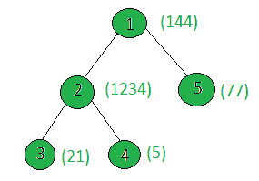

# 计算给定树中权重数字总和为奇数的节点

> 原文： [https://www.geeksforgeeks.org/count-the-nodes-in-the-given-tree-whose-sum-of-digits-of-weight-is-odd/](https://www.geeksforgeeks.org/count-the-nodes-in-the-given-tree-whose-sum-of-digits-of-weight-is-odd/)

给定一棵树，以及所有节点的权重，任务是计算权重之和为奇数的节点的数量。

**示例**：

> **输入**：
> 
> **输出**：3
> 节点 1：digitSum（144）= 1 + 4 + 4 = 9
> 节点 2： digitSum（1234）= 1 + 2 + 3 + 4 = 10
> 节点 3：digitSum（21）= 2 + 1 = 3
> 节点 4：digitSum（5）= 5
> 节点 5：digitSum（ 77）= 7 + 7 = 14
> 只有节点 1、3 和 4 的权重的数字总和是奇数。

**方法**：在树上执行 [dfs](http://www.geeksforgeeks.org/depth-first-traversal-for-a-graph/) ，对于每个节点，检查其权重的数字总和是否为奇数。 如果是，则增加计数。

下面是上述方法的实现：

## C++

```cpp

// C++ implementation of the approach 
#include <bits/stdc++.h> 
using namespace std; 

int ans = 0; 

vector<int> graph[100]; 
vector<int> weight(100); 

// Function to return the 
// sum of the digits of n 
int digitSum(int n) 
{ 
    int sum = 0; 
    while (n) { 
        sum += n % 10; 
        n = n / 10; 
    } 
    return sum; 
} 

// Function to perform dfs 
void dfs(int node, int parent) 
{ 
    // If sum of the digits of current node's 
    // weight is odd then increment ans 
    int sum = digitSum(weight[node]); 
    if (sum % 2 == 1) 
        ans += 1; 

    for (int to : graph[node]) { 
        if (to == parent) 
            continue; 
        dfs(to, node); 
    } 
} 

// Driver code 
int main() 
{ 

    // Weights of the node 
    weight[1] = 144; 
    weight[2] = 1234; 
    weight[3] = 21; 
    weight[4] = 5; 
    weight[5] = 77; 

    // Edges of the tree 
    graph[1].push_back(2); 
    graph[2].push_back(3); 
    graph[2].push_back(4); 
    graph[1].push_back(5); 

    dfs(1, 1); 

    cout << ans; 

    return 0; 
} 

```

## Java

```java

// Java implementation of the approach 
import java.util.*; 

class GFG  
{ 
    static int ans = 0; 

    static Vector<Integer>[] graph = new Vector[100]; 
    static Integer[] weight = new Integer[100]; 

    // Function to return the 
    // sum of the digits of n 
    static int digitSum(int n)  
    { 
        int sum = 0; 
        while (n > 0)  
        { 
            sum += n % 10; 
            n = n / 10; 
        } 
        return sum; 
    } 

    // Function to perform dfs 
    static void dfs(int node, int parent) 
    { 

        // If sum of the digits of current node's 
        // weight is odd then increment ans 
        int sum = digitSum(weight[node]); 
        if (sum % 2 == 1) 
            ans += 1; 

        for (int to : graph[node]) 
        { 
            if (to == parent) 
                continue; 
            dfs(to, node); 
        } 
    } 

    // Driver code 
    public static void main(String[] args) 
    { 
        for (int i = 0; i < 100; i++) 
            graph[i] = new Vector<Integer>(); 

        // Weights of the node 
        weight[1] = 144; 
        weight[2] = 1234; 
        weight[3] = 21; 
        weight[4] = 5; 
        weight[5] = 77; 

        // Edges of the tree 
        graph[1].add(2); 
        graph[2].add(3); 
        graph[2].add(4); 
        graph[1].add(5); 

        dfs(1, 1); 

        System.out.print(ans); 
    } 
} 

// This code is contributed by Rajput-Ji 

```

## Python3

```

# Python3 implementation of the approach  
ans = 0

graph = [[] for i in range(100)] 
weight = [0] * 100

# Function to return the  
# sum of the digits of n  
def digitSum(n): 
    sum = 0
    while (n): 
        sum += n % 10
        n = n // 10
    return sum

# Function to perform dfs  
def dfs(node, parent): 
    global ans 

    # If sum of the digits of current node's  
    # weight is odd then increment ans  
    sum = digitSum(weight[node])  
    if (sum % 2 == 1): 
        ans += 1

    for to in graph[node]: 
        if (to == parent): 
            continue
        dfs(to, node) 

# Driver code  

# Weights of the node  
weight[1] = 144
weight[2] = 1234
weight[3] = 21
weight[4] = 5
weight[5] = 77

# Edges of the tree  
graph[1].append(2) 
graph[2].append(3) 
graph[2].append(4) 
graph[1].append(5) 

dfs(1, 1) 
print(ans) 

# This code is contributed by SHUBHAMSINGH10 

```

## C#

```cs

// C# implementation of the approach 
using System; 
using System.Collections.Generic; 

class GFG  
{ 
    static int ans = 0; 

    static List<int>[] graph = new List<int>[100]; 
    static int[] weight = new int[100]; 

    // Function to return the 
    // sum of the digits of n 
    static int digitSum(int n)  
    { 
        int sum = 0; 
        while (n > 0)  
        { 
            sum += n % 10; 
            n = n / 10; 
        } 
        return sum; 
    } 

    // Function to perform dfs 
    static void dfs(int node, int parent) 
    { 

        // If sum of the digits of current node's 
        // weight is odd then increment ans 
        int sum = digitSum(weight[node]); 
        if (sum % 2 == 1) 
            ans += 1; 

        foreach (int to in graph[node]) 
        { 
            if (to == parent) 
                continue; 
            dfs(to, node); 
        } 
    } 

    // Driver code 
    public static void Main(String[] args) 
    { 
        for (int i = 0; i < 100; i++) 
            graph[i] = new List<int>(); 

        // Weights of the node 
        weight[1] = 144; 
        weight[2] = 1234; 
        weight[3] = 21; 
        weight[4] = 5; 
        weight[5] = 77; 

        // Edges of the tree 
        graph[1].Add(2); 
        graph[2].Add(3); 
        graph[2].Add(4); 
        graph[1].Add(5); 

        dfs(1, 1); 

        Console.Write(ans); 
    } 
} 

// This code is contributed by PrinciRaj1992 

```

**Output:**

```
3

```

**<u>复杂度分析：</u>**

*   **时间复杂度**：O（N）。
    在 DFS 中，树的每个节点都处理一次，因此对于树中的 N 个节点，由于 dfs 而导致的复杂度为 O（N）。 因此，时间复杂度为 O（N）。
*   **辅助空间**：O（1）。
    不需要任何额外的空间，因此空间复杂度是恒定的。


* * *

* * *

如果您喜欢 GeeksforGeeks 并希望做出贡献，则还可以使用 [tribution.geeksforgeeks.org](https://contribute.geeksforgeeks.org/) 撰写文章，或将您的文章邮寄至 tribution@geeksforgeeks.org。 查看您的文章出现在 GeeksforGeeks 主页上，并帮助其他 Geeks。

如果您发现任何不正确的地方，请单击下面的“改进文章”按钮，以改进本文。