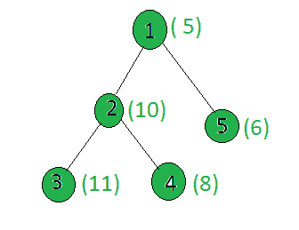

# 计算给定树中权重为 2 的幂的节点

> 原文： [https://www.geeksforgeeks.org/count-the-nodes-in-the-given-tree-whose-weight-is-a-power-of-two/](https://www.geeksforgeeks.org/count-the-nodes-in-the-given-tree-whose-weight-is-a-power-of-two/)

给定一棵树，以及所有节点的权重，任务是计算权重为 2 的幂的节点数。

**示例：**

> **输入：**
> 
> **输出：** 1
> 只有节点 4 的权重是 2 的幂。

**方法：**在树上执行 [dfs](http://www.geeksforgeeks.org/depth-first-traversal-for-a-graph/) ，对于每个节点，检查其权重是否为 2 的幂，如果是，则增加计数。

下面是上述方法的实现：

## C ++

```

// C++ implementation of the approach 
#include <bits/stdc++.h> 
using namespace std; 

int ans = 0; 

vector<int> graph[100]; 
vector<int> weight(100); 

// Function to perform dfs 
void dfs(int node, int parent) 
{ 
    // If weight of the current node 
    // is a power of 2 
    int x = weight[node]; 
    if (x && (!(x & (x - 1)))) 
        ans += 1; 

    for (int to : graph[node]) { 
        if (to == parent) 
            continue; 
        dfs(to, node); 
    } 
} 

// Driver code 
int main() 
{ 

    // Weights of the node 
    weight[1] = 5; 
    weight[2] = 10; 
    weight[3] = 11; 
    weight[4] = 8; 
    weight[5] = 6; 

    // Edges of the tree 
    graph[1].push_back(2); 
    graph[2].push_back(3); 
    graph[2].push_back(4); 
    graph[1].push_back(5); 

    dfs(1, 1); 

    cout << ans; 

    return 0; 
} 

```