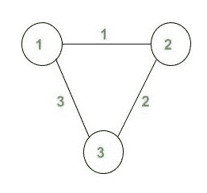
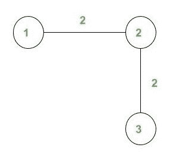
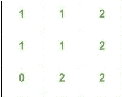

# 计算长度为 N 的步行次数，其中每次步行的费用等于给定的次数

> 原文： [https://www.geeksforgeeks.org/count-the-number-of-walks-of-length-n-where-cost-of-each-walk-is-equal-to-a-given-number/](https://www.geeksforgeeks.org/count-the-number-of-walks-of-length-n-where-cost-of-each-walk-is-equal-to-a-given-number/)

给定一个加权的无向图，步长 N 和 CostX。任务是计算长度 N 的不同步长 W 的数量，以使 **Cost（W）= X** 。
我们将步行的成本 W 定义为步行沿边缘的权重中的最大值。
节点从 1 到 n 编号。 该图不包含任何多个边或自环。

**示例**：

> **输入**：
> 
> 
> 
> 。
> N = 4，X = 2
> **输出**：10
> **说明**：。
> 图上的步 W 是一系列顶点（重复）。 （允许的顶点和边数），这样序列中的每个相邻顶点对都是图的边。
> 对于 X = 2，下面列出了所有可能的 10 个步行：
> 
> 1.  1 -> 2 -> 1 -> 2 -> 3
> 2.  1 -> 2 -> 3 -> 2 -> 1
> 3.  1 -> 2 -> 3 -> 2 -> 3
> 4.  2 -> 1 -> 2 -> 3 -> 2
> 5.  2 -> 3 -> 2 -> 1 -> 2
> 6.  2 -> 3 -> 2 -> 3 -> 2
> 7.  3 -> 2 -> 1 -> 2 -> 1
> 8.  3 -> 2 -> 1 -> 2 -> 3
> 9.  3 -> 2 -> 3 -> 2 -> 1
> 10.  3 -> 2 -> 3 -> 2 -> 3
> 
> **输入**：
> 
> 
> 
> N = 4，X = 2
> **输出**：12

*   这个想法是要预先计算编号。 将所有可能成本的每个顶点的长度为 N 的步长存储在 2-D 矩阵中，我们将此矩阵称为 B.这些值可以通过在给定的无向图上运行 DFS 来计算。
    例如，



矩阵 B 的给定快照显示了存储在其中的值。 这里 B（i，j）表示不。 从顶点 i 开始的长度为 N 的步数具有步长 j 的代价。

*   我们维护一维数组 **Maxedge** ，其中我们将长度为 N 的步行成本保持不变。当步行长度小于 N 且有一些成本 X 与 edge（ u，v）。
    我们为 **length == N** 设置了一个基本条件，为此我们更新了数组`B`并返回了调用。
*   在计算矩阵 B 之后，我们只需将所有具有**成本= x** 的顶点的步数相加即可简单地计算步数。

> Ans + = B [i] [x];
> 这里，i 的范围是 1 到 n，其中 n 是顶点数。

下面是上述方法的实现

## C++

```cpp

// C++ program to count the number of walks
// of length N where cost of each walk is
// equal to k
#include <bits/stdc++.h>
using namespace std;
int G[250][250] = {0};
int Maxedge[250] = {0};
int B[250][250] = {0};
int l = 0, n, m;

// Function return total 
// walk of length N
int TotalWalks(int cost)
{
     int ans=0;

    // Add values of all 
    // node with cost X
     for(int i=1;i<=n;i++)
     {
        ans+=B[i][cost];
     }

     return ans;
}

// Function to precompute array B
// meantioned above
void DFS(int u, int v,int len)
{
    // Base condition
    if (l == len)              
    {
        // Updating the matrix B when 
        // we get a walk of length N.
        B[u][ Maxedge[len]]++; 
        return ;
    }
    for (int i = 1; i <= n; i++)
    {
        if (G[v][i] !=0)
        {
            // Incrementing the length 
            // of the walk
            l++;

            // Updating the cost of the walk
            Maxedge[l] = max(Maxedge[l - 1], 
                             G[v][i]); 
            DFS(u, i, len);
            l--;
        }
    }
}

// Function to calculate total
// number of walks of length N
void NumberOfWalks(int cost,int len)
{
    for (int i = 1; i <= n; i++)
    {
        // Calling the function DFS
        DFS(i, i, len);  
    }

    int ans = TotalWalks(cost);

    // Print the answer
    cout<< ans << endl;
}

// Driver code
int main()
{
    int Cost = 2;
    n = 3, m = 3;
    int length = 4;

    // Create a graph given in
    // the above diagram 
    G[1][2] = 1;
    G[2][1] = 1;
    G[2][3] = 2;
    G[3][2] = 2;
    G[1][3] = 3;
    G[3][1] = 3;

    NumberOfWalks(Cost, length) ;
}

```

## Java

```java

// Java program to count the number of walks
// of length N where cost of each walk is
// equal to k
import java.util.*;

class GFG{

static int [][]G = new int[250][250];
static int []Maxedge = new int[250];
static int [][]B = new int[250][250];
static int l = 0, n, m;

// Function return total 
// walk of length N
static int TotalWalks(int cost)
{
    int ans = 0;

    // Add values of all 
    // node with cost X
    for(int i = 1; i <= n; i++)
    {
        ans += B[i][cost];
    }

    return ans;
}

// Function to precompute array B
// meantioned above
static void DFS(int u, int v, int len)
{
    // Base condition
    if (l == len)             
    {

        // Updating the matrix B when 
        // we get a walk of length N.
        B[u][ Maxedge[len]]++; 
        return;
    }

    for (int i = 1; i <= n; i++)
    {
        if (G[v][i] !=0)
        {

            // Incrementing the length 
            // of the walk
            l++;

            // Updating the cost of the walk
            Maxedge[l] = Math.max(Maxedge[l - 1], 
                                        G[v][i]); 
            DFS(u, i, len);
            l--;
        }
    }
}

// Function to calculate total
// number of walks of length N
static void NumberOfWalks(int cost,int len)
{
    for(int i = 1; i <= n; i++)
    {

       // Calling the function DFS
       DFS(i, i, len); 
    }

    int ans = TotalWalks(cost);

    // Print the answer
    System.out.print(ans + "\n");
}

// Driver code
public static void main(String[] args)
{
    int Cost = 2;
    n = 3; m = 3;
    int length = 4;

    // Create a graph given in
    // the above diagram 
    G[1][2] = 1;
    G[2][1] = 1;
    G[2][3] = 2;
    G[3][2] = 2;
    G[1][3] = 3;
    G[3][1] = 3;

    NumberOfWalks(Cost, length);
}
}

// This code is contributed by 29AjayKumar

```

## Python

```py

# Python3 program to count the number of walks
# of length N where cost of each walk is
# equal to k
G = [[0 for i in range(250)] 
        for j in range(250)]
Maxedge = [0 for i in range(250)]
B = [[0 for i in range(250)] 
        for j in range(250)]
l = 0
n = 0
m = 0

# Function return total 
# walk of length N
def TotalWalks(cost):

    ans = 0

    # Add values of all 
    # node with cost X
    for i in range(1, n + 1):
        ans += B[i][cost]

    return ans

# Function to precompute array B
# meantioned above
def DFS(u, v, len):

    global l

    # Base condition
    if (l == len):

        # Updating the matrix B when 
        # we get a walk of length N.
        B[u][ Maxedge[len]] += 1
        return

    for i in range(1, n + 1):
        if (G[v][i] != 0):

            # Incrementing the length 
            # of the walk
            l += 1

            # Updating the cost of the walk
            Maxedge[l] = max(Maxedge[l - 1], G[v][i])
            DFS(u, i, len)
            l -= 1

# Function to calculate total
# number of walks of length N
def NumberOfWalks(cost, len):

    for i in range(1, n + 1):

        # Calling the function DFS
        DFS(i, i, len)  

    ans = TotalWalks(cost)

    # Print the answer
    print(ans)

# Driver code
if __name__=='__main__':

    Cost = 2
    n = 3
    m = 3
    length = 4

    # Create a graph given in
    # the above diagram 
    G[1][2] = 1
    G[2][1] = 1
    G[2][3] = 2
    G[3][2] = 2
    G[1][3] = 3
    G[3][1] = 3

    NumberOfWalks(Cost, length)

# This code is contributed by rutvik_56

```

## C#

```cs

// C# program to count the number of walks
// of length N where cost of each walk is
// equal to k
using System;

class GFG{

static int [,]G = new int[250, 250];
static int []Maxedge = new int[250];
static int [,]B = new int[250, 250];
static int l = 0, n;

// Function return total 
// walk of length N
static int TotalWalks(int cost)
{
    int ans = 0;

    // Add values of all 
    // node with cost X
    for(int i = 1; i <= n; i++)
    {
       ans += B[i, cost];
    }
    return ans;
}

// Function to precompute array B
// meantioned above
static void DFS(int u, int v, int len)
{

    // Base condition
    if (l == len)             
    {

        // Updating the matrix B when 
        // we get a walk of length N.
        B[u, Maxedge[len]]++; 
        return;
    }

    for(int i = 1; i <= n; i++)
    {
       if (G[v, i] != 0)
       {

           // Incrementing the length 
           // of the walk
           l++;

           // Updating the cost of the walk
           Maxedge[l] = Math.Max(Maxedge[l - 1], 
                                       G[v, i]); 
           DFS(u, i, len);
           l--;
       }
    }
}

// Function to calculate total
// number of walks of length N
static void NumberOfWalks(int cost, int len)
{
    for(int i = 1; i <= n; i++)
    {

       // Calling the function DFS
       DFS(i, i, len); 
    }

    int ans = TotalWalks(cost);

    // Print the answer
    Console.Write(ans + "\n");
}

// Driver code
public static void Main(String[] args)
{
    int Cost = 2;
    n = 3;
    int length = 4;

    // Create a graph given in
    // the above diagram 
    G[1, 2] = 1;
    G[2, 1] = 1;
    G[2, 3] = 2;
    G[3, 2] = 2;
    G[1, 3] = 3;
    G[3, 1] = 3;

    NumberOfWalks(Cost, length);
}
}

// This code is contributed by gauravrajput1

```

**Output:** 

```
10

```


* * *

* * *

如果您喜欢 GeeksforGeeks 并希望做出贡献，则还可以使用 [tribution.geeksforgeeks.org](https://contribute.geeksforgeeks.org/) 撰写文章，或将您的文章邮寄至 tribution@geeksforgeeks.org。 查看您的文章出现在 GeeksforGeeks 主页上，并帮助其他 Geeks。

如果您发现任何不正确的地方，请单击下面的“改进文章”按钮，以改进本文。