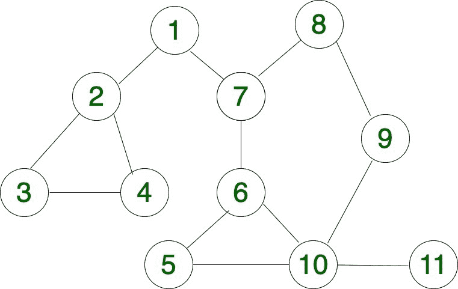

# 计算在无向图

中从源到达目的地的总计方式

> 原文： [https://www.geeksforgeeks.org/count-total-ways-to-reach-destination-from-source-in-an-undirected-graph/](https://www.geeksforgeeks.org/count-total-ways-to-reach-destination-from-source-in-an-undirected-graph/)

给定 **[无向图](https://www.geeksforgeeks.org/graph-and-its-representations/)** ，源顶点**'s'**和目标顶点**'d'**，任务就是 **计算从给定**的**到**'d'**的总路径**。

**范例**

> **输入**：s = 1，d = 4
> 
> **输出**：2
> **说明**：
> 下面是 2 条路径，从 1 到 4
> 1-> 3-> 4
> 1-> 2-> 3-> 4
> 
> **输入**：s = 3，d = 9
> 
> **输出**：6
> **说明**：
> 下面是 从 3 到 9 的 6 条路径
> 3-> 2-> 1-> 7-> 6-> 5-> 10-> 9
> 3- > 2-> 1-> 7-> 6-> 10-> 9
> 3-> 2-> 1-> 7-> 8-> 9
> 3-> 4-> 2-> 1-> 7-> 6-> 5-> 10-> 9
> 3-> 4-> 2-> 1-> 7-> 6-> 10-> 9
> 3-> 4 -> 2-> 1-> 7-> 8-> 9

**方法**：

的想法是对给定无向图进行[深度优先遍历](https://www.geeksforgeeks.org/depth-first-search-or-dfs-for-a-graph/)。

*   从源开始遍历。

*   继续将访问的顶点存储在一个名为“ visited []”的数组中。

*   如果到达目标顶点，则将计数加 1。

*   重要的是将访问[]中的当前顶点标记为已访问，以使遍历不会循环进行。

下面是上述方法的实现：

## C++

```cpp

// C++ program to count total number of 
// ways to reach destination in a graph 
#include <iostream> 
using namespace std; 

// Utility Function to count total ways 
int countWays(int mtrx[][11], int vrtx, 
              int i, int dest, bool visited[]) 
{ 
    // Base condition 
    // When reach to the destination 
    if (i == dest) { 

        return 1; 
    } 
    int total = 0; 
    for (int j = 0; j < vrtx; j++) { 
        if (mtrx[i][j] == 1 && !visited[j]) { 

            // Make vertex visited 
            visited[j] = true; 

            // Recursive function, for count ways 
            total += countWays(mtrx, vrtx, 
                               j, dest, visited); 

            // Backtracking 
            // Make vertex unvisited 
            visited[j] = false; 
        } 
    } 

    // Return total ways 
    return total; 
} 

// Function to count total ways 
// to reach destination 
int totalWays(int mtrx[][11], int vrtx, 
              int src, int dest) 
{ 
    bool visited[vrtx]; 

    // Loop to make all vertex unvisited, 
    // Initially 
    for (int i = 0; i < vrtx; i++) { 
        visited[i] = false; 
    } 

    // Make source visited 
    visited[src] = true; 

    return countWays(mtrx, vrtx, src, dest, 
                     visited); 
} 

int main() 
{ 
    int vrtx = 11; 
    int mtrx[11][11] = { 
        { 0, 1, 0, 0, 0, 0, 1, 0, 0, 0, 0 }, 
        { 1, 0, 1, 1, 0, 0, 0, 0, 0, 0, 0 }, 
        { 0, 1, 0, 1, 0, 0, 0, 0, 0, 0, 0 }, 
        { 0, 1, 1, 0, 0, 0, 0, 0, 0, 0, 0 }, 
        { 0, 0, 0, 0, 0, 1, 0, 0, 0, 1, 0 }, 
        { 0, 0, 0, 0, 1, 0, 1, 0, 0, 1, 0 }, 
        { 1, 0, 0, 0, 0, 1, 0, 1, 0, 0, 0 }, 
        { 0, 0, 0, 0, 0, 0, 1, 0, 1, 0, 0 }, 
        { 0, 0, 0, 0, 0, 0, 0, 1, 0, 1, 0 }, 
        { 0, 0, 0, 0, 1, 1, 0, 0, 1, 0, 0 }, 
        { 0, 0, 0, 0, 0, 0, 0, 0, 0, 1, 0 } 
    }; 

    int src = 3; 
    int dest = 9; 

    // Print total ways 
    cout << totalWays(mtrx, vrtx, src - 1, 
                      dest - 1); 

    return 0; 
} 

```