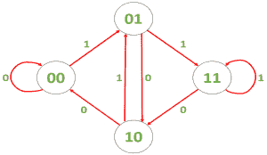

# De Bruijn 序列| 设置 1

> 原文： [https://www.geeksforgeeks.org/de-bruijn-sequence-set-1/](https://www.geeksforgeeks.org/de-bruijn-sequence-set-1/)

给定一个整数 *n* 和一组字符 *A* ，大小为 *k* ，找到一个字符串 *S* ，这样 A 上每个可能的字符串 长度 *n* 恰好在 *S* 中作为子串出现一次。 这样的字符串称为 [de Bruijn 序列](https://en.wikipedia.org/wiki/De_Bruijn_sequence)。

**示例**：

> **输入**：n = 3，k = 2，A = {0，1）
> **输出**：0011101000
> 所有可能的长度为三的字符串（000、001、010） ，011、100、101、110 和 111）作为 A 中的子字符串出现一次。
> 
> **输入**：n = 2，k = 2，A = {0，1）
> **输出**：01100

**方法**：
我们可以通过构造具有 k 个 <sup>n-1</sup> 个节点的有向图，每个结点具有 k 个输出边缘来解决此问题。 每个节点对应一个大小为 n-1 的字符串。 每个边都对应于 A 中的 k 个字符之一，并将该字符添加到起始字符串中。
例如，如果 n = 3 和 k = 2，则我们构建以下图：



*   节点“ 01”通过边“ 1”连接到节点“ 11”，因为在“ 01”上添加“ 1”（并删除第一个字符）得到了“ 11”。
*   我们可以观察到该图中的每个节点的入度和出度均相等，这意味着该图中存在[欧拉回路](https://www.geeksforgeeks.org/eulerian-path-and-circuit/)。
*   欧拉回路将对应于 de Bruijn 序列，因为节点和输出边的每种组合都代表长度为 n 的唯一字符串。
*   de Bruijn 序列将按开始点的顺序包含起始节点的字符和所有边的字符。
*   因此，字符串的长度将为 k <sup>n</sup> + n-1。 我们将使用 [Hierholzer 的算法](https://www.geeksforgeeks.org/hierholzers-algorithm-directed-graph/)查找欧拉回路。 该方法的时间复杂度是 O（k <sup>n</sup> ）。

下面是上述方法的实现：

## C ++

```

// C++ implementation of 
// the above approach 
#include <bits/stdc++.h> 
using namespace std; 

unordered_set<string> seen; 
vector<int> edges; 

// Modified DFS in which no edge 
// is traversed twice 
void dfs(string node, int& k, string& A) 
{ 
    for (int i = 0; i < k; ++i) { 
        string str = node + A[i]; 
        if (seen.find(str) == seen.end()) { 
            seen.insert(str); 
            dfs(str.substr(1), k, A); 
            edges.push_back(i); 
        } 
    } 
} 

// Function to find a de Bruijn sequence 
// of order n on k characters 
string deBruijn(int n, int k, string A) 
{ 

    // Clearing global variables 
    seen.clear(); 
    edges.clear(); 

    string startingNode = string(n - 1, A[0]); 
    dfs(startingNode, k, A); 

    string S; 

    // Number of edges 
    int l = pow(k, n); 
    for (int i = 0; i < l; ++i) 
        S += A[edges[i]]; 
    S += startingNode; 

    return S; 
} 

// Driver code 
int main() 
{ 
    int n = 3, k = 2; 
    string A = "01"; 

    cout << deBruijn(n, k, A); 

    return 0; 
} 

```