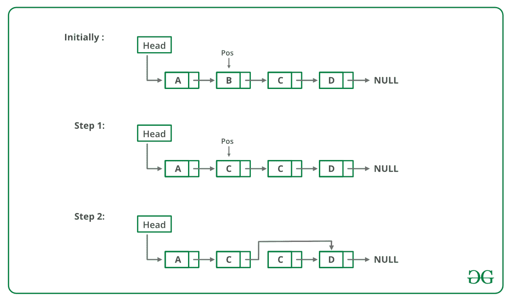

# 从链接列表中删除没有头指针的节点

您将获得一个单链表和一个指针，该列表和指针指向需要删除的节点。 没有提供有关头指针或任何其他节点的任何信息。 您需要编写一个函数以从链接列表中删除该节点。 您的函数将仅使用一个参数：指向要删除的节点的指针。

示例：
链接列表的构建方式为：


```
Defination of each node is as follows: 
struct Node {
    int data;
    struct Node* next;
};

Input : C (a pointer to C)
Output : A-->B-->D-->E-->F

Input : A (a pointer to A)
Output : B-->D-->E-->F

```

如果给出了头指针，那么从单链列表中将是一个简单的删除问题，因为要进行删除，您必须知道前一个节点，并且可以通过从头指针进行遍历轻松地到达那里。 如果不知道需要删除的节点的先前节点，则常规删除是不可能的。

这里的技巧是我们可以将下一个节点的数据复制到要删除的当前节点的数据字段中。 然后，我们可以向前迈出一步。 现在，我们的下一个节点已成为当前节点，而当前的节点已成为前一个节点。 现在，我们可以通过常规删除方法轻松删除当前节点。

例如，假设我们需要删除C并给出一个指向C的指针。 如果我们有一个指向B的指针，我们可以很容易地删除C。 但是在这里，我们将D的数据字段复制到C的数据字段。然后，我们将继续前进。 现在我们在D处，并且有一个指向C的指针，即前一个指针。 因此，我们将删除D。这就是删除节点C的方式。

下图是上述方法的模拟：



下面是上述方法的实现：

```

// C++ program to delete a node 
#include <bits/stdc++.h> 
using namespace std; 

/* Link list node */
struct Node { 
    int data; 
    struct Node* next; 
}; 

// Fucntion to delete the node without head 
void deleteNodeWithoutHead(struct Node* pos) 
{ 
    if (pos == NULL) // If linked list is empty 
        return; 
    else { 

        if (pos->next == NULL) { 
            printf("This is last node, require head, can't be freed\n"); 
            return; 
        } 

        struct Node* temp = pos->next; 

        // Copy data of the next node to current node 
        pos->data = pos->next->data; 

        // Perform conventional deletion 
        pos->next = pos->next->next; 

        free(temp); 
    } 
} 

// Function to print the linked list 
void print(Node* head) 
{ 
    Node* temp = head; 
    while (temp) { 
        cout << temp->data << " -> "; 
        temp = temp->next; 
    } 

    cout << "NULL"; 
} 

void push(struct Node** head_ref, int new_data) 
{ 
    /* allocate node */
    struct Node* new_node = new Node(); 

    /* put in the data */
    new_node->data = new_data; 

    /* link the old list off the new node */
    new_node->next = (*head_ref); 

    /* move the head to point to the new node */
    (*head_ref) = new_node; 
} 

// Driver Code 
int main() 
{ 
    /* Start with the empty list */
    struct Node* head = NULL; 

    // create linked 35->15->4->20 
    push(&head, 20); 
    push(&head, 4); 
    push(&head, 15); 
    push(&head, 35); 
    cout << "Initial Linked List: \n"; 
    print(head); 
    cout << endl 
         << endl; 

    // Delete 15 without sending head 
    Node* del = head->next; 
    deleteNodeWithoutHead(del); 

    // Print the final linked list 
    cout << "Final Linked List after deletion of 15:\n"; 
    print(head); 

    return 0; 

    // This code has been contributed by Striver 
} 

```

**Output:**

```
Initial Linked List: 
35 -> 15 -> 4 -> 20 -> NULL

Final Linked List after deletion of 15:
35 -> 4 -> 20 -> NULL

```

本文由 [Jeet Jain](https://www.linkedin.com/in/jeetjain8/) 提供。 请参阅[在单链列表中仅给出指向要删除的节点的指针，如何删除它？](https://www.geeksforgeeks.org/in-a-linked-list-given-only-a-pointer-to-a-node-to-be-deleted-in-a-singly-linked-list-how-do-you-delete-it/) 了解更多详细信息并完成实施。

注意读者！ 现在不要停止学习。 通过 [**DSA自学课程**](https://practice.geeksforgeeks.org/courses/dsa-self-paced?utm_source=geeksforgeeks&utm_medium=article&utm_campaign=gfg_article_dsa_content_bottom) 以对学生方便的价格掌握所有重要的DSA概念，并为行业做好准备。

* * *

* * *

如果您喜欢GeeksforGeeks并希望做出贡献，则还可以使用 [tribution.geeksforgeeks.org](https://contribute.geeksforgeeks.org/) 撰写文章，或将您的文章邮寄至tribution@geeksforgeeks.org。 查看您的文章出现在GeeksforGeeks主页上，并帮助其他Geeks。

如果您发现任何不正确的地方，请单击下面的“改进文章”按钮，以改进本文。