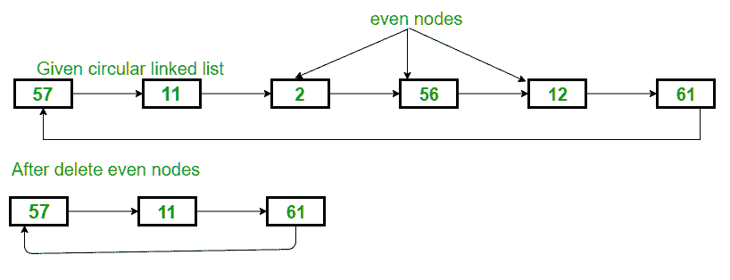

# 删除循环链接列表

的所有偶数节点

给定一个包含N个节点的循环单链接列表，任务是从列表中删除所有偶数节点。


**示例：**

```
Input : 57->11->2->56->12->61 
Output : List after deletion : 57 -> 11 -> 61 

Input : 9->11->32->6->13->20
Output : List after deletion : 9 -> 11 -> 13 

```

这个想法是一个遍历循环单链表的节点，并获得具有偶数数据的节点的指针。 遵循中的[中使用的方法删除那些节点。](https://www.geeksforgeeks.org/deletion-circular-linked-list/)

以下是上述想法的实现：

## C ++

*filter_none*

*编辑*
*关闭*

*play_arrow*

*链接*
*亮度_4*
*代码*

| `// CPP program to delete all even``// node from a Circular singly linked list``#include <bits/stdc++.h>``using` `namespace` `std;``// Structure for a node``struct` `Node {` `int` `data;` `struct` `Node* next;``};``// Function to insert a node at the beginning``// of a Circular linked list``void` `push(` `struct` `Node** head_ref,` `int` `data)``{` `struct` `Node* ptr1 = (` `struct` `Node*)` `malloc` `(` `sizeof` `(` `struct` `Node));` `struct` `Node* temp = *head_ref;` `ptr1->data = data;` `ptr1->next = *head_ref;` `// If linked list is not NULL then` `// set the next of last node`​​ `if` `(*head_ref != NULL) {` [HT G272] `while` `(temp->next != *head_ref)` `temp = temp->next;` `temp->next = ptr1;` `}` `else` `ptr1->next = ptr1;` `// For the first node` `*head_ref = ptr1;``}``// Delete the node if it is even``void` `deleteNode(Node* head_ref, Node* del)``{` `struct` `Node* temp = head_ref;` `// If node to be deleted is head node` `if` `(head_ref == del)` `head_ref = del->next;` `// traverse list till not found` `// delete node` ] `while` `(temp->next != del) {` `temp = temp->next;` `}` [ `// copy address of node` [HT G324] `temp->next = del->next;` `// Finally, free the memory occupied by del` `free` `(del);` `return` `;``}``// Function to delete all even nodes``// from the singly circular  linked list``void` `deleteEvenNodes(Node* head)``{` `struct` `Node* ptr = head;` `struct` `Node* next;` `// traverse list till the end` `// if the node is even then delete it` `do` `{` `// if node is even` `if` `(ptr->data % 2 == 0)` `deleteNode(head, ptr);` [ `// point to next node` `next = ptr->next;` `ptr = next;` `}` `while` `(ptr != head);``}``// Function to print nodes``void` `printList(` `struct` `Node* head)``{` `struct` `Node* temp = head;` `if` `(head != NULL) {` `do` `{` `printf` `(` `"%d "` `, temp->data);` `temp = temp->next;` `}` `while` `(temp != head);` `}``}`]`// Driver code``int` `main()``{` `// Initialize lists as empty` `struct` `Node* head = NULL;` [ `// Created linked list will be 57->11->2->56->12->61` G420] `push(&head, 12);` `push(&head, 56);` `push(&head, 2);` `push(&head, 11);` `push(&head, 57);` `cout <<` `"\nList after deletion : "` `;` `deleteEvenNodes(head);`] `printList(head);` `return` `0;``}` |

*chevron_right**filter_none*