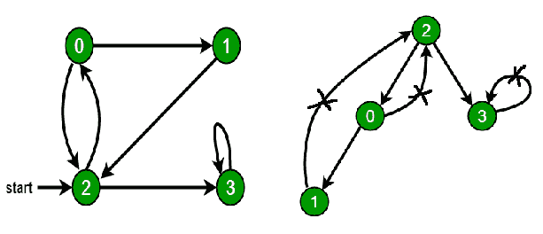
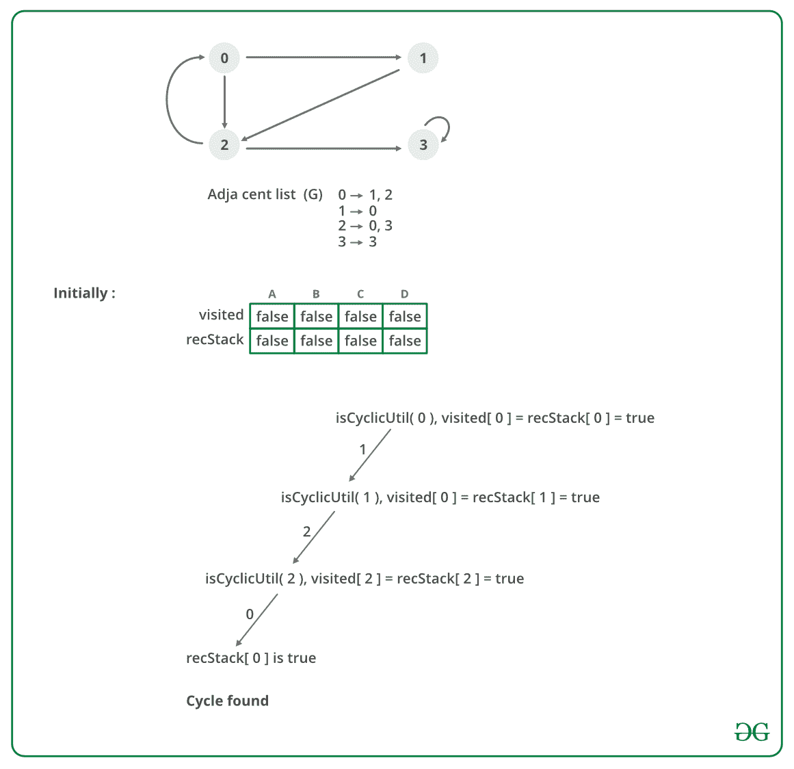

# 有向图

中的检测周期

> 原文： [https://www.geeksforgeeks.org/detect-cycle-in-a-graph/](https://www.geeksforgeeks.org/detect-cycle-in-a-graph/)

给定有向图，请检查该图是否包含循环。 如果给定图包含至少一个循环，则函数应返回 true，否则返回 false。

**示例，**

```
Input: n = 4, e = 6
0 -> 1, 0 -> 2, 1 -> 2, 2 -> 0, 2 -> 3, 3 -> 3
Output: Yes
Explanation:
Diagram:

The diagram clearly shows a cycle 0 -> 2 -> 0

Input:n = 4, e = 3
0 -> 1, 0 -> 2, 1 -> 2, 2 -> 3
Output:No
Explanation:
Diagram:

The diagram clearly shows no cycle

```

**<u>使用[深度优先搜索或 DFS 的解决方案](https://www.geeksforgeeks.org/depth-first-search-or-dfs-for-a-graph/)</u>**

*   **Approach:** Depth First Traversal can be used to detect a cycle in a Graph. DFS for a connected graph produces a tree. There is a cycle in a graph only if there is a [back edge](http://en.wikipedia.org/wiki/Depth-first_search#Output_of_a_depth-first_search) present in the graph. A back edge is an edge that is from a node to itself (self-loop) or one of its ancestors in the tree produced by DFS. In the following graph, there are 3 back edges, marked with a cross sign. We can observe that these 3 back edges indicate 3 cycles present in the graph.

    

    对于断开连接的图，获取 DFS 林作为输出。 要检测循环，请通过检查后边在单个树中检查循环。

    要检测后边，请跟踪 DFS 遍历函数的递归堆栈中当前的顶点。 如果到达了递归堆栈中已经存在的顶点，则树中将存在一个循环。 将当前顶点连接到递归堆栈中的顶点的边是后边。 使用 **recStack []** 数组跟踪递归堆栈中的顶点。

    **以上方法的空运行**：

    

*   **算法**：

    1.  使用给定数量的边和顶点创建图形。

    2.  创建一个递归函数，以初始化当前索引或顶点，已访问和递归堆栈。

    3.  将当前节点标记为已访问，并在递归堆栈中标记索引。

    4.  查找所有未访问且与当前节点相邻的顶点。 递归调用这些顶点的函数，如果递归函数返回 true，则返回 true。

    5.  如果在递归堆栈中已经标记了相邻的顶点，则返回 true。

    6.  创建一个包装器类，该包装器为所有顶点调用递归函数，如果有任何函数返回 true，则返回 true。 否则，如果函数对于所有顶点都返回 false，则返回 false。

*   **Implementation:**

    ## C++

    ```

    // A C++ Program to detect cycle in a graph 
    #include<bits/stdc++.h> 

    using namespace std; 

    class Graph 
    { 
        int V;    // No. of vertices 
        list<int> *adj;    // Pointer to an array containing adjacency lists 
        bool isCyclicUtil(int v, bool visited[], bool *rs);  // used by isCyclic() 
    public: 
        Graph(int V);   // Constructor 
        void addEdge(int v, int w);   // to add an edge to graph 
        bool isCyclic();    // returns true if there is a cycle in this graph 
    }; 

    Graph::Graph(int V) 
    { 
        this->V = V; 
        adj = new list<int>[V]; 
    } 

    void Graph::addEdge(int v, int w) 
    { 
        adj[v].push_back(w); // Add w to v’s list. 
    } 

    // This function is a variation of DFSUtil() in https://www.geeksforgeeks.org/archives/18212 
    bool Graph::isCyclicUtil(int v, bool visited[], bool *recStack) 
    { 
        if(visited[v] == false) 
        { 
            // Mark the current node as visited and part of recursion stack 
            visited[v] = true; 
            recStack[v] = true; 

            // Recur for all the vertices adjacent to this vertex 
            list<int>::iterator i; 
            for(i = adj[v].begin(); i != adj[v].end(); ++i) 
            { 
                if ( !visited[*i] && isCyclicUtil(*i, visited, recStack) ) 
                    return true; 
                else if (recStack[*i]) 
                    return true; 
            } 

        } 
        recStack[v] = false;  // remove the vertex from recursion stack 
        return false; 
    } 

    // Returns true if the graph contains a cycle, else false. 
    // This function is a variation of DFS() in https://www.geeksforgeeks.org/archives/18212 
    bool Graph::isCyclic() 
    { 
        // Mark all the vertices as not visited and not part of recursion 
        // stack 
        bool *visited = new bool[V]; 
        bool *recStack = new bool[V]; 
        for(int i = 0; i < V; i++) 
        { 
            visited[i] = false; 
            recStack[i] = false; 
        } 

        // Call the recursive helper function to detect cycle in different 
        // DFS trees 
        for(int i = 0; i < V; i++) 
            if (isCyclicUtil(i, visited, recStack)) 
                return true; 

        return false; 
    } 

    int main() 
    { 
        // Create a graph given in the above diagram 
        Graph g(4); 
        g.addEdge(0, 1); 
        g.addEdge(0, 2); 
        g.addEdge(1, 2); 
        g.addEdge(2, 0); 
        g.addEdge(2, 3); 
        g.addEdge(3, 3); 

        if(g.isCyclic()) 
            cout << "Graph contains cycle"; 
        else
            cout << "Graph doesn't contain cycle"; 
        return 0; 
    } 

    ```

    ## 爪哇

    ```

    // A Java Program to detect cycle in a graph 
    import java.util.ArrayList; 
    import java.util.LinkedList; 
    import java.util.List; 

    class Graph { 

        private final int V; 
        private final List<List<Integer>> adj; 

        public Graph(int V)  
        { 
            this.V = V; 
            adj = new ArrayList<>(V); 

            for (int i = 0; i < V; i++) 
                adj.add(new LinkedList<>()); 
        } 

        // This function is a variation of DFSUtil() in  
        // https://www.geeksforgeeks.org/archives/18212 
        private boolean isCyclicUtil(int i, boolean[] visited, 
                                          boolean[] recStack)  
        { 

            // Mark the current node as visited and 
            // part of recursion stack 
            if (recStack[i]) 
                return true; 

            if (visited[i]) 
                return false; 

            visited[i] = true; 

            recStack[i] = true; 
            List<Integer> children = adj.get(i); 

            for (Integer c: children) 
                if (isCyclicUtil(c, visited, recStack)) 
                    return true; 

            recStack[i] = false; 

            return false; 
        } 

        private void addEdge(int source, int dest) { 
            adj.get(source).add(dest); 
        } 

        // Returns true if the graph contains a  
        // cycle, else false. 
        // This function is a variation of DFS() in  
        // https://www.geeksforgeeks.org/archives/18212 
        private boolean isCyclic()  
        { 

            // Mark all the vertices as not visited and 
            // not part of recursion stack 
            boolean[] visited = new boolean[V]; 
            boolean[] recStack = new boolean[V]; 

            // Call the recursive helper function to 
            // detect cycle in different DFS trees 
            for (int i = 0; i < V; i++) 
                if (isCyclicUtil(i, visited, recStack)) 
                    return true; 

            return false; 
        } 

        // Driver code 
        public static void main(String[] args) 
        { 
            Graph graph = new Graph(4); 
            graph.addEdge(0, 1); 
            graph.addEdge(0, 2); 
            graph.addEdge(1, 2); 
            graph.addEdge(2, 0); 
            graph.addEdge(2, 3); 
            graph.addEdge(3, 3); 

            if(graph.isCyclic()) 
                System.out.println("Graph contains cycle"); 
            else
                System.out.println("Graph doesn't "
                                        + "contain cycle"); 
        } 
    } 

    // This code is contributed by Sagar Shah. 

    ```

    ## 蟒蛇

    ```

    # Python program to detect cycle  
    # in a graph 

    from collections import defaultdict 

    class Graph(): 
        def __init__(self,vertices): 
            self.graph = defaultdict(list) 
            self.V = vertices 

        def addEdge(self,u,v): 
            self.graph[u].append(v) 

        def isCyclicUtil(self, v, visited, recStack): 

            # Mark current node as visited and  
            # adds to recursion stack 
            visited[v] = True
            recStack[v] = True

            # Recur for all neighbours 
            # if any neighbour is visited and in  
            # recStack then graph is cyclic 
            for neighbour in self.graph[v]: 
                if visited[neighbour] == False: 
                    if self.isCyclicUtil(neighbour, visited, recStack) == True: 
                        return True
                elif recStack[neighbour] == True: 
                    return True

            # The node needs to be poped from  
            # recursion stack before function ends 
            recStack[v] = False
            return False

        # Returns true if graph is cyclic else false 
        def isCyclic(self): 
            visited = [False] * self.V 
            recStack = [False] * self.V 
            for node in range(self.V): 
                if visited[node] == False: 
                    if self.isCyclicUtil(node,visited,recStack) == True: 
                        return True
            return False

    g = Graph(4) 
    g.addEdge(0, 1) 
    g.addEdge(0, 2) 
    g.addEdge(1, 2) 
    g.addEdge(2, 0) 
    g.addEdge(2, 3) 
    g.addEdge(3, 3) 
    if g.isCyclic() == 1: 
        print "Graph has a cycle"
    else: 
        print "Graph has no cycle"

    # Thanks to Divyanshu Mehta for contributing this code 

    ```

    ## C＃

    ```

    // A C# Program to detect cycle in a graph  
    using System; 
    using System.Collections.Generic; 

    public class Graph {  

        private readonly int V;  
        private readonly List<List<int>> adj;  

        public Graph(int V)  
        {  
            this.V = V;  
            adj = new List<List<int>>(V);  

            for (int i = 0; i < V; i++)  
                adj.Add(new List<int>());  
        }  

        // This function is a variation of DFSUtil() in  
        // https://www.geeksforgeeks.org/archives/18212  
        private bool isCyclicUtil(int i, bool[] visited,  
                                        bool[] recStack)  
        {  

            // Mark the current node as visited and  
            // part of recursion stack  
            if (recStack[i])  
                return true;  

            if (visited[i])  
                return false;  

            visited[i] = true;  

            recStack[i] = true;  
            List<int> children = adj[i];  

            foreach (int c in children)  
                if (isCyclicUtil(c, visited, recStack))  
                    return true;  

            recStack[i] = false;  

            return false;  
        }  

        private void addEdge(int sou, int dest) {  
            adj[sou].Add(dest);  
        }  

        // Returns true if the graph contains a  
        // cycle, else false.  
        // This function is a variation of DFS() in  
        // https://www.geeksforgeeks.org/archives/18212  
        private bool isCyclic()  
        {  

            // Mark all the vertices as not visited and  
            // not part of recursion stack  
            bool[] visited = new bool[V];  
            bool[] recStack = new bool[V];  

            // Call the recursive helper function to  
            // detect cycle in different DFS trees  
            for (int i = 0; i < V; i++)  
                if (isCyclicUtil(i, visited, recStack))  
                    return true;  

            return false;  
        }  

        // Driver code  
        public static void Main(String[] args)  
        {  
            Graph graph = new Graph(4);  
            graph.addEdge(0, 1);  
            graph.addEdge(0, 2);  
            graph.addEdge(1, 2);  
            graph.addEdge(2, 0);  
            graph.addEdge(2, 3);  
            graph.addEdge(3, 3);  

            if(graph.isCyclic())  
                Console.WriteLine("Graph contains cycle");  
            else
                Console.WriteLine("Graph doesn't "
                                        + "contain cycle");  
        }  
    }  

    // This code contributed by Rajput-Ji 

    ```

    **Output:**

    ```
    Graph contains cycle

    ```

*   **Complexity Analysis:**

    *   **时间复杂度**：`O(V + E)`。 此方法的

        时间复杂度与 [DFS 遍历](https://www.geeksforgeeks.org/archives/18212)的时间复杂度相同，即`O(V + E)`。

    *   **空间复杂度**：`O(V)`。

        要存储访问和递归堆栈，需要`O(V)`空间。

在下面的文章中，讨论了另一种`O(V + E)`方法：

[使用颜色](https://www.geeksforgeeks.org/detect-cycle-direct-graph-using-colors/)在直接图中检测周期

如果发现任何不正确的地方，或者想分享有关上述主题的更多信息，请写评论。

