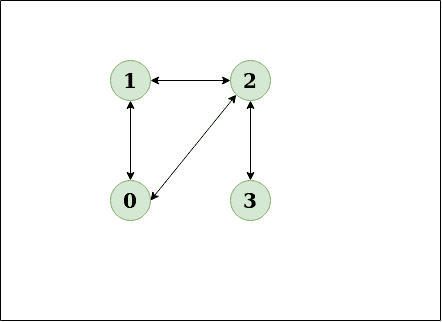
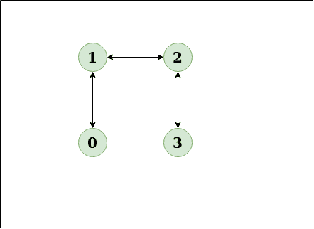
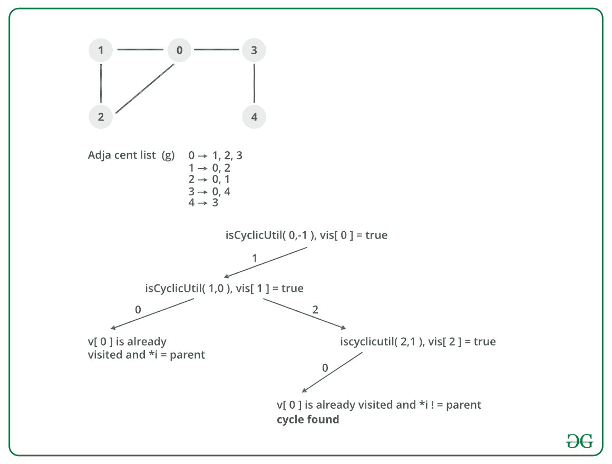

# 在无向图

中检测周期

> 原文： [https://www.geeksforgeeks.org/detect-cycle-undirected-graph/](https://www.geeksforgeeks.org/detect-cycle-undirected-graph/)

给定无向图，如何检查图中是否存在循环？

**例如**

> **输入**：n = 4，e = 4
> **输出**：是
> **说明**：
> 0 1，1 2，2 3， 0 2
> 图：
> 
> 
> 
> 该图清楚地显示了从 0 到 2 到 1 到 0 的循环
> **输入**：n = 4，e = 3
> 0 1，1 2，2 3
> **输出**：否
> **说明**：
> 示意图：
> 
> 
> 
> 该图清楚地表明没有周期

**有关循环检测的文章**：

*   [有向图](https://www.geeksforgeeks.org/detect-cycle-in-a-graph/)的循环检测。

*   [联合查找算法，用于无向图中的循环检测。](https://www.geeksforgeeks.org/union-find/)

**方法**：从每个未访问的节点运行 DFS。 [深度优先遍历](https://www.geeksforgeeks.org/depth-first-search-or-dfs-for-a-graph/)可用于检测图形中的循环。 连接图的 DFS 生成一棵树。 仅在图形中存在后边的情况下，图形中才会存在一个循环。 后边是将节点连接到其自身（自循环）或 DFS 生成的树中其祖先之一的边。

要找到其任何祖先的后边，请保留一个访问数组，如果有任何访问节点的后边，则存在一个循环并返回 true。

**算法**：

1.  使用给定数量的边和顶点创建图形。

2.  创建一个递归函数，该函数将当前索引或顶点进行访问和递归堆栈。

3.  将当前节点标记为已访问，并在递归堆栈中标记索引。

4.  查找所有未访问且与当前节点相邻的顶点。 递归调用这些顶点的函数，如果递归函数返回 true，则返回 true。

5.  如果在递归堆栈中已经标记了相邻的顶点，则返回 true。

6.  创建一个包装器类，该包装器为所有顶点调用递归函数，如果有任何函数返回 true，则返回 true。

7.  否则，如果函数对于所有顶点都返回 false，则返回 false。

**空试**：



**实施**：

## C++

```cpp

// A C++ Program to detect  
// cycle in an undirected graph 
#include<iostream> 
#include <list> 
#include <limits.h> 
using namespace std; 

// Class for an undirected graph 
class Graph 
{ 

    // No. of vertices 
    int V;    

    // Pointer to an array  
    // containing adjacency lists 
    list<int> *adj;   
    bool isCyclicUtil(int v, bool visited[],  
                              int parent); 
public: 

    // Constructor 
    Graph(int V);    

    // To add an edge to graph 
    void addEdge(int v, int w);  

    // Returns true if there is a cycle 
    bool isCyclic();   
}; 

Graph::Graph(int V) 
{ 
    this->V = V; 
    adj = new list<int>[V]; 
} 

void Graph::addEdge(int v, int w) 
{ 

    // Add w to v’s list. 
    adj[v].push_back(w);  

    // Add v to w’s list. 
    adj[w].push_back(v); 
} 

// A recursive function that  
// uses visited[] and parent to detect 
// cycle in subgraph reachable  
// from vertex v. 
bool Graph::isCyclicUtil(int v,  
                bool visited[], int parent) 
{ 

    // Mark the current node as visited 
    visited[v] = true; 

    // Recur for all the vertices  
    // adjacent to this vertex 
    list<int>::iterator i; 
    for (i = adj[v].begin(); i != 
                       adj[v].end(); ++i) 
    { 

        // If an adjacent is not visited,  
        //then recur for that adjacent 
        if (!visited[*i]) 
        { 
           if (isCyclicUtil(*i, visited, v)) 
              return true; 
        } 

        // If an adjacent is visited and  
        // not parent of current vertex, 
        // then there is a cycle. 
        else if (*i != parent) 
           return true; 
    } 
    return false; 
} 

// Returns true if the graph contains  
// a cycle, else false. 
bool Graph::isCyclic() 
{ 

    // Mark all the vertices as not  
    // visited and not part of recursion 
    // stack 
    bool *visited = new bool[V]; 
    for (int i = 0; i < V; i++) 
        visited[i] = false; 

    // Call the recursive helper  
    // function to detect cycle in different 
    // DFS trees 
    for (int u = 0; u < V; u++) 
    { 

        // Don't recur for u if  
        // it is already visited 
        if (!visited[u])  
          if (isCyclicUtil(u, visited, -1)) 
             return true; 
    } 
    return false; 
} 

// Driver program to test above functions 
int main() 
{ 
    Graph g1(5); 
    g1.addEdge(1, 0); 
    g1.addEdge(0, 2); 
    g1.addEdge(2, 1); 
    g1.addEdge(0, 3); 
    g1.addEdge(3, 4); 
    g1.isCyclic()?  
       cout << "Graph contains cycle\n": 
       cout << "Graph doesn't contain cycle\n"; 

    Graph g2(3); 
    g2.addEdge(0, 1); 
    g2.addEdge(1, 2); 
    g2.isCyclic()?  
       cout << "Graph contains cycle\n": 
       cout << "Graph doesn't contain cycle\n"; 

    return 0; 
} 

```

## Java

```java

// A Java Program to detect cycle in an undirected graph 
import java.io.*; 
import java.util.*; 
// This class represents a  
// directed graph using adjacency list 
// representation 
class Graph 
{ 

    // No. of vertices 
    private int V;    

    // Adjacency List Represntation 
    private LinkedList<Integer> adj[];  

    // Constructor 
    Graph(int v)  
    { 
        V = v; 
        adj = new LinkedList[v]; 
        for(int i=0; i<v; ++i) 
            adj[i] = new LinkedList(); 
    } 

    // Function to add an edge  
    // into the graph 
    void addEdge(int v,int w)  
    { 
        adj[v].add(w); 
        adj[w].add(v); 
    } 

    // A recursive function that  
    // uses visited[] and parent to detect 
    // cycle in subgraph reachable  
    // from vertex v. 
    Boolean isCyclicUtil(int v,  
                 Boolean visited[], int parent) 
    { 
        // Mark the current node as visited 
        visited[v] = true; 
        Integer i; 

        // Recur for all the vertices  
        // adjacent to this vertex 
        Iterator<Integer> it =  
                adj[v].iterator(); 
        while (it.hasNext()) 
        { 
            i = it.next(); 

            // If an adjacent is not  
            // visited, then recur for that 
            // adjacent 
            if (!visited[i]) 
            { 
                if (isCyclicUtil(i, visited, v)) 
                    return true; 
            } 

            // If an adjacent is visited  
            // and not parent of current 
            // vertex, then there is a cycle. 
            else if (i != parent) 
                return true; 
        } 
        return false; 
    } 

    // Returns true if the graph  
    // contains a cycle, else false. 
    Boolean isCyclic() 
    { 

        // Mark all the vertices as  
        // not visited and not part of 
        // recursion stack 
        Boolean visited[] = new Boolean[V]; 
        for (int i = 0; i < V; i++) 
            visited[i] = false; 

        // Call the recursive helper  
        // function to detect cycle in 
        // different DFS trees 
        for (int u = 0; u < V; u++) 
        {   

            // Don't recur for u if already visited 
            if (!visited[u])  
                if (isCyclicUtil(u, visited, -1)) 
                    return true; 
        } 

        return false; 
    } 

    // Driver method to test above methods 
    public static void main(String args[]) 
    { 

        // Create a graph given  
        // in the above diagram 
        Graph g1 = new Graph(5); 
        g1.addEdge(1, 0); 
        g1.addEdge(0, 2); 
        g1.addEdge(2, 1); 
        g1.addEdge(0, 3); 
        g1.addEdge(3, 4); 
        if (g1.isCyclic()) 
            System.out.println("Graph  
                             contains cycle"); 
        else
            System.out.println("Graph  
                        doesn't contains cycle"); 

        Graph g2 = new Graph(3); 
        g2.addEdge(0, 1); 
        g2.addEdge(1, 2); 
        if (g2.isCyclic()) 
            System.out.println("Graph  
                             contains cycle"); 
        else
            System.out.println("Graph  
                        doesn't contains cycle"); 
    } 
} 
// This code is contributed by Aakash Hasija 

```

## Python

```py

# Python Program to detect cycle in an undirected graph 
from collections import defaultdict 

# This class represents a undirected  
# graph using adjacency list representation 
class Graph: 

    def __init__(self,vertices): 

        # No. of vertices 
        self.V= vertices #No. of vertices 

        # Default dictionary to store graph 
        self.graph = defaultdict(list) 

    # Function to add an edge to graph 
    def addEdge(self,v,w): 

        #Add w to v_s list 
        self.graph[v].append(w) 

         #Add v to w_s list 
        self.graph[w].append(v) 

    # A recursive function that uses  
    # visited[] and parent to detect 
    # cycle in subgraph reachable from vertex v. 
    def isCyclicUtil(self,v,visited,parent): 

        # Mark the current node as visited  
        visited[v]= True

        # Recur for all the vertices  
        # adjacent to this vertex 
        for i in self.graph[v]: 

            # If the node is not  
            # visited then recurse on it 
            if  visited[i]==False :  
                if(self.isCyclicUtil(i,visited,v)): 
                    return True
            # If an adjacent vertex is  
            # visited and not parent  
            # of current vertex, 
            # then there is a cycle 
            elif  parent!=i: 
                return True

        return False

    # Returns true if the graph  
    # contains a cycle, else false. 
    def isCyclic(self): 

        # Mark all the vertices  
        # as not visited 
        visited =[False]*(self.V) 

        # Call the recursive helper  
        # function to detect cycle in different 
        # DFS trees 
        for i in range(self.V): 

            # Don't recur for u if it  
            # is already visited 
            if visited[i] ==False:  
                if(self.isCyclicUtil 
                       (i,visited,-1)) == True: 
                    return True

        return False

# Create a graph given in the above diagram 
g = Graph(5) 
g.addEdge(1, 0) 
g.addEdge(1, 2) 
g.addEdge(2, 0) 
g.addEdge(0, 3) 
g.addEdge(3, 4) 

if g.isCyclic(): 
    print "Graph contains cycle"
else : 
    print "Graph does not contain cycle "
g1 = Graph(3) 
g1.addEdge(0,1) 
g1.addEdge(1,2) 

if g1.isCyclic(): 
    print "Graph contains cycle"
else : 
    print "Graph does not contain cycle "

#This code is contributed by Neelam Yadav 

```

## C#

```cs

// C# Program to detect cycle in an undirected graph 
using System; 
using System.Collections.Generic; 

// This class represents a directed graph  
// using adjacency list representation 
class Graph 
{ 
    private int V; // No. of vertices 

    // Adjacency List Represntation 
    private List<int> []adj;  

    // Constructor 
    Graph(int v)  
    { 
        V = v; 
        adj = new List<int>[v]; 
        for(int i = 0; i < v; ++i) 
            adj[i] = new List<int>(); 
    } 

    // Function to add an edge into the graph 
    void addEdge(int v, int w)  
    { 
        adj[v].Add(w); 
        adj[w].Add(v); 
    } 

    // A recursive function that uses visited[]  
    // and parent to detect cycle in subgraph 
    // reachable from vertex v. 
    Boolean isCyclicUtil(int v, Boolean []visited, 
                         int parent) 
    { 
        // Mark the current node as visited 
        visited[v] = true; 

        // Recur for all the vertices  
        // adjacent to this vertex 
        foreach(int i in adj[v]) 
        { 
            // If an adjacent is not visited,  
            // then recur for that adjacent 
            if (!visited[i]) 
            { 
                if (isCyclicUtil(i, visited, v)) 
                    return true; 
            } 

            // If an adjacent is visited and  
            // not parent of current vertex, 
            // then there is a cycle. 
            else if (i != parent) 
                return true; 
        } 
        return false; 
    } 

    // Returns true if the graph contains  
    // a cycle, else false. 
    Boolean isCyclic() 
    { 
        // Mark all the vertices as not visited  
        // and not part of recursion stack 
        Boolean []visited = new Boolean[V]; 
        for (int i = 0; i < V; i++) 
            visited[i] = false; 

        // Call the recursive helper function  
        // to detect cycle in different DFS trees 
        for (int u = 0; u < V; u++) 

            // Don't recur for u if already visited 
            if (!visited[u])  
                if (isCyclicUtil(u, visited, -1)) 
                    return true; 

        return false; 
    } 

    // Driver Code 
    public static void Main(String []args) 
    { 
        // Create a graph given in the above diagram 
        Graph g1 = new Graph(5); 
        g1.addEdge(1, 0); 
        g1.addEdge(0, 2); 
        g1.addEdge(2, 1); 
        g1.addEdge(0, 3); 
        g1.addEdge(3, 4); 
        if (g1.isCyclic()) 
            Console.WriteLine("Graph contains cycle"); 
        else
            Console.WriteLine("Graph doesn't contains cycle"); 

        Graph g2 = new Graph(3); 
        g2.addEdge(0, 1); 
        g2.addEdge(1, 2); 
        if (g2.isCyclic()) 
            Console.WriteLine("Graph contains cycle"); 
        else
            Console.WriteLine("Graph doesn't contains cycle"); 
    } 
} 

// This code is contributed by PrinciRaj1992 

```

**输出**：

```
Graph contains cycle
Graph doesn't contain cycle

```

**复杂度分析**：

*   **时间复杂度**：O（V + E）。

    该程序对图进行简单的 DFS 遍历，该图使用邻接表表示。 因此，时间复杂度为 O（V + E）。

*   **空间复杂度**：O（V）。

    要存储访问数组，需要 O（V）空间。

**练习**：我们可以使用 BFS 在 O（V + E）时间内检测无向图中的周期吗？ 有向图呢？

如果发现任何不正确的内容，或者想共享有关上述主题的更多信息，请发表评论

