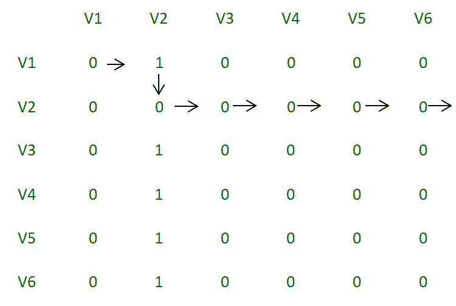
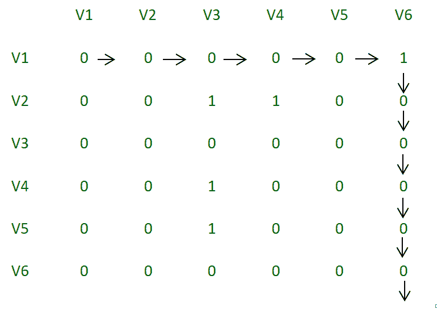

# 确定有向图

中是否存在通用接收器

> 原文： [https://www.geeksforgeeks.org/determine-whether-universal-sink-exists-directed-graph/](https://www.geeksforgeeks.org/determine-whether-universal-sink-exists-directed-graph/)

确定有向图中是否存在通用接收器。 通用接收器是一个不带任何边缘的顶点，而所有其他顶点都具有朝向接收器的边缘。

```
Input : 
v1 -> v2 (implies vertex 1 is connected to vertex 2)
v3 -> v2
v4 -> v2
v5 -> v2
v6 -> v2                        
Output :
Sink found at vertex 2

Input : 
v1 -> v6
v2 -> v3
v2 -> v4
v4 -> v3
v5 -> v3
Output :
No Sink

```

我们尝试消除 **O（n）**时间中的 n – 1 个非沉顶点，并检查剩余顶点的沉属性。
为了消除顶点，我们检查邻接矩阵中的特定索引（A [i] [j]）是 1 还是 0。如果它是 0，则意味着与索引 j 对应的顶点不能是 水槽。 如果索引为 1，则表示与 i 对应的顶点不能为汇。 我们一直以这种方式增加 i 和 j，直到 i 或 j 超过顶点数为止。
使用此方法，我们可以仅对一个顶点而不是所有 n 个顶点进行通用下沉测试。 假设我们只剩下顶点 i。
现在，我们检查第 i 行是否只有 0，第 j 行是否只有 1（除了 A [i] [i]，后者为 0）。

**插图：**

```
v1 -> v2 
v3 -> v2
v4 -> v2
v5 -> v2
v6 -> v2                     
We can visualize the adjacency matrix for 
the above as follows:
0 1 0 0 0 0
0 0 0 0 0 0
0 1 0 0 0 0
0 1 0 0 0 0
0 1 0 0 0 0 
```

我们注意到顶点 2 没有任何发射边缘，并且每个其他顶点在顶点 2 中都有一个边缘。在 A [0] [0]（A [i] [j]）处，我们遇到一个 0，所以我们递增 j 和下一个
查看 A [0] [1]。 在这里，我们遇到一个 1。因此，我们必须将 i 递增 1。A [1] [1]为 0，因此我们不断增加 j。 我们注意到 A [1] [2]，A [1] [3] ..等全为 0，因此 j 将超过
顶点数（在此示例中为 6）。 现在，我们检查接收器属性的第 i 行和第 i 列。 第 i 行必须完全为 0，第 i 列必须完全为 1，但索引 A [i] [i]

[](https://media.geeksforgeeks.org/wp-content/uploads/Adjacency_matrix_2.png)

邻接矩阵

第二个例子：

```
v1 -> v6
v2 -> v3
v2 -> v4
v4 -> v3
v5 -> v3
We can visualize the adjacency matrix
for the above as follows:
0 0 0 0 0 1
0 0 1 1 0 0
0 0 0 0 0 0
0 0 1 0 0 0
0 0 1 0 0 0
0 0 0 0 0 0

```

在此示例中，我们观察到在第 1 行中，除最后一列外，每个元素均为 0。 因此我们将递增 j 直到达到 1。当达到 1 时，只要
递增 A [i] [j]的值为 0。如果 i 超过了顶点数，则不可能 有一个接收器，在这种情况下，我将超过顶点数量。

[](https://media.geeksforgeeks.org/wp-content/uploads/Adjacency_matrix.png)

邻接矩阵

## 爪哇

```

// Java program to find whether a universal sink 
// exists in a directed graph 
import java.io.*; 
import java.util.*; 

class Graph 
{ 
    int vertices; 
    int[][] adjacency_matrix; 

    // constructor to initialize number of vertices and 
    // size of adjacency matrix 
    public graph(int vertices) 
    { 
        this.vertices = vertices; 
        adjacency_matrix = new int[vertices][vertices]; 
    } 

    public void insert(int source, int destination) 
    { 
        // make adjacency_matrix[i][j] = 1 if there is 
        // an edge from i to j 
        adjacency_matrix[destination-1] = 1; 
    } 

    public boolean issink(int i) 
    { 
        for (int j = 0 ; j < vertices ; j++) 
        { 
            // if any element in the row i is 1, it means 
            // that there is an edge emanating from the 
            // vertex, which means it cannot be a sink 
            if (adjacency_matrix[i][j] == 1) 
                return false; 

            // if any element other than i in the column 
            // i is 0, it means that there is no edge from 
            // that vertex to the vertex we are testing 
            // and hence it cannot be a sink 
            if (adjacency_matrix[j][i] == 0 && j != i) 
                return false; 
        } 
        //if none of the checks fails, return true 
        return true; 
    } 

    // we will eliminate n-1 non sink vertices so that 
    // we have to check for only one vertex instead of 
    // all n vertices 
    public int eliminate() 
    { 
        int i = 0, j = 0; 
        while (i < vertices && j < vertices) 
        { 
            // If the index is 1, increment the row we are 
            // checking by 1 
            // else increment the column 
            if (adjacency_matrix[i][j] == 1) 
                i = i + 1; 
            else
                j = j + 1; 

        } 

        // If i exceeds the number of vertices, it 
        // means that there is no valid vertex in 
        // the given vertices that can be a sink 
        if (i > vertices) 
            return -1; 
        else if (!issink(i)) 
            return -1; 
        else return i; 
    } 
} 

public class Sink 
{ 
    public static void main(String[] args)throws IOException 
    { 
        int number_of_vertices = 6; 
        int number_of_edges = 5; 
        graph g = new graph(number_of_vertices); 
        /* 
        //input set 1 
        g.insert(1, 6); 
        g.insert(2, 6); 
        g.insert(3, 6); 
        g.insert(4, 6); 
        g.insert(5, 6); 
        */
        //input set 2 
        g.insert(1, 6); 
        g.insert(2, 3); 
        g.insert(2, 4); 
        g.insert(4, 3); 
        g.insert(5, 3); 

        int vertex = g.eliminate(); 

        // returns 0 based indexing of vertex. returns 
        // -1 if no sink exits. 
        // returns the vertex number-1 if sink is found 
        if (vertex >= 0) 
            System.out.println("Sink found at vertex "
                                     + (vertex + 1)); 
        else
            System.out.println("No Sink"); 
    } 
} 

```

## Python3

```

# Python3 program to find whether a  
# universal sink exists in a directed graph 
class Graph: 

    # constructor to initialize number of  
    # vertices and size of adjacency matrix 
    def __init__(self, vertices): 
        self.vertices = vertices 
        self.adjacency_matrix = [[0 for i in range(vertices)] 
                                    for j in range(vertices)] 

    def insert(self, s, destination): 

        # make adjacency_matrix[i][j] = 1  
        # if there is an edge from i to j 
        self.adjacency_matrix[s - 1][destination - 1] = 1

    def issink(self, i): 
        for j in range(self.vertices): 

            # if any element in the row i is 1, it means 
            # that there is an edge emanating from the 
            # vertex, which means it cannot be a sink 
            if self.adjacency_matrix[i][j] == 1: 
                return False

            # if any element other than i in the column 
            # i is 0, it means that there is no edge from 
            # that vertex to the vertex we are testing 
            # and hence it cannot be a sink 
            if self.adjacency_matrix[j][i] == 0 and j != i: 
                return False

        # if none of the checks fails, return true 
        return True

    # we will eliminate n-1 non sink vertices so that 
    # we have to check for only one vertex instead of 
    # all n vertices 
    def eliminate(self): 
        i = 0
        j = 0
        while i < self.vertices and j < self.vertices: 

            # If the index is 1, increment the row  
            # we are checking by 1 
            # else increment the column 
            if self.adjacency_matrix[i][j] == 1: 
                i += 1
            else: 
                j += 1

        # If i exceeds the number of vertices, it 
        # means that there is no valid vertex in 
        # the given vertices that can be a sink 
        if i > self.vertices: 
            return -1
        elif self.issink(i) is False: 
            return -1
        else: 
            return i 

# Driver Code 
if __name__ == "__main__": 

    number_of_vertices = 6
    number_of_edges = 5
    g = Graph(number_of_vertices) 

    # input set 1 
    # g.insert(1, 6) 
    # g.insert(2, 6) 
    # g.insert(3, 6) 
    # g.insert(4, 6) 
    # g.insert(5, 6) 

    # input set 2 
    g.insert(1, 6) 
    g.insert(2, 3) 
    g.insert(2, 4) 
    g.insert(4, 3) 
    g.insert(5, 3) 

    vertex = g.eliminate() 

    # returns 0 based indexing of vertex.  
    # returns -1 if no sink exits. 
    # returns the vertex number-1 if sink is found 
    if vertex >= 0: 
        print("Sink found at vertex %d" % (vertex + 1)) 
    else: 
        print("No Sink") 

# This code is contributed by 
# sanjeev2552 

```

## C＃

```

// C# program to find whether a universal sink  
// exists in a directed graph  
using System; 
using System.Collections.Generic; 

class graph  
{  
    int vertices, itr;  
    int[,] adjacency_matrix;  

    // constructor to initialize number of vertices and  
    // size of adjacency matrix  
    public graph(int vertices)  
    {  
        this.vertices = vertices;  
        adjacency_matrix = new int[vertices, vertices];  
    }  

    public void insert(int source, int destination)  
    {  
        // make adjacency_matrix[i,j] = 1 if there is  
        // an edge from i to j  
        adjacency_matrix = 1;  
    }  

    public bool issink(int i)  
    {  
        for (int j = 0 ; j < vertices ; j++)  
        {  
            // if any element in the row i is 1, it means  
            // that there is an edge emanating from the  
            // vertex, which means it cannot be a sink  
            if (adjacency_matrix[i, j] == 1)  
                return false;  

            // if any element other than i in the column  
            // i is 0, it means that there is no edge from  
            // that vertex to the vertex we are testing  
            // and hence it cannot be a sink  
            if (adjacency_matrix[j, i] == 0 && j != i)  
                return false;  
        }  
        //if none of the checks fails, return true  
        return true;  
    }  

    // we will eliminate n-1 non sink vertices so that  
    // we have to check for only one vertex instead of  
    // all n vertices  
    public int eliminate()  
    {  
        int i = 0, j = 0;  
        while (i < vertices && j < vertices)  
        {  
            // If the index is 1, increment the row we are  
            // checking by 1  
            // else increment the column  
            if (adjacency_matrix[i, j] == 1)  
                i = i + 1;  
            else
                j = j + 1;  

        }  

        // If i exceeds the number of vertices, it  
        // means that there is no valid vertex in  
        // the given vertices that can be a sink  
        if (i > vertices)  
            return -1;  
        else if (!issink(i))  
            return -1;  
        else return i;  
    }  
}  

public class Sink  
{  
    public static void Main(String[] args) 
    {  
        int number_of_vertices = 6;  
        graph g = new graph(number_of_vertices);  
        /*  
        //input set 1  
        g.insert(1, 6);  
        g.insert(2, 6);  
        g.insert(3, 6);  
        g.insert(4, 6);  
        g.insert(5, 6);  
        */
        //input set 2  
        g.insert(1, 6);  
        g.insert(2, 3);  
        g.insert(2, 4);  
        g.insert(4, 3);  
        g.insert(5, 3);  

        int vertex = g.eliminate();  

        // returns 0 based indexing of vertex. returns  
        // -1 if no sink exits.  
        // returns the vertex number-1 if sink is found  
        if (vertex >= 0)  
            Console.WriteLine("Sink found at vertex "
                                    + (vertex + 1));  
        else
            Console.WriteLine("No Sink");  
    }  
}  

// This code is contributed by Rajput-Ji 

```

**Output:**

```
input set 1: 
Sink found at vertex 6
input set 2:
No Sink

```

该程序消除了 **O（n）**复杂度的非下沉顶点，并检查了 **O（n）**复杂度的下沉属性。

您也可以尝试[名人问题](https://www.geeksforgeeks.org/the-celebrity-problem/)，这是此概念的应用

本文由 **Deepak Srivatsav** 提供。 如果您喜欢 GeeksforGeeks 并希望做出贡献，则还可以使用 [tribution.geeksforgeeks.org](http://www.contribute.geeksforgeeks.org) 撰写文章，或将您的文章邮寄至 tribution@geeksforgeeks.org。 查看您的文章出现在 GeeksforGeeks 主页上，并帮助其他 Geeks。

如果发现任何不正确的地方，或者想分享有关上述主题的更多信息，请写评论。

