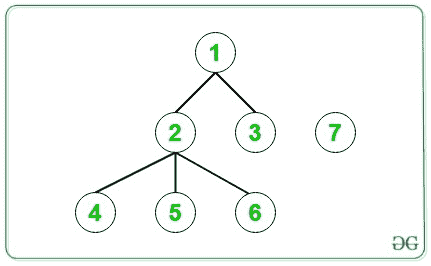
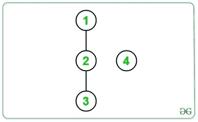

# 树的每个节点与给定的断开连接的组件

> 原文：[https://www.geeksforgeeks.org/diameters-for-each-node-of-tree-after-connecting-it-with-given-disconnected-component/](https://www.geeksforgeeks.org/diameters-for-each-node-of-tree-after-connecting-it-with-given-disconnected-component/)

连接后的直径

给定 [**树**](https://www.geeksforgeeks.org/generic-treesn-array-trees/) ，该树具有通过 **N-1** 边连接的 **N** 个节点和**单断开节点**的任务 是在将给定树与给定的断开连接的组件连接后找到给定树的每个节点的直径。

**示例**：

> **输入**：
> 
> [](https://media.geeksforgeeks.org/wp-content/cdn-uploads/20200825161849/graphExample1-2.jpg)
> 
> **输出**：3 3 4 4 4 4
> **说明**：
> 树木的初始直径= **3** 。
> 如果在节点 **1** 和节点 **7** 之间添加了一条边，则树的直径等于 **3** （7-> 1 -> 2-> 5）。
> 如果在节点 **2** 和节点 **7** 之间添加了一条边，则树的直径等于 **3** （3-> 1 -> 2-> 5）。
> 如果在节点 **3** 和节点 **7** 之间添加了一条边，则树的直径等于 **4** （7-> 3 -> 1-> 2-> 5）。
> 如果在节点 **4** 和节点 **7** 之间添加了一条边，则新树的直径等于 **4** （7- > 4-> 2-> 1-> 3）。
> 如果在节点 **5** 和节点 **7** 之间添加了一条边，则新树的直径将为 **4** （7- > 5 -> 2-> 1-> 3）。
> 如果在节点 **6** 和节点 **7** 之间添加了一条边，则新树的直径将为 **4** （（（7- > 6-> 2-> 1-> 3））。
> 
> [](https://media.geeksforgeeks.org/wp-content/cdn-uploads/20200825162001/graphExample1-2Explanation.jpg)
> 
> **输入**：
> 
> [](https://media.geeksforgeeks.org/wp-content/cdn-uploads/20200825162322/graphExample2-1.jpg)
> 
> **输出**：3 2 3
> **说明**：
> 树的初始直径= **2**
> 如果在 节点 **1** 和节点 **4** ，则树的直径等于 **3** （4-> 1-> 2-> 3）。
> 如果在节点 **2** 和节点 **4** 之间添加了一条边，则树的直径等于 **2** （4-> 2 -> 3）。
> 如果在节点 **3** 和节点 **4** 之间添加了一条边，则树的直径等于 **3** （4-> 3 -> 2-> 1）。

**方法**：要解决此问题，需要注意以下几点：

> *   当断开的节点连接到形成直径末端的边时，直径增加 1。
> *   对于所有其他节点，直径在连接断开的节点时保持不变。

请根据以下观察结果，按照以下步骤解决问题：

1.  执行给定树的 [DFS](http://www.geeksforgeeks.org/depth-first-traversal-for-a-graph/) 遍历。

2.  遍历时，请记录所经过的最远距离和最远的节点。

3.  现在，从通过上述步骤获得的最远节点执行 **DFS** ，并跟踪距该节点最远的节点。

4.  现在，执行 **DFS** ，并继续在 [Map](http://www.geeksforgeeks.org/map-associative-containers-the-c-standard-template-library-stl/) 中添加节点，这些节点距离通过上述步骤获得的两个节点最远。

下面是上述方法的实现：

## C++

```cpp

// C++ Program to implement
// the above approach
#include <bits/stdc++.h>
using namespace std;

// Keeps track of the farthest
// end of the diameter
int X = 1;

// Keeps track of the length of
// the diameter
int diameter = 0;

// Stores the nodes which are at
// ends of the diameter
map<int, bool> mp;

// Perform DFS on the given tree
void dfs(int current_node, int prev_node,
         int len, bool add_to_map,
         vector<vector<int> >& adj)
{
    // Update diameter and X
    if (len > diameter) {
        diameter = len;
        X = current_node;
    }

    // If current node is an end of diameter
    if (add_to_map && len == diameter) {
        mp[current_node] = 1;
    }

    // Traverse its neighbors
    for (auto& it : adj[current_node]) {
        if (it != prev_node)
            dfs(it, current_node, len + 1,
                add_to_map, adj);
    }
}

// Function to call DFS for the
// required purposes
void dfsUtility(vector<vector<int> >& adj)
{
    // DFS from a random node and find
    // the node farthest from it
    dfs(1, -1, 0, 0, adj);

    int farthest_node = X;

    // DFS from X to calculate diameter
    dfs(farthest_node, -1, 0, 0, adj);

    // DFS from farthest_node to find
    // the farthest node(s) from it
    dfs(farthest_node, -1, 0, 1, adj);

    // DFS from X (other end of diameter) and
    // check the farthest node(s) from it
    dfs(X, -1, 0, 1, adj);
}

void printDiameters(vector<vector<int> >& adj)
{
    dfsUtility(adj);

    for (int i = 1; i <= 6; i++) {

        // If node i is the end of
        // a diameter
        if (mp[i] == 1)

            // Increase diameter by 1
            cout << diameter + 1 << ",  ";

        // Otherwise
        else

            // Remains unchanged
            cout << diameter << ",  ";
    }
}

// Driver Code
int main()
{

    /* constructed tree is
            1
           / \
          2   3    7
         /|\
        / | \
       4  5  6    */

    vector<vector<int> > adj(7);

    // creating undirected edges
    adj[1].push_back(2);
    adj[2].push_back(1);
    adj[1].push_back(3);
    adj[3].push_back(1);
    adj[2].push_back(4);
    adj[4].push_back(2);
    adj[2].push_back(5);
    adj[5].push_back(2);
    adj[2].push_back(6);
    adj[6].push_back(2);

    printDiameters(adj);

    return 0;
}

```

## Java

```java

// Java Program to implement
// the above approach
import java.util.*;
class GFG{

// Keeps track of the farthest
// end of the diameter
static int X = 1;

// Keeps track of the length of
// the diameter
static int diameter = 0;

// Stores the nodes which are at
// ends of the diameter
static HashMap<Integer,
                 Boolean> mp = new HashMap<>();

// Perform DFS on the given tree
static void dfs(int current_node, int prev_node,
                 int len, boolean add_to_map,
                Vector<Integer> []  adj)
{
    // Update diameter and X
    if (len > diameter)
    {
        diameter = len;
        X = current_node;
    }

    // If current node is an end of diameter
    if (add_to_map && len == diameter) 
    {
        mp.put(current_node, true);
    }

    // Traverse its neighbors
    for (int it : adj[current_node]) 
    {
        if (it != prev_node)
            dfs(it, current_node, len + 1,
                add_to_map, adj);
    }
}

// Function to call DFS for the
// required purposes
static void dfsUtility(Vector<Integer> []  adj)
{
    // DFS from a random node and find
    // the node farthest from it
    dfs(1, -1, 0, false, adj);

    int farthest_node = X;

    // DFS from X to calculate diameter
    dfs(farthest_node, -1, 0, false, adj);

    // DFS from farthest_node to find
    // the farthest node(s) from it
    dfs(farthest_node, -1, 0, true, adj);

    // DFS from X (other end of diameter) and
    // check the farthest node(s) from it
    dfs(X, -1, 0, true, adj);
}

static void printDiameters(Vector<Integer> [] adj)
{
    dfsUtility(adj);

    for (int i = 1; i <= 6; i++)
    {

        // If node i is the end of
        // a diameter
        if (mp.containsKey(i) && 
            mp.get(i) == true)

            // Increase diameter by 1
            System.out.print(diameter + 1 + ",  ");

        // Otherwise
        else

            // Remains unchanged
            System.out.print(diameter + ",  ");
    }
}

// Driver Code
public static void main(String[] args)
{

    /* constructed tree is
            1
           / \
          2   3    7
         /|\
        / | \
       4  5  6    */

    Vector<Integer> []adj = new Vector[7];
    for (int i = 0; i < adj.length; i++)
        adj[i] = new Vector<Integer>();

    // creating undirected edges
    adj[1].add(2);
    adj[2].add(1);
    adj[1].add(3);
    adj[3].add(1);
    adj[2].add(4);
    adj[4].add(2);
    adj[2].add(5);
    adj[5].add(2);
    adj[2].add(6);
    adj[6].add(2);

    printDiameters(adj);
}
}

// This code is contributed by PrinciRaj1992

```

## Python3

```py

# Python3 program to implement 
# the above approach 
from collections import defaultdict

# Keeps track of the farthest 
# end of the diameter 
X = 1

# Keeps track of the length of 
# the diameter 
diameter = 0

# Stores the nodes which are at 
# ends of the diameter 
mp = defaultdict(lambda :0)

# Perform DFS on the given tree
def dfs(current_node, prev_node, 
        len, add_to_map, adj):

    global diameter, X

    # Update diameter and X 
    if len > diameter:
        diameter = len
        X = current_node

    # If current node is an end of diameter
    if add_to_map and len == diameter:
        mp[current_node] = 1

    # Traverse its neighbors 
    for it in adj[current_node]:
        if it != prev_node:
            dfs(it, current_node, len + 1,
                add_to_map, adj)

# Function to call DFS for the 
# required purposes 
def dfsUtility(adj):

    # DFS from a random node and find 
    # the node farthest from it 
    dfs(1, -1, 0, 0, adj)

    farthest_node = X

    # DFS from X to calculate diameter
    dfs(farthest_node, -1, 0, 0, adj)

    # DFS from farthest_node to find 
    # the farthest node(s) from it
    dfs(farthest_node, -1, 0, 1, adj)

    # DFS from X (other end of diameter) and 
    # check the farthest node(s) from it 
    dfs(X, -1, 0, 1, adj)

def printDiameters(adj):

    global diameter
    dfsUtility(adj)

    for i in range(1, 6 + 1):

        # If node i is the end of 
        # a diameter 
        if mp[i] == 1:

            # Increase diameter by 1
            print(diameter + 1, end = ", ")

        # Otherwise
        else:

            # Remains unchanged
            print(diameter, end = ", ")

# Driver code

# constructed tree is 
#         1 
#        / \ 
#      2   3 
#    / | \ 
#   4  5  6 
#      |
#      7

adj = []
for i in range(7):
    adj.append([])

# Creating undirected edges
adj[1].append(2)
adj[2].append(1)
adj[1].append(3)
adj[3].append(1)
adj[2].append(4)
adj[4].append(2)
adj[2].append(5)
adj[5].append(2)
adj[2].append(6)
adj[6].append(2)

printDiameters(adj)

# This code is contributed by Stuti Pathak

```

## C#

```cs

// C# Program to implement
// the above approach
using System;
using System.Collections.Generic;
class GFG {

    // Keeps track of the farthest
    // end of the diameter
    static int X = 1;

    // Keeps track of the
    // length of the diameter
    static int diameter = 0;

    // Stores the nodes which are at
    // ends of the diameter
    static Dictionary<int, Boolean> mp
        = new Dictionary<int, Boolean>();

    // Perform DFS on the given tree
    static void dfs(int current_node, int prev_node,
                    int len, bool add_to_map,
                    List<int>[] adj)
    {
        // Update diameter and X
        if (len > diameter) 
        {
            diameter = len;
            X = current_node;
        }

        // If current node is an end of diameter
        if (add_to_map && len == diameter) 
        {
            mp.Add(current_node, true);
        }

        // Traverse its neighbors
        foreach(int it in adj[current_node])
        {
            if (it != prev_node)
                dfs(it, current_node, len + 1, 
                    add_to_map, adj);
        }
    }

    // Function to call DFS for
    // the required purposes
    static void dfsUtility(List<int>[] adj)
    {

        // DFS from a random node and find
        // the node farthest from it
        dfs(1, -1, 0, false, adj);

        int farthest_node = X;

        // DFS from X to calculate diameter
        dfs(farthest_node, -1, 0, false, adj);

        // DFS from farthest_node to find
        // the farthest node(s) from it
        dfs(farthest_node, -1, 0, true, adj);

        // DFS from X (other end of diameter) and
        // check the farthest node(s) from it
        dfs(X, -1, 0, true, adj);
    }

    static void printDiameters(List<int>[] adj)
    {
        dfsUtility(adj);

        for (int i = 1; i <= 6; i++) 
        {

            // If node i is the end
            // of a diameter
            if (mp.ContainsKey(i) && mp[i] == true)

                // Increase diameter by 1
                Console.Write(diameter + 1 + ",  ");

            // Otherwise
            else

                // Remains unchanged
                Console.Write(diameter + ",  ");
        }
    }

    // Driver Code
    public static void Main(String[] args)
    {

        /* constructed tree is
            1
           / \
          2   3    7
         /|\
        / | \
       4  5  6    */

        List<int>[] adj = new List<int>[ 7 ];
        for (int i = 0; i < adj.Length; i++)
            adj[i] = new List<int>();

        // creating undirected edges
        adj[1].Add(2);
        adj[2].Add(1);
        adj[1].Add(3);
        adj[3].Add(1);
        adj[2].Add(4);
        adj[4].Add(2);
        adj[2].Add(5);
        adj[5].Add(2);
        adj[2].Add(6);
        adj[6].Add(2);
        printDiameters(adj);
    }
}

// This code is contributed by Amit Katiyar

```

**Output:** 

```
3,  3,  4,  4,  4,  4,

```

***时间复杂度**：O（V + E）*，其中 V 是图中的顶点数，E 是图中的边数。

**辅助空间**：O（V）


* * *

* * *


