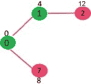
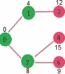
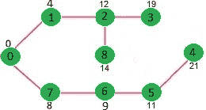

# Dijkstra 的邻接表表示算法| 贪婪的 Algo-8

> 原文： [https://www.geeksforgeeks.org/dijkstras-algorithm-for-adjacency-list-representation-greedy-algo-8/](https://www.geeksforgeeks.org/dijkstras-algorithm-for-adjacency-list-representation-greedy-algo-8/)

我们建议阅读以下两篇文章，作为这篇文章的先决条件。

**1\.** [贪婪算法| 集合 7（Dijkstra 最短路径算法）](https://www.geeksforgeeks.org/dijkstras-shortest-path-algorithm-greedy-algo-7/)

**2\.** [图及其表示](https://www.geeksforgeeks.org/graph-and-its-representations/)

我们讨论了 [Dijkstra 算法及其用于邻接矩阵表示的实现 图](https://www.geeksforgeeks.org/prims-minimum-spanning-tree-mst-greedy-algo-5/)。 矩阵表示的时间复杂度为 O（V ^ 2）。 在这篇文章中，讨论了用于邻接表表示的 O（ELogV）算法。

如前一篇文章所述，在 Dijkstra 算法中，维护了两组，一组包含 SPT（最短路径树）中已包含的顶点列表，另一组包含尚未包含的顶点。 使用邻接表表示，可以使用 [BFS](https://www.geeksforgeeks.org/breadth-first-search-or-bfs-for-a-graph/) 在 O（V + E）时间内遍历图的所有顶点。 这个想法是使用 [BFS](https://www.geeksforgeeks.org/breadth-first-search-or-bfs-for-a-graph/) 遍历图形的所有顶点，并使用最小堆存储尚未包含在 SPT 中的顶点（或尚未确定最短距离的顶点）。 Min Heap 用作优先级队列，以从尚未包含的顶点集中获取最小距离顶点。 对于 Min Heap，诸如 extract-min 和 reduce-key 值之类的操作的时间复杂度为 O（LogV）。

以下是详细步骤。

1.  创建大小为 V 的最小堆，其中 V 是给定图中顶点的数量。 最小堆的每个节点都包含顶点数和顶点的距离值。

2.  初始化以源顶点为根的 Min Heap（分配给源顶点的距离值为 0）。 分配给所有其他顶点的距离值为 INF（无限）。

3.  当 Min Heap 不为空时，请执行以下操作

….. **a）**从 Min Heap 中提取具有最小距离值节点的顶点。 令提取的顶点为 u。

….. **b）**。对于 u 的每个相邻顶点 v，检查 v 是否在 Min Heap 中。 如果 v 在“最小堆”中并且距离值大于 u-v 的权重加上 u 的距离值，则更新 v 的距离值。

让我们用以下示例理解。 假设给定的源顶点为 0


最初，所有其他顶点的源顶点距离值为 0，INF 为无穷大。 因此，从“最小堆”中提取源顶点，并更新与 0（1 和 7）相邻的顶点的距离值。 最小堆包含除顶点 0 以外的所有顶点。

绿色的顶点是已确定最小距离的顶点，而不是最小堆


由于顶点 1 的距离值在最小堆中的所有节点中最小，因此从最小堆中提取顶点，并更新与 1 相邻的顶点的距离值（如果顶点在最小堆中且到 1 的距离小于 以前的距离）。 最小堆包含除顶点 0 和 1 之外的所有顶点。



从最小堆中选取最小距离值的顶点。 选择了顶点 7。 因此，最小堆现在包含除 0、1 和 7 以外的所有顶点。更新相邻顶点 7 的距离值。顶点 6 和 8 的距离值变得有限（分别为 15 和 9）。



选择与最小堆的距离最小的顶点。 选择了顶点 6。 因此，最小堆现在包含除 0、1、7 和 6 以外的所有顶点。更新相邻顶点 6 的距离值。更新顶点 5 和 8 的距离值。


重复上述步骤，直到最小堆不为空为止。 最后，我们得到以下最短路径树。



## C++

```cpp

// C / C++ program for Dijkstra's 
// shortest path algorithm for adjacency
// list representation of graph
#include <stdio.h>
#include <stdlib.h>
#include <limits.h>

// A structure to represent a 
// node in adjacency list
struct AdjListNode
{
    int dest;
    int weight;
    struct AdjListNode* next;
};

// A structure to represent 
// an adjacency list
struct AdjList
{

   // Pointer to head node of list
   struct AdjListNode *head; 
};

// A structure to represent a graph. 
// A graph is an array of adjacency lists.
// Size of array will be V (number of 
// vertices in graph)
struct Graph
{
    int V;
    struct AdjList* array;
};

// A utility function to create 
// a new adjacency list node
struct AdjListNode* newAdjListNode(
                   int dest, int weight)
{
    struct AdjListNode* newNode =
            (struct AdjListNode*) 
      malloc(sizeof(struct AdjListNode));
    newNode->dest = dest;
    newNode->weight = weight;
    newNode->next = NULL;
    return newNode;
}

// A utility function that creates 
// a graph of V vertices
struct Graph* createGraph(int V)
{
    struct Graph* graph = (struct Graph*) 
            malloc(sizeof(struct Graph));
    graph->V = V;

    // Create an array of adjacency lists.  
    // Size of array will be V
    graph->array = (struct AdjList*) 
       malloc(V * sizeof(struct AdjList));

    // Initialize each adjacency list 
    // as empty by making head as NULL
    for (int i = 0; i < V; ++i)
        graph->array[i].head = NULL;

    return graph;
}

// Adds an edge to an undirected graph
void addEdge(struct Graph* graph, int src, 
                   int dest, int weight)
{
    // Add an edge from src to dest.  
    // A new node is added to the adjacency
    // list of src.  The node is 
    // added at the beginning
    struct AdjListNode* newNode = 
            newAdjListNode(dest, weight);
    newNode->next = graph->array[src].head;
    graph->array[src].head = newNode;

    // Since graph is undirected, 
    // add an edge from dest to src also
    newNode = newAdjListNode(src, weight);
    newNode->next = graph->array[dest].head;
    graph->array[dest].head = newNode;
}

// Structure to represent a min heap node
struct MinHeapNode
{
    int  v;
    int dist;
};

// Structure to represent a min heap
struct MinHeap
{

    // Number of heap nodes present currently
    int size;     

    // Capacity of min heap
    int capacity;  

    // This is needed for decreaseKey()
    int *pos;    
    struct MinHeapNode **array;
};

// A utility function to create a 
// new Min Heap Node
struct MinHeapNode* newMinHeapNode(int v, 
                                 int dist)
{
    struct MinHeapNode* minHeapNode =
           (struct MinHeapNode*) 
      malloc(sizeof(struct MinHeapNode));
    minHeapNode->v = v;
    minHeapNode->dist = dist;
    return minHeapNode;
}

// A utility function to create a Min Heap
struct MinHeap* createMinHeap(int capacity)
{
    struct MinHeap* minHeap =
         (struct MinHeap*) 
      malloc(sizeof(struct MinHeap));
    minHeap->pos = (int *)malloc(
            capacity * sizeof(int));
    minHeap->size = 0;
    minHeap->capacity = capacity;
    minHeap->array =
         (struct MinHeapNode**) 
                 malloc(capacity * 
       sizeof(struct MinHeapNode*));
    return minHeap;
}

// A utility function to swap two 
// nodes of min heap. 
// Needed for min heapify
void swapMinHeapNode(struct MinHeapNode** a, 
                     struct MinHeapNode** b)
{
    struct MinHeapNode* t = *a;
    *a = *b;
    *b = t;
}

// A standard function to 
// heapify at given idx
// This function also updates 
// position of nodes when they are swapped.
// Position is needed for decreaseKey()
void minHeapify(struct MinHeap* minHeap, 
                                  int idx)
{
    int smallest, left, right;
    smallest = idx;
    left = 2 * idx + 1;
    right = 2 * idx + 2;

    if (left < minHeap->size &&
        minHeap->array[left]->dist < 
         minHeap->array[smallest]->dist )
      smallest = left;

    if (right < minHeap->size &&
        minHeap->array[right]->dist <
         minHeap->array[smallest]->dist )
      smallest = right;

    if (smallest != idx)
    {
        // The nodes to be swapped in min heap
        MinHeapNode *smallestNode = 
             minHeap->array[smallest];
        MinHeapNode *idxNode = 
                 minHeap->array[idx];

        // Swap positions
        minHeap->pos[smallestNode->v] = idx;
        minHeap->pos[idxNode->v] = smallest;

        // Swap nodes
        swapMinHeapNode(&minHeap->array[smallest], 
                         &minHeap->array[idx]);

        minHeapify(minHeap, smallest);
    }
}

// A utility function to check if 
// the given minHeap is ampty or not
int isEmpty(struct MinHeap* minHeap)
{
    return minHeap->size == 0;
}

// Standard function to extract 
// minimum node from heap
struct MinHeapNode* extractMin(struct MinHeap* 
                                   minHeap)
{
    if (isEmpty(minHeap))
        return NULL;

    // Store the root node
    struct MinHeapNode* root = 
                   minHeap->array[0];

    // Replace root node with last node
    struct MinHeapNode* lastNode = 
         minHeap->array[minHeap->size - 1];
    minHeap->array[0] = lastNode;

    // Update position of last node
    minHeap->pos[root->v] = minHeap->size-1;
    minHeap->pos[lastNode->v] = 0;

    // Reduce heap size and heapify root
    --minHeap->size;
    minHeapify(minHeap, 0);

    return root;
}

// Function to decreasy dist value 
// of a given vertex v. This function
// uses pos[] of min heap to get the
// current index of node in min heap
void decreaseKey(struct MinHeap* minHeap, 
                         int v, int dist)
{
    // Get the index of v in  heap array
    int i = minHeap->pos[v];

    // Get the node and update its dist value
    minHeap->array[i]->dist = dist;

    // Travel up while the complete 
    // tree is not hepified.
    // This is a O(Logn) loop
    while (i && minHeap->array[i]->dist < 
           minHeap->array[(i - 1) / 2]->dist)
    {
        // Swap this node with its parent
        minHeap->pos[minHeap->array[i]->v] = 
                                      (i-1)/2;
        minHeap->pos[minHeap->array[
                             (i-1)/2]->v] = i;
        swapMinHeapNode(&minHeap->array[i],  
                 &minHeap->array[(i - 1) / 2]);

        // move to parent index
        i = (i - 1) / 2;
    }
}

// A utility function to check if a given vertex
// 'v' is in min heap or not
bool isInMinHeap(struct MinHeap *minHeap, int v)
{
   if (minHeap->pos[v] < minHeap->size)
     return true;
   return false;
}

// A utility function used to print the solution
void printArr(int dist[], int n)
{
    printf("Vertex   Distance from Source\n");
    for (int i = 0; i < n; ++i)
        printf("%d \t\t %d\n", i, dist[i]);
}

// The main function that calulates 
// distances of shortest paths from src to all
// vertices. It is a O(ELogV) function
void dijkstra(struct Graph* graph, int src)
{

    // Get the number of vertices in graph
    int V = graph->V;

    // dist values used to pick
    // minimum weight edge in cut
    int dist[V];     

    // minHeap represents set E
    struct MinHeap* minHeap = createMinHeap(V);

    // Initialize min heap with all 
    // vertices. dist value of all vertices 
    for (int v = 0; v < V; ++v)
    {
        dist[v] = INT_MAX;
        minHeap->array[v] = newMinHeapNode(v, 
                                      dist[v]);
        minHeap->pos[v] = v;
    }

    // Make dist value of src vertex 
    // as 0 so that it is extracted first
    minHeap->array[src] = 
          newMinHeapNode(src, dist[src]);
    minHeap->pos[src]   = src;
    dist[src] = 0;
    decreaseKey(minHeap, src, dist[src]);

    // Initially size of min heap is equal to V
    minHeap->size = V;

    // In the followin loop, 
    // min heap contains all nodes
    // whose shortest distance 
    // is not yet finalized.
    while (!isEmpty(minHeap))
    {
        // Extract the vertex with 
        // minimum distance value
        struct MinHeapNode* minHeapNode = 
                     extractMin(minHeap);

        // Store the extracted vertex number
        int u = minHeapNode->v; 

        // Traverse through all adjacent 
        // vertices of u (the extracted
        // vertex) and update 
        // their distance values
        struct AdjListNode* pCrawl =
                     graph->array[u].head;
        while (pCrawl != NULL)
        {
            int v = pCrawl->dest;

            // If shortest distance to v is
            // not finalized yet, and distance to v
            // through u is less than its 
            // previously calculated distance
            if (isInMinHeap(minHeap, v) && 
                      dist[u] != INT_MAX && 
              pCrawl->weight + dist[u] < dist[v])
            {
                dist[v] = dist[u] + pCrawl->weight;

                // update distance 
                // value in min heap also
                decreaseKey(minHeap, v, dist[v]);
            }
            pCrawl = pCrawl->next;
        }
    }

    // print the calculated shortest distances
    printArr(dist, V);
}

// Driver program to test above functions
int main()
{
    // create the graph given in above fugure
    int V = 9;
    struct Graph* graph = createGraph(V);
    addEdge(graph, 0, 1, 4);
    addEdge(graph, 0, 7, 8);
    addEdge(graph, 1, 2, 8);
    addEdge(graph, 1, 7, 11);
    addEdge(graph, 2, 3, 7);
    addEdge(graph, 2, 8, 2);
    addEdge(graph, 2, 5, 4);
    addEdge(graph, 3, 4, 9);
    addEdge(graph, 3, 5, 14);
    addEdge(graph, 4, 5, 10);
    addEdge(graph, 5, 6, 2);
    addEdge(graph, 6, 7, 1);
    addEdge(graph, 6, 8, 6);
    addEdge(graph, 7, 8, 7);

    dijkstra(graph, 0);

    return 0;
}

```

## Python

```py

# A Python program for Dijkstra's shortest 
# path algorithm for adjacency
# list representation of graph

from collections import defaultdict
import sys

class Heap():

    def __init__(self):
        self.array = []
        self.size = 0
        self.pos = []

    def newMinHeapNode(self, v, dist):
        minHeapNode = [v, dist]
        return minHeapNode

    # A utility function to swap two nodes 
    # of min heap. Needed for min heapify
    def swapMinHeapNode(self,a, b):
        t = self.array[a]
        self.array[a] = self.array[b]
        self.array[b] = t

    # A standard function to heapify at given idx
    # This function also updates position of nodes 
    # when they are swapped.Position is needed 
    # for decreaseKey()
    def minHeapify(self, idx):
        smallest = idx
        left = 2*idx + 1
        right = 2*idx + 2

        if left < self.size and
           self.array[left][1] \
            < self.array[smallest][1]:
            smallest = left

        if right < self.size and
           self.array[right][1]\
            < self.array[smallest][1]:
            smallest = right

        # The nodes to be swapped in min 
        # heap if idx is not smallest
        if smallest != idx:

            # Swap positions
            self.pos[ self.array[smallest][0]] 
                                       = idx
            self.pos[ self.array[idx][0]] =
                                     smallest

            # Swap nodes
            self.swapMinHeapNode(smallest, idx)

            self.minHeapify(smallest)

    # Standard function to extract minimum 
    # node from heap
    def extractMin(self):

        # Return NULL wif heap is empty
        if self.isEmpty() == True:
            return

        # Store the root node
        root = self.array[0]

        # Replace root node with last node
        lastNode = self.array[self.size - 1]
        self.array[0] = lastNode

        # Update position of last node
        self.pos[lastNode[0]] = 0
        self.pos[root[0]] = self.size - 1

        # Reduce heap size and heapify root
        self.size -= 1
        self.minHeapify(0)

        return root

    def isEmpty(self):
        return True if self.size == 0 else False

    def decreaseKey(self, v, dist):

        # Get the index of v in  heap array

        i = self.pos[v]

        # Get the node and update its dist value
        self.array[i][1] = dist

        # Travel up while the complete tree is 
        # not hepified. This is a O(Logn) loop
        while i > 0 and self.array[i][1] < 
                  self.array[(i - 1) / 2][1]:

            # Swap this node with its parent
            self.pos[ self.array[i][0] ] = (i-1)/2
            self.pos[ self.array[(i-1)/2][0] ] = i
            self.swapMinHeapNode(i, (i - 1)/2 )

            # move to parent index
            i = (i - 1) / 2;

    # A utility function to check if a given 
    # vertex 'v' is in min heap or not
    def isInMinHeap(self, v):

        if self.pos[v] < self.size:
            return True
        return False

def printArr(dist, n):
    print "Vertex\tDistance from source"
    for i in range(n):
        print "%d\t\t%d" % (i,dist[i])

class Graph():

    def __init__(self, V):
        self.V = V
        self.graph = defaultdict(list)

    # Adds an edge to an undirected graph
    def addEdge(self, src, dest, weight):

        # Add an edge from src to dest.  A new node 
        # is added to the adjacency list of src. The 
        # node is added at the beginning. The first 
        # element of the node has the destination 
        # and the second elements has the weight
        newNode = [dest, weight]
        self.graph[src].insert(0, newNode)

        # Since graph is undirected, add an edge 
        # from dest to src also
        newNode = [src, weight]
        self.graph[dest].insert(0, newNode)

    # The main function that calulates distances 
    # of shortest paths from src to all vertices. 
    # It is a O(ELogV) function
    def dijkstra(self, src):

        V = self.V  # Get the number of vertices in graph
        dist = []   # dist values used to pick minimum 
                    # weight edge in cut

        # minHeap represents set E
        minHeap = Heap()

        #  Initialize min heap with all vertices. 
        # dist value of all vertices
        for v in range(V):
            dist.append(sys.maxint)
            minHeap.array.append( minHeap.
                                newMinHeapNode(v, dist[v]))
            minHeap.pos.append(v)

        # Make dist value of src vertex as 0 so 
        # that it is extracted first
        minHeap.pos[src] = src
        dist[src] = 0
        minHeap.decreaseKey(src, dist[src])

        # Initially size of min heap is equal to V
        minHeap.size = V;

        # In the following loop, 
        # min heap contains all nodes
        # whose shortest distance is not yet finalized.
        while minHeap.isEmpty() == False:

            # Extract the vertex 
            # with minimum distance value
            newHeapNode = minHeap.extractMin()
            u = newHeapNode[0]

            # Traverse through all adjacent vertices of 
            # u (the extracted vertex) and update their 
            # distance values
            for pCrawl in self.graph[u]:

                v = pCrawl[0]

                # If shortest distance to v is not finalized 
                # yet, and distance to v through u is less 
                # than its previously calculated distance
                if minHeap.isInMinHeap(v) and
                     dist[u] != sys.maxint and \
                   pCrawl[1] + dist[u] < dist[v]:
                        dist[v] = pCrawl[1] + dist[u]

                        # update distance value 
                        # in min heap also
                        minHeap.decreaseKey(v, dist[v])

        printArr(dist,V)

# Driver program to test the above functions
graph = Graph(9)
graph.addEdge(0, 1, 4)
graph.addEdge(0, 7, 8)
graph.addEdge(1, 2, 8)
graph.addEdge(1, 7, 11)
graph.addEdge(2, 3, 7)
graph.addEdge(2, 8, 2)
graph.addEdge(2, 5, 4)
graph.addEdge(3, 4, 9)
graph.addEdge(3, 5, 14)
graph.addEdge(4, 5, 10)
graph.addEdge(5, 6, 2)
graph.addEdge(6, 7, 1)
graph.addEdge(6, 8, 6)
graph.addEdge(7, 8, 7)
graph.dijkstra(0)

# This code is contributed by Divyanshu Mehta

```

**输出**：

```
Vertex   Distance from Source
0                0
1                4
2                12
3                19
4                21
5                11
6                9
7                8
8                14

```

**时间复杂度**：上面的代码/算法的时间复杂度看起来为 O（V ^ 2），因为有两个嵌套的 while 循环。 如果仔细观察，可以发现内部循环中的语句执行了 O（V + E）次（类似于 BFS）。 内部循环具有 reduceKey（）操作，该操作需要 O（LogV）时间。 因此总体时间复杂度为 O（E + V）* O（LogV），即 O（（E + V）* LogV）= O（ELogV）。

请注意，以上代码使用二进制堆实现优先级队列。 使用斐波那契堆可以将时间复杂度降低到 O（E + VLogV）。 原因是，斐波那契堆需要`O(1)`时间来进行减键操作，而二进制堆需要 O（Logn）时间。

**注意**：

1.  该代码计算出最短距离，但不计算路径信息。 我们可以创建一个父数组，在更新距离时更新父数组（例如 [prim 的实现](https://www.geeksforgeeks.org/prims-mst-for-adjacency-list-representation-greedy-algo-6/)），并使用它显示从源到不同顶点的最短路径。

2.  该代码用于无向图，相同的 dijekstra 函数也可用于有向图。

3.  该代码查找从源到所有顶点的最短距离。 如果我们在最短的距离只关心从源到单个目标，我们可以打破 for 循环时所拾取最小距离顶点等于目标（算法的步骤 3.A）。

4.  Dijkstra 算法不适用于负边为负的图表。 对于负负边的图形，可以使用 [Bellman-Ford 算法](http://en.wikipedia.org/wiki/Bellman-Ford_algorithm)，我们将在单独的文章中讨论它。

    [Dijkstra 最短路径算法中的打印路径](https://www.geeksforgeeks.org/printing-paths-dijkstras-shortest-path-algorithm/)

    [Dijkstra 使用 STL 中设置的最短路径算法](https://www.geeksforgeeks.org/dijkstras-shortest-path-algorithm-using-set-in-stl/)

**参考**：

[Clifford Stein，Thomas H. Cormen，Charles E. Leiserson，Ronald L.的算法简介](http://www.flipkart.com/introduction-algorithms-8120340078/p/itmczynzhyhxv2gs?pid=9788120340077&affid=sandeepgfg)

[Sanjoy Dasgupta，Christos Papadimitriou 的算法 ，乌麦什·瓦济拉尼](http://www.flipkart.com/algorithms-0070636613/p/itmczynvb7p2zacz?pid=9780070636613&affid=sandeepgfg)

如果发现任何不正确的地方，或者想分享有关上述主题的更多信息，请写评论。

