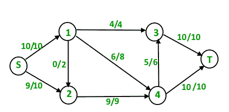
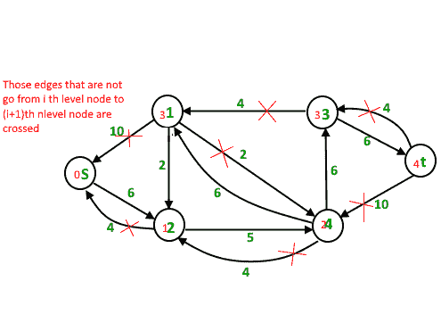

# Dinic 的最大流量算法

> 原文： [https://www.geeksforgeeks.org/dinics-algorithm-maximum-flow/](https://www.geeksforgeeks.org/dinics-algorithm-maximum-flow/)

<center>**问题陈述**：</center>

给定一个表示流网络的图，其中每个边都有容量。 还给定图中的两个顶点源“ s”和宿“ t”，找出具有以下约束的从 s 到 t 的最大可能流量：

1.  边上的流量不超过边的给定容量。

2.  除 s 和 t 以外，每个顶点的流入流量等于流出流量。

例如，在下面的输入图


中，最大 s-t 流量为 19，如下所示。



<center>**Background :**</center>

1.  [最大流量问题简介](https://www.geeksforgeeks.org/max-flow-problem-introduction/)：我们介绍了最大流量问题，讨论了贪婪算法，并介绍了残差图。

2.  [Ford-Fulkerson 算法和 Edmond Karp 实现](https://www.geeksforgeeks.org/ford-fulkerson-algorithm-for-maximum-flow-problem/)：我们讨论了 Ford-Fulkerson 算法及其实现。 我们还详细讨论了残差图。

[Edmond Karp 实施](https://www.geeksforgeeks.org/ford-fulkerson-algorithm-for-maximum-flow-problem/)的时间复杂度为 O（VE <sup>2</sup> ）。 在本文中，我们将讨论一种新的 Dinic 算法，该算法是一种更快的算法，采用 O（EV [HT G4] 2 ）。

与 Edmond Karp 的算法一样，Dinic 的算法使用以下概念：

1.  如果残差图中没有`s`至`t`路径，则流量最大。

2.  BFS 循环使用。 虽然在两种算法中使用 BFS 的方式有所不同。

在 Edmond 的 Karp 算法中，我们使用 BFS 查找扩展路径并通过该路径发送流。 在 Dinic 的算法中，我们使用 BFS 来检查是否可以增加流量并构建水位图。 在**级别图**中，我们将级别分配给所有节点，一个节点的级别是该节点到源的最短距离（以边数表示）。 一旦构建了级别图，我们便使用该级别图发送多个流。 这就是为什么它比 Edmond Karp 更好的原因。 在 Edmond Karp 中，我们仅发送通过 BFS 找到的路径发送的流。

<center>**Outline of Dinic’s algorithm :**</center>

```
1) Initialize residual graph G as given graph.
1) Do BFS of G to construct a level graph (or
   assign levels to vertices) and also check if 
   more flow is possible.
    a) If more flow is not possible, then return.
    b) Send multiple flows in G using level graph 
       until blocking flow is reached. Here using 
       level graph means, in every flow,
       levels of path nodes should be 0, 1, 2...
       (in order) from s to t. 
```

如果无法使用级别图发送更多的流，即没有更多的 s-t 路径，从而路径顶点的电流级别依次为 0、1、2…，则该流为**阻塞流**。 在此处讨论的[中讨论的贪婪算法中，阻塞流可以视为与最大流路相同。](https://www.geeksforgeeks.org/max-flow-problem-introduction/)

<center>**Illustration :**</center>

初始残差图（与给定图相同）


总流量= 0

**第一次迭代**：我们使用 BFS 向所有节点分配级别。 我们还会检查是否有更多流量（或残差图中有 s-t 路径）。


现在，我们发现使用级别来阻塞流（意味着每个流路径的级别都应为 0、1、2、3）。 我们一起发送三个流。 与我们一次发送一个流的 Edmond Karp 相比，这是优化的地方。

路径 s – 1 – 3 – t 上有 4 个流量单位。

路径 s – 1 – 4 – t 上有 6 个流量单位。

路径 s – 2 – 4 – t 上有 4 个流量单位。

总流量=总流量+ 4 + 6 + 4 = 14

一轮迭代后，残差图变为以下。


**第二个迭代**：我们使用上面修改的残差图的 BFS 为所有节点分配新级别。 我们还会检查是否有更多流量（或残差图中有 s-t 路径）。



现在，我们发现使用级别来阻塞流（意味着每个流路径的级别都应为 0、1、2、3、4）。 这次我们只能发送一个流。

路径 s 上的 5 个流量单位– 2 – 4 – 3 – t

总流量=总流量+ 5 = 19

新的残差图为


**第三次迭代**：我们运行 BFS 并创建一个级别图。 我们还会检查是否有更多流量，并仅在可能的情况下进行。 这次残差图中没有 s-t 路径，因此我们终止了算法。

<center>**实现**：</center>

下面是 Dinic 算法的 C++实现：

```

// C++ implementation of Dinic's Algorithm 
#include<bits/stdc++.h> 
using namespace std; 

// A structure to represent a edge between 
// two vertex 
struct Edge 
{ 
    int v ;  // Vertex v (or "to" vertex) 
             // of a directed edge u-v. "From" 
             // vertex u can be obtained using 
             // index in adjacent array. 

    int flow ; // flow of data in edge 

    int C;    // capacity 

    int rev ; // To store index of reverse 
              // edge in adjacency list so that 
              // we can quickly find it. 
}; 

// Residual Graph 
class Graph 
{ 
    int V; // number of vertex 
    int *level ; // stores level of a node 
    vector< Edge > *adj; 
public : 
    Graph(int V) 
    { 
        adj = new vector<Edge>[V]; 
        this->V = V; 
        level = new int[V]; 
    } 

    // add edge to the graph 
    void addEdge(int u, int v, int C) 
    { 
        // Forward edge : 0 flow and C capacity 
        Edge a{v, 0, C, adj[v].size()}; 

        // Back edge : 0 flow and 0 capacity 
        Edge b{u, 0, 0, adj[u].size()}; 

        adj[u].push_back(a); 
        adj[v].push_back(b); // reverse edge 
    } 

    bool BFS(int s, int t); 
    int sendFlow(int s, int flow, int t, int ptr[]); 
    int DinicMaxflow(int s, int t); 
}; 

// Finds if more flow can be sent from s to t. 
// Also assigns levels to nodes. 
bool Graph::BFS(int s, int t) 
{ 
    for (int i = 0 ; i < V ; i++) 
        level[i] = -1; 

    level[s] = 0;  // Level of source vertex 

    // Create a queue, enqueue source vertex 
    // and mark source vertex as visited here 
    // level[] array works as visited array also. 
    list< int > q; 
    q.push_back(s); 

    vector<Edge>::iterator i ; 
    while (!q.empty()) 
    { 
        int u = q.front(); 
        q.pop_front(); 
        for (i = adj[u].begin(); i != adj[u].end(); i++) 
        { 
            Edge &e = *i; 
            if (level[e.v] < 0  && e.flow < e.C) 
            { 
                // Level of current vertex is, 
                // level of parent + 1 
                level[e.v] = level[u] + 1; 

                q.push_back(e.v); 
            } 
        } 
    } 

    // IF we can not reach to the sink we 
    // return false else true 
    return level[t] < 0 ? false : true ; 
} 

// A DFS based function to send flow after BFS has 
// figured out that there is a possible flow and 
// constructed levels. This function called multiple 
// times for a single call of BFS. 
// flow : Current flow send by parent function call 
// start[] : To keep track of next edge to be explored. 
//           start[i] stores  count of edges explored 
//           from i. 
//  u : Current vertex 
//  t : Sink 
int Graph::sendFlow(int u, int flow, int t, int start[]) 
{ 
    // Sink reached 
    if (u == t) 
        return flow; 

    // Traverse all adjacent edges one -by - one. 
    for (  ; start[u] < adj[u].size(); start[u]++) 
    { 
        // Pick next edge from adjacency list of u 
        Edge &e = adj[u][start[u]];  

        if (level[e.v] == level[u]+1 && e.flow < e.C) 
        { 
            // find minimum flow from u to t 
            int curr_flow = min(flow, e.C - e.flow); 

            int temp_flow = sendFlow(e.v, curr_flow, t, start); 

            // flow is greater than zero 
            if (temp_flow > 0) 
            { 
                // add flow  to current edge 
                e.flow += temp_flow; 

                // subtract flow from reverse edge 
                // of current edge 
                adj[e.v][e.rev].flow -= temp_flow; 
                return temp_flow; 
            } 
        } 
    } 

    return 0; 
} 

// Returns maximum flow in graph 
int Graph::DinicMaxflow(int s, int t) 
{ 
    // Corner case 
    if (s == t) 
        return -1; 

    int total = 0;  // Initialize result 

    // Augment the flow while there is path 
    // from source to sink 
    while (BFS(s, t) == true) 
    { 
        // store how many edges are visited 
        // from V { 0 to V } 
        int *start = new int[V+1]; 

        // while flow is not zero in graph from S to D 
        while (int flow = sendFlow(s, INT_MAX, t, start)) 

            // Add path flow to overall flow 
            total += flow; 
    } 

    // return maximum flow 
    return total; 
} 

// Driver program to test above functions 
int main() 
{ 
    Graph g(6); 
    g.addEdge(0, 1, 16 ); 
    g.addEdge(0, 2, 13 ); 
    g.addEdge(1, 2, 10 ); 
    g.addEdge(1, 3, 12 ); 
    g.addEdge(2, 1, 4 ); 
    g.addEdge(2, 4, 14); 
    g.addEdge(3, 2, 9 ); 
    g.addEdge(3, 5, 20 ); 
    g.addEdge(4, 3, 7 ); 
    g.addEdge(4, 5, 4); 

    // next exmp 
    /*g.addEdge(0, 1, 3 ); 
      g.addEdge(0, 2, 7 ) ; 
      g.addEdge(1, 3, 9); 
      g.addEdge(1, 4, 9 ); 
      g.addEdge(2, 1, 9 ); 
      g.addEdge(2, 4, 9); 
      g.addEdge(2, 5, 4); 
      g.addEdge(3, 5, 3); 
      g.addEdge(4, 5, 7 ); 
      g.addEdge(0, 4, 10); 

     // next exp 
     g.addEdge(0, 1, 10); 
     g.addEdge(0, 2, 10); 
     g.addEdge(1, 3, 4 ); 
     g.addEdge(1, 4, 8 ); 
     g.addEdge(1, 2, 2 ); 
     g.addEdge(2, 4, 9 ); 
     g.addEdge(3, 5, 10 ); 
     g.addEdge(4, 3, 6 ); 
     g.addEdge(4, 5, 10 ); */

    cout << "Maximum flow " << g.DinicMaxflow(0, 5); 
    return 0; 
} 

```

输出：

```
Maximum flow 23

```

**时间复杂度**：O（EV <sup>2</sup> ）。 进行 BFS 构造级别图需要 O（E）时间。 发送更多流量直到达到阻塞流量需要 O（VE）时间。 外循环最多运行 O（V）时间。 在每次迭代中，我们构造新的级别图并找到阻塞流。 可以证明，级别的数量在每次迭代中至少增加了一个（请参见下面的参考视频作为证明）。 因此，外循环最多运行 O（V）次。 因此，总的时间复杂度为 O（EV <sup>2</sup> ）。

**参考文献**：

[https://en.wikipedia.org/wiki/Dinic's_algorithm](https://en.wikipedia.org/wiki/Dinic's_algorithm)

[https://www.youtube.com/watch？ v = uM06jHdIC70](https://www.youtube.com/watch?v=uM06jHdIC70)

本文由 **[Nishant Singh](https://practice.geeksforgeeks.org/user-profile.php?user=_code)** 提供。 如果您喜欢 GeeksforGeeks 并希望做出贡献，则还可以使用 [tribution.geeksforgeeks.org](http://www.contribute.geeksforgeeks.org) 撰写文章，或将您的文章邮寄至 tribution@geeksforgeeks.org。 查看您的文章出现在 GeeksforGeeks 主页上，并帮助其他 Geeks。

如果发现任何不正确的地方，或者想分享有关上述主题的更多信息，请写评论。

