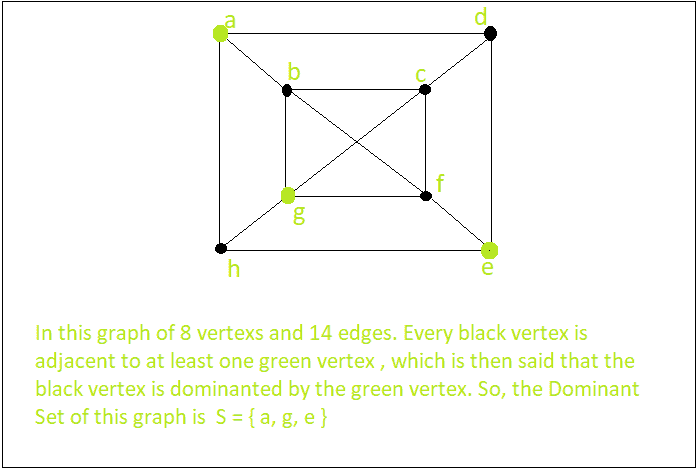

# 图的主要集合

> 原文： [https://www.geeksforgeeks.org/dominant-set-of-a-graph/](https://www.geeksforgeeks.org/dominant-set-of-a-graph/)

在图论中，图 G =（V，E）的支配集是 V 的子集 D，使得不在 D 中的每个顶点都与 D 的至少一个成员相邻。支配数是 a 中的顶点数。 G 的最小控制集。

示例：

```
Input :   A graph with 4 vertex and 4 edges   
Output :  The Dominant Set S= { a, b } or { a, d } or { a, c } and more.

Input : A graph with 6 vertex and 7 edges   
Output :  The Dominant Set S= { a, d, f } or { e, c } and more.

```

可以相信，可能没有找到所有图的最小控制集的有效算法，但是存在有效的近似算法。
**算法**：

*   首先，我们必须将集合“ S”初始化为空
*   取连接顶点的图的任意边“ e”（例如 A 和 B）
*   将 A 和 B 之间的一个顶点（假设 A）添加到集合 S 中
*   删除连接到 A 的图形中的所有边
*   返回第 2 步，并重复操作（如果图形中仍留有一些边）
*   最终集 S 是图形的一个主导集

## C ++

```

// C++ program to find the Dominant Set of a graph 
#include <bits/stdc++.h> 
using namespace std; 

vector<vector<int> > g; 
bool box[100000]; 

vector<int> Dominant(int ver, int edge) 
{ 
    vector<int> S; // set S 
    for (int i = 0; i < ver; i++) { 
        if (!box[i]) { 
            S.push_back(i); 
            box[i] = true; 
            for (int j = 0; j < (int)g[i].size(); j++) { 
                if (!box[g[i][j]]) { 
                    box[g[i][j]] = true; 
                    break; 
                } 
            } 
        } 
    } 
    return S; 
} 

// Driver function 
int main() 
{ 
    int ver, edge, x, y; 

    ver = 5; // Enter number of vertices 
    edge = 6; // Enter number of Edges 
    g.resize(ver); 

    // Setting all index value of an array as 0 
    memset(box, 0, sizeof(box));  

    // Enter all the end-points of all the Edges 
    // g[x--].push_back[y--]      g[y--].push_back[x--] 
    g[0].push_back(1); 
    g[1].push_back(0); // x = 1, y = 2 ; 
    g[1].push_back(2); 
    g[2].push_back(1); // x = 2, y = 3 ; 
    g[2].push_back(3); 
    g[3].push_back(2); // x = 3, y = 4 ; 
    g[0].push_back(3); 
    g[3].push_back(0); // x = 1, y = 4 ; 
    g[3].push_back(4); 
    g[4].push_back(3); // x = 4, y = 5 ; 
    g[2].push_back(4); 
    g[4].push_back(2); // x = 3, y = 5 ; 

    vector<int> S = Dominant(ver, edge); 
    cout << "The Dominant Set is : { "; 
    for (int i = 0; i < (int)S.size(); i++) 
        cout << S[i] + 1 << " "; 
    cout << "}"; 
    return 0; 
} 

```

## 爪哇

```

// Java program to find the Dominant Set of a graph 
import java.util.*; 

class GFG 
{ 

static Vector<Integer> []g; 
static boolean []box = new boolean[100000]; 

static Vector<Integer> Dominant(int ver, int edge) 
{ 
    Vector<Integer> S = new Vector<Integer>(); // set S 
    for (int i = 0; i < ver; i++)  
    { 
        if (!box[i])  
        { 
            S.add(i); 
            box[i] = true; 
            for (int j = 0; j < (int)g[i].size(); j++)  
            { 
                if (!box[g[i].get(j)]) 
                { 
                    box[g[i].get(j)] = true; 
                    break; 
                } 
            } 
        } 
    } 
    return S; 
} 

// Driver code 
public static void main(String[] args) 
{ 
    int ver, edge, x, y; 

    ver = 5; // Enter number of vertices 
    edge = 6; // Enter number of Edges 
    g = new Vector[ver]; 
    for (int i = 0; i < ver; i++) 
        g[i] = new Vector<Integer>(); 

    // Enter all the end-points of all the Edges 
    // g[x--].push_back[y--]     g[y--].push_back[x--] 
    g[0].add(1); 
    g[1].add(0); // x = 1, y = 2 ; 
    g[1].add(2); 
    g[2].add(1); // x = 2, y = 3 ; 
    g[2].add(3); 
    g[3].add(2); // x = 3, y = 4 ; 
    g[0].add(3); 
    g[3].add(0); // x = 1, y = 4 ; 
    g[3].add(4); 
    g[4].add(3); // x = 4, y = 5 ; 
    g[2].add(4); 
    g[4].add(2); // x = 3, y = 5 ; 

    Vector<Integer> S = Dominant(ver, edge); 
    System.out.print("The Dominant Set is : { "); 
    for (int i = 0; i < (int)S.size(); i++) 
        System.out.print(S.get(i) + 1 + " "); 
    System.out.print("}"); 
} 
} 

// This code is contributed by Rajput-Ji 

```

## C＃

```

// C# program to find the Dominant Set of a graph 
using System; 
using System.Collections.Generic; 

class GFG 
{ 

static List<int> []g; 
static bool []box = new bool[100000]; 

static List<int> Dominant(int ver, int edge) 
{ 
    List<int> S = new List<int>(); // set S 
    for (int i = 0; i < ver; i++)  
    { 
        if (!box[i])  
        { 
            S.Add(i); 
            box[i] = true; 
            for (int j = 0; j < (int)g[i].Count; j++)  
            { 
                if (!box[g[i][j]]) 
                { 
                    box[g[i][j]] = true; 
                    break; 
                } 
            } 
        } 
    } 
    return S; 
} 

// Driver code 
public static void Main(String[] args) 
{ 
    int ver, edge; 

    ver = 5; // Enter number of vertices 
    edge = 6; // Enter number of Edges 
    g = new List<int>[ver]; 
    for (int i = 0; i < ver; i++) 
        g[i] = new List<int>(); 

    // Enter all the end-points of all the Edges 
    // g[x--].push_back[y--]     g[y--].push_back[x--] 
    g[0].Add(1); 
    g[1].Add(0); // x = 1, y = 2 ; 
    g[1].Add(2); 
    g[2].Add(1); // x = 2, y = 3 ; 
    g[2].Add(3); 
    g[3].Add(2); // x = 3, y = 4 ; 
    g[0].Add(3); 
    g[3].Add(0); // x = 1, y = 4 ; 
    g[3].Add(4); 
    g[4].Add(3); // x = 4, y = 5 ; 
    g[2].Add(4); 
    g[4].Add(2); // x = 3, y = 5 ; 

    List<int> S = Dominant(ver, edge); 
    Console.Write("The Dominant Set is : { "); 
    for (int i = 0; i < (int)S.Count; i++) 
        Console.Write(S[i] + 1 + " "); 
    Console.Write("}"); 
} 
} 

// This code is contributed by PrinciRaj1992 

```

**Output:**

```
The Dominant Set is : { 1 3 5 }

```

参考： [Wiki](https://en.wikipedia.org/wiki/Dominating_set)


* * *

* * *

如果您喜欢 GeeksforGeeks 并希望做出贡献，则还可以使用 [tribution.geeksforgeeks.org](https://contribute.geeksforgeeks.org/) 撰写文章，或将您的文章邮寄至 tribution@geeksforgeeks.org。 查看您的文章出现在 GeeksforGeeks 主页上，并帮助其他 Geeks。

如果您发现任何不正确的地方，请单击下面的“改进文章”按钮，以改进本文。