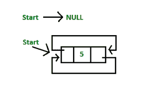
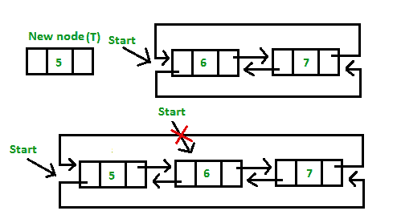
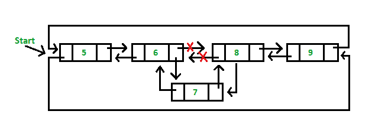

# 双向循环链接列表| 第1组（简介和插入）

先决条件：[双链表，](http://quiz.geeksforgeeks.org/doubly-linked-list/) [循环链表](https://www.geeksforgeeks.org/circular-singly-linked-list-insertion/)

循环双重链接列表具有双重链接列表和循环链接列表的属性，其中两个连续元素通过上一个指针和下一个指针链接或连接，最后一个节点通过下一个指针指向第一个节点，并且第一个节点通过下一个指针指向最后一个节点 前一个指针。

以下是C / C ++中的循环双向链接列表节点的表示形式：

```
// Structure of the node 
struct node
{
    int data;
    struct node *next; // Pointer to next node
    struct node *prev; // Pointer to previous node
};

```

[](https://media.geeksforgeeks.org/wp-content/uploads/Circular-doubly-linked-list.png)

**插入循环双链表**

1.  **Insertion at the end of list or in an empty list**
    *   **Empty List (start = NULL):** A node(Say N) is inserted with data = 5, so previous pointer of N points to N and next pointer of N also points to N. But now start pointer points to the first node the list.

        [](https://media.geeksforgeeks.org/wp-content/uploads/Insertion-in-empty-list1.png)

    *   **List initially contain some nodes, start points to first node of the List:** A node(Say M) is inserted with data = 7, so previous pointer of M points to last node, next pointer of M points to first node and last node’s next pointer points to this M node and first node’s previous pointer points to this M node.

        [](https://media.geeksforgeeks.org/wp-content/uploads/Insertion-in-a-list.png)

        *filter_none*

        *编辑*
        *关闭*

        *play_arrow*

        *链接*
        *亮度_4*
        *代码*

        | `// Function to insert at the end``void` `insertEnd(` `struct` `Node** start,` `int` `value)``{` `// If the list is empty, create a single node` `// circular and doubly list` `if` `(*start == NULL)` `{` `struct` `Node* new_node =` `new` `Node;` `new_node->data = value;` `new_node->next = new_node->prev = new_node;` `*start = new_node;` `return` `;` `}` `// If list is not empty` `/* Find last node */` `Node *last = (*start)->prev;` `// Create Node dynamically` `struct` `Node* new_node =` `new` `Node;` `new_node->data = value;` `// Start is going to be next of new_node` `new_node->next = *start;` `// Make new node previous of start` `(*start)->prev = new_node;` `// Make last preivous of new node` `new_node->prev = last;` `// Make new node next of old last` `last->next = new_node;``}` |

        *chevron_right**filter_none*
2.  **Insertion at the beginning of the list:** To insert a node at the beginning of the list, create a node(Say T) with data = 5, T next pointer points to first node of the list, T previous pointer points to last node the list, last node’s next pointer points to this T node, first node’s previous pointer also points this T node and at last don’t forget to shift ‘Start’ pointer to this T node.
    [](https://media.geeksforgeeks.org/wp-content/uploads/Insertion-at-beginning-of-list.png)*filter_none*

    *编辑*
    *关闭*

    *play_arrow*

    *链接*
    *亮度_4*
    *代码*

    | `// Function to insert Node at the beginning``// of the List,``void` `insertBegin(` `struct` `Node** start,` `int` `value)``{` `// Pointer points to last Node` `struct` `Node *last = (*start)->prev;` [ HTG17] `new` `Node;` `new_node->data = value;` `// Inserting the data` `// setting up previous and next of new node` `new_node->next = *start;` `new_node->prev = last;` `// Update next and previous pointers of start` `// and last.` `last->next = (*start)->prev = new_node;` `// Update start pointer` `*start = new_node;`[`}` |

    *chevron_right**filter_none*
3.  **Insertion in between the nodes of the list**: To insert a node in between the list, two data values are required one after which new node will be inserted and another is the data of the new node.

    [](https://media.geeksforgeeks.org/wp-content/uploads/Insertion-in-between-the-list.png)

    *filter_none*

    *编辑*
    *关闭*

    *play_arrow*

    *链接*
    *亮度_4*
    *代码*

    | `// Function to insert node with value as value1\.``// The new node is inserted after the node with``// with value2``void` `insertAfter(` `struct` `Node** start,` `int` `value1,` `int` `value2)``{` `struct` `Node* new_node =` `new` `Node;` `new_node->data = value1;` `// Inserting the data` `// Find node having value2 and next node of it` `struct` `Node *temp = *start;` `while` `(temp->data != value2)` `temp = temp->next;` `struct` `Node *next = temp->next;`] `// insert new_node between temp and next.` `temp->next = new_node;` `new_node->prev = temp;` `new_node->next = next;`[ `next->prev = new_node;``}` |

    *chevron_right**filter_none*

以下是一个完整的程序，该程序使用上述所有方法来创建循环双向链接列表。

## C ++

*filter_none*

*编辑*
*关闭*

*play_arrow*

*链接*
*亮度_4*
*代码*

| `// C++ program to illustrate inserting a Node in``// a Cicular Doubly Linked list in begging, end``// and middle``#include <bits/stdc++.h>``using` `namespace` `std;``// Structure of a Node``struct` `Node``{` `int` `data;` `struct` `Node *next;` `struct` `Node *prev;``};``// Function to insert at the end``void` `insertEnd(` `struct` `Node** start,` `int` `value)``{` `// If the list is empty, create a single node` `// circular and doubly list` `if` `(*start == NULL)` `{` `struct` `Node* new_node =` `new` `Node;` `new_node->data = value;` `new_node->next = new_node->prev = new_node;` `*start = new_node;` `return` `;` `}` `// If list is not empty` `/* Find last node */` `Node *last = (*start)->prev;` `// Create Node dynamically` `struct` `Node* new_node =` `new` `Node;` `new_node->data = value;` `// Start is going to be next of new_node` `new_node->next = *start;` `// Make new node previous of start` `(*start)->prev = new_node;` `// Make last preivous of new node` `new_node->prev = last;` `// Make new node next of old last` ] `last->next = new_node;``}``// Function to insert Node at the beginning``// of the List,` [`void` `insertBegin(` `struct` `Node** start,` `int` `value)``{` `// Pointer points to last Node` `struct` `Node *last = (*start)->prev;` `struct` `Node* new_node =` `new` `Node;` `new_node->data = value;` `// Inserting the data` `// setting up previous and next of new node` `new_node->next = *start;` `new_node->prev = last;`[ `// Update next and previous pointers of start` `// and last.` `last->next = (*start)->prev = new_node;` `// Update start pointer` `*start = new_node;``}``// Function to insert node with value as value1\.``// The new node is inserted after the node with``// with value2``void` `insertAfter(` `struct` `Node** start,` `int` `value1,` `int` `value2)``{` `struct` `Node* new_node =` `new` `Node;` `new_node->data = value1;` `// Inserting the data` `// Find node having value2 and next node of it` `struct` `Node *temp = *start;` `while` `(temp->data != value2)` `temp = temp->next;` `struct` `Node *next = temp->next;`[HTG175 `// insert new_node between temp and next.` `temp->next = new_node;` `new_node->prev = temp;` `new_node->next = next;` `next->prev = new_node;``}``void` `display(` `struct` `Node* start)``{` `struct` `Node *temp = start;` `printf` `(` `"\nTraversal in forward direction \n"` `);` `while` `(temp->next != start)` `{` `printf` `(` `"%d "` `, temp->data);` `temp = temp->next;` `}` `printf` `(` `"%d "` `, temp->data);` `printf` `(` `"\nTraversal in reverse direction \n"` `);` `Node *last = start->prev;` `temp = last;` `while` `(temp->prev != last)` `{`]  `printf` `(` `"%d "` `, temp->data);` `temp = temp->prev;` `}` `printf` `(` `"%d "` `, temp->data);``}``/* Driver program to test above functions*/``int` `main()``{` `/* Start with the empty list */` `struct` `Node* start = NULL;` `// Insert 5\. So linked list becomes 5->NULL` `insertEnd(&start, 5);` `// Insert 4 at the beginning. So linked `]​​ `// list becomes 4->5` `insertBegin(&start, 4);` `// Insert 7 at the end. So linked list` `// becomes 4->5->7` `insertEnd(&start, 7);` `// Insert 8 at the end. So linked list ` `// becomes 4->5->7->8` `insertEnd(&start, 8);` `// Insert 6, after 5\. So linked list ` `// becomes 4->5->6->7->8`]  `insertAfter(&start, 6, 5);` `printf` `(` `"Created circular doubly linked list is: "` `);`[ `display(start);` `return` `0;``}` |

*chevron_right**filter_none*