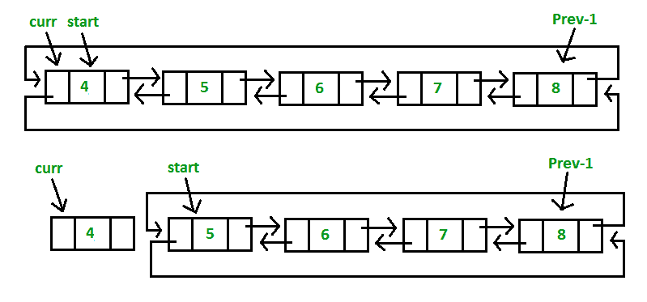
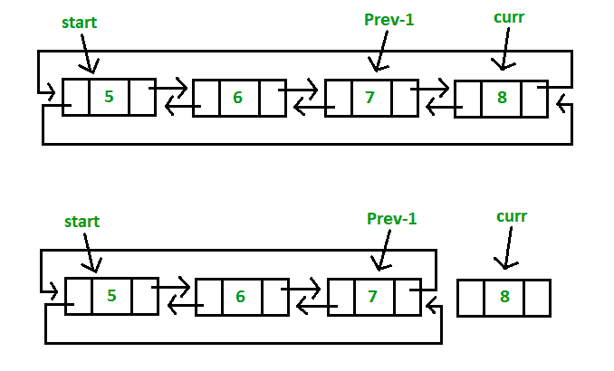
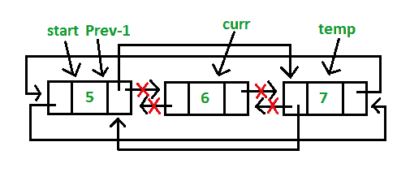

# 双向循环链接列表 | 系列 2（删除）

> 原文：[https://www.geeksforgeeks.org/doubly-circular-linked-list-set-2-deletion/](https://www.geeksforgeeks.org/doubly-circular-linked-list-set-2-deletion/)

我们已经讨论了[双循环链表介绍及其插入](https://www.geeksforgeeks.org/doubly-circular-linked-list-set-1-introduction-and-insertion/)。

让我们制定问题陈述以了解删除过程。 给定*'密钥'*，请删除此密钥在循环双链表中的第一个匹配项。

**算法**

**情况 1**：空列表（开始= NULL）

*   如果列表为空，只需返回即可。

**情况 2**：列表最初包含一些节点，起点指向列表的第一个节点

1.  如果列表不为空，则我们定义两个指针 **curr** 和 **prev_1** ，并初始化指针 **curr** 指向列表的第一个节点，并且 prev_1 = NULL。

2.  每次设置 *prev_1 = curr* 时，使用 *curr* 指针遍历列表以查找要删除的节点，然后将 *curr* 移至下一个节点。

3.  如果找到该节点，请检查它是否是列表中的唯一节点。 如果是，则设置 start = NULL 并释放 *curr* 指向的节点。

4.  如果列表具有多个节点，请检查它是否是列表的第一个节点。 检查的条件是（curr ==开始）。 如果是，则将 prev_1 移至最后一个节点（prev_1 =开始-> prev）。 在 prev_1 到达最后一个节点后，设置 start = start-> next 和 prev_1-> next = start and start-> prev = prev_1。 释放由 curr 指向的节点。

5.  如果 *curr* 不是第一个节点，我们检查它是否是列表中的最后一个节点。 检查的条件是（curr-> next == start）。 如果是，则设置 prev_1-> next =开始并开始-> prev = prev_1。 释放由 curr 指向的节点。

6.  如果要删除的节点既不是第一个节点，也不是最后一个节点，则再声明一个指针 **temp** 并初始化指针 **temp** 指向 *curr* 指针的下一个指针 （临时= curr- >）。 现在设置，prev_1-> next = temp 和 temp-> prev = prev_1。 释放由 curr 指向的节点。

*   如果给定的*键*（说 4）与列表的第一个节点匹配（步骤 4）：

    

*   如果给定的*键*（说 8）与列表的最后一个节点匹配（步骤 5）：

    

*   如果给定的*键*（说 6）与列表的中间节点匹配（步骤 6）：

    

## C++

```cpp

// C++ program to delete a given key from 
// circular doubly linked list. 
#include <bits/stdc++.h> 
using namespace std; 

// Structure of a Node 
struct Node { 
    int data; 
    struct Node* next; 
    struct Node* prev; 
}; 

// Function to insert node in the list 
void insert(struct Node** start, int value) 
{ 
    // If the list is empty, create a single node 
    // circular and doubly list 
    if (*start == NULL) { 
        struct Node* new_node = new Node; 
        new_node->data = value; 
        new_node->next = new_node->prev = new_node; 
        *start = new_node; 
        return; 
    } 

    // If list is not empty 

    /* Find last node */
    Node* last = (*start)->prev; 

    // Create Node dynamically 
    struct Node* new_node = new Node; 
    new_node->data = value; 

    // Start is going to be next of new_node 
    new_node->next = *start; 

    // Make new node previous of start 
    (*start)->prev = new_node; 

    // Make last preivous of new node 
    new_node->prev = last; 

    // Make new node next of old last 
    last->next = new_node; 
} 

// Function to delete a given node from the list 
void deleteNode(struct Node** start, int key) 
{ 
    // If list is empty 
    if (*start == NULL) 
        return; 

    // Find the required node 
    // Declare two pointers and initialize them 
    struct Node *curr = *start, *prev_1 = NULL; 
    while (curr->data != key) { 
        // If node is not present in the list 
        if (curr->next == *start) { 
            printf("\nList doesn't have node with value = %d", key); 
            return; 
        } 

        prev_1 = curr; 
        curr = curr->next; 
    } 

    // Check if node is the only node in list 
    if (curr->next == *start && prev_1 == NULL) { 
        (*start) = NULL; 
        free(curr); 
        return; 
    } 

    // If list has more than one node, 
    // check if it is the first node 
    if (curr == *start) { 
        // Move prev_1 to last node 
        prev_1 = (*start)->prev; 

        // Move start ahead 
        *start = (*start)->next; 

        // Adjust the pointers of prev_1 and start node 
        prev_1->next = *start; 
        (*start)->prev = prev_1; 
        free(curr); 
    } 

    // check if it is the last node 
    else if (curr->next == *start) { 
        // Adjust the pointers of prev_1 and start node 
        prev_1->next = *start; 
        (*start)->prev = prev_1; 
        free(curr); 
    } 
    else { 
        // create new pointer, points to next of curr node 
        struct Node* temp = curr->next; 

        // Adjust the pointers of prev_1 and temp node 
        prev_1->next = temp; 
        temp->prev = prev_1; 
        free(curr); 
    } 
} 

// Function to display list elements 
void display(struct Node* start) 
{ 
    struct Node* temp = start; 

    while (temp->next != start) { 
        printf("%d ", temp->data); 
        temp = temp->next; 
    } 
    printf("%d ", temp->data); 
} 

// Driver program to test above functions 
int main() 
{ 
    // Start with the empty list 
    struct Node* start = NULL; 

    // Created linked list will be 4->5->6->7->8 
    insert(&start, 4); 
    insert(&start, 5); 
    insert(&start, 6); 
    insert(&start, 7); 
    insert(&start, 8); 

    printf("List Before Deletion: "); 
    display(start); 

    // Delete the node which is not present in list 
    deleteNode(&start, 9); 
    printf("\nList After Deletion: "); 
    display(start); 

    // Delete the first node 
    deleteNode(&start, 4); 
    printf("\nList After Deleting %d: ", 4); 
    display(start); 

    // Delete the last node 
    deleteNode(&start, 8); 
    printf("\nList After Deleting %d: ", 8); 
    display(start); 

    // Delete the middle node 
    deleteNode(&start, 6); 
    printf("\nList After Deleting %d: ", 6); 
    display(start); 

    return 0; 
} 

```

## Java

```java

// Java program to delete a given key from 
// circular doubly linked list. 
class GFG { 

    // structure of a Node 
    static class Node { 
        int data; 
        Node next; 
        Node prev; 
    }; 

    // Function to insert node in the list 
    static Node insert(Node start, int value) 
    { 
        // If the list is empty, create a single node 
        // circular and doubly list 
        if (start == null) { 
            Node new_node = new Node(); 
            new_node.data = value; 
            new_node.next = new_node.prev = new_node; 
            start = new_node; 
            return start; 
        } 

        // If list is not empty 

        // Find last node / 
        Node last = (start).prev; 

        // Create Node dynamically 
        Node new_node = new Node(); 
        new_node.data = value; 

        // Start is going to be next of new_node 
        new_node.next = start; 

        // Make new node previous of start 
        (start).prev = new_node; 

        // Make last preivous of new node 
        new_node.prev = last; 

        // Make new node next of old last 
        last.next = new_node; 
        return start; 
    } 

    // Function to delete a given node from the list 
    static Node deleteNode(Node start, int key) 
    { 
        // If list is empty 
        if (start == null) 
            return null; 

        // Find the required node 
        // Declare two pointers and initialize them 
        Node curr = start, prev_1 = null; 
        while (curr.data != key) { 
            // If node is not present in the list 
            if (curr.next == start) { 
                System.out.printf("\nList doesn't have node with value = %d", key); 
                return start; 
            } 

            prev_1 = curr; 
            curr = curr.next; 
        } 

        // Check if node is the only node in list 
        if (curr.next == start && prev_1 == null) { 
            (start) = null; 
            return start; 
        } 

        // If list has more than one node, 
        // check if it is the first node 
        if (curr == start) { 
            // Move prev_1 to last node 
            prev_1 = (start).prev; 

            // Move start ahead 
            start = (start).next; 

            // Adjust the pointers of prev_1 and start node 
            prev_1.next = start; 
            (start).prev = prev_1; 
        } 

        // check if it is the last node 
        else if (curr.next == start) { 
            // Adjust the pointers of prev_1 and start node 
            prev_1.next = start; 
            (start).prev = prev_1; 
        } 
        else { 
            // create new pointer, points to next of curr node 
            Node temp = curr.next; 

            // Adjust the pointers of prev_1 and temp node 
            prev_1.next = temp; 
            temp.prev = prev_1; 
        } 
        return start; 
    } 

    // Function to display list elements 
    static void display(Node start) 
    { 
        Node temp = start; 

        while (temp.next != start) { 
            System.out.printf("%d ", temp.data); 
            temp = temp.next; 
        } 
        System.out.printf("%d ", temp.data); 
    } 

    // Driver program to test above functions 
    public static void main(String args[]) 
    { 
        // Start with the empty list 
        Node start = null; 

        // Created linked list will be 4.5.6.7.8 
        start = insert(start, 4); 
        start = insert(start, 5); 
        start = insert(start, 6); 
        start = insert(start, 7); 
        start = insert(start, 8); 

        System.out.printf("List Before Deletion: "); 
        display(start); 

        // Delete the node which is not present in list 
        start = deleteNode(start, 9); 
        System.out.printf("\nList After Deletion: "); 
        display(start); 

        // Delete the first node 
        start = deleteNode(start, 4); 
        System.out.printf("\nList After Deleting %d: ", 4); 
        display(start); 

        // Delete the last node 
        start = deleteNode(start, 8); 
        System.out.printf("\nList After Deleting %d: ", 8); 
        display(start); 

        // Delete the middle node 
        start = deleteNode(start, 6); 
        System.out.printf("\nList After Deleting %d: ", 6); 
        display(start); 
    } 
} 

// This code is contributed by Arnab Kundu 

```

## Python3

```py

# Python3 program to delete a given key from 
# circular doubly linked list. 

# structure of a node of linked list  
class Node:  
    def __init__(self, data):  
        self.data = data  
        self.next = None
        self.prev = None

def insert( start, value): 

    # If the list is empty, create a single node 
    # circular and doubly list 
    if (start == None):  
        new_node = Node(0) 
        new_node.data = value 
        new_node.next = new_node.prev = new_node 
        start = new_node 
        return start 

    # If list is not empty 

    # Find last node / 
    last = (start).prev 

    # Create Node dynamically 
    new_node = Node(0) 
    new_node.data = value 

    # Start is going to be next of new_node 
    new_node.next = start 

    # Make new node previous of start 
    (start).prev = new_node 

    # Make last preivous of new node 
    new_node.prev = last 

    # Make new node next of old last 
    last.next = new_node 
    return start 

# Function to delete a given node 
# from the list 
def deleteNode(start, key): 

    # If list is empty 
    if (start == None): 
        return None

    # Find the required node 
    # Declare two pointers and initialize them 
    curr = start 
    prev_1 = None
    while (curr.data != key) : 

        # If node is not present in the list 
        if (curr.next == start) : 
            print ("List doesn't have node",  
                       "with value = ", key) 
            return start 

        prev_1 = curr 
        curr = curr.next

    # Check if node is the only node in list 
    if (curr.next == start and prev_1 == None) : 
        (start) = None
        return start 

    # If list has more than one node, 
    # check if it is the first node 
    if (curr == start) : 

        # Move prev_1 to last node 
        prev_1 = (start).prev 

        # Move start ahead 
        start = (start).next

        # Adjust the pointers of prev_1  
        # and start node 
        prev_1.next = start 
        (start).prev = prev_1 

    # check if it is the last node 
    elif (curr.next == start) : 

        # Adjust the pointers of prev_1  
        # and start node 
        prev_1.next = start 
        (start).prev = prev_1 

    else : 

        # create new pointer, 
        # points to next of curr node 
        temp = curr.next

        # Adjust the pointers of prev_1 
        # and temp node 
        prev_1.next = temp 
        temp.prev = prev_1 

    return start 

# Function to display list elements 
def display(start): 

    temp = start 

    while (temp.next != start) : 
        print (temp.data, end = " ")  
        temp = temp.next

    print (temp.data) 

# Driver Code  
if __name__=='__main__':  

    # Start with the empty list 
    start = None

    # Created linked list will be 4.5.6.7.8 
    start = insert(start, 4) 
    start = insert(start, 5) 
    start = insert(start, 6) 
    start = insert(start, 7) 
    start = insert(start, 8) 

    print ("List Before Deletion: ") 
    display(start) 

    # Delete the node which is not present in list 
    start = deleteNode(start, 9) 
    print ("List After Deletion: ") 
    display(start) 

    # Delete the first node 
    start = deleteNode(start, 4) 
    print ("List After Deleting", 4) 
    display(start) 

    # Delete the last node 
    start = deleteNode(start, 8) 
    print ("List After Deleting ", 8) 
    display(start) 

    # Delete the middle node 
    start = deleteNode(start, 6) 
    print ("List After Deleting ", 6) 
    display(start) 

# This code is contributed by Arnab Kundu 

```

## C#

```cs

// C# program to delete a given key from 
// circular doubly linked list. 
using System; 

class GFG { 

    // structure of a Node 
    public class Node { 
        public int data; 
        public Node next; 
        public Node prev; 
    }; 

    // Function to insert node in the list 
    static Node insert(Node start, int value) 
    { 
        // If the list is empty, create a single node 
        // circular and doubly list 
        Node new_node = new Node(); 
        if (start == null) { 

            new_node.data = value; 
            new_node.next = new_node.prev = new_node; 
            start = new_node; 
            return start; 
        } 

        // If list is not empty 

        // Find last node / 
        Node last = (start).prev; 

        // Create Node dynamically 
        new_node = new Node(); 
        new_node.data = value; 

        // Start is going to be next of new_node 
        new_node.next = start; 

        // Make new node previous of start 
        (start).prev = new_node; 

        // Make last preivous of new node 
        new_node.prev = last; 

        // Make new node next of old last 
        last.next = new_node; 
        return start; 
    } 

    // Function to delete a given node from the list 
    static Node deleteNode(Node start, int key) 
    { 
        // If list is empty 
        if (start == null) 
            return null; 

        // Find the required node 
        // Declare two pointers and initialize them 
        Node curr = start, prev_1 = null; 
        while (curr.data != key) { 
            // If node is not present in the list 
            if (curr.next == start) { 
                Console.Write("\nList doesn't have node with value = {0}", key); 
                return start; 
            } 

            prev_1 = curr; 
            curr = curr.next; 
        } 

        // Check if node is the only node in list 
        if (curr.next == start && prev_1 == null) { 
            (start) = null; 
            return start; 
        } 

        // If list has more than one node, 
        // check if it is the first node 
        if (curr == start) { 
            // Move prev_1 to last node 
            prev_1 = (start).prev; 

            // Move start ahead 
            start = (start).next; 

            // Adjust the pointers of prev_1 and start node 
            prev_1.next = start; 
            (start).prev = prev_1; 
        } 

        // check if it is the last node 
        else if (curr.next == start) { 
            // Adjust the pointers of prev_1 and start node 
            prev_1.next = start; 
            (start).prev = prev_1; 
        } 
        else { 
            // create new pointer, points to next of curr node 
            Node temp = curr.next; 

            // Adjust the pointers of prev_1 and temp node 
            prev_1.next = temp; 
            temp.prev = prev_1; 
        } 
        return start; 
    } 

    // Function to display list elements 
    static void display(Node start) 
    { 
        Node temp = start; 

        while (temp.next != start) { 
            Console.Write("{0} ", temp.data); 
            temp = temp.next; 
        } 
        Console.Write("{0} ", temp.data); 
    } 

    // Driver code 
    public static void Main(String[] args) 
    { 
        // Start with the empty list 
        Node start = null; 

        // Created linked list will be 4.5.6.7.8 
        start = insert(start, 4); 
        start = insert(start, 5); 
        start = insert(start, 6); 
        start = insert(start, 7); 
        start = insert(start, 8); 

        Console.Write("List Before Deletion: "); 
        display(start); 

        // Delete the node which is not present in list 
        start = deleteNode(start, 9); 
        Console.Write("\nList After Deletion: "); 
        display(start); 

        // Delete the first node 
        start = deleteNode(start, 4); 
        Console.Write("\nList After Deleting {0}: ", 4); 
        display(start); 

        // Delete the last node 
        start = deleteNode(start, 8); 
        Console.Write("\nList After Deleting {0}: ", 8); 
        display(start); 

        // Delete the middle node 
        start = deleteNode(start, 6); 
        Console.Write("\nList After Deleting {0}: ", 6); 
        display(start); 
    } 
} 

// This code has been contributed by 29AjayKumar 

```

**Output:**

```
List Before Deletion: 4 5 6 7 8 
List doesn't have node with value = 9
List After Deletion: 4 5 6 7 8 
List After Deleting 4: 5 6 7 8 
List After Deleting 8: 5 6 7 
List After Deleting 6: 5 7 

```

本文由 **Akash Gupta** 提供。 如果您喜欢 GeeksforGeeks 并希望做出贡献，则还可以使用 [tribution.geeksforgeeks.org](http://www.contribute.geeksforgeeks.org) 撰写文章，或将您的文章邮寄至 tribution@geeksforgeeks.org。 查看您的文章出现在 GeeksforGeeks 主页上，并帮助其他 Geeks。

如果发现任何不正确的地方，或者您想分享有关上述主题的更多信息，请发表评论。

